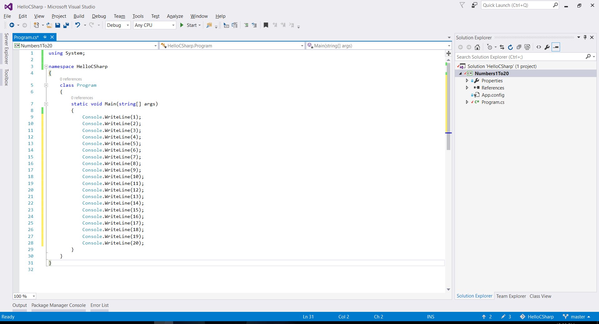

# Глава 1. Първи стъпки в програмирането

В тази глава ще разберем **какво е програмирането** в неговата същина. Ще се запознаем с идеята за **програмни езици** и ще разгледаме **средите за разработка на софтуер** (IDE) и как да работим с тях, в частност с **Visual Studio**. Ще напишем и изпълним **първата си програма** на програмния език **C#**, а след това ще се упражним с няколко задачи: ще създадем конзолна програма, графично приложение и уеб приложение. Ще се научим как да проверяваме за коректност решенията на задачите от тази книга в **Judge системата на СофтУни** и накрая ще се запознаем с типичните грешки, които често се допускат при писането на код и как да се предпазим от тях.

## Видео

<div class="video-player">
  Гледайте видеоурок по тази глава тук: <a target="_blank"
  href="https://www.youtube.com/watch?v=LgT10WCBw0M">
  https://www.youtube.com/watch?v=LgT10WCBw0M</a>.
</div>
<script src="/assets/js/video.js"></script>

## Какво означава "да програмираме"?

**Да програмираме** означава да даваме команди на компютъра какво да прави, например "*да изсвири някакъв звук*", "*да отпечата нещо на екрана*" или "*да умножи две числа*". Когато командите са няколко една след друга, те се наричат **компютърна програма**. Текстът на компютърните програми се нарича **програмен код** (или **сорс код** или за по-кратко **код**).

**Компютърните програми** представляват **поредица от команди**, които се изписват на предварително избран **език за програмиране**, например C#, Java, JavaScript, Python, Ruby, PHP, C, C++, Swift или друг. За да пишем команди, трябва да знаем **синтаксиса и семантиката на езика**, с който ще работим, в нашия случай **C#**. Затова ще се запознаем със синтаксиса и семантиката на езика C# и с програмирането като цяло в настоящата книга, изучавайки стъпка по стъпка писането на код, от по-простите към по-сложните програмни конструкции.

Компютърните програми обикновено изпълняват някакъв алгоритъм. **Алгоритмите** са последователност от стъпки, необходими за да се свърши определена работа и да се постигне някакъв очакван резултат, нещо като "рецепта". Например, ако пържим яйца, ние изпълняваме някаква рецепта (алгоритъм): загряваме мазнина в някакъв съд, чупим яйцата, изчакваме докато се изпържат, отместваме от огъня. Аналогично, в програмирането **компютърните програми изпълняват алгоритми**: поредица от команди, необходими, за да се свърши определена работа. Например, за да се подредят поредица от числа в нарастващ ред, е необходим алгоритъм, примерно да се намери най-малкото число и да се отпечата, от останалите числа да се намери отново най-малкото число и да се отпечата и това се повтаря докато числата свършат.

За удобство при създаването на програми, за писане на програмен код (команди), за изпълнение на програмите и за други операции, свързани с програмирането, ни е необходима и **среда за разработка**, например Visual Studio.

### Езици за програмиране, компилатори, интерпретатори и среди за разработка

**Езикът за програмиране** е изкуствен език (синтаксис за изразяване), предназначен за **задаване на команди**, които искаме компютърът да прочете, обработи и изпълни. Чрез езиците за програмиране пишем поредици от команди (**програми**), които **контролират поведението на компютъра**. Изпълнението на компютърните програми може да се реализира с **компилатор** или с **интерпретатор**.

**Компилаторът** превежда кода от програмен език на **машинен код**, като за всяка от конструкциите избира подходящ, предварително подготвен фрагмент от машинен код, като междувременно **проверява за грешки текста на програмата**. Заедно компилираните фрагменти съставят програмата в машинен вид, както я очаква микропроцесорът на компютъра. След като е компилирана програмата, тя може да бъде директно изпълнена от от микропроцесора в кооперация с операционната система.

Някои езици за програмиране не използват компилатор, а се **интерпретират директно** от специализиран софтуер, наречен "интерпретатор". **Интерпретаторът** е "**програма за изпълняване на програми**", написани на някакъв език за програмиране. Езици като PHP, Python и JavaScript работят с интерпретатор и се изпълняват без да се компилират. Поради липса на предварителна компилация, при интерпретеруемите езици **грешките се откриват по време на изпълнение**, след като програмата започне да работи, а не предварително.

**Средата за програмиране** (Integrated Development Environment - **IDE**, интегрирана среда за разработка) е съвкупност от традиционни инструменти за разработване на софтуерни приложения. В средата за разработка пишем код, компилираме и изпълняваме програмите. Средите за разработка интегрират в себе си **текстов редактор** за писане на кода, **език за програмиране**, **компилатор или интерпретатор** и **среда за изпълнение** за изпълнение на програмите, **дебъгер** за проследяване на програмата и търсене на грешки, **инструменти за дизайн на потребителски интерфейс** и други инструменти и добавки.

**Средите за програмиране** са удобни, защото интегрират всичко необходимо за разработката на програмата, без да се напуска средата. Ако не ползваме среда за разработка, ще трябва да пишем кода в текстов редактор, да го компилираме с команда от конзолата, да го изпълняваме с друга команда от конзолата и да пишем още допълнителни команди, когато се налага, и това ще ни губи време. Затова повечето програмисти ползват IDE в ежедневната си работа.

За програмиране на **езика C#** най-често се ползва средата за разработка **Visual Studio**, която се разработва и разпространява безплатно от Microsoft и може да се изтегли от: https://www.visualstudio.com/downloads/. Алтернативи на Visual Studio са **Rider** (https://www.jetbrains.com/rider/) и **MonoDevelop** / **Xamarin Studio** (http://www.monodevelop.com) и **SharpDevelop** (http://www.icsharpcode.net/OpenSource/SD/). В настоящата книга ще използваме средата за разработка Visual Studio.

### Среди за изпълнение (Runtime Environments)

Програмата в своята същност е **набор от инструкции**, които карат компютъра да свърши определена задача. Те се въвеждат от програмиста и се **изпълняват безусловно от машината**.

Съществуват различни видове **езици за програмиране**. С езиците от най-ниско ниво могат да бъдат написани **самите инструкции**, които **управляват процесора**, например с езика "**Assembler**". С езици от по-високо ниво като **C** и **C++** могат да бъдат създадени операционна система, драйвер за видеокарта и т.н. **Езиците от ниско ниво** управляват директно хардуера и изискват много усилия и огромен брой команди, за да свършат единица работа. **Езиците от по-високо ниво** изискват по-малко код за единица работа, но нямат директен достъп до хардуера. На тях се разработва приложен софтуер.

Самият софтуер, който използваме ежедневно, като музикален плеър, видеоплеър, GPS програма и т.н., се пише на **езици за приложно програмиране**, които са от високо ниво, като C#, Java, Python, C++, JavaScript, PHP и др. 

**C# е компилируем език**, а това означава, че пишем команди, които се компилират до машинен код преди да се изпълнят. Именно тези команди, чрез помощна програма (компилатор), се преобразуват във файл, който може да се изпълнява (executable). За да пишем на език като **C#** ни трябва текстов редактор или среда за разработка и **.NET среда за изпълнение**.

**.NET средата за изпълнение** представлява виртуална машина, нещо като компютър в компютъра, която може да изпълнява компилиран C# код (C# програми). Тя съдържа библиотеки с класове, **CSC** компилатор, **CLR** (Common Language Runtime) и други компоненти, които са необходими, за да работим с езика C#. **Средата .NET** е достъпна като свободен софтуер с отворен код за всички съвременни операционни системи (като Windows, Linux и Mac OS X). Тя има две разновидности, **.NET Framework** (по-старата) и **.NET Core** (по-новата), но това няма съществено значение за навлизането в програмирането. Нека се фокусираме върху писането на програми с езика C#.

### Компютърни програми - компилация и изпълнение

Както вече споменахме, програмата е **последователност от команди**, иначе казано тя описва поредица от пресмятания, проверки, повторения и всякакви подобни операции, които целят постигане на някакъв резултат.

Програмата се пише в текстов формат, а самият текст на програмата се нарича **сорс код** (source code). Той се компилира до **изпълним файл** (например `Program.cs` се компилира до `Program.exe`) или се **изпълнява директно** от .NET средата.

Процесът на **компилация** на кода преди изпълнение се използва само при компилируеми езици като C#, Java и C++. При **скриптови и интерпретеруеми езици**, като например JavaScript и Python, сорс кодът се изпълнява постъпково от интерпретатор.

### Компютърни програми – примери

Да започнем с много прост пример за кратка C# програма.

#### Пример: програма, която свири музикалната нота "ла"

Нашата първа програма ще е единична C# команда, която свири музикалната нота "ла" половин секунда:

```csharp
Console.Beep(432, 500);
```

След малко ще разберем как можем да изпълним тази команда и да чуем звука от нотата, но засега нека само разгледаме какво представляват командите в програмирането. Да се запознаем с още няколко примера.

#### Пример: програма, която свири поредица от музикални ноти

Можем да усложним предходната програма, като зададем за изпълнение повтарящи се в цикъл команди за свирене на поредица от ноти с нарастваща височина:

```csharp
for (i = 200; i <= 4000; i += 200)
{
    Console.Beep(i, 100);
}
```

Как работят повторенията (циклите) в програмирането ще научим в **главата "[Цикли](chapter-5-loops.html)"**, но засега приемете, че просто повтаряме някаква команда много пъти.

#### Пример: програма, която конвертира от левове в евро

Да разгледаме още една проста програма, която прочита от потребителя някаква сума в лева (цяло число), конвертира я в евро (като я разделя на курса на еврото) и отпечатва получения резултат. Това е програма от 3 поредни команди:

```csharp
var leva = int.Parse(Console.ReadLine());
var euro = leva / 1.95583;
Console.WriteLine(euro);
```

Разгледахме **три примера за компютърни програми**: единична команда, серия команди в цикъл и поредица от 3 команди. Нека сега преминем към по-интересното: как можем да пишем собствени команди (програми на **C#**) и как можем да ги изпълняваме (да стартираме **C#** програми)?

## Как да напишем конзолна програма?

Нека преминем през **стъпките за създаване и изпълнение на компютърна програма**, която чете и пише своите данни от и на текстова конзола (прозорец за въвеждане и извеждане на текст). Такива програми се наричат "конзолни".

### Среда за разработка

Както вече стана дума, за да програмираме ни е нужна **среда за разработка** - **Integrated Development Environment** (IDE). Това е всъщност редактор за програми, в който пишем програмния код и можем да го компилираме и изпълняваме, да виждаме грешките, да ги поправяме и да стартираме програмата отново.
 - За програмиране на C# използваме средата **Visual Studio** за операционната система Windows и **MonoDevelop** за Linux или Max OS X.
 - Ако програмираме на Java, е подходяща средата **IntelliJ Idea**.
 - Ако ще пишем на Python, можем да използваме средата **PyCharm**.

Започваме с инсталацията на интегрираната среда **Microsoft Visual Studio Community**, последна версия. Можем да я изтеглим безплатно от: https://visualstudio.com/products/visual-studio-community-vs.

Може да се използват и по-стари версии на Visual Studio, но **не е препоръчително**, тъй като в тях не се съдържат някои от по-новите възможности и инструменти за разработка.

Съществуват и алтернативни среди за разработка онлайн. Ето някои линкове:
* За езика C#: .NET Fiddle позволява писане на код и изпълнението му онлайн: [https://dotnetfiddle.net](https://dotnetfiddle.net)
* За Java: [https://www.compilejava.net](https://www.compilejava.net)
* За JavaScript: може да се пише директно в конзолата на даден браузър с натискане на **[F12]**

### Пример: създаване на конзолна програма "Hello C#"

Стартираме Visual Studio.

Създаваме нов конзолен проект: [**File**] &rarr; [**New**] &rarr; [**Project**] &rarr; [**Visual C#**] &rarr; [**Windows**] &rarr; [**Console Application**]


#### Писане на програмен код

Сорс кодът на програма се пише в секцията **`Main(string[] args)`**, между отварящата и затварящата скоба **`{ }`**. <br>
Натискаме [**Enter**] след **отварящата скоба** **`{`** и **започваме да пишем**. Кодът на програмата се пише **отместен навътре**, като това е част от оформянето на текста, за по-голямо удобство при повторен преглед и/или дебъгване.


Пишем следния код:


#### Стартиране на програмата

За стартиране на програмата натискаме [**Ctrl + F5**].
Ако няма грешки, програмата ще се изпълни.
Резултатът ще се изпише на конзолата (в черния прозорец):


#### Тестване на програмата в Judge системата

Тестването на задачи е автоматизирано и се осъществява посредством Интернет, през сайта на Judge системата: [https://judge.softuni.bg/](https://judge.softuni.bg/). Оценяването на задачите става в реално време. Всяка задача минава поредица от тестове, като всеки успешно преминат тест дава предвидените за него точки. Тестовете, които се подават на задачите, са скрити.

Горната програма може да тествате тук: [https://judge.softuni.bg/Contests/Practice/Index/503#0](https://judge.softuni.bg/Contests/Practice/Index/503#0)

Поставяме целия код на програмата в черното поле и избираме **C# code**, както е показано тук:


Изпращаме решението за оценяване с бутона [**Submit**]. Системата връща резултат след няколко секунди в таблицата с изпратени решения:

* Брой точки (между 0 и 100), когато предаденият код се компилира успешно
* Или съобщение за грешка по време на компилация


#### Как да се регистрирам в SoftUni Judge?

Използваме идентификацията си за softuni.bg.


## Типични грешки в C# програмите

Една от често срещаните грешки при начинаещите е писането **извън тялото** на **``Main()``** метода, защото интегрираната среда или компилаторът не би могъл правилно да разчете зададените команди в програмата.

Друга грешка е бъркането на **главни и малки букви**, а те имат значение при извикване на командите и тяхното правилно функциониране.

Липсата на **точка и запетая** (**`;`**) в края на командите е един от вечните проблеми на програмиста. Пропускането на този знак води до **неправилно функциониране на програмата** и **често проблемът остава незабелязан**.

Липсваща **кавичка** или **липса на отваряща или затваряща скоба** също може да се окаже проблем. Kакто и при точката и запетаята, така и тук проблемът води до **неправилно функциониране на програмата** или въобще до нейното неизпълнение. Този пропуск трудно се забелязва при по-обемен код.


## Какво научихме от тази глава?

На първо място научихме **какво е програмирането** - **задаване на команди, изписани на компютърен език**, които машината разбира и може да изпълни. 
Също така разбрахме какво е **компютърната програма** - **поредица от команди**, подредени в определен ред.
Запознахме се с **езика за програмиране C#** на базисно ниво и как **да създаваме прости приложения** с Visual Studio.
Проследихме и **подредбата на програмния код**, като например, че командите главно се задават в секцията **``static void Main(string[] args)``** между **отварящата и затварящата къдрава скоба**. Видяхме как да печатаме с **`Console.WriteLine(...)`** и как да стартираме програмата си с [**Ctrl + F5**].


## Упражнения: първи стъпки в коденето

### Задача: конзолна програма “Expression”

Да се напише конзолна C# програма, която **пресмята** и **отпечатва** стойността на следния числен израз:

<p align="center"> (3522 + 52353) * 23 - (2336 * 501 + 23432 - 6743) * 3 </p>

Забележка: **не е разрешено да се пресметне стойността предварително** (например с Windows Calculator).

#### Насоки и подсказки

Правим **нов C# конзолен проект** с име "Expression".	Намираме метода **``static void Main(string[] args)``** и **влизаме в неговото тяло** между **`{`** и **`}`**. След това трябва да **напишем кода**, който да изчисли горния числен израз и да отпечата на конзолата стойността му. Подаваме горния числен израз в скобите на командата **``Console.WriteLine(...)``**:


Стартираме програмата с [**Ctrl+F5**] и проверяваме дали резултатът е същия:


#### Тестване в Judge системата

Тествайте решението си тук: [https://judge.softuni.bg/Contests/Practice/Index/503#1](https://judge.softuni.bg/Contests/Practice/Index/503#1)


### Задача: числата от 1 до 20

Да се напише C# конзолна програма, която **отпечатва числата от 1 до 20** на отделни редове на конзолата.

#### Насоки и подсказки

Създаваме **конзолно C# приложение** с име “Nums1To20“:


В **`static void Main()`** метода пишем 20 команди **``Console.WriteLine(...)``**, всяка на отделен ред , за да отпечатаме числата от 1 до 20.



#### Тестване в Judge системата

Тествайте решението си тук: [https://judge.softuni.bg/Contests/Practice/Index/503#2](https://judge.softuni.bg/Contests/Practice/Index/503#2)

Можем ли да напишем програмата по по-умен начин, така че да не повтаряме 20 пъти една и съща команда? Потърсете в Интернет информация за "**`for` loop C#**".


### Задача: Триъгълник от 55 звездички

Да се напише C# конзолна програма, която **отпечатва триъгълник от 55 звездички**, разположени на 10 реда:

```
*
**
***
****
*****
******
*******
********
*********
**********
```

#### Насоки и подсказки

Създаваме **ново конзолно C# приложение** с име “TriangleOf55Stars”. В него трябва да напишем код, който печата триъгълника от звездички, например чрез 10 команди, подобни на **``Console.WriteLine("*")``**.

#### Тестване в Judge системата

Тествайте решението си тук: [https://judge.softuni.bg/Contests/Practice/Index/503#3](https://judge.softuni.bg/Contests/Practice/Index/503#3)


Опитайте да **подобрите решението**, така че да няма много повтарящи се команди. Може ли това да стане с **`for`** цикъл?


### Задача: лице на правоъгълник

Да се напише C# програма, която **прочита** от конзолата **две числа a и b**, **пресмята** и **отпечатва** лицето на правоъгълник със страни a и b. 

#### Примерен вход и изход

| a | b | area |
| :---: | :---: | :---: |
| 2 | 7 |  14  |
| 7 | 8 |  56  |
| 12 | 5 |  60  |

#### Насоки и подсказки

Правим нова **конзолна C# програма**. За да **прочетем двете числа**, използваме  следния код:


Да се допише програмата по-горе, за да пресмята лицето на правоъгълника и да го проверява.

#### Тестване в Judge системата

Тествайте решението си тук: [https://judge.softuni.bg/Contests/Practice/Index/503#4](https://judge.softuni.bg/Contests/Practice/Index/503#4)


### \* Задача: квадрат от звездички

Да се напише C# конзолна програма, която **прочита** от конзолата **цяло положително число N** и **отпечатва** на конзолата **квадрат от N звездички**, като в примерите по-долу.

#### Примерен вход и изход

| Вход  |    Изход   	| Вход  |    Изход   	| Вход  |    Изход   	| 
|-----|-----------|-----|-----------|-----|----------|
|  3  	|<code>\*\*\*</code><br><code>\*&nbsp;\*</code><br><code>\*\*\*</code>|  4  |<code>\*\*\*\*</code><br><code>\*&nbsp;&nbsp;\*</code><br><code>\*&nbsp;&nbsp;\*</code><br><code>\*\*\*\*</code>| 5  	|<code>\*\*\*\*\*</code><br><code>\*&nbsp;&nbsp;&nbsp;\*</code><br><code>\*&nbsp;&nbsp;&nbsp;\*</code><br><code>\*&nbsp;&nbsp;&nbsp;\*</code><br><code>\*\*\*\*\*</code>|

#### Насоки и подсказки

Правим нова **конзолна C# програма**. За да прочетем числото N (2 ≤ N ≤100), използваме следния код:


Да се допише програмата по-горе, за да отпечатва квадрат, съставен от звездички. Може да се наложи да се използват **`for`** цикли. Потърсете информация в Интернет.

#### Тестване в Judge системата

Тествайте решението си тук: [https://judge.softuni.bg/Contests/Practice/Index/503#5](https://judge.softuni.bg/Contests/Practice/Index/503#5)


### Конзолни, графични и уеб приложения

При **конзолните приложения** (Console Applications), както и сами можете да се досетите, **всички операции** се **извършват през конзолата**. Там се **въвеждат входните данни**, които се прочитат от приложението, там се **отпечатват и изходните данни** след или по време на изпълнение на програмата.

Докато конзолните приложения **ползват текстовата конзола**, уеб приложенията (Web Аpplications) **използват уеб-базиран потребителски интерфейс**. За да се **постигне тяхното изпълнение** са необходими две неща - **уеб сървър** и **уеб браузър**, като **браузърът** играе главната роля по **обработката на зададените в програмата команди**.

Графичните (GUI) приложения имат **визуален потребителски интерфейс**. Графичните приложения (настолни приложения или, иначе казано, desktop apps) **се състоят от един или повече графични прозореца**, в които се намират определени **контроли** (текстови полета, бутони, картинки, таблици и други), **служещи за улеснение** на обикновения потребител.


## Упражнения: графични и уеб приложения

Сега предстои да направим едно просто уеб и едно просто графично приложение, за да можем да надникнем в това, какво ще можем да създаваме и как ще изглежда то. Няма да разглеждаме детайлите по конструкциите из основи, а само ще хвърлим поглед върху подредбата и функционалността на създаденото от нас. След като напреднем със знанията, ще бъдем способни да правим големи и сложни софтуерни приложения и системи.


### Задача: графично приложение „Суматор за числа“

Да се напише **графично (GUI) приложение**, което **изчислява сумата на две числа**:


При въвеждане на две числа в първите две текстови полета и натискане на бутона [**Calculate**] се изчислява тяхната сума и резултатът се показва в третото текстово поле.
За нашето приложение ще използваме **технологията Windows Forms**, която позволява създаване на **графични приложения за Windows**, в среда за разработка **Visual Studio** и с **език** за програмиране **C#**.

Във Visual Studio създаваме **нов C# проект от тип „Windows Forms Application“**:


При създаването на Windows Forms приложение ще се появи **редактор за потребителски интерфейс**, в който могат да се слагат **различни визуални елементи** (например кутийки с текст и бутони):


Изтегляме от лентата вляво (Toolbox) **три текстови полета** (**`TextBox`**), **два надписа** (**`Label`**) и **един бутон** (**`Button`**), след което ги подреждаме в прозореца на приложението. След това **променяме имената на всяка от контролите**. Това става от **прозорчето “Properties”** вдясно, чрез промяна на полето (**`Name`**):


*	Имена на текстовите полета: **`textBox1`**, **`textBox2`**, **`textBoxSum`**
* Име на бутона: **`buttonCalculate`**
*	Име на формата: **`FormCalculate`**

**Променяме заглавията** (**`Text`** свойството) на контролите:

*	buttonCalculate -> Calculate
*	label1 -> +
*	label2 -> =
*	Form1 -> Sumator


**Преоразмеряваме и подреждаме контролите**, за да изглеждат по-добре:


Опитваме да пуснем приложението с [**Ctrl+F5**]. То би трябвало да стартира, но да **не функционира напълно**, защото не сме написали какво се случва при натискане на бутона.


Сега е време да напишем кода, който **сумира числата** от първите две полета и **показва резултата** в третото поле. За целта кликваме **два пъти върху бутона [Calculate]**. Ще се появи място, в което да напишем какво да се случва при натискане на бутона:


Написваме следния C# код между отварящата и затварящата скоба **`{ }`**, където е курсорът:


Този код **взима първото число** от полето **`textBox1`** и го запазва **в променливата `num1`**, запазва **второто число** от полето **`textBox2`** в **променливата `num2`**, след това **сумира `num1` и `num2` в променливата `sum`** и накрая **извежда текстовата стойност на променливата `sum`** в полето **`textBoxSum`**.

Стартираме отново програмата с [**Ctrl+F5**] и проверяваме дали работи коректно. Правим опит да сметнете **4 + 5**, а след това **-12.5 + 1.3**:

 

Пробваме и с **невалидни числа**, напр. “aaa” и “bbb”. Изглежда има проблем: 

 

Проблемът идва от **прехвърлянето на текстово поле в число**. Ако стойността в полето **не е число, програмата дава грешка**. Можем да поправим кода, за да коригираме този проблем:


Горният код **прихваща грешките при работа с числа** (хваща изключенията) и в случай на грешка **извежда стойност `error`** в полето с резултата. Стартираме отново програмата с [**Ctrl+F5**] и я пробваме дали работи. Този път **при грешно число резултатът е `error`** и програмата не се чупи:

 


### Уеб приложение: суматор за числа

Напишете уеб приложение, което **изчислява сумата на две числа**. При **въвеждане на две числа** в първите две текстови полета и натискане на бутона [**Calculate**] се **изчислява тяхната сума** и резултатът се показва в третото текстово поле. Уеб приложението би могло да изглежда по следния начин:


За разлика от конзолните приложения, които четат и пишат данните си във вид на текст на конзолата, уеб приложенията имат **уеб базиран потребителски интерфейс**. Уеб приложенията се **зареждат от някакъв Интернет адрес** (URL) чрез стандартен уеб браузър. Потребителите пишат входните данни в страница, визуализирана от уеб приложението, данните се обработват на уеб сървър и резултатите се показват отново в страницата в уеб браузъра.
За нашето уеб приложение ще използваме **технологията ASP.NET MVC**, която позволява създаване на **уеб приложения с езика за програмиране C#** в средата за разработка Visual Studio.

Във Visual Studio създаваме **нов C# проект от тип „ASP.NET Web Application“**:


Избираме **тип** на приложението - **“MVC”**:


Намираме файла **`Views\Home\Index.cshtml`**. В него се намира **изгледът (view) за главната страница** на нашето уеб приложението:


Изтриваме стария код от **файла `Index.cshtml`** и пишем следния код: 


Този код **създава една уеб форма с три текстови полета и един бутон в нея**. В полетата се зареждат стойности, които се изчисляват предварително в обекта **`ViewBag`**. Указано е, че при натискане на бутона [**Calculate**] ще се извика действието **`/home/calculate` (действие `calculate` от `home` контролера)**.

Ето как трябва да изглежда **файлът `Index.cshtml`** след промяната:


Остава да се напише **действието** (action), което **сумира числата при натискане на бутона** [**Calculate**]. Отваряме файла **`Controllers\HomeController.cs`** и добавяме следния код в тялото на **`HomeController`** класа:


Този код осъществява действието “**calculate**”. То приема два параметъра **`num1`** и **`num2`** и ги записва в обекта **`ViewBag`**, след което **изчислява и записва** тяхната сума. Записаните във **`ViewBag`** стойности след това **се използват от изгледа**, за да се покажат в **трите текстови полета** във формата за сумиране на числа в уеб страницата от приложението.

Ето как трябва да изглежда **файлът `HomeController.cs`** след промяната:


Приложението е готово. Можем да го стартираме с [**Ctrl+F5**] и да тестваме дали работи:


