# Глава 1. Първи стъпки в програмирането

В тази глава ще разберем **какво е програмирането** в неговата същина. Ще се запознаем с идеята за **програмни езици** и ще разгледаме **средите за разработка на софтуер** (IDE) и как да работим с тях, в частност с **Visual Studio**. Ще напишем и изпълним **първата си програма** на програмния език **C#**, а след това ще се упражним с няколко задачи: ще създадем конзолна програма, графично приложение и уеб приложение. Ще се научим как да проверяваме за коректност решенията на задачите от тази книга в **Judge системата на СофтУни** и накрая ще се запознаем с типичните грешки, които често се допускат при писането на код и как да се предпазим от тях.

## Видео

<div class="video-player">
  Гледайте видеоурок по тази глава тук: <a target="_blank"
  href="https://www.youtube.com/watch?v=LgT10WCBw0M">
  https://www.youtube.com/watch?v=LgT10WCBw0M</a>.
</div>
<script src="/assets/js/video.js"></script>

## Какво означава "да програмираме"?

**Да програмираме** означава да даваме команди на компютъра какво да прави, например "*да изсвири някакъв звук*", "*да отпечата нещо на екрана*" или "*да умножи две числа*". Когато командите са няколко една след друга, те се наричат **компютърна програма**. Текстът на компютърните програми се нарича **програмен код** (или **сорс код** или за по-кратко **код**).

**Компютърните програми** представляват **поредица от команди**, които се изписват на предварително избран **език за програмиране**, например C#, Java, JavaScript, Python, Ruby, PHP, C, C++, Swift, Go или друг. За да пишем команди, трябва да знаем **синтаксиса и семантиката на езика**, с който ще работим, в нашия случай **C#**. Затова ще се запознаем със синтаксиса и семантиката на езика C# и с програмирането като цяло в настоящата книга, изучавайки стъпка по стъпка писането на код, от по-простите към по-сложните програмни конструкции.

Компютърните програми обикновено изпълняват някакъв алгоритъм. **Алгоритмите** са последователност от стъпки, необходими за да се свърши определена работа и да се постигне някакъв очакван резултат, нещо като "рецепта". Например, ако пържим яйца, ние изпълняваме някаква рецепта (алгоритъм): загряваме мазнина в някакъв съд, чупим яйцата, изчакваме докато се изпържат, отместваме от огъня. Аналогично, в програмирането **компютърните програми изпълняват алгоритми**: поредица от команди, необходими, за да се свърши определена работа. Например, за да се подредят поредица от числа в нарастващ ред, е необходим алгоритъм, примерно да се намери най-малкото число и да се отпечата, от останалите числа да се намери отново най-малкото число и да се отпечата и това се повтаря докато числата свършат.

За удобство при създаването на програми, за писане на програмен код (команди), за изпълнение на програмите и за други операции, свързани с програмирането, ни е необходима и **среда за разработка**, например Visual Studio.

### Езици за програмиране, компилатори, интерпретатори и среди за разработка

**Езикът за програмиране** е изкуствен език (синтаксис за изразяване), предназначен за **задаване на команди**, които искаме компютърът да прочете, обработи и изпълни. Чрез езиците за програмиране пишем поредици от команди (**програми**), които **задават какво да прави компютъра**. Изпълнението на компютърните програми може да се реализира с **компилатор** или с **интерпретатор**.

**Компилаторът** превежда кода от програмен език на **машинен код**, като за всяка от конструкциите (командите) в кода избира подходящ, предварително подготвен фрагмент от машинен код, като междувременно **проверява за грешки текста на програмата**. Заедно компилираните фрагменти съставят програмата в машинен код, както я очаква микропроцесорът на компютъра. След като е компилирана програмата, тя може да бъде директно изпълнена от микропроцесора в кооперация с операционната система. При компилируемите езици за програмиране **компилирането на програмата** се извършва задължително преди нейното изпълнение и по време на компилация се откриват синтактичните грешки (грешно зададени команди). С компилатор работят езици като C++, C#, Java, Swift и Go.

Някои езици за програмиране не използват компилатор, а се **интерпретират директно** от специализиран софтуер, наречен "интерпретатор". **Интерпретаторът** е "**програма за изпълняване на програми**", написани на някакъв програмен език. Той изпълнява командите на програмата една след друга, като разбира не само от единични команди и поредици от команди, но и от другите езикови конструкции (проверки, повторения, функции и т.н.). Езици като PHP, Python и JavaScript работят с интерпретатор и се изпълняват без да се компилират. Поради липса на предварителна компилация, при интерпретеруемите езици **грешките се откриват по време на изпълнение**, след като програмата започне да работи, а не предварително.

**Средата за програмиране** (Integrated Development Environment - **IDE**, интегрирана среда за разработка) е съвкупност от традиционни инструменти за разработване на софтуерни приложения. В средата за разработка пишем код, компилираме и изпълняваме програмите. Средите за разработка интегрират в себе си **текстов редактор** за писане на кода, **език за програмиране**, **компилатор или интерпретатор** и **среда за изпълнение** за изпълнение на програмите, **дебъгер** за проследяване на програмата и търсене на грешки, **инструменти за дизайн на потребителски интерфейс** и други инструменти и добавки.

**Средите за програмиране** са удобни, защото интегрират всичко необходимо за разработката на програмата, без да се напуска средата. Ако не ползваме среда за разработка, ще трябва да пишем кода в текстов редактор, да го компилираме с команда от конзолата, да го изпълняваме с друга команда от конзолата и да пишем още допълнителни команди, когато се налага, и това ще ни губи време. Затова повечето програмисти ползват IDE в ежедневната си работа.

За програмиране на **езика C#** най-често се ползва средата за разработка **Visual Studio**, която се разработва и разпространява безплатно от Microsoft и може да се изтегли от: https://www.visualstudio.com/downloads/. Алтернативи на Visual Studio са **Rider** (https://www.jetbrains.com/rider/) и **MonoDevelop** / **Xamarin Studio** (http://www.monodevelop.com) и **SharpDevelop** (http://www.icsharpcode.net/OpenSource/SD/). В настоящата книга ще използваме средата за разработка Visual Studio.

### Езици от ниско и високо ниво, среди за изпълнение (Runtime Environments)

Програмата в своята същност е **набор от инструкции**, които карат компютъра да свърши определена задача. Те се въвеждат от програмиста и се **изпълняват безусловно от машината**.

Съществуват различни видове **езици за програмиране**. С езиците от най-ниско ниво могат да бъдат написани **самите инструкции**, които **управляват процесора**, например с езика "**assembler**". С езици от малко по-високо ниво като **C** и **C++** могат да бъдат създадени операционна система, драйвери за управление на хардуера (например драйвер за видеокарта), уеб браузъри, компилатори, двигатели за графика и игри (game engines) и други системни компоненти и програми. С езици от още по-високо ниво като **C#**, **Python** и **JavaScript** се създават приложни програми, например програма за четене на поща или чат програма.

**Езиците от ниско ниво** управляват директно хардуера и изискват много усилия и огромен брой команди, за да свършат единица работа. **Езиците от по-високо ниво** изискват по-малко код за единица работа, но нямат директен достъп до хардуера. На тях се разработва приложен софтуер, например уеб приложения и мобилни приложения.

Болшинството софтуер, който използваме ежедневно, като музикален плеър, видеоплеър, GPS програма и т.н., се пише на **езици за приложно програмиране**, които са от високо ниво, като C#, Java, Python, C++, JavaScript, PHP и др.

**C# е компилируем език**, а това означава, че пишем команди, които се компилират преди да се изпълнят. Именно тези команди, чрез помощна програма (компилатор), се преобразуват във файл, който може да се изпълнява (executable). За да пишем на език като **C#** ни трябва текстов редактор или среда за разработка и **.NET среда за изпълнение**.

**.NET средата за изпълнение** (.NET Runtime Environment) представлява виртуална машина, нещо като компютър в компютъра, която може да изпълнява компилиран C# код. С риск да навлезем в твърде много детайли, трябва да поясним, че езикът C# се компилира до междинен .NET код и се изпълнява от .NET средата, която компилира този междинен код допълнително в движение до машинни инструкции (машинен код) за да се изпълни от микропроцесора. .NET средата съдържа библиотеки с класове, **CSC** компилатор, **CLR** (Common Language Runtime - CLR) и други компоненти, които са необходими, за да работим с езика C# и изпъляваме C# програми.

**Средата .NET** е достъпна като свободен софтуер с отворен код за всички съвременни операционни системи (като Windows, Linux и Mac OS X). Тя има две разновидности, **.NET Framework** (по-старата) и **.NET Core** (по-новата), но всичко това няма съществено значение за навлизането в програмирането. Нека се фокусираме върху писането на програми с езика C#.

### Компютърни програми - компилация и изпълнение

Както вече споменахме, програмата е **последователност от команди**, иначе казано тя описва поредица от пресмятания, проверки, повторения и всякакви подобни операции, които целят постигане на някакъв резултат.

Програмата се пише в текстов формат, а самият текст на програмата се нарича **сорс код** (source code). Той се компилира до **изпълним файл** (например `Program.cs` се компилира до `Program.exe`) или се **изпълнява директно** от .NET средата.

Процесът на **компилация** на кода преди изпълнение се използва само при компилируеми езици като C#, Java и C++. При **скриптови и интерпретеруеми езици**, като JavaScript, Python и PHP, сорс кодът се изпълнява постъпково от интерпретатор.

### Компютърни програми – примери

Да започнем с много прост пример за кратка C# програма.

#### Пример: програма, която свири музикалната нота "ла"

Нашата първа програма ще е единична C# команда, която свири музикалната нота "ла" (432 херца) с продължителност половин секунда (500 милисекунди):

```csharp
Console.Beep(432, 500);
```

След малко ще разберем как можем да изпълним тази команда и да чуем звука от нотата, но засега нека само разгледаме какво представляват командите в програмирането. Да се запознаем с още няколко примера.

#### Пример: програма, която свири поредица от музикални ноти

Можем да усложним предходната програма, като зададем за изпълнение повтарящи се в цикъл команди за свирене на поредица от ноти с нарастваща височина:

```csharp
for (i = 200; i <= 4000; i += 200)
{
    Console.Beep(i, 100);
}
```

В горния пример караме компютъра да свири една след друга за много кратко (по 100 милисекунди) всички ноти с височина 200, 400, 600 и т.н. херца до достигане на 4000 херца. Резултатът от програмата е свирене на нещо като мелодия.

Как работят повторенията (циклите) в програмирането ще научим в **главата "[Цикли](chapter-05-loops.md)"**, но засега приемете, че просто повтаряме някаква команда много пъти.

#### Пример: програма, която конвертира от левове в евро

Да разгледаме още една проста програма, която прочита от потребителя някаква сума в лева (цяло число), конвертира я в евро (като я разделя на курса на еврото) и отпечатва получения резултат. Това е програма от 3 поредни команди:

```csharp
var leva = int.Parse(Console.ReadLine());
var euro = leva / 1.95583;
Console.WriteLine(euro);
```

Разгледахме **три примера за компютърни програми**: единична команда, серия команди в цикъл и поредица от 3 команди. Нека сега преминем към по-интересното: как можем да пишем собствени програми на **C#** и как можем да ги компилираме и изпълняваме?

## Как да напишем конзолна програма?

Нека преминем през **стъпките за създаване и изпълнение на компютърна програма**, която чете и пише своите данни от и на текстова конзола (прозорец за въвеждане и извеждане на текст). Такива програми се наричат "**конзолни**". Преди това, обаче, трябва първо да си **инсталираме и подготвим средата за разработка**, в която ще пишем и изпълняваме C# програмите от тази книга и упражненията към нея.

## Среда за разработка (IDE)

Както вече стана дума, за да програмираме ни е нужна **среда за разработка** - **Integrated Development Environment** (IDE). Това е всъщност редактор за програми, в който пишем програмния код и можем да го компилираме и изпълняваме, да виждаме грешките, да ги поправяме и да стартираме програмата отново.
 - За програмиране на C# използваме средата **Visual Studio** за операционната система Windows и **MonoDevelop** или **Raider** за Linux или Mac OS X.
 - Ако програмираме на Java, подходящи са средите **IntelliJ IDEA**, **Eclipse** или **NetBeans**.
 - Ако ще пишем на Python, можем да използваме средата **PyCharm**.

## Инсталация на Visual Studio Community

Започваме с инсталацията на интегрираната среда **Microsoft Visual Studio Community** (версия 2017, актуална към юни 2017 г.).

**Community** версията на Visual Studio (VS) се разпространява безплатно от Microsoft и може да бъде изтеглена от: [https://www.visualstudio.com/vs/community](https://www.visualstudio.com/vs/community). Инсталацията е типичната за Windows с [**Next**], [**Next**] и [**Finish**], но е важно да включим компонентите за "**desktop development**" и "**ASP.NET**". Не е необходимо да променяме останалите настройки за инсталация.

В следващите редове подробно са описани подробно **стъпките за инсталация на Visual Studio** (версия Community 2017). След като свалим инсталационния файл и го стартираме, се появява следният екран:

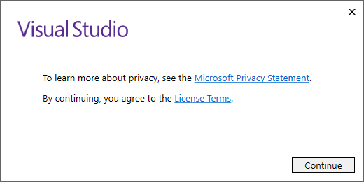

Натискаме бутона [**Continue**], след което ще видим прозореца долу:

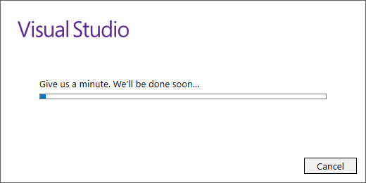

Зарежда се прозорец с инсталационния панел на Visual Studio.

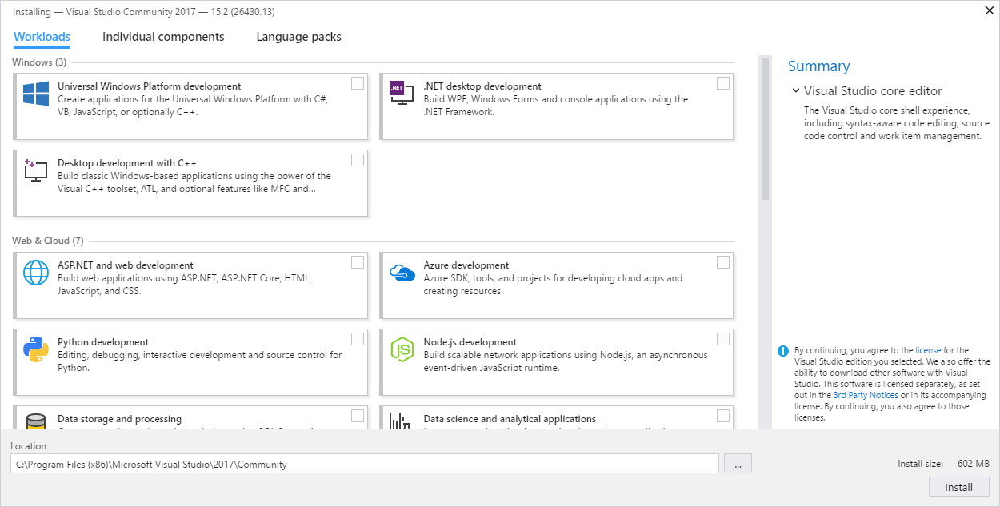

Слагаме отметка на [**Universal Windows Platform development**], [**.NET desktop development**] и [**ASP.NET and web development**], след което натискаме бутона [**Install**]. Общо взето това е всичко.

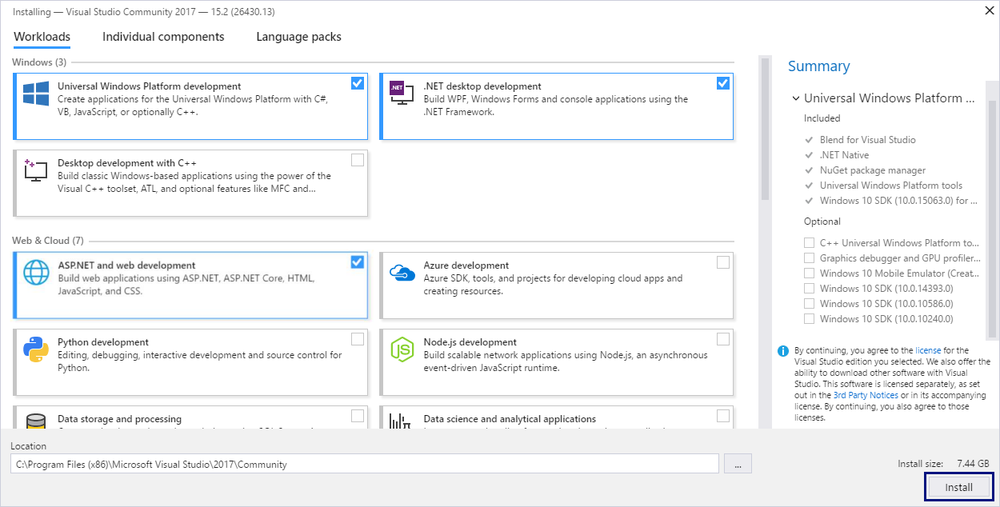

Започва инсталацията на Visual Studio и ще се появи екран като този по-долу:

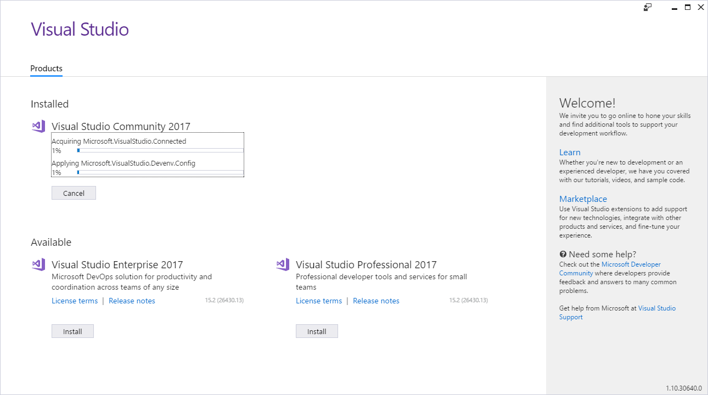

След като Visual Studio се инсталира, ще се появи информативен екран и трябва да натиснем бутона [**Launch**], за да го стартираме.


След **старта на VS** излиза екран като този по-долу. От него можем да изберем дали да влезем с Microsoft профила си във Visual Studio. За момента избираме да работим без да сме се логнали с Microsoft акаунта си, затова избираме опцията [**Not now, maybe later.**]. На по-късен етап, ако имате такъв акаунт, можете да се логнете, а ако нямате и срещате затруднения със създаването му, винаги можете да пишете във форума на SoftUni: [https://softuni.bg/forum](https://softuni.bg/forum).

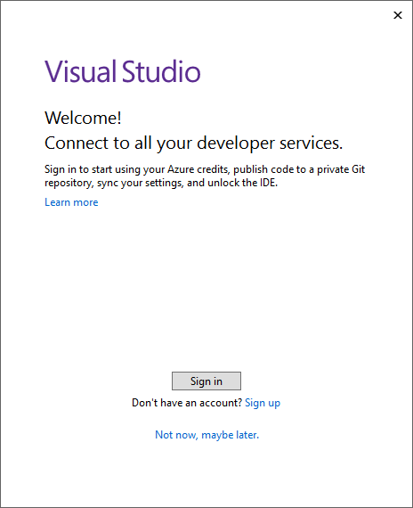

Следващата стъпка е да изберем **цветовата тема**, с която да се визуализира Visual Studio. Тук изборът е изцяло според предпочитанията на потребителя, като няма значение коя опция ще бъде избрана. 

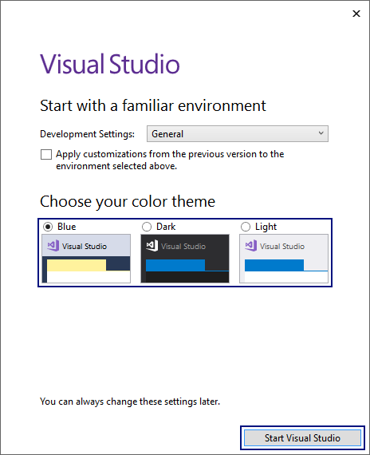

Натискаме бутона [**Start Visual Studio**] и се зарежда в началния изглед на Visual Studio Community:

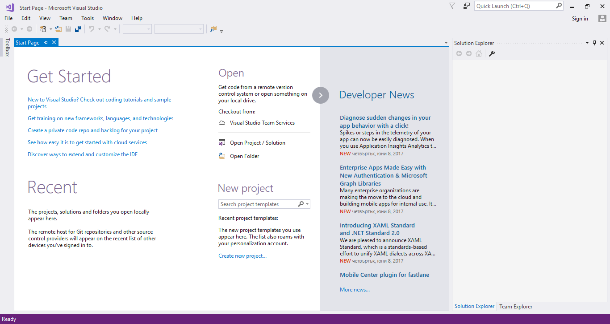

Това е всичко. Готови сме за работа с Visual Studio.

### По-стари версии на Visual Studio

Можем да използваме и по-стари версии на Visual Studio (например версия 2015 или 2013 или дори 2010 или 2005), но **не е препоръчително**, тъй като в тях не се съдържат някои от по-новите възможности за разработка и не всички примери от книгата ще тръгнат.

### Онлайн среди за разработка

Съществуват и **алтернативни среди за разработка онлайн**, директно във вашия уеб браузър. Тези среди не са много удобни, но ако нямате друга възможност, може да стартирате обучението си с тях и да си качите Visual Studio по-късно. Ето някои линкове:
* За езика C# сайтът **.NET Fiddle** позволява писане на код и изпълнението му онлайн: [https://dotnetfiddle.net](https://dotnetfiddle.net).
* За Java можем да използваме следното онлайн Java IDE: [https://www.compilejava.net](https://www.compilejava.net).
* За JavaScript можем да пишем JS код директно в конзолата на даден браузър с натискане на **[F12]**.

### Проектни решения и проекти във Visual Studio

Преди да започнем да работим с Visual Studio е нужно да се запознаем с понятията **Visual Studio Solution** и **Visual Studio Project**, които са неизменна част от него.

**Visual Studio Project** представлява "проектът", върху който работим. В началото това ще са нашите конзолни програми, които ще се научим да пишем с помощта на настоящата книга, ресурсите към нея и в курса Programming Basics в SoftUni. При по-задълбочено изучаване и с времето и практиката, тези проекти ще преминат в апликации, уеб приложения и други разработки. Проектът във VS **логически групира множество файлове**, изграждащи дадено приложение или компонент. Един **C# проект** съдържа един или няколко **C# сорс файла**, конфигурационни файлове и други ресурси. Във всеки C# сорс файл има една или повече **дефиниции на типове** (класове или други дефиниции). В **класовете** има **методи** (действия), а те се състоят от **поредици от команди**. Изглежда сложно, но при големи проекти такава структура е много удобна и позволява добра организация на работните файлове.

**Visual Studio Solution** представлява контейнер (работно решение), в който **логически са обединени няколко проекта**. Целта на обединението на тези VS Projects е да има възможност кода от който и да е от проектите, да си взаимодейства с кода на останалите VS проекти, за да може приложението или уеб сайта да работи коректно. Когато софтуерният продукт или услуга, който разработваме е голям, той се изгражда като **VS Solution**, а този Solution се разделя на **проекти** (VS Projects) и във всеки проект има **папки със сорс файлове**. Такава йерархична организация е много удобна при по-сериозни проекти (да кажем над 50 000 реда код).

За **малки проекти** VS Solutions и VS Projects повече **усложняват работата**, отколкото помагат, но се свиква бързо.

### Пример: създаване на конзолна програма "Hello C#"

Да се върнем на нашата конзолна програмка. Вече имаме Visual Studio и можем да го стартираме. След това създаваме нов конзолен проект: [**File**] &rarr; [**New**] &rarr; [**Project**] &rarr; [**Visual C#**] &rarr; [**Windows**] &rarr; [**Console Application**].

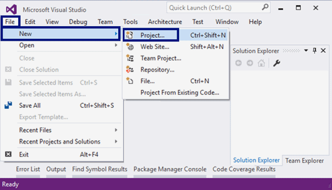

Задаваме **смислено име** на нашата програма, например `HelloCSharp`:

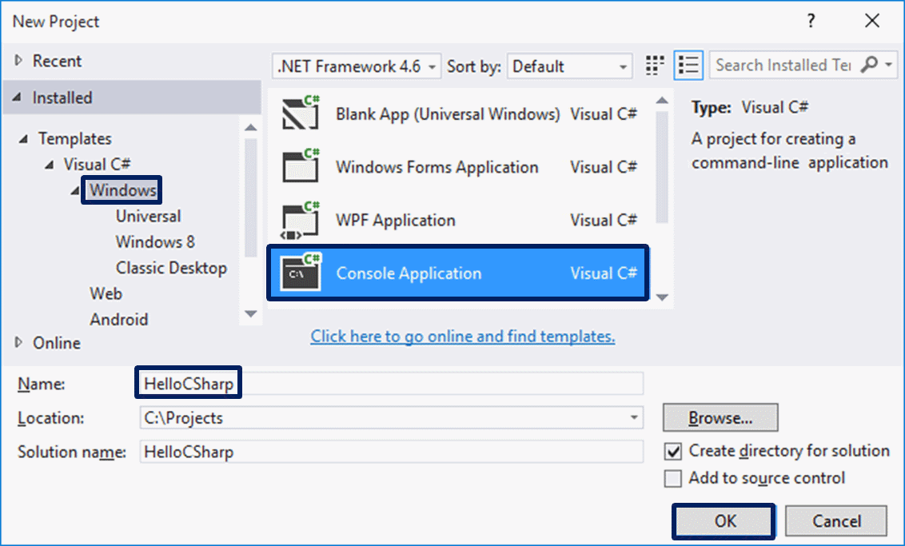

Visual Studio ще създаде за нас **празна C# програма**, която трябва да допишем (VS Solution с VS Project в него със C# сорс файл в него с един C# клас в него с **`Main()`** метод в него).

#### Писане на програмен код

Сорс кодът на C# програмите се пише в секцията **`Main(string[] args)`**, между отварящата и затварящата скоба **`{ }`**. Това е главният метод (действие), което се изпълнява при стартиране на една C# програма. Този главен **`Main()`** метод може да се запише по два начина:
 - **`static void Main(string[] args)`** - с параметри от командния ред (няма да навлизаме в подробности)
 - **`static void Main()`** - без параметри от командния ред

И двата начина са валидни, като **вторият е за предпочитане**, защото е по-кратък и по-изчистен. По подразбиране, обаче, при създаване на конзолна програма Visual Studio ползва първия начин, който можем по желание да редактираме на ръка и да изтрием частта с параметрите **`string[] args`**.

Натискаме [**Enter**] след **отварящата скоба** **`{`** и **започваме да пишем**. Кодът на програмата се пише **отместен навътре**, като това е част от оформянето на текста, за по-голямо удобство при повторен преглед и/или дебъгване.

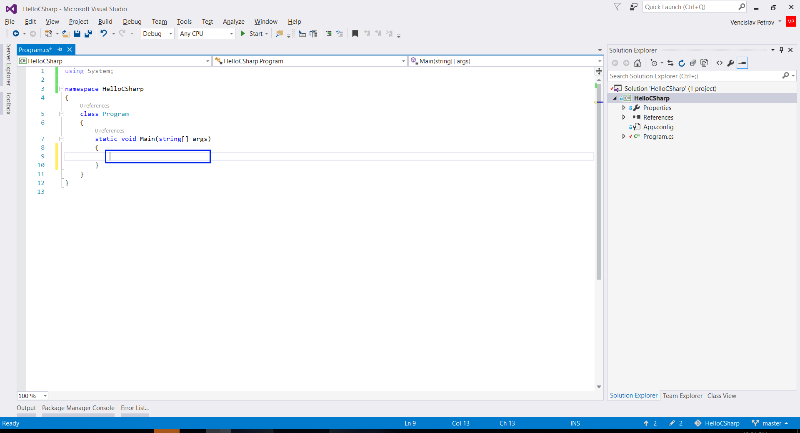

Пишем следната команда:

```csharp
Console.WriteLine("Hello C#");
```

Ето как трябва да изглежда нашата програма във Visual Studio:

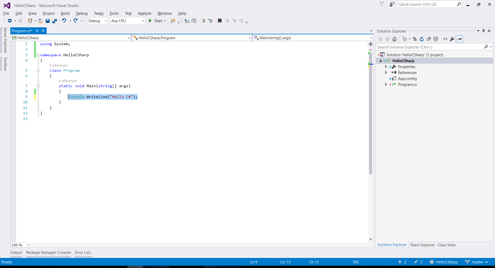

Командата **`Console.WriteLine("Hello C#")`** на езика C# означава да изпълним отпечатване (**`WriteLine(...)`**) върху конзолата (**`Console`**) и да отпечатаме текстово съобщение **`Hello C#`**, което трябва да оградим с кавички, за да поясним, че това е текст. В края на всяка команда на езика C# се слага символът **`;`** и той указва, че командата свършва на това място (т.е. не продължава на следващия ред).

Тази команда много типична за програмирането: указваме да се намери даден **обект** (в случая конзолата) и върху него да се изпълни някакво **действие** (в случая печатане на нещо, което се задава в скоби). По-техническо обяснено, извикваме метода **`WriteLine(...)`** от класа **`Console`** и му подаваме като параметър текстов литерал **`"Hello C#"`**.

#### Стартиране на програмата

За стартиране на програмата натискаме [**Ctrl + F5**]. Ако няма грешки, програмата ще се изпълни. Резултатът ще се изпише на конзолата (в черния прозорец):

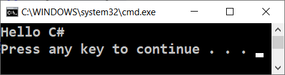

Забележете, че стартираме с **[Ctrl+F5]**, а не само с **[F5]** или с бутона за стартиране във Visual Studio. Ако ползваме **[F5]**, програмата ще се изпълни за кратко и веднага след това черният прозорец ще изчезне и няма да видим резултата.

Всъщност, изходът от програмата е следното текстово съобщение:

```csharp
Hello C#
```

Съобщението "**Press any key to continue . . .**" се изписва допълнително на най-долния ред на конзолата от Visual Studio след като програмата завърши, за да ни подкани да видим резултата от изпълнението на програмата и да натиснем клавиш, за да затворим конзолата.

#### Тестване на програмата в Judge системата

Тестването на задачите от тази книга е автоматизирано и се осъществява през Интернет, от сайта на **Judge системата**: [https://judge.softuni.bg](https://judge.softuni.bg). Оценяването на задачите се извършва на момента от системата. Всяка задача минава поредица от тестове, като всеки успешно преминат тест дава предвидените за него точки. Тестовете, които се подават на задачите, са скрити.

Горната програма може да тестваме тук: [https://judge.softuni.bg/Contests/Practice/Index/503#0](https://judge.softuni.bg/Contests/Practice/Index/503#0). Поставяме целия сорс код на програмата в черното поле и избираме **C# code**, както е показано тук:


Изпращаме решението за оценяване с бутона [**Изпрати**]. Системата връща резултат след няколко секунди в таблицата с изпратени решения. При необходимост може да натиснем бутона за обновяване на резултатите **[refresh]** в горната дясна част на таблицата с изпратени за проверка решения:

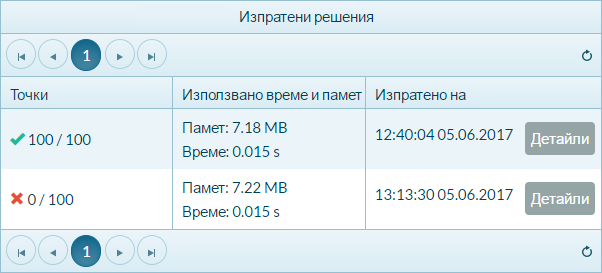

В таблицата с изпратените решения judge системата ще покаже един от следните **възможни резултати**:
* **Брой точки** (между 0 и 100), когато предаденият код се компилира успешно (няма синтактични грешки) и може да бъде тестван.
  - При **вярно решение** всички тестове са маркирани в зелено и получаваме **100 точки**.
  - При **грешно решение** някои от тестовете са маркирани в червено и получаваме непълен брой точки или 0 точки.
* При грешна програма ще получим **съобщение за грешка** по време на компилация.

#### Как да се регистрирам в SoftUni Judge?

Използваме идентификацията си (username + password) за сайта softuni.bg. Ако нямате СофтУни регистрация, направете си. Отнема само минутка - стандартна регистрация в Интернет сайт.

### Тествайте програмите за свирене на ноти

Сега, след като вече **знаете как да изпълнявате програми**, можете да тествате примерните програми по-горе, които свирят музикални ноти. Позабавлявайте се, пробвайте тези програми. Пробвайте да ги промените и да си поиграете с тях. Заменете командата **`Console.WriteLine("Hello C#");`** с команда **`Console.Beep(432, 500);`** и стартирайте програмата. Проверете дали ви е включен звука на компютъра и дали е усилен. Ако работите в онлайн среда за разработка, няма да чуете звук, защото програмата не се изпълнява на вашия компютър, а накъде другаде.


## Типични грешки в C# програмите

Една от често срещаните грешки при начинаещите е **писането извън тялото на ``Main()`` метода**, защото интегрираната среда или компилаторът не биха могли правилно да разчетат зададените команди в програмата. Ето пример за грешно написана програма:
```csharp
static void Main(string[] args)
{
}
Console.WriteLine("Hello C#");
```

Друга грешка е бъркането на **главни и малки букви**, а те имат значение при извикване на командите и тяхното правилно функциониране. Ето пример за такава грешка:
```csharp
static void Main(string[] args)
{
    Console.Writeline("Hello C#");
}
```

В горния пример **`Writeline`** е изписано грешно и трябва да се поправи на **`WriteLine`**.

Липсата на **точка и запетая** (**`;`**) в края на командите е един от вечните проблеми на начинаещия програмист. Пропускането на този знак води до **неправилно функциониране на програмата** и **често проблемът остава незабелязан**. Ето примерен грешен код:
```csharp
static void Main(string[] args)
{
    Console.Writeline("Hello C#")
}
```

Липсваща **кавичка** или **липса на отваряща или затваряща скоба** също може да се окажат проблеми. Kакто и при точката и запетаята, така и тук проблемът води до **неправилно функциониране на програмата** или въобще до нейното неизпълнение. Този пропуск трудно се забелязва при по-обемен код. Ето пример за грешна програма:
```csharp
static void Main(string[] args)
{
    Console.WriteLine("Hello C#);
}
```

Тази програма ще даде **грешка при опит за компилация** и стартиране и даже още преди това кодът ще бъде подчертан, за да се насочи вниманието на програмиста към грешката, която е допуснал (пропуснатата затваряща кавичка):

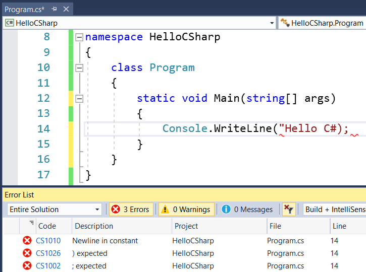


## Какво научихме от тази глава?

На първо място научихме **какво е програмирането** - **задаване на команди, изписани на компютърен език**, които машината разбира и може да изпълни. Разбрахме още какво е **компютърната програма** - тя представлява **поредица от команди**, подредени една след друга. Запознахме се с **езика за програмиране C#** на базисно ниво и как **да създаваме прости конзолни програми** с Visual Studio. Проследихме и **структурата на програмния код в езика C#**, като например, че командите главно се задават в секцията **``static void Main(string[] args)``** между **отварящата и затварящата къдрава скоба**. Видяхме как да печатаме с **`Console.WriteLine(...)`** и как да стартираме програмата си с [**Ctrl + F5**]. Научихме се да тестваме кода си в **SoftUni Judge**.

Добра работа! Да се захващаме с **упражненията**. Нали не сте забравили, че програмиране се учи с много писане на код и решаване на задачи? Да решим няколко задачи, за да затвърдим наученото.


## Упражнения: първи стъпки в коденето

Добре дошли в упражненията. Сега ще напишем няколко конзолни програмки, с които ще направим още няколко първи стъпки в програмирането, след което ще покажем как можем да програмираме нещо по-сложно - програми с графичен и уеб потребителски интерфейс.

### Задача: конзолна програма “Expression”

Да се напише конзолна C# програма, която **пресмята** и **отпечатва** стойността на следния числен израз:

<p align="center"> (3522 + 52353) * 23 - (2336 * 501 + 23432 - 6743) * 3 </p>

Забележка: **не е разрешено да се пресметне стойността предварително** (например с Windows Calculator).

#### Насоки и подсказки

Правим **нов C# конзолен проект** с име "**Expression**".	Намираме метода **``static void Main(string[] args)``** и **влизаме в неговото тяло** между **`{`** и **`}`**. След това трябва да **напишем кода**, който да изчисли горния числен израз и да отпечата на конзолата стойността му. Подаваме горния числен израз в скобите на командата **``Console.WriteLine(...)``**:

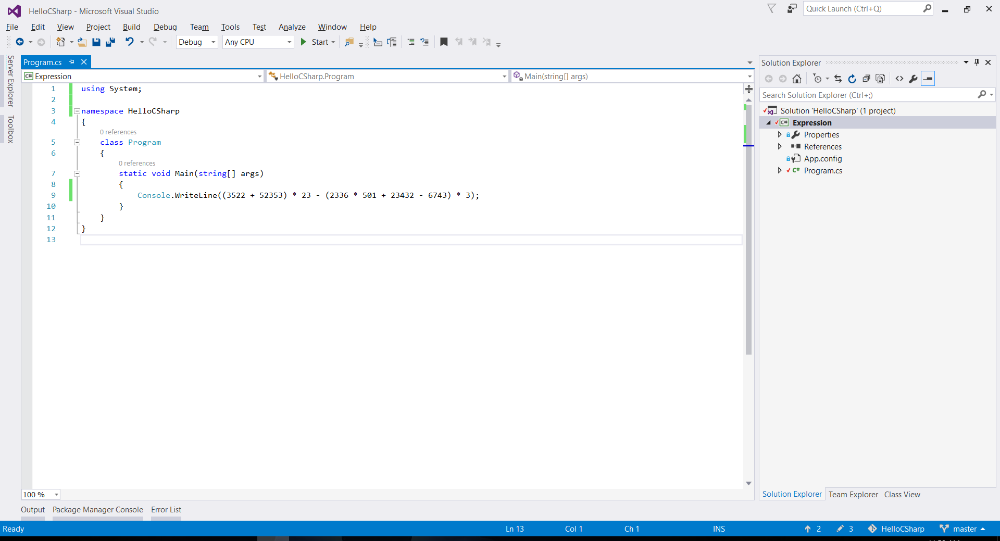

Стартираме програмата с [**Ctrl+F5**] и проверяваме дали резултатът е същия като на картинката:

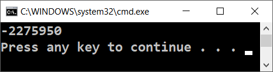

#### Тестване в Judge системата

Тествайте решението си тук: [https://judge.softuni.bg/Contests/Practice/Index/503#1](https://judge.softuni.bg/Contests/Practice/Index/503#1)

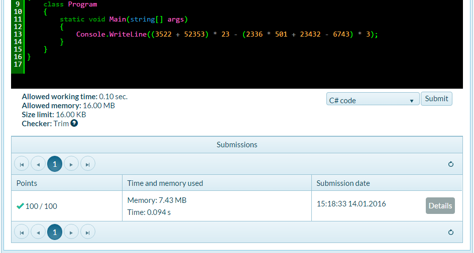


### Задача: числата от 1 до 20

Да се напише C# конзолна програма, която **отпечатва числата от 1 до 20** на отделни редове на конзолата.

#### Насоки и подсказки

Създаваме **конзолно C# приложение** с име “**Nums1To20**“:


В **`static void Main()`** метода пишем 20 команди **``Console.WriteLine(...)``**, всяка на отделен ред, за да отпечатаме числата от 1 до 20 едно след друго. По-досетливите от вас, сигурно се питат дали няма по-умен начин. Спокойно, има, но за него по-късно.


Сега **стартираме програмата** и поверяваме дали резултатът е какъвто се очаква да бъде:
```
1
2
...
20
```

#### Тестване в Judge системата

Тествайте решението си тук: [https://judge.softuni.bg/Contests/Practice/Index/503#2](https://judge.softuni.bg/Contests/Practice/Index/503#2)

Сега помислете дали може да напишем програмата по **по-умен начин**, така че да не повтаряме 20 пъти една и съща команда. Потърсете в Интернет информация за "**[for loop C#](https://www.google.bg/search?q=for+loop+C%23&oq=for+loop+C%23)**".


### Задача: Триъгълник от 55 звездички

Да се напише C# конзолна програма, която **отпечатва триъгълник от 55 звездички**, разположени на 10 реда:

```
*
**
***
****
*****
******
*******
********
*********
**********
```

#### Насоки и подсказки

Създаваме **ново конзолно C# приложение** с име “**TriangleOf55Stars**”. В него трябва да напишем код, който печата триъгълника от звездички, например чрез 10 команди, като посочените по-долу:
```csharp
Console.WriteLine("*");
Console.WriteLine("**");
...
```

#### Тестване в Judge системата

Тествайте решението си тук: [https://judge.softuni.bg/Contests/Practice/Index/503#3](https://judge.softuni.bg/Contests/Practice/Index/503#3)

Опитайте да **подобрите решението**, така че да няма много повтарящи се команди. Може ли това да стане с **`for`** цикъл? Успяхте ли да намерите умно решение (например с цикъл) на предната задача? При тази задача може да се ползва нещо подобно, но малко по-сложно (два цикъла един в друг). Ако не успеете, няма проблем, ще учим цикли след няколко глави и ще си спомните за тази задача тогава.


### Задача: лице на правоъгълник

Да се напише C# програма, която **прочита** от конзолата **две числа a и b**, **пресмята** и **отпечатва** лицето на правоъгълник със страни **a** и **b**. 

#### Примерен вход и изход

| a | b | area |
| :---: | :---: | :---: |
| 2 | 7 |  14  |
| 7 | 8 |  56  |
| 12 | 5 |  60  |

#### Насоки и подсказки

Правим нова **конзолна C# програма**. За да **прочетем двете числа**, използваме следните две команди:

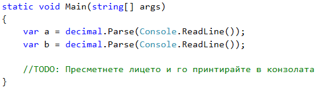

Остава да се допише програмата по-горе, за да пресмята лицето на правоъгълника и да го отпечата. Използвайте познатата ни вече команда **`Console.WriteLine()`** и й подайте в скобите произведението на числата **a** и **b**. В програмирането умножението се извършва с оператора **`*`**.

#### Тествайте решението си

Тествайте решението си с няколко примера. Трябва да получите рзултат, подобен на този (въвеждаме 2 и 7 като вход и програмата отпечатва като резултат 14 - тяхното произведение):
```
2
7
14
```

#### Тестване в Judge системата

Тествайте решението си тук: [https://judge.softuni.bg/Contests/Practice/Index/503#4](https://judge.softuni.bg/Contests/Practice/Index/503#4)


### \* Задача: квадрат от звездички

Да се напише C# конзолна програма, която **прочита** от конзолата **цяло положително число N** и **отпечатва** на конзолата **квадрат от N звездички**, като в примерите по-долу.

#### Примерен вход и изход

| Вход  |    Изход   	| Вход  |    Изход   	| Вход  |    Изход   	| 
|-----|-----------|-----|-----------|-----|----------|
|  3  	|<code>\*\*\*</code><br><code>\*&nbsp;\*</code><br><code>\*\*\*</code>|  4  |<code>\*\*\*\*</code><br><code>\*&nbsp;&nbsp;\*</code><br><code>\*&nbsp;&nbsp;\*</code><br><code>\*\*\*\*</code>| 5  	|<code>\*\*\*\*\*</code><br><code>\*&nbsp;&nbsp;&nbsp;\*</code><br><code>\*&nbsp;&nbsp;&nbsp;\*</code><br><code>\*&nbsp;&nbsp;&nbsp;\*</code><br><code>\*\*\*\*\*</code>|

#### Насоки и подсказки

Правим нова **конзолна C# програма**. За да прочетем числото N (2 ≤ N ≤100), използваме следния код:


Да се допише програмата по-горе, за да отпечатва квадрат, съставен от звездички. Може да се наложи да се използват **`for`** цикли. Потърсете информация в Интернет.

**Внимание**: тази задача е по-трудна от останалите и нарочно е дадена сега и е обозначена със звездичка, за да ви провокира да потърсите информация в Интернет. Това е едно от най-важните умения, което трябва да развивате докато учите програмирането: **да търсите информация в Интернет**. Това ще правите всеки ден, ако работите като програмисти, така че не се плашете, а се опитайте. Ако имате трудности, можете да потърсите помощ и в СофтУни форума: https://softuni.bg/forum.

#### Тестване в Judge системата

Тествайте решението си тук: [https://judge.softuni.bg/Contests/Practice/Index/503#5](https://judge.softuni.bg/Contests/Practice/Index/503#5)


## Конзолни, графични и уеб приложения

При **конзолните приложения** (Console Applications), както и сами можете да се досетите, **всички операции** за четене на вход и печатане на изход се **извършват през конзолата**. Там се **въвеждат входните данни**, които се прочитат от приложението, там се **отпечатват и изходните данни** след или по време на изпълнение на програмата.

Докато конзолните приложения **ползват текстовата конзола**, уеб приложенията (Web Аpplications) **използват уеб-базиран потребителски интерфейс**. За да се **постигне тяхното изпълнение** са необходими две неща - **уеб сървър** и **уеб браузър**, като **браузърът** играе главната роля по **визуализация на данните и взаимодействието с потребителя**. Уеб приложенията са много по-приятни за потребителя, изглеждат визуално много по-добре, използват се мишка и докосване с пръст (при таблети и телефони), но зад всичко това стои програмирането. И затова **трябва да се научим да програмираме** и вече направихме първите си съвсем малки стъпки.

Графичните (GUI) приложения имат **визуален потребителски интерфейс**, директно върху вашия компютър или мобилно устройство, без да е необходим уеб браузър. Графичните приложения (настолни приложения или, иначе казано, desktop apps) **се състоят от един или повече графични прозореца**, в които се намират определени **контроли** (текстови полета, бутони, картинки, таблици и други), **служещи за диалог** с потребителя по по-интуитивен начин. Подобни са и мобилните приложения във вашия телефон и таблет: ползваме форми, текстови полета, бутони и други контроли и ги управляване чрез програмен код. Нали затова се учим сега да пишем код: **кодът е навсякъде в разработката на софтуер**.


## Упражнения: графични и уеб приложения

Сега предстои да направим едно просто **уеб приложение** и едно просто **графично приложение**, за да можем да надникнем в това, какво ще можем да създаваме като напреднем с програмирането и разработката на софтуер. Няма да разглеждаме детайлите по използваните техники и конструкции из основи, а само ще хвърлим поглед върху подредбата и функционалността на създаденото от нас. След като напреднем със знанията си, ще бъдем способни да правим големи и сложни софтуерни приложения и системи. Надяваме се примерите по-долу **да ви запалят интереса**, а не да ви откажат.


### Задача: графично приложение „Суматор за числа“

Да се напише **графично (GUI) приложение**, което **изчислява сумата на две числа**:

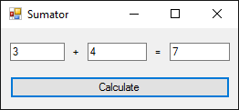

При въвеждане на две числа в първите две текстови полета и натискане на бутона [**Calculate**] се изчислява тяхната сума и резултатът се показва в третото текстово поле. За нашето приложение ще използваме **технологията Windows Forms**, която позволява създаване на **графични приложения за Windows**, в среда за разработка **Visual Studio** и с **език** за програмиране **C#**.

Във Visual Studio създаваме **нов C# проект от тип „Windows Forms Application“**:

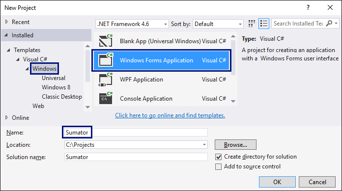

При създаването на Windows Forms приложение ще се появи **редактор за потребителски интерфейс**, в който могат да се слагат **различни визуални елементи** (например кутийки с текст и бутони):

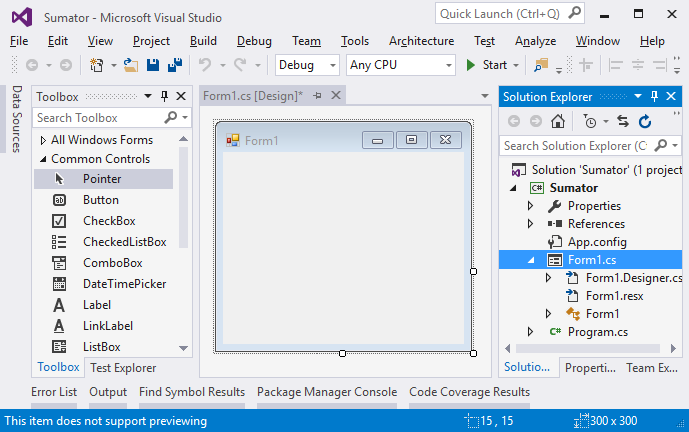

Изтегляме от лентата вляво (Toolbox) **три текстови полета** (**`TextBox`**), **два надписа** (**`Label`**) и **един бутон** (**`Button`**), след което ги подреждаме в прозореца на приложението. След това **променяме имената на всяка от контролите**. Това става от **прозорчето “Properties”** вдясно, чрез промяна на полето (**`Name`**):

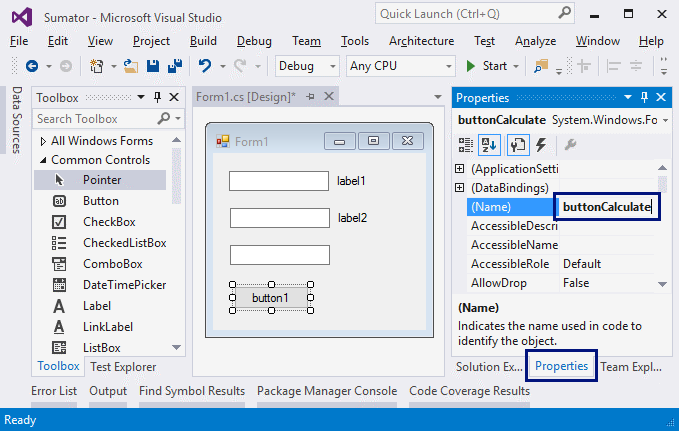

*	Имена на текстовите полета: **`textBox1`**, **`textBox2`**, **`textBoxSum`**
* Име на бутона: **`buttonCalculate`**
*	Име на формата: **`FormCalculate`**

**Променяме заглавията** (**`Text`** свойството) на контролите:

*	buttonCalculate -> Calculate
*	label1 -> +
*	label2 -> =
*	Form1 -> Sumator

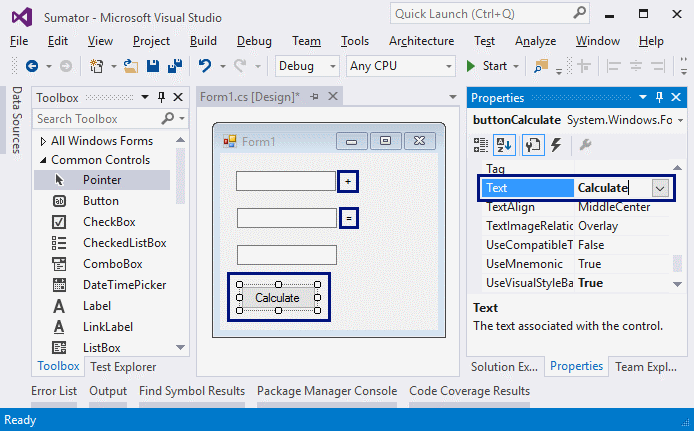

**Преоразмеряваме и подреждаме контролите**, за да изглеждат по-добре:

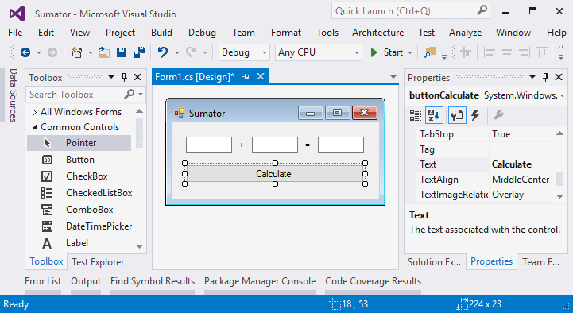

Опитваме да пуснем приложението с [**Ctrl+F5**]. То би трябвало да стартира, но да **не функционира напълно**, защото не сме написали какво се случва при натискане на бутона.

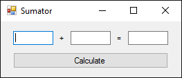

Сега е време да напишем кода, който **сумира числата** от първите две полета и **показва резултата** в третото поле. За целта кликваме **два пъти върху бутона [Calculate]**. Ще се появи място, в което да напишем какво да се случва при натискане на бутона:

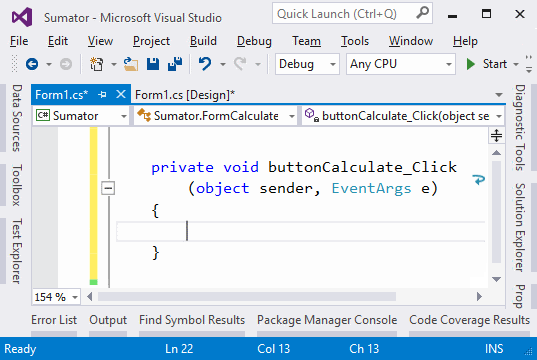

Написваме следния C# код между отварящата и затварящата скоба **`{ }`**, където е курсорът:

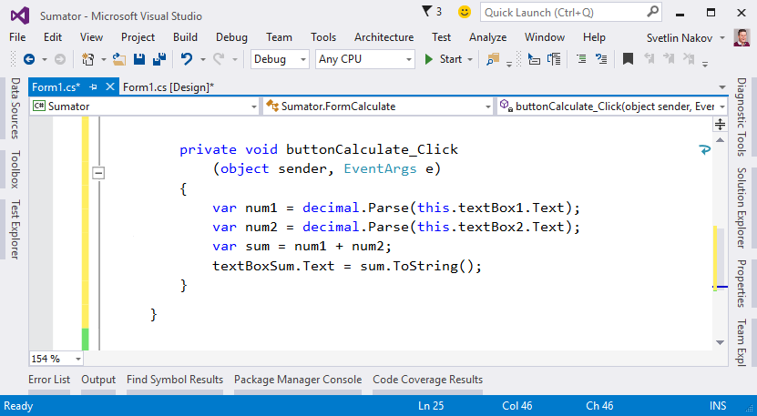

Този код **взима първото число** от полето **`textBox1`** и го запазва **в променливата `num1`**, запазва **второто число** от полето **`textBox2`** в **променливата `num2`**, след това **сумира `num1` и `num2` в променливата `sum`** и накрая **извежда текстовата стойност на променливата `sum`** в полето **`textBoxSum`**.

Стартираме отново програмата с [**Ctrl+F5**] и проверяваме дали работи коректно. Правим опит да сметнете **4 + 5**, а след това **-12.5 + 1.3**:

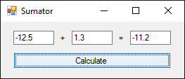 

Пробваме и с **невалидни числа**, напр. “**aaa**” и “**bbb**”. Изглежда има проблем: 

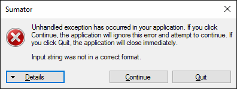 

Проблемът идва от **прехвърлянето на текстово поле в число**. Ако стойността в полето **не е число, програмата дава грешка**. Можем да поправим кода, за да коригираме този проблем:

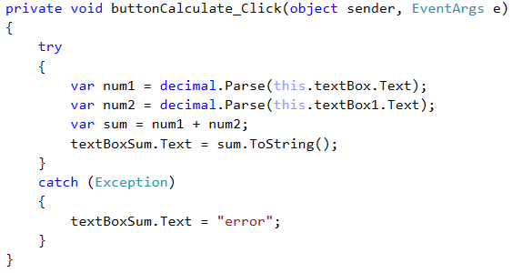

Горният код **прихваща грешките при работа с числа** (хваща изключенията) и в случай на грешка **извежда стойност `error`** в полето с резултата. Стартираме отново програмата с [**Ctrl+F5**] и я пробваме дали работи. Този път **при грешно число резултатът е `error`** и програмата не се чупи:

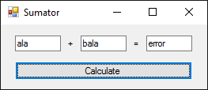 

Сложно ли е? Нормално е да е сложно, разбира се. Тъкмо започваме да навлизаме в програмирането. Примерът по-горе изисква още много знания и умения, които ще развиваме в тази книга и даже и след нея. Просто си позволете да се позабавлявате с desktop програмирането. Ако не тръгва нещо, гледайте **видеото в началото на тази глава** или питайте във **форума на СофтУни**: https://softuni.bg/forum. Или продължете смело напред към следващия пример или към следващата глава от книгата. Ще дойде време и ще ви е лесно, но наистина трябва да вложите **усърдие и постоянство**. Програмирането се учи бавно и с много, много практика.


### Уеб приложение: суматор за числа

Сега ще напишем нещо още по-сложно, но и по-интересно: уеб приложение, което **изчислява сумата на две числа**. При **въвеждане на две числа** в първите две текстови полета и натискане на бутона [**Calculate**] се **изчислява тяхната сума** и резултатът се показва в третото текстово поле.

Обърнете внимание, че ще създадем **уеб-базирано приложение**. Това е приложение, което е достъпно през уеб браузър, точно както любимата ви уеб поща или новинарски сайт. Уеб приложението ще има сървърна част (back-end), която е написана на езика C# с технологията ASP.NET MVC и клиентска част (front-end), която е написана на езика HTML (това е език за визуализация на информация в уеб браузър). 
Уеб приложението се очаква да изглежда приблизително по следния начин:

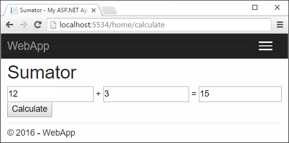

За разлика от конзолните приложения, които четат и пишат данните си във вид на текст на конзолата, уеб приложенията имат **уеб базиран потребителски интерфейс**. Уеб приложенията се **зареждат от някакъв Интернет адрес** (URL) чрез стандартен уеб браузър. Потребителите пишат входните данни в страница, визуализирана от уеб браузъра, данните се обработват на уеб сървър и резултатите се показват отново в страницата в уеб браузъра. За нашето уеб приложение ще използваме **технологията ASP.NET MVC**, която позволява създаване на **уеб приложения с езика за програмиране C#** в средата за разработка **Visual Studio**.

Във Visual Studio създаваме **нов C# проект от тип „ASP.NET Web Application“** с име **WebApp**:

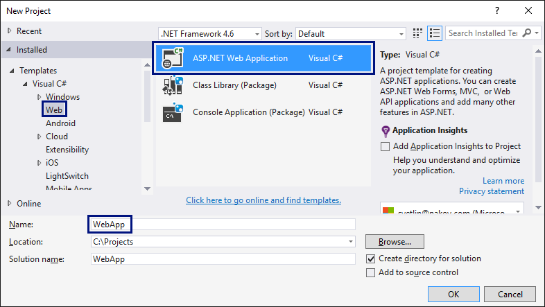

Избираме **тип** на приложението - **“MVC”**:

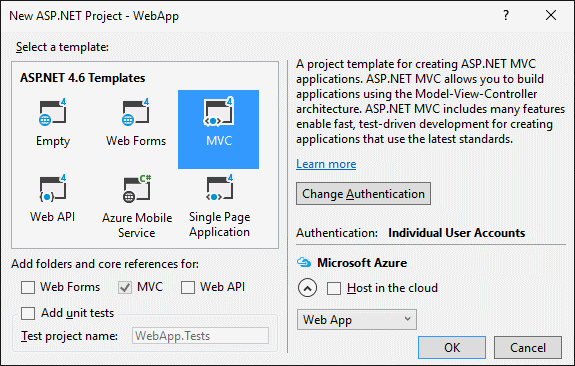

Намираме файла **`Views\Home\Index.cshtml`**. В него се намира **изгледът (view) за главната страница** на нашето уеб приложението:

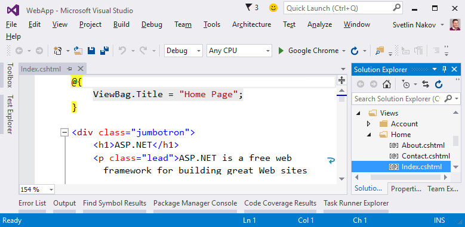

Изтриваме стария код от **файла `Index.cshtml`** и пишем следния код: 

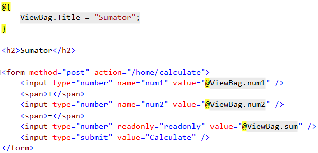


Този код **създава една уеб форма с три текстови полета и един бутон в нея**. В полетата се зареждат стойности, които се изчисляват предварително в обекта **`ViewBag`**. Указано е, че при натискане на бутона [**Calculate**] ще се извика действието **`/home/calculate` (действие `calculate` от `home` контролера)**.

Ето как трябва да изглежда **файлът `Index.cshtml`** след промяната:

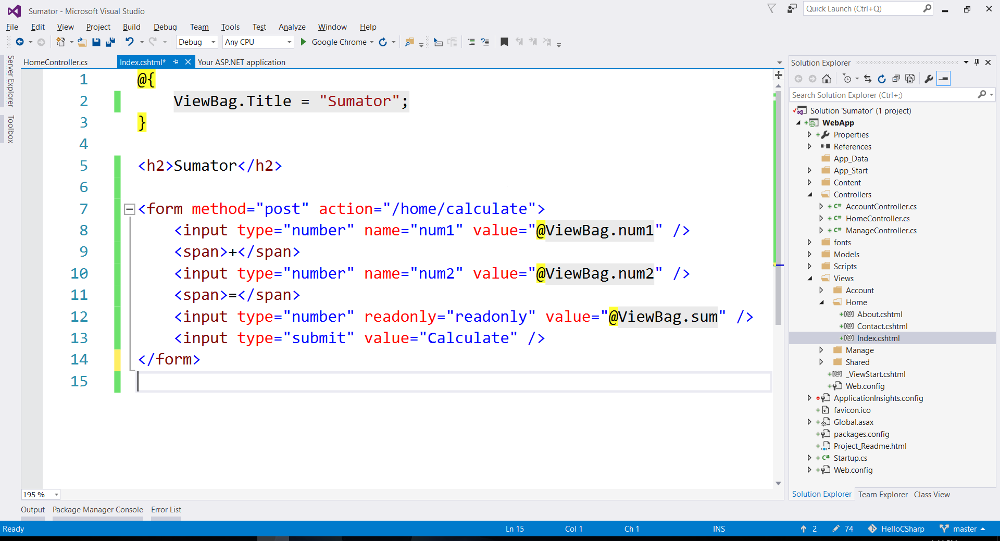

Остава да се напише **действието** (action), което **сумира числата при натискане на бутона** [**Calculate**]. Отваряме файла **`Controllers\HomeController.cs`** и добавяме следния код в тялото на **`HomeController`** класа:

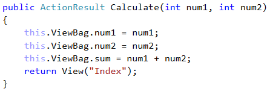

Този код осъществява действието “**calculate**”. То приема два параметъра **`num1`** и **`num2`** и ги записва в обекта **`ViewBag`**, след което **изчислява и записва** тяхната сума. Записаните във **`ViewBag`** стойности след това **се използват от изгледа**, за да се покажат в **трите текстови полета** във формата за сумиране на числа в уеб страницата от приложението.

Ето как трябва да изглежда **файлът `HomeController.cs`** след промяната:

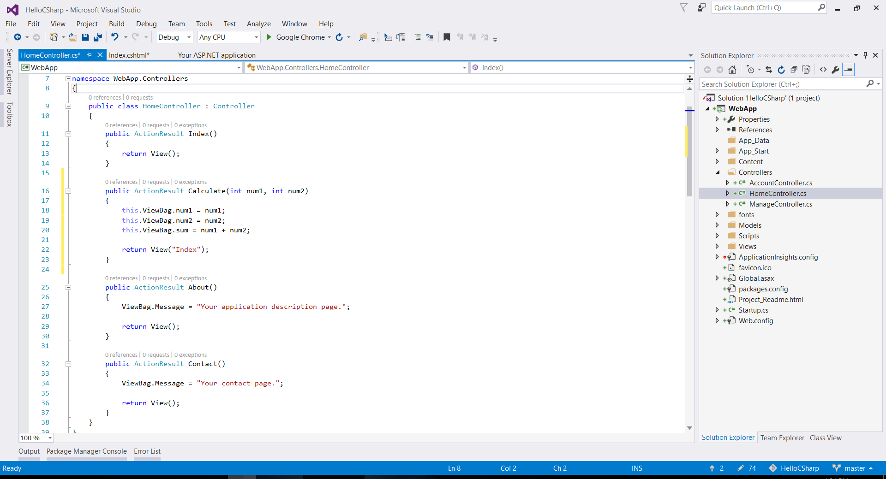

Приложението е готово. Можем да го стартираме с [**Ctrl+F5**] и да тестваме дали работи:

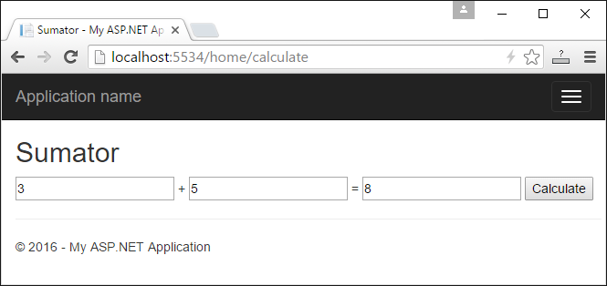

Страшно ли изглежда? **Не се плашете!** Имаме да учим още много, за да достигнем ниво на знания и умения, за да пишем свободно уеб-базирани приложения, като в примера по-горе и много по-големи и по-сложни. Ако не успеете да се справите, няма страшно, продължете спокойно напред. След време ще си спомняте с усмивка колко непонятен и вълнуващ е бил първият ви сблъсък с уеб програмирането. Ако имате проблеми с примера по-горе, **гледайте видеото** в началото на тази глава. Там приложението е направено на живо стъпка по стъпка с много обяснения. Или питайте във **форума на СофтУни**: https://softuni.bg/forum.

Целта на горните два примера (графично desktop приложение и уеб приложение) не е да се научите, а да се докоснете по-надълбоко до програмирането, **да разпалите интереса си** към разработката на софтуер и да се вдъхновите да учите здраво. **Имате да учите още много**, но пък е интересно, нали?
