# Глава 2. Прости пресмятания с числа - изпитни задачи

В предходната глава се запознахме със системната конзола и как да работим с нея - как да прочетем число от конзолата и как да отпечатаме резултат на конзолата. Разгледахме основните аритметични операции и накратко споменахме типовете данни. В настоящата глава ще упражним и затвърдим наученото досега, като разгледаме няколко по-сложни задачи, давани на изпити. Преди да преминем към задачите, нека си припомним някои важни неща:

#### Четене на числа от конзолата

##### Четене на цяло число

Необходима ни е променлива, в която да запазим числото (напр. **`num`**), и да използваме стандартната команда за четене на данни от конзолата в съчетание с функцията **`int.Parse(...)`**, която конвертира текст в число:

```csharp
var num = int.Parse(Console.ReadLine());
```

##### Четене на дробно число

По същия начин, както четем цяло число, но този път ще използваме функцията **`double.Parse(...)`**:

```csharp
var num = double.Parse(Console.ReadLine());
```

#### Извеждане на текст по шаблон (placeholder)

**Placeholder** представлява израз, който ще бъде заменен с конкретна стойност при отпечатване. Методите **`Console.Write(...)/WriteLine(...)`** поддържат печатане на текст по шаблон, като първият аргумент, който трябва да подадем, е форматиращият низ, следван от броя аргументи, равен на броя на плейсхолдърите.

```csharp
Console.WriteLine("You are {0} {1}, a {2}-years old person from {3}.",
  firstName, lastName, age, town);
```

#### Аритметични оператори

##### Оператор +

```csharp
var result = 3 + 5; //резултатът е 8
```

##### Оператор -

```csharp
var result = 3 - 5; //резултатът е -2
```

##### Оператор *

```csharp
var result = 3 * 5; //резултатът е 15
```

##### Оператор /

```csharp
var result = 6 / 3; //резултатът е 2 (целочислено деление)
var result2 = 5 / 2.0; //резултатът е 2.5 (дробно деление)
```

##### Конкатенация

При използване на оператора **`+`** между променливи от тип текст (или между текст и число) се извършва т.нар. конкатенация (слепване на низове).

```csharp
var firstName = "Ivan";
var lastName = "Ivanov";
var age = 19;
var str = firstName + " " + lastName + " is " + age + " years old";
// Ivan Ivanov is 19 years old
```

### Задача: Учебна зала

**Учебна зала** има правоъгълен размер **w** на **h** метра, без колони във вътрешността си. Залата е разделена на две части – лява и дясна, с коридор - приблизително по средата. В лявата и в дясната част има **редици с бюра**. В задната част на залата има голяма **входна врата**. В предната част на залата има **катедра** с подиум за преподавателя. Едно **работно място** заема **70 на 120 cm** (маса с размер 70 на 40 cm + място за стол и преминаване с размер 70 на 80 cm). **Коридорът** е широк поне **100 cm**. Изчислено е, че заради **входната врата** (която е с отвор 160 cm) **се губи точно 1 работно място**, а заради **катедрата** (която е с размер 160 на 120 cm) се губят точно **2 работни места**. Напишете програма, която въвежда размери на учебната зала и изчислява **броя работни места в нея** при описаното разположение (вж. фигурата).

#### Входни данни

От конзолата се четат **2 числа**, по едно на ред: **h** (дължина в метри) и **w** (широчина в метри).

Ограничения: **3 ≤ h ≤ w ≤ 100**.

#### Изходни данни

Да се отпечата на конзолата едно цяло число: **броят места** в учебната зала.

#### Примерен вход и изход

| Вход   | Изход | Чертеж |
|---------|-------|--------|
|15<br>8.9  |129  | 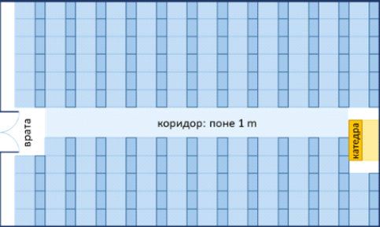       | 
|8.4<br>5.2 |39    | 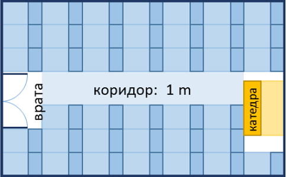        |

**Обяснения**:

Залата е дълга 1500 cm. В нея могат да бъдат разположени **12 реда** (12 \* 120 cm = 1440 + 60 cm остатък). Залата е широка 890 cm. От тях 100 cm отиват за коридора в средата. В останалите 790 cm могат да се разположат по **11 бюра на ред** (11 \* 70 cm = 770 cm + 20 cm остатък). **Брой места = 12 * 11 - 3** = 132 - 3 = **129** (имаме 12 реда по 11 места = 132 минус 3 места за катедра и входна врата).

Залата е дълга 840 cm. В нея могат да бъдат разположени **7 реда** (7 \* 120 cm = 840, без остатък). Залата е широка 520 cm. От тях 100 cm отиват за коридора в средата. В останалите 420 cm могат да се разположат по **6 бюра на ред** (6 \* 70 cm = 420 cm, без остатък). **Брой места = 7 * 6 - 3** = 42 - 3 = **39** (имаме 7 реда по 6 места = 42 минус 3 места за катедра и входна врата).

#### Насоки и подсказки

##### Идея за решение
Както при всяка една задача по програмиране, е **важно да си изградим идея за решението ѝ, преди да започнем да пишем код**. Да разгледаме внимателно зададеното ни условие. Изисква се да напишем програма, която да изчислява броя работни места в една зала, като този брой е зависим от дължината и височината ѝ. Забелязваме, че те ще ни бъдат подадени като входни данни **в метри**, а информацията за това колко пространство заемат работните места и коридорът, ни е дадена **в сантиметри**. За да извършим изчисленията, ще трябва да използваме еднакви мерни единици, няма значение дали ще изберем да превърнем височината и дължината в сантиметри, или останалите данни в метри. За представеното тук решение е избрана първата опция.  

Следва да изчислим **колко колони и колко редици** с бюра ще се съберат. Колоните можем да пресметнем като **от височината извадим необходимото място за коридора (100 cm)** и **разделим остатъка на 70 cm** (колкото е дължината на едно работно място). Редиците ще намерим като разделим **широчината на 120 cm**. И при двете операции може да се получи реално число с цяла и дробна част, **в променлива трябва да запазим обаче само цялата част**. Накрая умножаваме броя на редиците по този на колоните и от него изваждаме 3 (местата, които се губят заради входната врата и катедрата). Така ще получим исканата стойност. 

##### Избор на типове данни

От примерните входни данни виждаме, че за вход може да ни бъде подадено реално число с цяла и дробна част, затова не е подходящо да избираме тип **`int`**, нека за тях използваме **`double`**. Изборът на тип за следващите променливи зависи от метода за решение, който изберем. Както всяка задача по програмиране, тази също има **повече от един начин на решение**. Тук ще бъдат показани два такива. 

##### Решение

Време е да пристъпим към решението. Мислено можем да го разделим на три подзадачи: 
* **Прочитане на входните данни**.
* **Извършване на изчисленията**.
* **Извеждане на изход** на конзолата.

Първото, което трябва да направим, е да прочетем входните данни от конзолата. С **`Console.ReadLine(...)`** четем стойностите от конзолата, а с функцията **`double.Parse(...)`** преобразуваме зададената стрингова (текстова) стойност в **`double`**. 

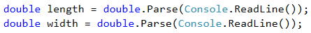

Нека пристъпим към изчисленията. Особеното тук е, че след като извършим делението, трябва да запазим в променлива само цялата част от резултата. 

<table><tr><td></td>
<td><b>Търсете в Google!</b> Винаги, когато имаме идея как да решим даден проблем, но не знаем как да го изпишем на C#, или когато се сблъскаме с такъв, за който предполагаме, че много други хора са имали, най-лесно е да се справим като потърсим информация в Интернет.</td>
</tr></table>

В случая може да пробваме със следното търсене: *c# get whole number part of double*. Откриваме, че едната възможност е да използваме метода **`Math.Truncate(...)`**. Тъй като той работи с променливи от тип **`double`**, за броя редици и колони създаваме променливи също от този тип.  


Втори вариант: както вече знаем, операторът за деление **`/`** има различно действие върху цели и реални числа. **При деление на целочислен с целочислен тип** (напр. **`int`**), **върнатият резултат е отново целочислен**. Следователно можем да потърсим как да преобразуваме реалните числа, които имаме като стойности за височината и широчината, в цели числа и след това да извършим делението. 

Тъй като в този случай може да се получи **загуба на данни**, идваща от премахването на дробната част, е необходимо преобразуването да стане **изрично** (explicit typecasting). Използваме оператора за преобразуване на данни **`(type)`**, като заменяме думата **type** с необходимия **тип данни** и го поставяме **преди променливата**. (Светлин Наков, Веселин Колев и колектив: "Въведение в програмирането със C#", стр. 153-157; повече за преобразуването на типовете данни можете да прочетете [тук](http://www.introprogramming.info/intro-csharp-book/read-online/glava3-operatori-i-izrazi/#_Toc298863977)) 

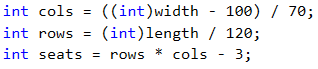

С **`Console.WriteLine(...)`** отпечатваме резултата на конзолата.


#### Тестване в Judge системата

Тествайте решението си тук: [https://judge.softuni.bg/Contests/Practice/Index/505#0](https://judge.softuni.bg/Contests/Practice/Index/505#0)

### Задача: Зеленчукова борса

Градинар продава реколтата от градината си на зеленчуковата борса. Продава **зеленчуци за N лева на килограм** и **плодове за M лева за килограм**. Напишете програма, която **да пресмята приходите от реколтата в евро** (ако приемем, че **едно евро** е равно на **1.94 лв.**).

#### Входни данни

От конзолата се четат **4 числа**, по едно на ред:
* Първи ред – Цена за килограм зеленчуци – число с плаваща запетая.
* Втори ред – Цена за килограм плодове – число с плаваща запетая.
* Трети ред – Общо килограми на зеленчуците – цяло число.
* Четвърти ред – Общо килограми на плодовете – цяло число.

**Ограничения: Всички числа ще са в интервала от 0.00 до 1000.00**

#### Изходни данни

Да се отпечата на конзолата **едно число с плаваща запетая: приходите от всички плодове и зеленчуци в евро**.

#### Примерен вход и изход

| Вход   | Изход  |
|-----------|----------|
|0.194<br>19.4<br>10<br>10|101 | 

**Обяснение:** 
* Зеленчуците струват: 0.194 лв. \* 10 кг. = **1.94 лв.**
* Плодовете струват: 19.4 лв. \* 10 кг.  = **194 лв.**
* Общо: **195.94 лв. = 101 евро**. 

| Вход    | Изход      |
|-----------|----------------|
|1.5<br>2.5<br>10<br>10|20.6185567010309| 

#### Насоки и подсказки

##### Идея за решение

Нека първо разгледаме зададеното ни условие. В случая, от нас се иска да пресметнем колко е **общият приход** от реколтата. Той е равен на **сбора от печалбата от плодовете и зеленчуците**, а тях можем да изчислим като умножим **цената на килограм по количеството им**. Входните данни са дадени в лева, а за изхода се изисква да бъде в евро. По условие 1 евро е равно на 1.94 лeва, следователно за да получим исканата **изходна стойност, трябва да разделим сбора на 1.94**.

##### Избор на типове данни

След като сме изяснили идеята си за решаването на задачата, можем да пристъпим към избора на подходящи типове данни. Да разгледаме **входа**: дадени са **две цели числа** за общия брой килограми на зеленчуците и плодовете, съответно променливите, които декларираме, за да пазим техните стойности, ще бъдат от тип **`int`**. За цените на плодовете и зеленчуците е указано, че ще бъдат подадени **две числа с плаваща запетая**, т.е. променливите ще бъдат от тип **`double`**.

Може да декларираме също две променливи, в които да пазим стойността на печалбата от плодовете и зеленчуците поотделно. Тъй като умножаваме променлива от тип **`int`** (общо килограми) с такава от тип **`double`** (цена), резултатът също трябва да бъде от тип **`double`**. Нека поясним това: по принцип **операторите работят с аргументи от един и същи тип**. Следователно, за да извършим операция като умножение върху два различна типа данни, ни се налага да ги преобразуваме към един и същ такъв. Когато в един израз има типове с различен обхват, преобразуването винаги се извършва към този с най-голям обхват, в този случай това е **`double`**. Тъй като няма опасност от загуба на данни, **преобразуването е неявно** (implicit) и става автоматично от компилатора.  

Като **изход** се изисква също **число с плаваща запетая**, т.е. резултата ще пазим в променлива от тип **`double`**.

##### Решение 

Време е да пристъпим към решението. Мислено можем да го разделим на три подзадачи: 
* **Прочитане на входните данни**.
* **Извършване на изчисленията**.
* **Извеждане на изход** на конзолата.

За да прочетем входните данни декларираме променливи, като внимаваме да ги именуваме по такъв начин, който да ни подсказва какви стойности съдържат променливите. С **`Console.ReadLine(...)`** четем стойностите от конзолата, а с функциите **`int.Parse(...)`** и **`double.Parse(...)`** преобразуваме зададената стрингова стойност съответно в **`int`** и **`double`**.

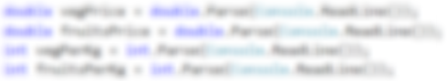

Извършваме необходимите изчисления: 

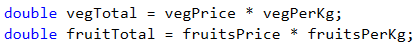

В условието на задачата не е зададено специално форматиране на изхода, следователно трябва просто да изчислим исканата стойност и да я отпечатаме на конзолата. Както в математиката, така и в програмирането делението има приоритет пред събирането. За задачата обаче трябва първо да **сметнем сбора** на двете получени стойности и след това да **разделим на 1.94**. За да дадем предимство на събирането, може да използваме скоби. С **`Console.WriteLine(...)`** отпечатваме изхода на конзолата.  

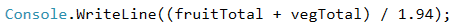

#### Тестване в Judge системата

Тествайте решението си тук: [https://judge.softuni.bg/Contests/Practice/Index/505#1](https://judge.softuni.bg/Contests/Practice/Index/505#1)

### Задача: Ремонт на плочки

На площадката пред жилищен блок трябва **да се поставят плочки**. Площадката е с форма **на квадрат със страна N метра**. Плочките са **широки „W“ метра** и **дълги „L“ метра**. На площадката има една пейка с **ширина M метра и дължина O метра**. Под нея не е нужно да се слагат плочки. Всяка плочка се поставя за **0.2 минути**.

Напишете програма, която **чете от конзолата размерите** на **площадката, плочките и пейката** и пресмята **колко плочки са необходими** да се покрие площадката и пресмята **времето за поставяне на всички плочки**.

**Пример: площадка с размер 20 м.** има **площ 400 кв.м.**. **Пейка**, широка **1 м.** и дълга **2 м.**, заема площ **2 кв.м.** Една **плочка** е **широка 5 м.** и **дълга 4 м.** и има **площ = 20кв.м.** **Площта**, която трябва да се покрие, е **400 – 2 = 398 кв.м.** Необходими са **398 / 20 = 19.90 плочки**. Необходимото **време** е **19.90 * 0.2 = 3.98 минути.**

#### Входни данни

От конзолата се четат **5 числа**:

* **N – дължината** на **страна** от **площадката** в интервала [**1...100**].
* **W – широчината** на една **плочка** в интервала [**0.1...10.00**].
* **L – дължината** на една **плочка** в интервала [**0.1...10.00**].
* **М – широчината** на **пейката** в интервала [**0...10**].
* **О – дължината** на **пейката** в интервала [**0...10**].

#### Изходни данни

Да се отпечатат на конзолата **две числа**: **броя плочки**, необходим за ремонта и **времето за поставяне**, всяко на нов ред.

### Примерен вход и изход

| Вход        | Изход    |
|---------------|------------|
|20<br>5<br>4<br>1<br>2|19.9<br>3.98| 

**Обяснение:** 
* **Обща площ** = 20 \* 20 = 400.
* Площ на **пейката** = 1 \* 2 = 2.
* **Площ за покриване** = 400 – 2 = 398.
* **Площ на плочки** = 5 \* 4 = 20.
* **Необходими плочки** = 398 \/ 20 = 19.9.
* **Необходимо време** = 19.9 \* 0.2 = 3.98.

| Вход    | Изход            |
|-----------|--------------------|
|40<br>0.8<br>0.6<br>3<br>5|3302.08333333333<br>660.416666666667| 

#### Насоки и подсказки

##### Идея за решение

Нека да си направим чертеж, за да поясним условието на задачата. Той може да изглежда по следния начин:

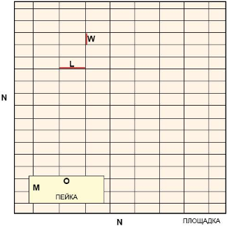

Изисква се да пресметнем **броя плочки**, който трябва да се постави, както и **времето, за което това ще се извърши**. За да **изчислим броя**, е необходимо да сметнем **площта, която трябва да се покрие**, и да я **разделим на лицето на една плочка**. По условие площадката е квадратна, следователно общата площ ще намерим като умножим страната ѝ по стойността й **`N * N`**. След това пресмятаме **площта, която заема пейката**, също като умножим двете ѝ страни **`M * O`**. Като извадим площта на пейката от тази на цялата площадка, получаваме площта, която трябва да се ремонтира. 

Лицето на единична плочка изчисляваме като **умножим едната ѝ страна по другата** **`W * H`**. Както вече отбелязахме, сега трябва да **разделим площта за покриване на площта на една плочка**. По този начин ще разберем какъв е необходимият брой плочки. Него умножаваме по **0.2** (времето, за което по условие се поставя една плочка). Така вече ще имаме исканите изходни стойности. 

##### Избор на типове данни

Дължината на страна от площадката, широчината и дължината на пейката ще бъдат дадени като **цели числа**, следователно, за да запазим техните стойности може да декларираме **променливи от тип `int`**. За широчината и дължината на плочките ще ни бъдат подадени реални числа (с цяла и дробна част), затова за тях ще използваме **`double`**. Изходът на задачата отново ще е реално число, т.е. променливите ще бъдат също от тип **`double`**. 


##### Решение

Както и в предходните задачи, можем мислено да разделим решението на три части:
* **Прочитане на входните данни**.
* **Извършване на изчисленията**.
* **Извеждане на изход** на конзолата.

Първото, което трябва да направим, е да разгледаме **входните данни** на задачата. Важно е да внимаваме за последователността, в която са дадени. С **`Console.ReadLine(...)`** четем стойностите от конзолата, а с **`int.Parse(...)`** и **`double.Parse(...)`** преобразуваме зададената стрингова стойност, съответно в **`int`** и **`double`**.

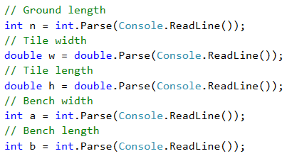

След като сме инициализирали променливите и сме запазили съответните стойности в тях, пристъпваме към **изчисленията**. Тъй като стойностите на променливите **`n`**, **`a`** и **`b`**, с които работим, са запазени в променливи от тип **`int`**, за резултатите от изчисленията може да дефинираме **променливи също от този тип**.  


Променливите **`w`** и  **`h`** са от тип **`double`**, т.е. за **лицето на една плочка** създаваме променлива от същия тип. За финал **изчисляваме стойностите, които трябва да отпечатаме** на конзолата. **Броят** на необходимите **плочки** получаваме като **разделим площта, която трябва да се покрие, на площта на единична плочка**. При деление на две числа, от които **едното е реално**, резултатът е **реално число** с цяла и дробна част. Следователно, за да са коректни изчисленията ни, запазваме резултата в променлива от тип **`double`**. В условието на задачата не е зададено специално форматиране или закръгляне на изхода, затова просто отпечатваме стойностите с **`Console.WriteLine(...)`**. 

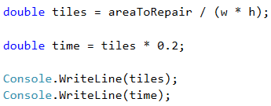

#### Тестване в Judge системата

Тествайте решението си тук: [https://judge.softuni.bg/Contests/Practice/Index/505#2](https://judge.softuni.bg/Contests/Practice/Index/505#2)

### Задача: Парички

Преди време **Пешо си е купил биткойни**. Сега ще ходи на екскурзия из Европа **и ще му трябва евро**. Освен биткойни има **и китайски юани**. Пешо иска **да обмени парите си в евро** за екскурзията. Напишете програма, която **да пресмята колко евро може да купи спрямо следните валутни курсове**:
* **1 биткойн = 1168 лева.**
* **1 китайски юан = 0.15 долара.**
* **1 долар = 1.76 лева.**
* **1 евро = 1.95 лева.**

Обменното бюро има **комисионна от 0 до 5 процента от крайната сума в евро**

#### Входни данни

От конзолата се четат 3 числа:
* На първия ред – **броят биткойни**. Цяло число в интервала [**0...20**].
* На втория ред – **броят китайски юани**. Реално число в интервала [**0.00...50 000.00**].
* На третия ред – **комисионната**. Реално число в интервала [**0.00...5.00**].

#### Изходни данни

На конзолата да се отпечата 1 число - **резултатът от обмяната на валутите**. Не е нужно резултатът да се закръгля.

#### Примерен вход и изход

| Вход        | Изход    |
|---------------|------------|
|1<br>5<br>5|569.668717948718| 

**Обяснение**: 
* 1 биткойн = 1168 лева
* 5 юана = 0.75 долара 
* 0.75 долара = 1.32 лева 
* **1168 + 1.32 = 1169.32 лева = 599.651282051282 евро**
* **Комисионна:** 5% от 599.651282051282 = **29.9825641025641** 
* **Резултат**: 599.651282051282 - 29.9825641025641 = **569.668717948718 евро**

| Вход        | Изход            | Вход         | Изход            |
|------------|------------------|--------------|------------------|
|20<br>5678<br>2.4|12442.2442010256|7<br>50200.12<br>3|10659.4701177436|

#### Насоки и подсказки

##### Идея за решение

Нека отново помислим първо за начина, по който можем да решим задачата, преди да започнем да пишем код. Виждаме, че ще ни бъдат подадени **броят биткойни** и **броят китайски юани**. За **изходната стойност** е указано да бъде в **евро**. В условието са посочени и валутните курсове, с които трябва да работим. Забелязваме, че към евро можем да преобразуваме само сума в лева, следователно трябва **първо да пресметнем цялата сума, която Пешо притежава в лева**, и **след това да изчислим изходната стойност**. 

Тъй като ни е дадена информация за валутния курс на биткойни срещу лева, можем директно да направим това преобразуване. От друга страна, за да получим стойността на **китайските юани в лева**, трябва първо да ги **конвертираме в долари**, а след това **доларите - в лева**. Накрая ще **съберем двете получени стойности** и ще пресметнем на колко евро съответстват. 

Остава последната стъпка: да **пресметнем колко ще бъде комисионната** и да извадим получената сума от общата. Като комисионна ще ни бъде подадено **реално число**, което ще представлява определен **процент от общата сума**. Нека още в началото разделим подаденото число на 100, за да изчислим **процентната му стойност**. Нея ще умножим по сумата в евро, а резултатът ще извадим от същата тази сума. Получената сума ще отпечатаме на конзолата. 

##### Избор на типове данни

**Биткойните** са дадени като **цяло число**, следователно за тяхната стойност може да декларираме **променлива от тип `int`**. Като брой **китайски юани и комисионна** ще получим **реално число**, следователно за тях използваме **`double`**. Тъй като **`double`** e типът данни с по-голям обхват, а **изходът** също ще бъде **реално число**, ще използваме него и за останалите променливи, които създаваме. 

##### Решение

След като сме си изградили идея за решението на задачата и сме избрали структурите от данни, с които ще работим, е време да пристъпим към **писането на код**. Както и в предните задачи, можем да разделим решението на три подзадачи: 
* **Прочитане на входните данни**.
* **Извършване на изчисленията**.
* **Извеждане на изход** на конзолата.

**Декларираме променливите**, които ще използваме, като отново внимаваме да изберем **смислени имена**, които подсказват какво съдържат те. Инициализираме техните стойности: с **`Console.ReadLine(...)`** четем подадените числа на конзолата и конвертираме въведения от потребителя стринг към **`int`** или **`double`**. 

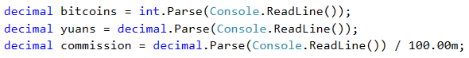

Извършваме необходимите изчисления: 


Накрая **пресмятаме стойността на комисионната** и я **изваждаме от сумата в евро**. Нека обърнем внимание на начина, по който можем да изпишем това: **`euro -= commission * euro`** e съкратен начин за изписване на **`euro = euro - (commission * euro);`**. В случая използваме **комбиниран оператор за присвояване** (**`-=`**), който **изважда стойността от операнда вдясно от този вляво**. Операторът за умножение (**`*`**) има **по-висок приоритет** от комбинирания оператор, затова изразът **`commission * euro`** се изпълнява първи, след което неговата стойност се изважда. (Светлин Наков, Веселин Колев и колектив: "Въведение в програмирането със C#", стр. 150; повече за операторите може да прочетете [тук](http://www.introprogramming.info/intro-csharp-book/read-online/glava3-operatori-i-izrazi/#_Toc298863965))

В условието на задачата не е зададено специално форматиране или закръгляне на резултата, следователно трябва просто да изчислим изхода и да го отпечатаме на конзолата. 


Нека обърнем внимание на нещо, което важи за всички задачи от този тип: разписано по този начин, решението на задачата е доста подробно. Тъй като условието като цяло не е сложно, бихме могли на теория да напишем един голям израз, в който директно след получаване на входните данни да сметнем изходната стойност. Напр., такъв израз би изглеждал ето така: 

```csharp
double euro = (bitcoins * 1168 + yuans * 0.15 * 1.76) / 1.95 - 
  ((bitcoins * 1168 + yuans * 0.15 * 1.76) / 1.95 * commission);
```

Този код би дал правилен резултат, **но се чете трудно**. Няма да ни е лесно да разберем какво прави и дали съдържа грешки, както и как да поправим някоя такава. По-добра практика е **вместо един сложен израз да напишем няколко прости** и да запишем резултатите от тях в променливи със подходящи имена. Така кодът е ясен и по-лесно променяем. 

### Тестване в Judge системата

Тествайте решението си тук: [https://judge.softuni.bg/Contests/Practice/Index/505#3](https://judge.softuni.bg/Contests/Practice/Index/505#3)

### Задача: Дневна печалба

Иван е програмист в **американска компания** и **работи** от вкъщи **средно N дни в месеца**, като изкарва **средно по M долара на ден**. В края на годината Иван **получава бонус**, който е **равен на 2.5 месечни заплати. От спечеленото през годината му се удържат 25% данъци**. Напишете програма, която да **пресмята колко е чистата средна печалба на Иван на ден в лева**, тъй като той харчи изкараното в България. Приема се, че **в годината има точно 365 дни. Курсът на долара** спрямо лева ще **се чете от конзолата**.

#### Входни данни

От конзолата се четат **3 числа**: 
* На първия ред – **работни дни в месеца**. Цяло число в интервала [**5…30**].
* На втория ред – **изкарани пари на ден**. Реално число в интервала [**10.00…2000.00**].
* На третия ред – **курсът на долара спрямо  лева** /1 долар = X лева/. Реално число в интервала [**0.99…1.99**].

#### Изходни данни

На конзолата **да се отпечата 1 число – средната печалба на ден в лева**. Резултатът да се **форматира до втория знак след запетаята**.

#### Примерен вход и изход

| Вход        | Изход          |
|---------------|------------------|
|21<br>75.00<br>1.59|74.61| 

**Обяснение**:
* **1 месечна заплата** = 21 \* 75 = 1575 долара.
* **Годишен доход** = 1575 \* 12 + 1575 \* 2.5 = 22837.5 долара.
* **Данък** = 25% от 22837.5 = 5709.375 лева.
* **Чист годишен доход** = 17128.125 долара = 27233.71875 лева.
* **Средна печалба на ден** = 27233.71875 / 365 = 74.61 лева.


| Вход        | Изход            | Вход         | Изход    |
|-------------|------------------|-------------|------------------|
|15<br>105<br>1.71|80.24|22<br>199.99<br>1.50|196.63|

#### Насоки и подсказки

##### Идея за решение

Нека първо пресметнем **колко е месечната заплата** на Иван. Това ще направим като **умножим работните дни в месеца по парите**, които той печели на ден. **Умножаваме получения резултат** първо по 12, за да изчислим колко е заплатата му за 12 месеца, а след това и **по 2.5**, за да пресметнем бонуса. Като съберем двете получени стойности, ще изчислим **общия му годишен доход**. От него **трябва да извадим 25%**. Това може да направим като умножим общия доход по **0.25** и извадим резултата от него. Спрямо дадения ни курс **преобразуваме доларите в лева**, след което **разделяме резултата на дните в годината**, за които приемаме, че са 365.     

#### Избор на типове данни

**Работните дни за месец** са дадени като **цяло число**, следователно за тяхната стойност може да декларираме променлива от **тип `int`**. За **изкараните пари**, както и за **курса на долара спрямо лева**, ще получим **реално число**, следователно за тях използваме **`double`**. Тъй като **`double`** e типът данни с **по-голям обхват**, а за изходната стойност също се изисква **реално число** (с цяла и дробна част), ще използваме него и за останалите променливи, които създаваме. 

##### Решение

Отново: след като имаме идея как да решим задачата и сме помислили за типовете данни, с които ще работим, пристъпваме към **писането на програмата**. Както и в предходните задачи, можем да разделим решението на три подзадачи: 
* **Прочитане на входните данни**.
* **Извършване на изчисленията**.
* **извеждане на изход** на конзолата.

**Декларираме променливите**, които ще използваме, като отново се стараем да изберем **подходящи имена**. С **`Console.ReadLine(...)`** четем подадените числа на конзолата и **преобразуваме** въведения от потребителя стринг към **`int`** или **`double`** с **`int/double.Parse(...)`**. 


Извършваме изчисленията: 

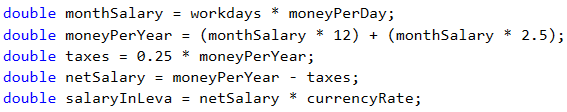

Бихме могли да напишем израза, с който пресмятаме общия годишен доход, и без скоби. Тъй като умножението е операция с по-висок приоритет от събирането, то ще се извърши първо. Въпреки това **писането на скоби се препоръчва, когато използваме повече оператори**, защото така кодът става **по-лесно четим** и възможността да се допусне грешка е по-малка. 

Накрая остава да изведем резултата на конзолата. Забелязваме, че се **изисква форматиране на числената стойност до втория знак след десетичната запетая**. За целта можем да използваме **placeholder, т.е. място, което ще бъде заместено с конкретна стойност при отпечатването**. В C# за **placeholder** се използва цифра, оградена с къдрави скоби. Тъй като **в програмирането броенето започва от 0**, изразът **`{0}`** означава, че на негово място ще бъде поставен първият подаден аргумент. Цяло или дробно число можем да форматираме със спецификаторите **F** или **f**. След него следва цяло положително число, което указва броя на знаците след десетичния знак (Светлин Наков, Веселин Колев и колектив: "Въведение в програмирането със C#", стр. 155-158; повече за форматирането може да прочетете [тук](http://www.introprogramming.info/intro-csharp-book/read-online/glava4-vhod-i-izhod-ot-konzolata/#_Toc298863992)):  

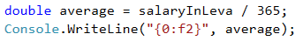

#### Тестване в Judge системата

Тествайте решението си тук: [https://judge.softuni.bg/Contests/Practice/Index/505#4](https://judge.softuni.bg/Contests/Practice/Index/505#4)
