# Глава 2. Прости пресмятания с числа

В настоящата глава ще се запознаем със следните концепции и програмни техники:
- Какво представлява **системната конзола**?
- Как да **прочитаме числа** от системната конзола?
- Как да работим с **типове данни и променливи**, които са ни необходими при обработка на числа и операциите между тях?
- Как да **изведем** резултат (число) на системната конзола?
- Как да извършваме прости **аритметични операции**: събиране, изваждане, умножение, деление, съединяване на низ?

## Видео

<div class="video-player">
  Гледайте видео-урок по тази глава тук: <a target="_blank" href="https://www.youtube.com/watch?v=0f7c9RIZGaE">https://www.youtube.com/watch?v=0f7c9RIZGaE</a>.
</div>
<script src="/assets/js/video.js"></script>

## Системна конзола
Обикновено наричана само "**конзола**", системната, или още компютърната конзола, представлява устройството, чрез което подаваме команди на компютъра в текстов вид и получаваме резултатите от тяхното изпълнение отново като текст. В повечето случаи системната конзола представлява текстов терминал, т.е. приема и визуализира само **текст**, без графични елементи като например бутони, менюта и т.н.

В повечето операционни системи **конзолата** е достъпна като самостоятелно приложение на което пишем конзолни команди. В Windows се нарича **Command Prompt**, а в Linux и Mac се нарича **Terminal**. В конзолата се изпълняват конзолни приложения. Те четат текстов вход от командния ред и печатат изхода си като текстов изход на конзолата. В настоящата книга ще се учим на програмиране като създаваме предимно **конзолни приложения**.

## Четене на числа от конзолата

За да прочетем **цяло** (не дробно) **число** от конзолата е необходимо да **декларираме променлива**, да посочим **типа на числото**, както и да използваме стандартната команда за четене на информация от системната конзола:

```csharp
var num = int.Parse(Console.ReadLine());
```

### Пример: пресмятане на лице на квадрат със страна **а**

За пример да вземем следната програма, която прочита цяло число от конзолата, умножава го по него самото (вдига го на квадрат) и отпечатва резултата от умножението. Така можем да пресметнем лицето на квадрат по дадена дължина на страната:

```csharp
Console.Write("a = ");              
var a = int.Parse(Console.ReadLine());
var area = a * a;
Console.Write("Square area = ");
Console.WriteLine(area);
```

Ето как би работила програмата при квадрат с размер на страната 3:


Опитайте да въведете грешно число, например "**hello**". Ще получите съобщение за грешка по време на изпълнение (excption). Това е нормално. По-късно ще разберем как можем да прихващаме такива грешки и да караме потребителят да въвежда число наново.

#### Как работи примерът?

Първият ред **`Console.Write("a = ");`** печата информативно съобщение, което подканва потребителя да въведе страната на квадрата **a**. След отпечатването курсорът остава на същия ред. Оставането на същия ред е по-удобно за потребителя, чисто визуално. Използва се **`Console.Write(...)`**, а не **`Console.WriteLine(...)`** и така курсорът остава на същия ред.

Следващият ред **`var a = int.Parse(Console.ReadLine());`** прочита цяло число от конзолата. Всъщност първо се прочита текст (стринг) чрез **`Console.ReadLine()`** и след това се преобразува до цяло число (парсва се) чрез **`int.Parse(...)`**. Резултатът се записва в променлива с име **`a`**.

Следващата команда **`var area = a * a;`** записва в нова променлива **`area`** резултата от умножението на **`a`** по **`a`**.

Следващата команда **`Console.Write("Square area = ");`** отпечатва посочения текст, без да преминава на нов ред. Отново се използва **`Console.Write(...)`**, а не **`Console.WriteLine(...)`** и така курсорът остава на същия ред, за да може след това да се отпечата и изчисленото лице на квадрата.

Последната команда **`Console.WriteLine(area);`** отпечатва изчислената стойност от променливата **`area`**.

#### Тестване в Judge системата

Тествайте решението си тук: [https://judge.softuni.bg/Contests/Practice/Index/504#0](https://judge.softuni.bg/Contests/Practice/Index/504#0).

## Пресмятания в програмирането

За компютрите знаем, че са машини, които обработват данни. Всички **данни** се записват в компютърната памет (RAM памет) в **променливи**. Променливите са именовани области от паметта, които пазят данни от определен тип, например число или текст. Всяка една **променлива** в C# има **име**, **тип** и **стойност**. Ето как бихме дефинирали една променлива, като едновременно с декларацията ѝ, ѝ присвояваме и стойност:


След тяхната обработка, данните се записват отново в променливи (т.е. някъде в паметта, заделена от нашата програма).

## Типове данни и променливи

В програмирането всяка една променлива съхранява определена **стойност** от даден **тип**. Типовете данни могат да бъдат например: **число**, **буква**, **текст** (стринг), **дата**, **цвят**, **картинка**, **списък** и др.
Ето няколко примера за типове данни:
- тип **цяло число**: 1, 2, 3, 4, 5, …
- тип **дробно число**: 0.5, 3.14, -1.5, …
- тип **буква от азбуката** (символ): 'a', 'b', 'c', …
- тип **текст** (стринг): "Здрасти", "Hi", "Beer", …
- тип **ден от седмицата**: Monday, Tuesday, …

## Четене на дробно число от конзолата

За да прочетем **дробно число** от конзолата е необходимо отново да **декларираме променлива**, да посочим **типа на числото**, както и да използваме стандартната команда за четене на информация от системната конзола:

```csharp
var num = double.Parse(Console.ReadLine());
```

### Пример: прехвърляне от инчове в сантиметри

Да напишем програма, която чете дробно число в инчове и го обръща в сантиметри:

```csharp
Console.Write("Inches = ");              
var inches = double.Parse(Console.ReadLine());
var centimeters = inches * 2.54;
Console.Write("Centimeters = ");
Console.WriteLine(centimeters);
```

Да стартираме програмата и да се уверим, че при подаване на стойност в инчове, получаваме коректен резултат в сантиметри:

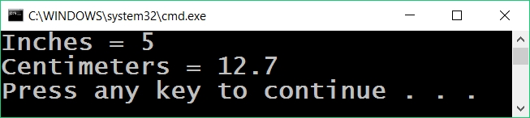

#### Тестване в Judge системата

Тествайте решението си тук: [https://judge.softuni.bg/Contests/Practice/Index/504#1](https://judge.softuni.bg/Contests/Practice/Index/504#1)

## Четене и печатане на текст

За да прочетем текст (стринг) от конзолата, отново **декларираме нова променлива** и използваме стандартната **команда за четене на информация от системната конзола**:

```csharp
var str = Console.ReadLine();
```
Нека обърнем внимание на факта, че при **четене на текст не се декларира** по никакъв начин тип "**`string`**" (текст). Това е така, защото по подразбиране методът **`Console.ReadLine(...)`** връща като **резултат текст**. Допълнително, вие можете да зададете текстa да бъде прехвърлен в цяло число чрез **`int.Parse(...)`** или дробно число чрез **`double.Parse(...)`**. Ако това не се направи, за програмата **всяко едно число** ще бъде просто **текст**, с който **не бихме могли да извършваме** аритметични операции.

### Пример: поздрав по име

Да напишем програма, която въвежда името на потребителя и го поздравява с текста "**Hello, *име***".

```csharp           
var name = Console.ReadLine();
Console.WriteLine("Hello, {0}!", name);
```

В този случай, изразът **`{0}`** e заместен от **първия** подаден аргумент, който в примера е променливата **`name`**:


#### Тестване в Judge системата

Тествайте решението си тук: [https://judge.softuni.bg/Contests/Practice/Index/504#2](https://judge.softuni.bg/Contests/Practice/Index/504#2)

## Съединяване на текст и числа

При печат в конзолата на текст, числа и други данни, **можем да ги съединим**, като използваме шаблони **`{0}`**, **`{1}`**, **`{2}`** и т.н. В програмирането тези шаблони се наричат **placeholders**.

```csharp
var firstName = Console.ReadLine();
var lastName = Console.ReadLine();
var age = int.Parse(Console.ReadLine());
var town = Console.ReadLine();
Console.WriteLine("You are {0} {1}, a {2}-years old person from {3}.",
  firstName, lastName, age, town);
```

Ето резултатът, който ще получим, след изпълнение на този пример:

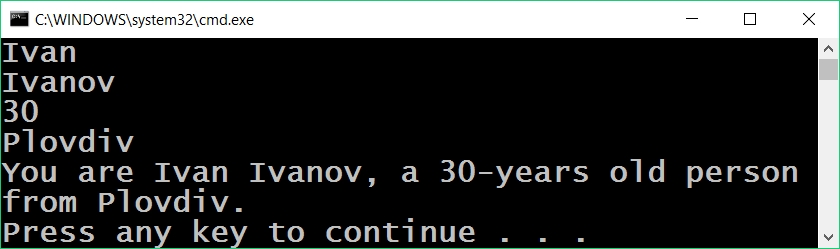

Обърнете внимание как всяка една променлива трябва да бъде подадена в **реда, в който искаме да се печата**. По същество, шаблонът (**placeholder**) **приема променливи от всякакъв вид**.

Възможно е един и същ номер на шаблон да се използва по няколко пъти и не е заъдлжително шаблоните да са номерирани поредно. Ето пример:

```csharp
Console.WriteLine("{1} + {1} = {0}", 1+1, 1);
```
Резултатът е:
```
1 + 1 = 2
```

#### Тестване в Judge системата

Тествайте решението си тук: [https://judge.softuni.bg/Contests/Practice/Index/504#3](https://judge.softuni.bg/Contests/Practice/Index/504#3)

## Аритметични операции

Да разгледаме базовите аритметични операции в програмирането.

### Събиране на числа (оператор **`+`**)

Можем да събираме числа с оператора **`+`**:

```csharp
var a = 5;
var b = 7;
var sum = a + b; // резултатът е 12
```

### Изваждане на числа (оператор **`-`**)

Изваждането на числа се извършва с оператора **`-`**:

```csharp
var a = int.Parse(Console.ReadLine());
var b = int.Parse(Console.ReadLine());
var result = a - b;
Console.WriteLine(result);
```

Ето резултатът от изпълнението на програмата (при числа 10 и 3):

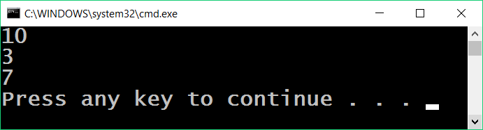

### Умножение на числа (оператор **`*`**)

За умножение на числа използваме оператора **`*`**:

```csharp
var a = 5;
var b = 7;
var product = a * b; // 35
```

### Деление на числа (оператор /)

Делението на числа се извършва с оператора **`/`**. Той работи различно при цели и при дробни числа.
* Когато делим две цели числа, се извършва **целочислено деление** и полученият резултат е цяло число с отрязана дробна част. Например 11 / 3 = 3.
* Когато делим две числа, от които поне едното е дробно, се извършва **дробно деление** и полученият резултат е дробно число, както в математиката. Например 11 / 4.0 = 2.75. При невъзможност за точно разделяне, резултатът се закръгля, например 11.0 / 3 = 3.66666666666667.
* Челочисленото **деление на 0** предизвиква **грешка** по време на изпълнение (runtime exception).
* Дробното **деление на 0** не предизвиква грешка, а резултатът е **+/- безкрайност** или специалната стойност **NaN**. Например 5 / 0.0 = &#8734;.

Ето няколко примера за използване на оператора за делене:

```csharp
var a = 25;
var i = a / 4;      // извършваме т.нар. целочислено деление:
                    // резултатът от тази операция ще бъде 6 – дробната част се отрязва, 
                    // тъй като извършваме деление с цели числа
var f = a / 4.0;    // 6.25 – дробно деление. Изрично сме указали числото 4 да се интерпретира
                    // като дробно, като сме добавили десетичната точка, следвана от нула
var error = a / 0;  // Грешка: целочислено деление на 0
```

Да разгледаме и няколко примера за **целочислено деление** (запомнете, че при **деление на цели числа** в езика C# резултатът е **цяло число**):

```csharp
var a = 25;
Console.WriteLine(a / 4);  // Целочислен резултат: 6
Console.WriteLine(a / 0);  // Грешка: деление на 0
```
Да разгледаме няколко примера за **деление на дробни числа**. При дробно делене резултатът винаги е **дробно число** и деленето никога не дава грешка и работи коректно със специалните стойности **+&#8734;** и **-&#8734;**:

```csharp
var a = 15;
Console.WriteLine(a / 2.0);   // Дробен резултат: 7.5
Console.WriteLine(a / 0.0);   // Резултат: Infinity
Console.WriteLine(-a / 0.0);   // Резултат: -Infinity
Console.WriteLine(0.0 / 0.0); // Резултат: NaN (Not a Number), т.е. резултатът
                              // от операцията не е валидна числена стойност
```

При отпечатването на стойностите **&#8734;** и **-&#8734;** на конзолата може да излязат `?`, защото конзолата в Windows не поддържа коректно Unicode и поврежда повечето нестандартни символи, букви и специални знаци. Горният пример най-вероятно ще изведе следния резултат:
```
7.5
?
-?
NaN
```

## Съединяване на текст и число

Операторът **`+`** освен за събиране на числа служи и за съединяване на текст (долепяне на два символни низа един след друг). В програмирането съединяване на текст с текст или с число наричаме "**конкатенация**". Ето как можем да съединяваме текст и число с оператора **`+`**:

```csharp
var firstName = "Maria";
var lastName = "Ivanova";
var age = 19;
var str = firstName + " " + lastName + " @ " + age;
Console.WriteLine(str);  // Maria Ivanova @ 19
```

Ето още един пример:

```csharp
var a = 1.5;
var b = 2.5;
var sum = "The sum is: " + a + b;
Console.WriteLine(sum);  // The sum is: 1.52.5
```

Забелязвате ли нещо странно? Може би очаквахте числата **`a`** и **`b`** да се сумират? Всъщност конкатенацията работи отляво надясно и горният резултат е абсолютно коректен. Ако искаме да сумираме числата, ще трябва да ползваме **скоби**, за да променим реда на изпълнение на операциите:

```csharp
var a = 1.5;
var b = 2.5;
var sum = "The sum is: " + (a + b);
Console.WriteLine(sum);  // The sum is: 4
```


## Числени изрази

В програмирането можем да пресмятаме и **числови изрази**, например:

```csharp
var expr = (3 + 5) * (4 – 2);
```
В сила е стандартното правило за приоритетите на аритметичните операции: **умножение и деление се извършват винаги преди събиране и изваждане**. При наличие на **израз в скоби, той се изчислява пръв**, но ние знаем всичко това от училищната математика.

### Пример: изчисляване на лице на трапец

Да напишем програма, която въвежда дължините на двете основи на трапец и неговата височина (по едно дробно число на ред) и пресмята **лицето на трапеца** по стандартната математическа формула:

```csharp
var b1 = double.Parse(Console.ReadLine());
var b2 = double.Parse(Console.ReadLine());
var h = double.Parse(Console.ReadLine());
var area = (b1 + b2) * h / 2.0;
Console.WriteLine("Trapezoid area = " + area);
```

Ако стартираме програмата и въведем за страните съответно `3`, `4` и `5`, ще получим следния резултат:
```
3
4
5
Trapezoid area = 17.5
```

#### Тестване в Judge системата

Тествайте решението си тук: [https://judge.softuni.bg/Contests/Practice/Index/504#4](https://judge.softuni.bg/Contests/Practice/Index/504#4)

### Пример: периметър и лице на кръг 

Нека напишем програма, която при въвеждане **радиуса r** на кръг **изчислява лицето и периметъра** на кръга / окръжността.

Формули:
- Лице = π \* r \* r
- Периметър = 2 \* π \* r
- π ≈ 3.14159265358979323846…

```csharp
Console.Write("Enter circle radius. r = ");
var r = double.Parse(Console.ReadLine());
Console.WriteLine("Area = " + Math.PI * r * r); 
  // Math.PI - вградена в C# константа за π
Console.WriteLine("Perimeter = " + 2 * Math.PI * r);
```
Нека изпробваме програмата с **радиус `r = 10`**:


#### Тестване в Judge системата

Тествайте решението си тук: [https://judge.softuni.bg/Contests/Practice/Index/504#5](https://judge.softuni.bg/Contests/Practice/Index/504#5)

### Пример: лице на правоъгълник в равнината

Правоъгълник е зададен с **координатите на два от своите два срещуположни ъгъла**. Да се пресметнат **площта и периметъра** му:


В тази задача трябва да съобразим, че ако от по-големия `x` извадим по-малкия `x`, ще получим дължината на правоъгълника. Аналогично, ако от по-големия `y` извадим по-малкия `y`, ще получим височината на правоъгълника. Остава да умнижим двете страни. Ето примерна имплементация на описаната логика:

```csharp
var x1 = double.Parse(Console.ReadLine());
var y1 = double.Parse(Console.ReadLine());
var x2 = double.Parse(Console.ReadLine());
var y2 = double.Parse(Console.ReadLine());

// Изчисляване страните на правоъгълника:
var width = Math.Max(x1, x2) - Math.Min(x1, x2);
var height = Math.Max(y1, y2) - Math.Min(y1, y2);

Console.WriteLine("Area = " + width * height);
Console.WriteLine("Perimeter = " + 2 * (width + height));
```

Използваме **`Math.Max(a, b)`**, за да намерим по-голямата измежду стойностите **`a`** и **`b`** и аналогично **`Math.Min(a, b)`** за намиране на по-малката от двете стойности.

При стартиране на програмата със стойностите от координатната система в условието, получаваме следния резултат:


#### Тестване в Judge системата

Тествайте решението си тук: [https://judge.softuni.bg/Contests/Practice/Index/504#6](https://judge.softuni.bg/Contests/Practice/Index/504#6)

## Какво научихме от тази глава?

Да резюмираме какво научихме от тази глава на книгата:
- **Въвеждане на текст**: **`var str = Console.ReadLine();`**.
- **Въвеждане на цяло число**: **`var num = int.Parse(Console.ReadLine());`**.
- **Въвеждане на дробно число**: **`var num = double.Parse(Console.ReadLine());`**.
- **Извършване на пресмятания с числа** и използване на съответните **аритметични оператори** [+, -, \*, /, ()]: **`var sum = 5 + 3;`**.
- **Извеждане на текст по шаблон** на конзолата: **`Console.WriteLine("{0} + {1} = {2}", 3, 5, 3 + 5);`**.

## Упражнения: прости пресмятания

Нека затвърдим наученото в тази глава с няколко задачи.

### Празно Visual Studio решение (Blank Solution)

Започваме, като създадем празно решение **(Blank Solution)** във Visual Studio. Решенията (solutions) във Visual Studio обединяват **група проекти**. Тази възможност е **изключително удобна**, когато искаме да **работим по няколко проекта** и бързо да превключваме между тях или искаме да **обединим логически няколко взаимносвързани проекта**.
В настоящото практическо занимание ще използваме **Blank Solution с няколко проекта**, за да организираме решенията на задачите от упражненията – всяка задача в отделен проект и всички проекти в общ solution.

*	Стартираме Visual Studio.
* Създаваме нов **Blank Solution:** [**File**] -> [**New**] -> [**Project**].

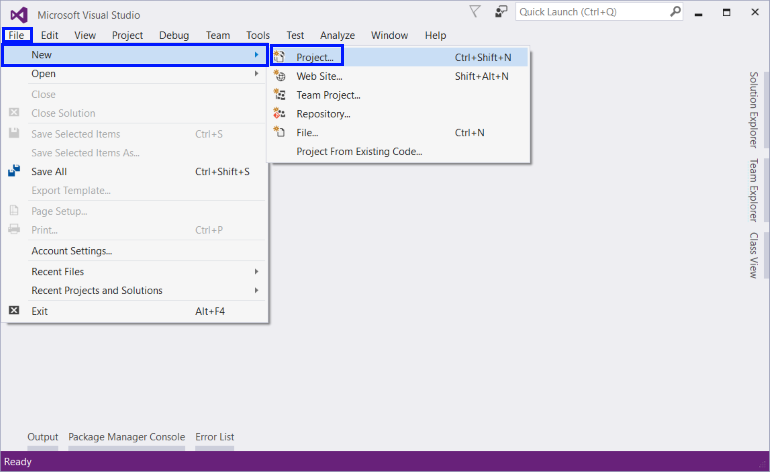

Избираме от диалоговия прозорец [**Templates**] -> [**Other Project Types**] -> [**Visual Studio Solutions**] -> [**Blank Solution**] и даваме подходящо име на проекта, например “Simple-Calculations”:

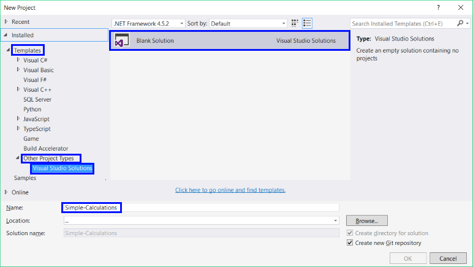

Сега имаме създаден **празен Visual Studio Solution** (с 0 проекта в него):


Целта на този blank solution e да добавяме в него **по един проект за всяка задача** от упражненията.

### Задача:	пресмятане на лице на квадрат

Първата задача от тази тема е следната: да се напише конзолна програма, която **въвежда цяло число `a` и пресмята лицето** на квадрат със страна **`a`**. Задачата е тривиално лесна: **въвеждате число** от конзолата, **умножавате го само по себе си** и **печатате получения резултат** на конзолата.

#### Насоки и подсказки

Създаваме **нов проект** в съществуващото Visual Studio решение. В **Solution Explorer** кликнете с десен бутон на мишката върху **Solution 'Simple-Calculations'**. Изберете [**Add**] -> [**New Project...**]:

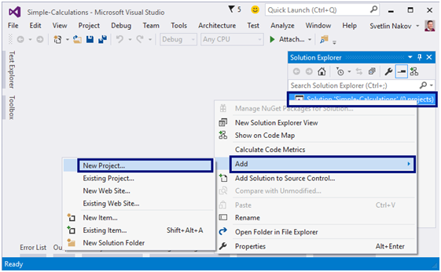

Ще се отвори **диалогов прозорец** за избор на **тип проект** за създаване. Избираме **C# конзолно приложение** с име “Square-Area”:

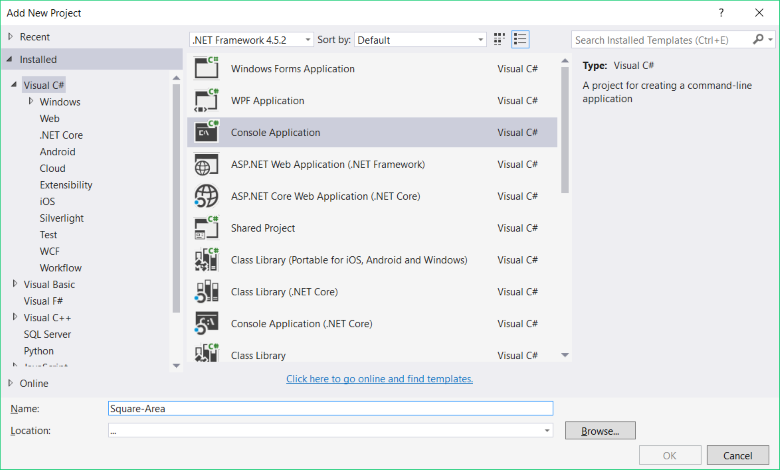

Вече имаме solution с едно конзолно приложение в него. Остава да напишем **кода за решаване на задачата**. За целта отиваме в тялото на метода **`Main(string[] args)`** и пишем следния код:


Кодът въвежда цяло число чрез **`a = int.Parse(Console.ReadLine())`**, след това изчислява **`area = a * a`** и накрая печата стойността на променливата **`area`**. **Стартираме** програмата с [**Ctrl+F5**] и я **тестваме** с различни входни стойности:


#### Тестване в Judge системата

Тествайте решението си тук: [https://judge.softuni.bg/Contests/Practice/Index/504#0](https://judge.softuni.bg/Contests/Practice/Index/504#0). Трябва да получите 100 точки (напълно коректно решение):

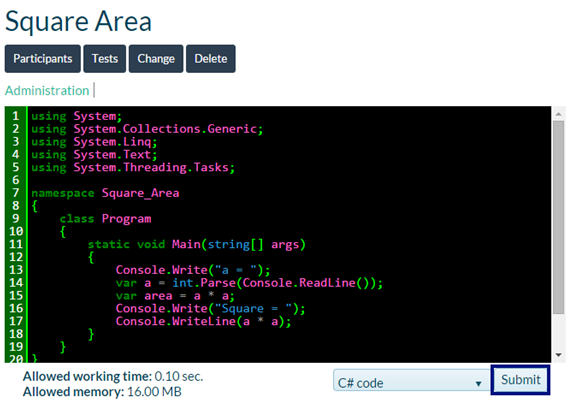

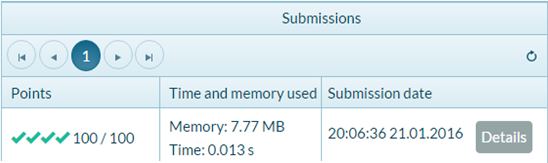

### Задача:	от инчове към сантиметри

Да се напише програма, която **чете от конзолата число** (не непременно цяло) и преобразува числото от **инчове в сантиметри.** За целта **умножава инчовете по 2.54** (защото 1 инч = 2.54 сантиметра).

#### Насоки и подсказки

Първо създаваме **нов C# конзолен проект** в решението “Simple-Calculations”. Кликаме с мишката върху решението в **Solution Explorer** и избираме [**Add**] -> [**New Project…**]:

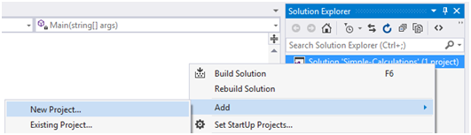

Избираме [**Visual C#**] -> [**Windows**] -> [**Console Application**] и задайте име “Inches-to-Centimeters”:

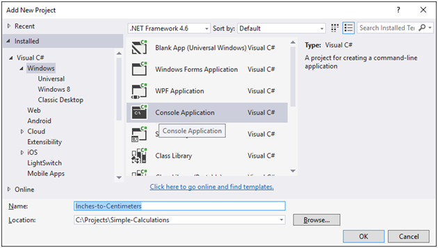

Следва да напишем **кода на програмата**:

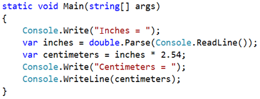

**Стартираме програмата** с [**Ctrl+F5**]:

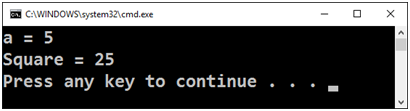

Изненада! Какво става? Програмата не работи правилно… Всъщност това не е ли предходната програма?
Във Visual Studio **текущият активен проект** в един solution е маркиран в получерно и може да се сменя:

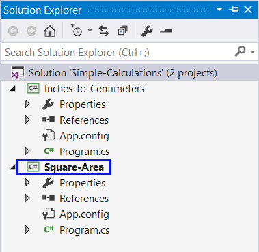

За да включим режим на **автоматично преминаване към текущия проект**, кликаме върху главния solution с десния бутон на мишката и избираме [**Set StartUp Projects…**]:

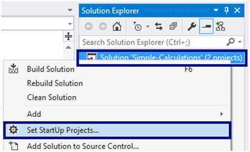

Ще се появи диалогов прозорец, от който трябва да се избере [**Startup Project**] -> [**Current Selection**]:

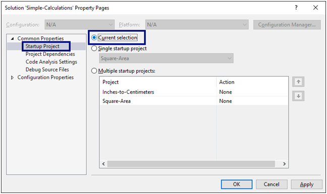

Сега отново **стартираме програмата**, както обикновено с [**Ctrl+F5**]. Този път ще се стартира **текущата отворена програма**, която преобразува инчове в сантиметри. Изглежда работи коректно:

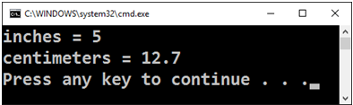

Сега **да превключим към преходната програма** (лице на квадрат). Това става с двоен клик на мишката върху файла **``Program.cs``** от предходния проект **“Square-Area”** в панела [**Solution Explorer**] на Visual Studio:

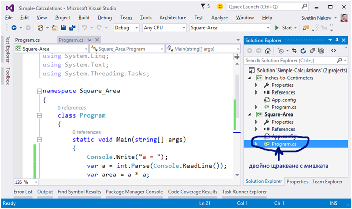

Натискаме пак [**Ctrl+F5**]. Този път трябва да се стартира другият проект:

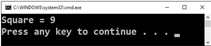

Превключваме обратно към проекта **“Inches-to-Centimeters”** и го стартираме с [**Ctrl+F5**]:

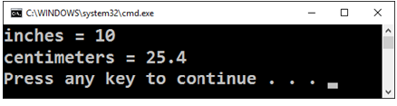

**Превключването между проектите** е много лесно, нали? Просто избираме файла със сорс кода на програмата, кликваме го два пъти с мишката и при стартиране тръгва програмата от този файл.

Да тестваме с дробни числа, например с **2.5**:

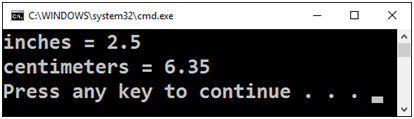

<table><tr><td></td>
<td>В зависимост от регионалните настройки на операционната система, е възможно вместо <b>десетична точка</b> (US настройки) да се използва <b>десетична запетая</b> (BG настройки).</td>
</tr></table>

Ако програмата очаква десетична точка и бъде въведено число с десетична запетая или обратното (бъде въведена десетична точка, когато се очаква десетична запетая), ще се получи следната грешка:


Препоръчително е **да променим настройките на компютъра си**, така че да се използва **десетична точка**:

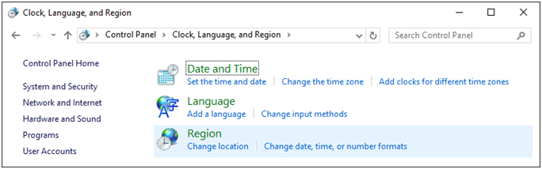

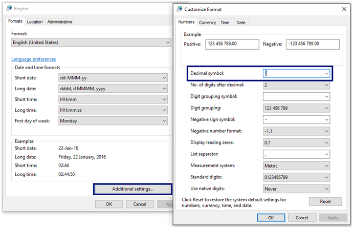

#### Тестване в Judge системата

Тествайте решението си тук: [https://judge.softuni.bg/Contests/Practice/Index/504#1](https://judge.softuni.bg/Contests/Practice/Index/504#1).

Решението би трябвало да бъде прието като напълно коректно:

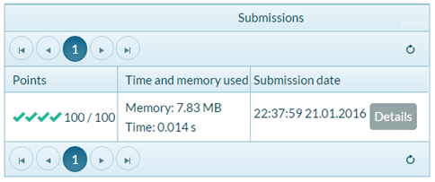

### Задача: поздрав по име

Да се напише програма, която **чете от конзолата име на човек** и отпечатва **`Hello, <name>!`**, където **`<name>`** е въведеното преди това име.

#### Насоки и подсказки

Първо създаваме **нов C# конзолен проект** с име “Greeting” в решението “Simple-Calculations”:

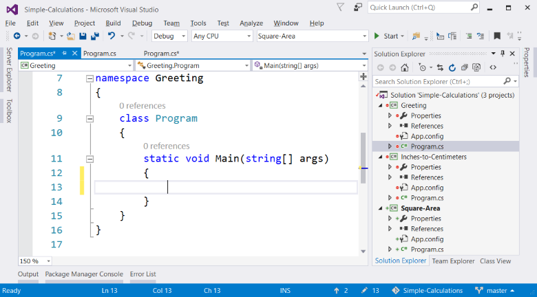

**Следва да напишем кода** на програмата. Ако се затруднявате, може да ползвате примерния код по-долу:

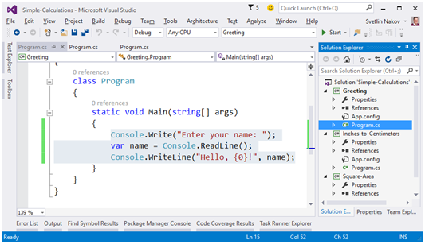

**Стартираме** програмата с [**Ctrl+F5**] и я тестваме дали работи:

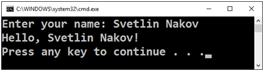

#### Тестване в Judge системата

Тествайте решението си тук:  [https://judge.softuni.bg/Contests/Practice/Index/504#2](https://judge.softuni.bg/Contests/Practice/Index/504#2)

### Задача:	съединяване на текст и числа

Напишете C# програма, която прочита от конзолата име, фамилия, възраст и град и печата съобщение от следния вид: **`You are <firstName> <lastName>, a <age>-years old person from <town>`**.

#### Насоки и подсказки

Добавяме към текущото Visual Studio решение още един конзолен C# проект с име “Concatenate-Data”.	**Пишем кода**, който чете входните данни от конзолата:


**Кодът**, който отпечатва описаното в условието на задачата съобщение, трябва да се допише.


На горната картинка кодът е нарочно даден замъглен, за да помислите как да си го напишете сами.

Следва да се тества решението локално с [**Ctrl+F5**] и въвеждане на примерни входни данни.

#### Тестване в Judge системата

Тествайте решението си тук: [https://judge.softuni.bg/Contests/Practice/Index/504#3](https://judge.softuni.bg/Contests/Practice/Index/504#3)

### Задача:	лице на трапец

Напишете програма, която чете от конзолата три числа **b1, b2 и h и пресмята лицето на трапец** с основи **b1 и b2 и височина h. Формулата за лице на трапец е (b1 + b2) * h / 2**.

На фигурата по-долу е показан трапец със страни 8 и 13 и височина 7. Той има лице **(8 + 13) * 7 / 2 = 73.5**.

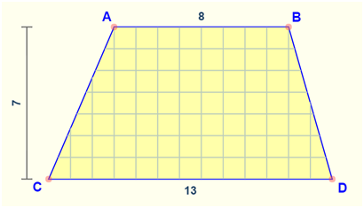

#### Насоки и подсказки

Отново трябва да добавим към текущото Visual Studio решение още един **конзолен C# проект** с име ""Trapezoid-Area" и да напишем **кода, който чете входните данни от конзолата, пресмята лицето на трапеца и го отпечатва**:


Кодът на картинката е нарочно размазан, за да помислите върху него и да го допишете сами.

**Тествайте** решението локално с [**Ctrl+F5**] и въвеждане на примерни данни.

#### Тестване в Judge системата

Тествайте решението си тук: [https://judge.softuni.bg/Contests/Practice/Index/504#4](https://judge.softuni.bg/Contests/Practice/Index/504#4)

### Задача:	периметър и лице на кръг

Напишете програма, която чете от конзолата **число r** и пресмята и отпечатва **лицето и периметъра на кръг**/**окръжност** с **радиус r**.

#### Примерен вход и изход

| Вход  |           Изход                                          |    
|-----|--------------------------------------------------------|
| 3     | Area = 28.2743338823081 <br> Perimeter = 18.8495559215388|
| 4.5   | Area = 63.6172512351933 <br> Perimeter = 28.2743338823081|

#### Насоки и подсказки

За изчисленията можете да използвате следните формули:
-	**`Area = Math.PI * r * r`**.
-	**`Perimeter = 2 * Math.PI * r`**.

#### Тестване в Judge системата

Тествайте решението си тук: [https://judge.softuni.bg/Contests/Practice/Index/504#5](https://judge.softuni.bg/Contests/Practice/Index/504#5)

### Задача: лице на правоъгълник в равнината

**Правоъгълник** е зададен с **координатите** на два от своите срещуположни ъгъла (x1, y1) – (x2, y2). Да се пресметнат **площта и периметъра** му. **Входът** се чете от конзолата. Числата **x1, y1, x2 и y2** са дадени по едно на ред. **Изходът** се извежда на конзолата и трябва да съдържа два реда с по една число на всеки от тях – лицето и периметъра.


#### Примерен вход и изход

|               Вход                        |       Изход         |
|-----------------------------------------|-------------------|
|60<br>20<br>10<br>50                     |1500<br>160         |
|30<br>40<br>70<br>-10                   |2000<br>180         |
|600.25<br>500.75<br>100.50<br>-200.5    |350449.6875<br>2402 |

#### Тестване в Judge системата

Тествайте решението си тук: [https://judge.softuni.bg/Contests/Practice/Index/504#6]( https://judge.softuni.bg/Contests/Practice/Index/504#6)

### Задача:	лице на триъгълник

Напишете програма, която чете от конзолата **страна и височина на триъгълник** и пресмята неговото лице. Използвайте **формулата** за лице на триъгълник: **area = a * h / 2**. Закръглете резултата до **2 цифри след десетичния знак използвайки `Math.Round(area, 2)`**.

#### Примерен вход и изход

|       Вход           |         Изход         |
|--------------------|---------------------|
| 20 <br>30            | Triangle area = 300   |
| 15 <br>35            | Triangle area = 262.5 |
| 7.75 <br>8.45        | Triangle area = 32.74 |
| 1.23456 <br>4.56789  | Triangle area = 2.82  |

#### Тестване в Judge системата

Тествайте решението си тук: [https://judge.softuni.bg/Contests/Practice/Index/504#7](https://judge.softuni.bg/Contests/Practice/Index/504#7)

### Задача:	конзолен конвертор - от градуси °C към градуси °F

Напишете програма, която чете **градуси по скалата на Целзий** (°C) и ги преобразува до **градуси по скалата на Фаренхайт** (°F). Потърсете в Интернет подходяща [формула](http://bfy.tw/3rGh "Търсене в Google"), с която да извършите изчисленията. Закръглете резултата до **2 символа след десетичния знак**. Ето няколко примера:

#### Примерен вход и изход

| Вход | Изход |
|----|-----|
|  25  |   77  |
|   0  |   32  |
| -5.5 |  22.1 |
| 32.3 | 90.14 |

#### Тестване в Judge системата

Тествайте решението си тук: [https://judge.softuni.bg/Contests/Practice/Index/504#8](https://judge.softuni.bg/Contests/Practice/Index/504#8)

### Задача:	конзолен конвертор - от радиани в градуси

Напишете програма, която чете **ъгъл в [радиани](https://bg.wikipedia.org/wiki/Радиан)** (**`rad`**) и го преобразува в **[градуси](https://bg.wikipedia.org/wiki/Градус_(ъгъл))** (`deg`). Потърсете в Интернет подходяща формула. Числото **π** в C# програмите е достъпно чрез **``Math.PI``**. Закръглете резултата до най-близкото цяло число използвайки метода **``Math.Round(...)``**.

#### Примерен вход и изход

|  Вход  | Изход |
|------|-----|
| 3.1416 |  180  |       
| 6.2832 |  360  | 
| 0.7854 |   45  | 
| 0.5236 |   30  |

#### Тестване в Judge системата

Тествайте решението си тук: [https://judge.softuni.bg/Contests/Practice/Index/504#9](https://judge.softuni.bg/Contests/Practice/Index/504#9)

### Задача: конзолен конвертор - USD към BGN

Напишете програма за **конвертиране на щатски долари** (USD) **в български лева** (BGN). **Закръглете** резултата до **2 цифри** след десетичния знак. Използвайте фиксиран курс между долар и лев: **1 USD = 1.79549 BGN**.

#### Примерен вход и изход

|  Вход  |    Изход  |
|------|---------|
|   20   | 35.91 BGN |      
|   100  | 179.55 BGN|
|  12.5  | 22.44 BGN |

#### Тестване в Judge системата

Тествайте решението си тук: [https://judge.softuni.bg/Contests/Practice/Index/504#10](https://judge.softuni.bg/Contests/Practice/Index/504#10)

### Задача:	\* конзолен междувалутен конвертор

Напишете програма за **конвертиране на парична сума от една валута в друга**. Трябва да се поддържат следните валути: **BGN, USD, EUR, GBP**. Използвайте следните фиксирани валутни курсове:

|  Курс  |   USD   |   EUR   |   GBP   |
|:------:|:-------:|:-------:|:-------:|
| 1 BGN  | 1.79549 | 1.95583 | 2.53405 |

**Входът** e **сума за конвертиране**, **входна валута** и **изходна валута**. **Изходът** е едно число – преобразуваната сума по посочените по-горе курсове, закръглен до **2 цифри** след десетичната точка. 

#### Примерен вход и изход

|        Вход        |   Изход  |
|------------------|--------|
|   20<br>USD<br>BGN |35.91 BGN |     
|  100<br>BGN<br>EUR |51.13 EUR | 
| 12.35<br>EUR<br>GBP| 9.53 GBP |  
|150.35<br>USD<br>EUR|138.02 EUR|
 
#### Тестване в Judge системата

Тествайте решението си тук: [https://judge.softuni.bg/Contests/Practice/Index/504#11](https://judge.softuni.bg/Contests/Practice/Index/504#11)

### Задача:	** пресмятане с дати - 1000 дни на Земята

Напишете програма, която въвежда **рождена дата** във формат **`dd-MM-yyyy`** и пресмята датата, на която се навършват **1000 дни** от тази рождена дата и я отпечатва в същия формат.

#### Примерен вход и изход

|   Вход   |	 Изход  |
|--------|--------|
|25-02-1995|20-11-1997|
|07-11-2003|02-08-2006|
|30-12-2002|24-09-2005|
|01-01-2012|26-09-2014|
|14-06-1980|10-03-1983|

#### Насоки и подсказки 
* Потърсете информация за типа **``DateTime``** в C# и по-конкретно разгледайте методите **``ParseExact(str, format)``**, **``AddDays(count)``** и **``ToString(format)``**. С тяхна помощ може да решите задачата, без да е необходимо да изчислявате дни, месеци и високосни години.
* **Не печатайте** нищо допълнително на конзолата освен изискваната дата!

#### Тестване в Judge системата

Тествайте решението си тук: [https://judge.softuni.bg/Contests/Practice/Index/504#12](https://judge.softuni.bg/Contests/Practice/Index/504#12)

## Графични приложения с числови израви

За да упражним работата с променливи и пресмятания с оператори и числови изрази, ще направим нещо интересно: ще разработим **настолно приложение** с графичен потребителски интерфейс. В него ще използваме пресмятания с дробни числа.

### Графично приложение: конвертор от BGN към EUR

От нас се изисква да създадем **графично приложение** (GUI application), което пресмята стойността в **евро** (EUR) на парична сума, зададена в **лева** (BGN). При промяна на стойността в лева, равностойността в евро трябва да се преизчислява автоматично (използваме курс лева / евро: **1.95583**).


Тази задача излиза извън изучавания в книгата материал и има за цел не да ви научи как да програмирате GUI приложения, а да ви запали интереса към разработката на софтуер. Да се залавяме за работа.

Добавяме към текущото Visual Studio решение (solution) още един проект. Този път създаваме **Windows Forms** приложение със C# с име "BGN-to-EUR-Converter":


Подреждаме следните UI контроли във формата:
* **`NumericUpDown`** с име **`numericUpDownAmount`** – ще въвежда сумата за конвертиране
*	**`Label`** с име **`labelResult`** – ще показва резултата след конвертиране
*	Още два **`Label`** компонента, служещи единствено за статично изобразяване на текст
Графичният редактор за потребителски интерфейс може да изглежда по подобен начин:


Задаваме следните настройки на формата и на отделните контроли:

|                                             Настройка                                                 | Снимка|
|:-----------------------------------------------------------------------------------------------------:|:-----:|
|**``FormConverter``**:<br>Text = "BGN to EUR",<br>Font.Size = 12,<br>MaximizeBox = False,<br>MinimizeBox = False,<br>FormBorderStyle = FixedSingle |  |
|**``numericUpDownAmount``**:<br>Value = 1,<br>Minimum = 0,<br>Maximum = 10000000,<br>TextAlign = Right,<br>DecimalPlaces = 2 |  |
|**``labelResult``**:<br>AutoSize = False,<br>BackColor = PaleGreen,<br>TextAlign = MiddleCenter,<br>Font.Size = 14,<br>Font.Bold = True|  |

Дефинираме следните **обработчици на събития** по контролите:

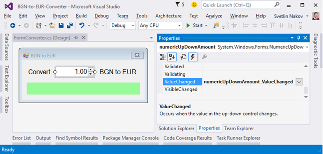

След това хващаме следните събития:
- **``FormConverter.Load``** (като кликнем върху формата 2 пъти с мишката)
- **``numericUpDownAmount.ValueChanged``** (като кликнем върху **``NumericUpDown``** контролата 2 пъти)
- **``numericUpDownAmount.KeyUp``** (избираме **``Events``** от таблото **``Properties``** и кликнем 2 пъти върху **``KeyUp``**)

Събитието **`Form.Load`** се изпълнява при стартиране на програмата, преди да се появи прозореца на приложението. Събитието **`NumericUpDown.ValueChanged`** се изпълнява при промяна на стойността в полето за въвеждане на число. Събитието **`NumericUpDown.KeyUp`** се изпълнява след натискане на клавиш в полето за въвеждане на число. При всяко от тези събития ще преизчисляваме резултата.

За **хващане на събитие** ползваме иконката със събитията (Events) в **Properties**  прозореца във Visual Studio:

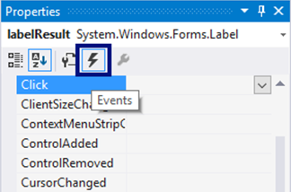

Ще използваме следния **C# код** за обработка на събитията:

```csharp
private void FormConverter_Load(object sender, EventArgs e)
{
  ConvertCurrency();
}

private void numericUpDownAmount_ValueChanged(object sender, EventArgs e)
{
  ConvertCurrency();
}

private void numericUpDownAmount_KeyUp(object sender, KeyEventArgs e)
{
  ConvertCurrency();
}
```

Всички прихванати събития извикват метода **`ConvertCurrency()`**, който конвертира зададената сума от лева в евро и показва резултата в зелената кутийка.

Трябва да напишем **кода** (програмната логика) за конвертиране от лева към евро: 

```csharp
private void ConvertCurrency()
{
  var amountBGN = this.numericUpDownAmount.Value;
  var amountEUR = amountBGN * 1.95583m;
  this.labelResult.Text = 
    amountBGN + " BGN = " + 
    Math.Round(amountEUR, 2) + " EUR";
}
```

Накрая **стартираме проектa** с [**Ctrl+F5**] и тестваме дали работи коректно.

Ако имате проблеми с примера по-горе, **гледайте видеото** в началото на тази глава. Там приложението е направено на живо стъпка по стъпка с много обяснения. Или питайте във **форума на СофтУни**: https://softuni.bg/forum.

### Графично приложение: \*\*\* Хвани бутона!

Създайте забавно графично приложение **„хвани бутона“**: една форма съдържа един бутон. При преместване на курсора на мишката върху бутона той се премества на случайна позиция. Така се създава усещане, че **„бутонът бяга от мишката и е трудно да се хване“**. При „хващане“ на бутона се извежда съобщение-поздрав.


**Подсказка**: напишете обработчик за събитието **``Button.MouseEnter``** и премествайте бутона на случайна позиция. Използвайте генератор за случайни числа **``Random``**. Позицията на бутона се задава от свойството **``Location``**. За да бъде новата позиция на бутона в рамките на формата, можете да направите изчисления спрямо размера на формата, който е достъпен от свойството **``ClientSize``**. Можете да ползвате следния примерен код:

```csharp
private void buttonCatchMe_MouseEnter(object sender, EventArgs e)
{
    Random rand = new Random();
    var maxWidth = this.ClientSize.Width - buttonCatchMe.ClientSize.Width;
    var maxHeight = this.ClientSize.Height - buttonCatchMe.ClientSize.Height;
    this.buttonCatchMe.Location = new Point(
        rand.Next(maxWidth), rand.Next(maxHeight));
}
```
