# Глава 6. Чертане на фигурки с цикли

В настоящата глава ще разгледаме как да използваме **`for`** цикли за **чертане** на различни **фигурки на конзолата**. Ще използваме **единични и вложени цикли** (цикли един в друг), за да чертаем прости и не чак толкова прости фигурки в конзолата.

## Видео

<div class="video-player">
  Гледайте видео-урок по тази глава тук: <a target="\_blank"
  href="https://www.youtube.com/watch?v=x7zXRCpkebo">
  https://www.youtube.com/watch?v=x7zXRCpkebo</a>.
</div>
<script src="/assets/js/video.js"></script>

### Пример: правоъгълник от 10 x 10 звездички

Да се начертае в конзолата правоъгълник от **10 x 10** звездички.

|Вход|Изход|
|---|---|
|(няма)|<code>\*\*\*\*\*\*\*\*\*\*</code><br><code>\*\*\*\*\*\*\*\*\*\*</code><br><code>\*\*\*\*\*\*\*\*\*\*</code><br><code>\*\*\*\*\*\*\*\*\*\*</code><br><code>\*\*\*\*\*\*\*\*\*\*</code><br><code>\*\*\*\*\*\*\*\*\*\*</code><br><code>\*\*\*\*\*\*\*\*\*\*</code><br><code>\*\*\*\*\*\*\*\*\*\*</code><br><code>\*\*\*\*\*\*\*\*\*\*</code><br><code>\*\*\*\*\*\*\*\*\*\*</code>|

#### Насоки и подсказки

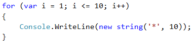

Как работи примерът? Инициализира се **цикъл с променлива `i = 1`**, която се увеличава на всяка итерация на цикъла, докато е **по-малка или равна на 10**. Така кодът в тялото на цикълa се изпълнява **10 пъти**. В тялото на цикъла се печата на нов ред в конзолата **`new string('*', 10)`**, което създава низ от 10 звездички.

#### Тестване в Judge системата

Тествайте решението си тук: [https://judge.softuni.bg/Contests/Practice/Index/512#0](https://judge.softuni.bg/Contests/Practice/Index/512#0)

### Пример: правоъгълник от N x N звездички

Да се напише програма, която въвежда цяло положително число **n** и печата на конзолата **правоъгълник от N x N звездички**.

|Вход|Изход|Вход|Изход|Вход|Изход|
|---|---|---|---|---|---|
|2|<code>\*\*</code><br><code>\*\*</code>|3|<code>\*\*\*</code><br><code>\*\*\*</code><br><code>\*\*\*</code>|4|<code>\*\*\*\*</code><br><code>\*\*\*\*</code><br><code>\*\*\*\*</code><br><code>\*\*\*\*</code>|

#### Насоки и подсказки


#### Тестване в Judge системата

Тествайте решението си тук: [https://judge.softuni.bg/Contests/Practice/Index/512#1](https://judge.softuni.bg/Contests/Practice/Index/512#1)

## Вложени цикли

Вложените цикли представляват конструкция от няколко цикъла, разположени един в друг.

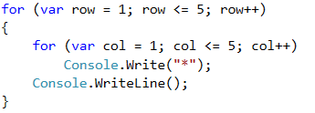

Нека разгледаме примера по-горе - след инициализацията на **първия** цикъл, започва да се изпълнява неговото **тяло**, което съдържа **втория (вложен) цикъл**. Той сам по себе си печата на един ред **`n`** на брой звездички. След като **вътрешният** цикъл **приключи** изпълнението си при първата итерация на външния, то след това **външният ще продължи**, т.е. ще отпечата един празен ред на конзолата. **След това** ще се извърши **обновяване** на променливата на **първия** цикъл и отново ще бъде изпълнен целия **втори** цикъл. Вътрешният цикъл ще се изпълни толкова пъти, колкото се изпълнява тялото на външния цикъл, в случaя **`n`** пъти.

### Пример: квадрат от звездички

Да се начертае на конзолата квадрат от **N x N** звездички:

|Вход|Изход|Вход|Изход|Вход|Изход|
|---|---|---|---|---|---|
|2|<code>\* \*</code><br><code>\* \*</code>|3|<code>\* \* \*</code><br><code>\* \* \*</code><br><code>\* \* \*</code>|4|<code>\* \* \* \*</code><br><code>\* \* \* \*</code><br><code>\* \* \* \*</code><br><code>\* \* \* \*</code>|

#### Насоки и подсказки

Задачата е аналогична на предходната. Разликата тук е, че в тази трябва да обмислим как да печатаме интервал след звездичките по такъв начин, че да няма излишни интервали в началото или края.

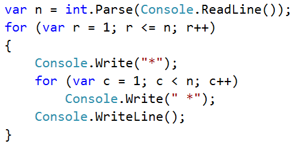

#### Тестване в Judge системата

Тествайте решението си тук: [https://judge.softuni.bg/Contests/Practice/Index/512#2](https://judge.softuni.bg/Contests/Practice/Index/512#2)

### Пример: триъгълник от долари

Да се напише програма, която въвежда число **n** и печата **триъгълник от долари**.

|Вход|Изход|Вход|Изход|Вход|Изход
|---|---|---|---|---|---|
|3|<code>$</code><br><code>$ $</code><br><code>$ $ $</code>|4|<code>$</code><br><code>$ $</code><br><code>$ $ $</code><br><code>$ $ $ $</code>|5|<code>$</code><br><code>$ $</code><br><code>$ $ $</code><br><code>$ $ $ $</code><br><code>$ $ $ $ $</code>|

#### Насоки и подсказки

Задачата е **сходна** с тези за рисуване на **правоъгълник** и **квадрат**. Отново ще използваме **вложени цикли**, но тук има **уловка**. Разликата е в това, че **броя на колонките**, които трябва да разпечатаме, зависят от **реда**, на който се намираме, а не от входното число **`n`**. От примерните входни и изходни данни забелязваме, че **броят на доларите зависи** от това на кой **ред** се намираме към момента на печатането, т.е. 1 долар означава първи ред, 3 долара означават трети ред и т.н. Нека разгледаме долния пример по-подробно. Виждаме, че **променливата** на **вложения** цикъл е обвързана с променливата на **външния**. По този начин нашата програма печата желания триъгълник.

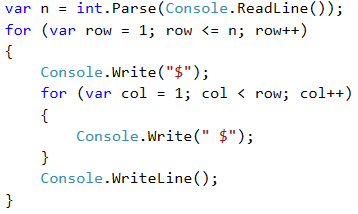

#### Тестване в Judge системата

Тествайте решението си тук: [https://judge.softuni.bg/Contests/Practice/Index/512#3](https://judge.softuni.bg/Contests/Practice/Index/512#3)

### Пример: квадратна рамка

Да се напише програма, която въвежда цяло положително число **n** и чертае на конзолата **квадратна рамка** с размер **n \* n**.

|Вход|Изход|Вход|Изход|
|---|---|---|---|
|3|<code>+ - +</code><br><code>&#124; - &#124;</code><br><code>+ - +</code>|4|<code>+ - - +</code><br><code>&#124; - - &#124;</code><br><code>&#124; - - &#124;</code><br><code>+ - - +</code>|

|Вход|Изход|Вход|Изход|
|---|---|---|---|
|5|<code>+ - - - +</code><br><code>&#124; - - - &#124;</code><br><code>&#124; - - - &#124;</code><br><code>&#124; - - - &#124;</code><br><code>+ - - - +</code>|6|<code>+ - - - - +</code><br><code>&#124; - - - - &#124;</code><br><code>&#124; - - - - &#124;</code><br><code>&#124; - - - - &#124;</code><br><code>&#124; - - - - &#124;</code><br><code>+ - - - - +</code>|

#### Насоки и подсказки

Можем да решим задачата по следния начин:
* Четем от конзолата числото **`n`**.
* Отпечатваме горната част: първо знак **`+`**, после n-2 пъти **` -`** и накрая знак **`+`**.
* Отпечатваме средната част: печатаме n-2 реда като първо печатаме знак **`|`**, после n-2 пъти **` -`** и накрая отново знак **`|`**. Това можем да постигнем с вложени цикли.
* Отпечатваме долната част: първо **`+`**, после n-2 пъти **` -`** и накрая **`+`**.

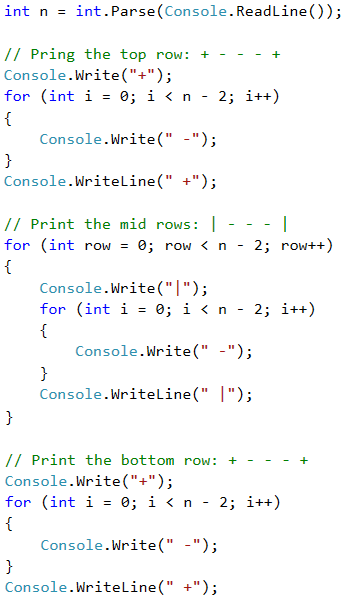

#### Тестване в Judge системата

Тествайте решението си тук: [https://judge.softuni.bg/Contests/Practice/Index/512#4](https://judge.softuni.bg/Contests/Practice/Index/512#4)

### Пример: ромбче от звездички

Да се напише програма, която въвежда цяло положително число **n** и печата **ромбче от звездички** с размер **n**.

|Вход|Изход|Вход|Изход|
|---|---|---|---|
|1|<code>\*</code>|2|<code>&nbsp;\*&nbsp;</code><br><code>\*&nbsp;\*</code><br><code>&nbsp;\*&nbsp;</code><br>|


|Вход|Изход|Вход|Изход|
|---|---|---|---|
|3|<code>&nbsp;&nbsp;\*&nbsp;&nbsp;</code><br><code>&nbsp;\*&nbsp;\*&nbsp;</code><br><code>\*&nbsp;\*&nbsp;\*</code><br><code>&nbsp;\*&nbsp;\*&nbsp;</code><br><code>&nbsp;&nbsp;\*&nbsp;&nbsp;</code>|4|<code>&nbsp;&nbsp;&nbsp;\*&nbsp;&nbsp;&nbsp;</code><br><code>&nbsp;&nbsp;\*&nbsp;\*&nbsp;&nbsp;</code><br><code>&nbsp;\*&nbsp;\*&nbsp;\*&nbsp;</code><br><code>\*&nbsp;\*&nbsp;\*&nbsp;\*</code><br><code>&nbsp;\*&nbsp;\*&nbsp;\*&nbsp;</code><br><code>&nbsp;&nbsp;\*&nbsp;\*&nbsp;&nbsp;</code><br><code>&nbsp;&nbsp;&nbsp;\*&nbsp;&nbsp;&nbsp;</code>|

#### Насоки и подсказки

За решението на тази задача е нужно да **разделим** мислено **ромба** на **две части** - **горна**, която включва **и** средния ред, и **долна**. За **разпечатването** на всяка една част ще използваме **два** отделни цикъла, като оставяме на читателя сам да намери зависимостта между **`n`** и променливите на циклите. За първия цикъл може да използваме следните насоки:
* Отпечатвaме **`n-row`** интервала.
* Отпечатваме **`*`**.
* Отпечатваме **`row-1`** пъти **`*`**.
**Втората** (долна) част ще разпечатаме по **аналогичен** начин, което отново оставяме на читателя да се опита да направи сам.


#### Тестване в Judge системата

Тествайте решението си тук: [https://judge.softuni.bg/Contests/Practice/Index/512#5](https://judge.softuni.bg/Contests/Practice/Index/512#5)

### Пример: коледна елха

Да се напише програма, която въвежда число **n** (1 ≤ n ≤ 100) и печата коледна елха с височина **n+1**.

|Вход|Изход|Вход|Изход|
|---|---|---|---|
|1|<code>&nbsp;&nbsp;&#124;&nbsp;&nbsp;</code><br><code>\*&nbsp;&#124;&nbsp;\*</code>|2|<code>&nbsp;&nbsp;&nbsp;&#124;&nbsp;&nbsp;&nbsp;</code><br><code>&nbsp;\*&nbsp;&#124;&nbsp;\*&nbsp;</code><br><code>\*\*&nbsp;&#124;&nbsp;\*\*</code>|

|Вход|Изход|Вход|Изход|
|---|---|---|---|
|3|<code>&nbsp;&nbsp;&nbsp;&nbsp;&#124;&nbsp;&nbsp;&nbsp;&nbsp;</code><br><code>&nbsp;&nbsp;\*&nbsp;&#124;&nbsp;\*&nbsp;&nbsp;</code><br><code>&nbsp;\*\*&nbsp;&#124;&nbsp;\*\*&nbsp;</code><br><code>\*\*\*&nbsp;&#124;&nbsp;\*\*\*</code>|4|<code>&nbsp;&nbsp;&nbsp;&nbsp;&nbsp;&#124;&nbsp;&nbsp;&nbsp;&nbsp;&nbsp;</code><br><code>&nbsp;&nbsp;&nbsp;\*&nbsp;&#124;&nbsp;\*&nbsp;&nbsp;&nbsp;</code><br><code>&nbsp;&nbsp;\*\*&nbsp;&#124;&nbsp;\*\*&nbsp;&nbsp;</code><br><code>&nbsp;\*\*\*&nbsp;&#124;&nbsp;\*\*\*&nbsp;</code><br><code>\*\*\*\*&nbsp;&#124;&nbsp;\*\*\*\*</code>|

#### Насоки и подсказки

От примерите виждаме, че **елхата** може да бъде **разделена** на **три** логически части. **Първата** част са **звездичките и празните места преди и след тях**, **средната** част е **` | `**, а **последната** част са отново **звездички**, като този път **празни** места има само **преди** тях. Разпечатването може да бъде постигнато само с **един цикъл** и конструктора **`new string(...)`**, който ще използваме един път за звездичките и един път за интервалите. 

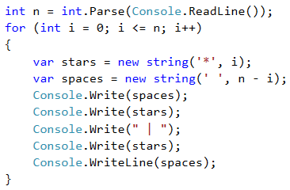

#### Тестване в Judge системата

Тествайте решението си тук: [https://judge.softuni.bg/Contests/Practice/Index/512#6](https://judge.softuni.bg/Contests/Practice/Index/512#6)

## Чертане на по-сложни фигури

### Пример: слънчеви очила
Да се напише програма, която въвежда цяло число **n** (3 ≤ n ≤ 100) и печата слънчеви очила с размер **5\*n x n** като в примерите:

|Вход|Изход|Вход|Изход|
|---|---|---|---|
|3|<code>\*\*\*\*\*\*&nbsp;&nbsp;&nbsp;\*\*\*\*\*\*</code><br><code>\*////\*&#124;&#124;&#124;\*////\*</code><br><code>\*\*\*\*\*\*&nbsp;&nbsp;&nbsp;\*\*\*\*\*\*</code>|4|<code>\*\*\*\*\*\*\*\*&nbsp;&nbsp;&nbsp;&nbsp;\*\*\*\*\*\*\*\*</code><br><code>\*//////\*&#124;&#124;&#124;&#124;\*//////\*</code><br><code>\*//////\*&nbsp;&nbsp;&nbsp;&nbsp;\*//////\*</code><br><code>\*\*\*\*\*\*\*\*&nbsp;&nbsp;&nbsp;&nbsp;\*\*\*\*\*\*\*\*</code><br>|

|Вход|Изход|
|---|---|
|5|<code>\*\*\*\*\*\*\*\*\*\*&nbsp;&nbsp;&nbsp;&nbsp;&nbsp;\*\*\*\*\*\*\*\*\*\*</code><br><code>\*////////\*&nbsp;&nbsp;&nbsp;&nbsp;&nbsp;\*////////\*</code><br><code>\*////////\*&#124;&#124;&#124;&#124;&#124;\*////////\*</code><br><code>\*////////\*&nbsp;&nbsp;&nbsp;&nbsp;&nbsp;\*////////\*</code><br><code>\*\*\*\*\*\*\*\*\*\*&nbsp;&nbsp;&nbsp;&nbsp;&nbsp;\*\*\*\*\*\*\*\*\*\*</code><br>|

#### Насоки и подсказки

От примерите виждаме, че очилата могат да се разделят на три части - горна, средна и долна. По-долу е част от кода, с помощта на който задачата може да се реши.

При рисуването на горния и долния ред трябва да се изпечатат **`2 * n`** звездички, **`n`** интервала и **`2 * n`** звездички.

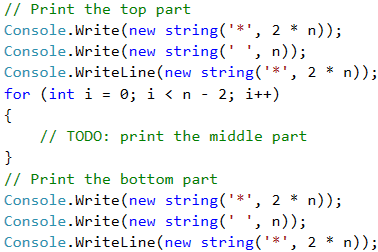

При печатането на **средната** част трябва да **проверим** дали редът е **`(n-1) / 2 - 1`**, тъй като от примерите е видно, че на **този ред** трябва да печатаме **вертикални чертички** вместо интервали.

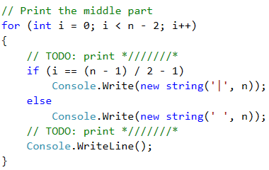

#### Тестване в Judge системата

Тествайте решението си тук: [https://judge.softuni.bg/Contests/Practice/Index/512#7](https://judge.softuni.bg/Contests/Practice/Index/512#7)

### Пример: къщичка

Да се напише програма, която въвежда число **n** (2 ≤ **n** ≤ 100) и печата **къщичка** с размери **n x n**.

|Вход|Изход|Вход|Изход|Вход|Изход|
|---|---|---|---|---|---|
|2|<code>**</code><br><code>&#124;&#124;</code><br>|3|<code>-\*-</code><br><code>\*\*\*</code><br><code>&#124;\*&#124;</code>|4|<code>-\*\*-</code><br><code>\*\*\*\*</code><br><code>&#124;\*\*&#124;</code><br><code>&#124;\*\*&#124;</code>

|Вход|Изход|Вход|Изход|
|---|---|---|---|
|5|<code>--\*--</code><br><code>-\*\*\*-</code><br><code>\*\*\*\*\*</code><br><code>&#124;\*\*\*&#124;</code><br><code>&#124;\*\*\*&#124;</code>|8|<code>---\*\*---</code><br><code>--\*\*\*\*--</code><br><code>-\*\*\*\*\*\*-</code><br><code>\*\*\*\*\*\*\*\*</code><br><code>&#124;\*\*\*\*\*\*&#124;</code><br><code>&#124;\*\*\*\*\*\*&#124;</code><br><code>&#124;\*\*\*\*\*\*&#124;</code><br><code>&#124;\*\*\*\*\*\*&#124;</code><br>|


#### Насоки и подсказки

Разбираме от условието на задачата, че къщата е с размер **`n` x `n`**. Това, което виждаме от примерните вход и изход, е че:

* Къщичката е разделена на 2 части: **покрив и основа**. 

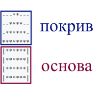

* Когато **`n`** е четно число, върхът на къщичката е "тъп".
* Когато **`n`** е нечетно число, **покривът** е с един ред по-голям от **основата**.

##### Покрив
* Съставен е от **звезди** и **тирета**.
* В най-високата си част има една или две звезди, спрямо това дали **n** e четно или нечетно, както и тирета.
* В най-ниската си част има много звезди и малко или никакви долни черти.
* С всеки един ред по-надолу, **звездите** се увеличават с 2, а **тиретата** намаляват с 2.

##### Основа
* Дълга е **`n`** на брой реда.
* Съставена е от **звезди** и **тирета**.
* Редовете представляват 2 **тирета** - по едно в началото и в края на реда, както и **звезди** между тиретата с дължина на низа **`n - 2`**.  

Прочитаме **`n`** от конзолата и записваме стойността в променлива от тип **`int`**.  

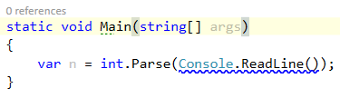

<table><tr><td></td>
<td><b>Много е важно да проверяваме дали са валидни входните данни!</b> В тези задачи не е проблем директно да обръщаме прочетеното от конзолата в тип <b><code>Integer</code></b>, защото изрично е казано че ще получаваме валидни целочислени числа. Ако обаче правите по-сериозни приложения е добра практика да проверявате данните. Какво ще стане, ако вместо буквата "А" потребителя въведе число?</td>
</tr></table>

За да начертаем **покрива**, записваме колко ще е началният брой **звезди** в променлива **`stars`**:
* Ако **`n`** е четно число, ще са 2 броя.
* Ако е нечетно, ще е 1 брой.

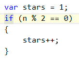

Изчисляваме дължината на **покрива**. Тя е равна на половината от **`n`**. Резултата записваме в променливата **`roofLength`**.


Важно е да се отбележи че, когато **`n`** е нечетно число, дължината на покрива е по-голяма с един ред от тази на **основата**. В езика **C#**, когато два целочислени типа се делят и има остатък, то резултата ще е числото без остатъка.

Пример:

**`int result = 3 / 2; //резултат 1`**

Ако искаме да закръглим нагоре, трябва да използваме метода **`Math.Ceiling(...)`**:
**`int result = (int)Math.Ceiling(3 / 2f);`**
В този пример делението не е от 2 целочислени числа. "`f`" след число показва, че даденото число е от тип **`float`** (число с плаваща запетая). Резултатът от **`3 / 2f`** е **`1.5f`**. **`Math.Ceiling(...)`** закръгля делението нагоре. В нашият случай **`1.5f`** ще стане 2. **`(int)`** се използва, за да може да трансформираме типа обратно в **`Integer`**.

След като сме изчислили дължината на покрива, завъртаме цикъл от 0 до **`roofLength`**. На всяка итерация ще:
* Изчисляваме броя **тирета**, които трябва да изрисуваме. Броят ще е равен на **`(n - stars) / 2`**. Записваме го в променлива **`padding`**.

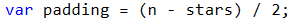

* Отпечатваме на конзолата: "**тирета**" (**`padding / 2`** на брой пъти) + "**звезди**" (**`stars`** пъти) + "**тирета**" (**`padding / 2`** пъти). 

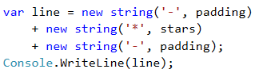

* Преди да свърши итерацията на цикъла добавяме 2 към **`stars`** (броя на **звездите**).

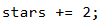

<table><tr><td></td>
<td>Не е добра идея да правим събирания на много на брой символни низове по показания по-горе начин. За повече информация посетете: https://bg.wikipedia.org/wiki/%D0%9D%D0%B8%D0%B7#String_Builder</td>
</tr></table>

След като сме приключили с **покрива**, е време за **основата**. Тя е по-лесна за печатане:
* Започваме с цикъл от 0 до n (изключено).
* Отпечатваме на конзолата: `|` + `*` (**`n - 2`** на брой пъти) + `|`.


Ако всичко сме написали както трябва, задачата ни е решена.

#### Тестване в Judge системата

Тествайте решението си тук: [https://judge.softuni.bg/Contests/Practice/Index/512#8](https://judge.softuni.bg/Contests/Practice/Index/512#8)

### Пример: диамант

Да се напише програма, която въвежда цяло число **n** (1 ≤ **n** ≤ 100) и печата диамант с размер **n**.

|Вход|Изход|Вход|Изход|Вход|Изход|
|---|---|---|---|---|---|
|1|<code>\*</code><br>|2|<code>\*\*</code>|3|<code>-\*-</code><br><code>\*-\*</code><br><code>-\*-</code>|

|Вход|Изход|Вход|Изход|Вход|Изход|
|---|---|---|---|---|---|
|4|<code>-\*\*-</code><br><code>\*--\*</code><br><code>-\*\*-</code>|5|<code>--\*--</code><br><code>-\*-\*-</code><br><code>\*---\*</code><br><code>-\*-\*-</code><br><code>--\*--</code><br>|6|<code>--\*\*--</code><br><code>-\*--\*-</code><br><code>\*----\*</code><br><code>-\*--\*-</code><br><code>--\*\*--</code><br>|

|Вход|Изход|Вход|Изход|Вход|Изход|
|---|---|---|---|---|---|
|7|<code>---\*---</code><br><code>--\*-\*--</code><br><code>-\*---\*-</code><br><code>\*-----\*</code><br><code>-\*---\*-</code><br><code>--\*-\*--</code><br><code>---\*---</code><br>|8|<code>---\*\*---</code><br><code>--\*--\*--</code><br><code>-\*----\*-</code><br><code>\*------\*</code><br><code>-\*----\*-</code><br><code>--\*--\*--</code><br><code>---\*\*---</code><br>|9|<code>----\*----</code><br><code>---\*-\*---</code><br><code>--\*---\*--</code><br><code>-\*-----\*-</code><br><code>\*-------\*</code><br><code>-\*-----\*-</code><br><code>--\*---\*--</code><br><code>---\*-\*---</code><br><code>----\*----</code>|

#### Насоки и подсказки

Това, което знаем от условието на задачата, е че диамантът е с размер **`n` x `n`**.

От примерните вход и изход можем да си направим изводи, че всички редове съдържат точно по **`n`** символа и всички редове, с изключение на горните върхове, имат по **2 звезди**. Можем мислено да разделим диаманта на 2 части:
* **Горна** част. Тя започва от горният връх до средата.
* **Долна** част. Тя започва от реда след средата до най-долният връх (включително).

##### Горна част
* Ако **n** е **четно**, то тя започва с **1 звезда**.
* Ако **n** е **нечетно**, то тя започва с **2 звезди**.
* С всеки ред надолу, звездите се отдалечават една от друга.
* Пространството между, преди и след **звездите** е запълнено с **тирета**.

##### Долна част
* С всеки ред надолу, звездите се събират една с друга. Това означава, че пространството (**тиретата**) между тях намалява, а пространството (**тиретата**) отляво и отдясно се увеличава.
* В най-долната си част е с 1 или 2 **звезди**, спрямо това дали **n** е четно или не.

##### Горна и долна част на диаманта
* На всеки ред звездите са заобиколени от външни **тирета**, с изключение на средния ред.
* На всеки ред има пространство между двете **звезди**, с изключение на първия и последния ред (понякога **звездата е 1**).

Прочитаме стойността на **n** от конзолата и я записваме в променлива от тип **`Integer`**.  

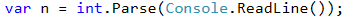

Започваме да чертаем горната част на диаманта. Първото нещо, което трябва да направим, е да изчислим началната стойност на външната бройка **тирета `leftRight`** (тиретата от външната част на **звездите**). Тя е равна на **`(n - 1) / 2`**, закръглено надолу.

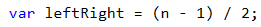

След като сме изчислили **`leftRight`**, започваме да чертаем **горната част** на диаманта. Може да започнем, като завъртим **цикъл** от **`0`** до **`n / 2 + 1`** (закръглено надолу).  

При всяка итерация на цикъла трябва да се изпълнят следните стъпки:
* Рисуваме по конзолата левите **тирета** (с дължина **`leftRight`**) и веднага след тях първата **звезда**.

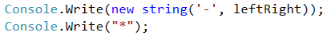

* Ще изчислим разстоянието между двете **звезди**. Може да го изчислим като извадим от **n** дължината на външните **тирета**, както и числото 2 (бройката на **звездите**, т.е. очертанията на диаманта). Резултата от тази разлика записваме в променлива **`mid`**. 

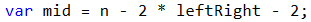

* Ако **`mid`** е по-малко от 0, то тогава знаем, че на реда трябва да има 1 звезда. Ако е по-голямо или равно на 0, то тогава трябва да начертаем **тирета** с дължина **`mid`** и една **звезда** след тях.
* Рисуваме на конзолата десните външни **тирета** с дължина **`leftRight`**. 

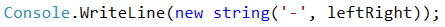

* В края на цикъла намаляваме **`leftRight`** с 1 (**звездите** се отдалечават).

Готови сме с горната част.

Рисуването на долната част е доста подобна на рисуването на горната част. Разликите са, че вместо да намаляваме **`leftRight`** с 1 към края на цикъла, ще увеличаваме **`leftRight`** с 1 в началото на цикъла. Също така, **цикълът ще е от 0 до `(n - 1) / 2`**.   


<table><tr><td></td>
<td><b>Повторението на код се смята за лоша практика</b>, защото кодът става доста труден за поддръжка. Нека си представим, че имаме парче код (напр. логиката за чертането на ред от диаманта) на още няколко места и решаваме да направим промяна. За целта би било необходимо да минем през всичките места и да направим промените. Нека си представим, че трябва да използвате код не 1, 2 или 3 пъти, а десетки пъти.
Начин за справяне с този проблем е като се използват методи. Можете да потърсите допълнителна информация за тях в Интернет.</td>
</tr></table>

Ако сме написали всичко коректно, задачата ни е решена.

#### Тестване в Judge системата

Тествайте решението си тук: [https://judge.softuni.bg/Contests/Practice/Index/512#9](https://judge.softuni.bg/Contests/Practice/Index/512#9)


## Какво научихме от тази глава?

Запознахме се с конструктора **`new string`**:

```csharp
string printMe = new string('*', 5);
```

Научихме се да чертаем фигури с вложени **`for`** цикли:

```csharp
for (var r = 1; r <= 5; r++)
{
   Console.Write("*");
   for (var c = 1; c < 5; c++)
      Console.Write(" *");
   Console.WriteLine();
}
```


## Упражнения: чертане на фигурки в уеб среда

Сега, след като свикнахме с **вложените цикли** и как да ги използваме, за да чертаем фигурки на конзолата, можем да се захванем с нещо още по-интересно: да видим как цилите могат да се използват за **чертане в уеб среда**. Ще направим уеб приложение, което визуализира числов рейтинг (число от 0 до 100) със звездички. Такава визуализация се среща често в сайтове за електронна търговия, ревюта на продукти, оценки на събития, рейтинг на приложения и други.

Не се притеснявайте, ако не разберете целия код, как е точно е направен и как точно работи проектът. Нормално е, сега се учим да пишем код, не сме стигнали до технологиите за уеб разработка. Ако имате трудности да си напишете проекта, следвайки описаните стъпки, **гледайте видеото** от началото на тази глава или питайте в СофтУни форума: https://softuni.bg/forum.

### Задача: рейтинги – визуализация в уеб среда

Да се разработи ASP.NET MVC уеб приложение за визуализация на рейтинг (число от 0 до 100). Чертаят се от 1 до 10 звездички (с половинки). Звездичките да се генерират с **`for`** цикъл.


Във Visual Studio създаваме ново ASP.NET MVC уеб приложение с език C#. Добавяме нов проект от [**Solution Explorer**] -> [**Add**] -> [**New Project…**] . Даваме смислено име, например "WebApp-Ratings".


Избираме тип на уеб приложението **MVC**.


Отваряме и редактираме файла **`Views/Home/Index.cshtml`**. Изтриваме всичко и въвеждаме следния код:


Този код създава уеб форма **`<form>`** с едно поле **`"rating"`** за въвеждане на число в интервала [**0…100**] и бутон [**Draw**] за изпращане на данните от формата към сървъра. Действието, което ще обработи данните, се казва **`/Home/DrawRatings`**, което означава метод **`DrawRatings`** в контролер **`Home`**, който се намира във файла **`HomeController.cs`**. След формата се отпечатва съдържанието на **`ViewBag.Stars`**. Кодът, който ще се съдържа в него, ще бъде динамично генериран от контролера HTML с поредица от звездички.

Добавяме метод **`DrawRatings`** в контролера **`HomeController`**. Отваряме файла **`Controllers/HomeController.cs`** и добавяме следния код:


Горният код взима въведеното число **`rating`**, прави малко пресмятания и изчислява броя **пълни звездички**, броя **празни звездички** и броя **половинки звездички**, след което генерира HTML код, който нарежда няколко картинки със звездички една след друга, за да сглоби от тях картинката с рейтинга. Подготвеният HTML код се записва във **`ViewBag.Stars`** за визуализация от изгледа **`Index.cshtml`**. Допълнително се запазва и изпратеният рейтинг (като число) във **`ViewBag.Rating`**, за да се зададе в полето за рейтинг в изгледа. За да се ориeнтирате по-добре в проекта, може да си помогнете с картинката от Visual Studio по-долу:


От [**Solution Explorer**] създаваме нова папка **images** в проекта:
  
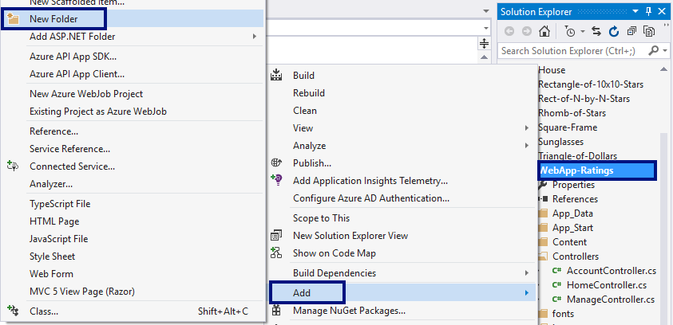

Сега добавяме **картинките със звездичките** (те са част от файловете със заданието за този проект и могат да бъдат свалени от [тук](https://github.com/SoftUni/Programming-Basics-Book-CSharp-BG/tree/master/assets/chapter-6-assets)). Копираме ги от Windows Explorer и ги поставяме в папката **images** в [**Solution Explorer**] във Visual Studio с copy/paste.

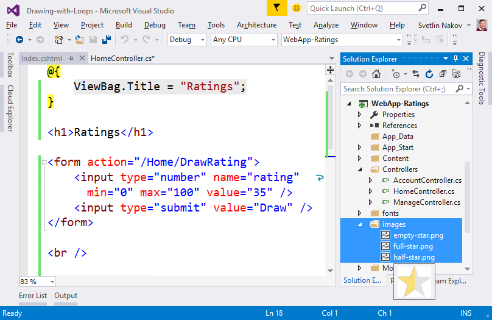

Стартираме проекта с [**Ctrl+F5**] и му се наслаждаваме:

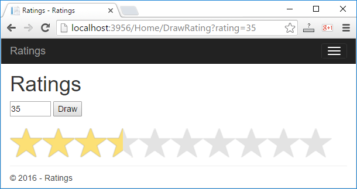

Ако имате проблеми с примерния проект по-горе, **гледайте видеото** в началото на тази глава. Там приложението е направено на живо стъпка по стъпка с много обяснения. Или питайте във **форума на СофтУни**: https://softuni.bg/forum.
