# Глава 7. По-сложни цикли - изпитни задачи

Вече **научихме** как може да изпълним даден **блок от команди повече от веднъж** използвайки **`for`** цикъл. В предходната глава **разгледахме** още няколко **циклични конструкции**, които биха ни помогнали при решаването на по-сложни проблеми, а именно:
- **Цикли със стъпка**
- **Вложени** цикли
- **`While`** цикли
- **`Do-while`** цикли
- **Безкрайни** цикли и излизане от цикъл (**`break`** оператор)
- Конструкцията **`try-catch`**

Нека затвърдим знанията си като решим няколко по-сложни задачи с цикли, давани на приемни изпити.

## Изпитни задачи

### Задача: генератор за тъпи пароли

Да се напише програма, която въвежда две цели числа **n** и **l** и генерира по азбучен ред всички възможни **"тъпи” пароли"**, които се състоят от следните **5 символа**:
-	Символ 1: цифра от **1** до **n**.
-	Символ 2: цифра от **1** до **n**.
-	Символ 3: малка буква измежду първите **l** букви на латинската азбука.
-	Символ 4: малка буква измежду първите **l** букви на латинската азбука.
-	Символ 5: цифра от **1** до **n, по-голяма от първите 2 цифри**.

#### Входни данни

Входът се чете от конзолата и се състои от **две цели числа: n** и **l** в интервала [**1…9**], по едно на ред.

#### Изходни данни

На конзолата трябва да се отпечатат **всички "тъпи" пароли по азбучен ред**, разделени с **интервал**.
#### Примерен вход и изход

|Вход|Изход|Вход|Изход|
|---|---|---|---|
|2 4|11aa2 11ab2 11ac2 11ad2 11ba2 11bb2 11bc2 11bd2 11ca2 11cb2 11cc2 11cd2 11da2 11db2 11dc2 11dd2|3 1|11aa2 11aa3 12aa3 21aa3 22aa3|

|Вход|Изход|Вход|Изход|
|---|---|---|---|
|3 2|11aa2 11aa3 11ab2 11ab3 11ba2 11ba3 11bb2 11bb3 12aa3 12ab3 12ba3 12bb3 21aa3 21ab3 21ba3 21bb3 22aa3 22ab3 22ba3 22bb3|4 2|11aa2 11aa3 11aa4 11ab2 11ab3 11ab4 11ba2 11ba3 11ba4 11bb2 11bb3 11bb4 12aa3 12aa4 12ab3 12ab4 12ba3 12ba4 12bb3 12bb4 13aa4 13ab4 13ba4 13bb4 21aa3 21aa4 21ab3 21ab4 21ba3 21ba4 21bb3 21bb4 22aa3 22aa4 22ab3 22ab4 22ba3 22ba4 22bb3 22bb4 23aa4 23ab4 23ba4 23bb4 31aa4 31ab4 31ba4 31bb4 32aa4 32ab4 32ba4 32bb4 33aa4 33ab4 33ba4 33bb4|

#### Насоки и подсказки

Програмата, която решава този проблем, можем да разделим мислено на **три** части:
* **Прочитане на входните данни** – в настоящата задача това включва прочитането на две числа **`n`** и **`l`**, всяко на отделен ред.
* **Обработка на входните данни** – използване на вложени цикли за преминаване през всеки възможен символ за всеки от петте символа на паролата.
* **Извеждане на резултат** – отпечатване на всяка "тъпа" парола, която отговаря на условията.

##### Прочитане и обработка на входните данни

За **прочитане** на **входните** данни ще декларираме две променливи от целочислен тип **`int`**: **`n`** и **`l`**.

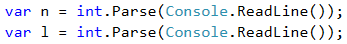

Нека декларираме и инициализираме **променливите**, които ще **съхраняват символите** на паролата: за **цифровите** символи - от тип **`int`** -  **`d1`**, **`d2`**, **`d3`**, a за **буквените** - от тип  **`char`** - **`l1`**, **`l2`**. За улеснение ще пропуснем изричното уточняване на типа като го заместим с ключовата дума **`var`**.

##### Извеждане на резултат

Необходимо е да вложим **пет** **`for`** цикъла един в друг, по един за всяка променлива. За да гарантираме условието последната цифра **d3** да бъде **по-голяма** от първите две, ще използваме вградената функция **`Math.Max(...)`**. 

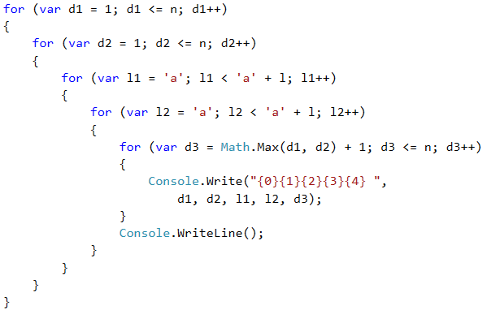

**Знаете ли, че...?** 

* Можем да **дефинираме `for`** цикъл с променлива от тип **`char`**:

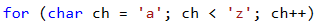

* Можем да **прочетем** променлива от тип **`char`** от конзолата със следната конструкция:

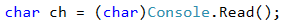
    
* Можем да обърнем **главен** символ **към малък**, използвайки вградена функция в C#:
    
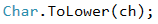
    
* При прочит на символи от конзолата, директно можем да преобразуваме главни към малки букви, **обединявайки горните два реда**:

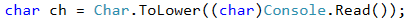

#### Тестване в Judge системата

Тествайте решението си тук: [https://judge.softuni.bg/Contests/Practice/Index/515#0](https://judge.softuni.bg/Contests/Practice/Index/515#0)

### Задача: магически числа

Да се напише програма, която въвежда едно цяло **магическо** число и изкарва всички възможни **6-цифрени числа**, за които **произведението на техните цифри е равно на магическото число**.

Пример: "Магическо число" &rarr; 2
-	111112 &rarr; 1 \* 1 \* 1 \* 1 \* 1 \* 2 = 2
-	111121 &rarr; 1 \* 1 \* 1 \* 1 \* 2 \* 1 = 2
-	111211 &rarr; 1 \* 1 \* 1 \* 2 \* 1 \* 1 = 2
-	112111 &rarr; 1 \* 1 \* 2 \* 1 \* 1 \* 1 = 2
-	121111 &rarr; 1 \* 2 \* 1 \* 1 \* 1 \* 1 = 2
-	211111 &rarr; 2 \* 1 \* 1 \* 1 \* 1 \* 1 = 2

#### Входни данни

Входът се чете от конзолата и се състои от **едно цяло число** в интервала [**1…600000**].

#### Изходни данни

На конзолата трябва да се отпечатат **всички магически числа**, разделени с **интервал**.

#### Примерен вход и изход

|Вход|Изход|Вход|Изход|Вход|Изход|
|---|---|---|---|---|---|
|2|111112 111121 111211 112111 121111 211111|8|111118 111124 111142 111181 111214 111222 111241 111412 111421 111811 112114 112122 112141 112212 112221 112411 114112 114121 114211 118111 121114 121122 121141 121212 121221 121411 122112 122121 122211 124111 141112 141121 141211 142111 181111 211114 211122 211141 211212 211221 211411 212112 212121 212211 214111 221112 221121 221211 222111 241111 411112 411121 411211 412111 421111 811111|531441|999999|

#### Насоки и подсказки

**Решението** на задачата за магическите числа следва **същата** концепция (отново трябва да генерираме всички комбинации за n елемента). Следвайки тези стъпки, опитайте да решите задачата сами.

-	Декларирайте и инициализирайте **променлива** от целочислен тип **`int`** и прочетете **входа** от конзолата.
-	Вложете **шест `for` цикъла** един в друг, по един за всяка цифра на търсените 6-цифрени числа.
-	В последния цикъл, чрез **`if`** конструкция проверете дали **произведението** на шестте цифри е **равно** на **магическото** число.

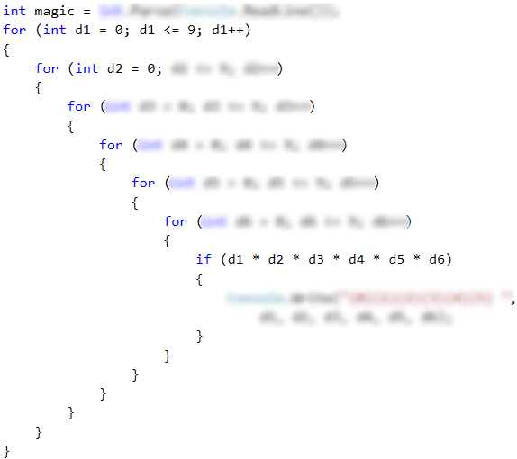

В предходната глава разгледахме и други циклични конструкции. Нека разгледаме примерно решение на същата задача, в което използваме цикъла **`while`**.
Първо трябва да запишем **входното магическо число** в подходяща променлива. След това ще инициализираме 6 променливи - по една за всяка от шестте цифри на търсените като **резултат** числа.

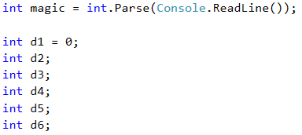

След това ще започнем да разписваме **`while`** циклите.
- Ще инициализираме **първата цифра**: **`d1 = 0`**.
- Ще зададем **условие за всеки** цикъл: цифрата да бъде по-малка или равна на 9.
- В **началото** на всеки цикъл задаваме стойност на **следващата** цифра, в случая: **`d2 = 0`**. При вложените **`for`** цикли инициализираме променливите във вътрешните цикли при всяко увеличение на външните. Искаме да постигнем същото поведение и тук.
- В **края** на всеки цикъл ще **увеличаваме** цифрата с едно: **`d++`**.
- В **най-вътрешния** цикъл ще направим **проверката** и ако е необходимо, ще принтираме на конзолата.

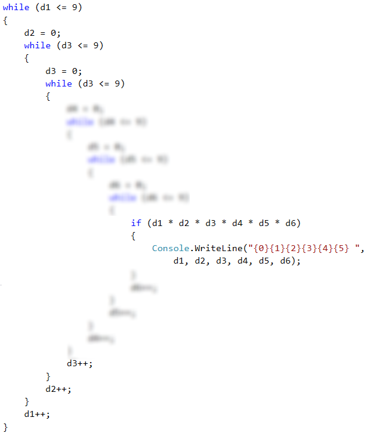

Нека премахнем **`if`** проверката от най-вътрешния цикъл. Сега, нека инициализираме всяка променлива извън циклите и нека изтрием редовете **`dx = 0`**. След като стартираме програмата, получаваме само 10 резултата. Защо? А ако използвате **`do-while`**? В случая този цикъл не изглежда подходящ, нали? Помислете защо. Разбира се, можете да решите задачата и с помощта на **безкраен цикъл**.

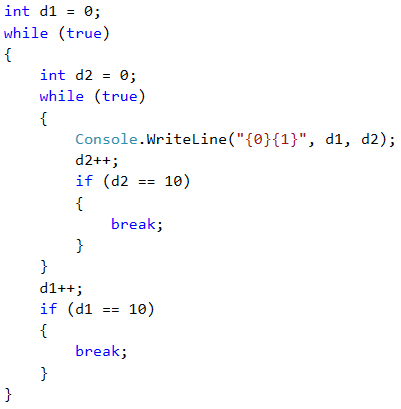

Както виждаме, един проблем можем да решим с различни видове цикли. Разбира се, за всяка задача има най-подходящ избор. С цел да упражните всеки цикъл - опитайте се да решите всяка от следващите задачи с всички изучени цикли.

#### Тестване в Judge системата
Тествайте решението си тук: [https://judge.softuni.bg/Contests/Practice/Index/515#1](https://judge.softuni.bg/Contests/Practice/Index/515#1)

### Задача: спиращо число

Напишете програма, която **принтира на конзолата всички числа** от **N** do **M**, които **се делят на 2** и **на 3 без остатък**, в **обратен ред**. От конзолата ще се чете още **едно "спиращо" число S**. Ако **някое от делящите се на 2 и 3 числа** е **равно на спиращото число, не трябва да се принтира и програмата трябва да приключи**. **В противен случай се принтират всички числа до N**, които отговарят на условието.

#### Вход

От конзолата се четат 3 числа, всяко на отделен ред:
* **N** - цяло число: **0 &le; N &lt; M**.
* **M** - цяло число: **N &lt; M &le; 10000**.
* **S** - цяло число: **N &le; S &le; M**.

#### Изход

На конзолата се принтират на един ред, разделени с интервал, всички числа, отговарящи на условията.

#### Примерен вход и изход

|Вход|Изход|Обяснения|
|---|---|---|
|1 30 15|30 24 18 12 6|Числата от 30 до 1, които се делят едновременно на 2 и на 3 без остатък са: 30, 24, 18, 12 и 6. Числото 15 **не е равно** на нито едно, затова редицата **продължава**.|

|Вход|Изход|Обяснения|
|---|---|---|
|1 36 12|36 30 24 18|Числата от 36 до 1, които се делят едновременно на 2 и на 3 без остатък, са: 36, 30, 24, 18, 12 и 6. Числото 12 **е равно** на спиращото число, затова **спираме до 18**.|

|Вход|Изход|Обяснения|
|---|---|---|
|20 |1000 36|996 990 984 978 972 966 960 954 948 942 936 930 924 918 912 906 900 894 888 882 876 870 864 858 852 846 840 834 828 822 816 810 804 798 792 786 780 774 768 762 756 750 744 738 732 726 720 714 708 702 696 690 684 678 672 666 660 654 648 642 636 630 624 618 612 606 600 594 588 582 576 570 564 558 552 546 540 534 528 522 516 510 504 498 492 486 480 474 468 462 456 450 444 438 432 426 420 414 408 402 396 390 384 378 372 366 360 354 348 342 336 330 324 318 312 306 300 294 288 282 276 270 264 258 252 246 240 234 228 222 216 210 204 198 192 186 180 174 168 162 156 150 144 138 132 126 120 114 108 102 96 90 84 78 72 66 60 54 48 42|

#### Насоки и подсказки

Задачата може да се раздели на **четири** логически части:
* **Четене** на входните данни от конзолата.
* **Проверка** на всички числа в дадения интервал, съответно завъртане на **цикъл**.
* **Проверка** на условията от задачата спрямо всяко едно число от въпросния интервал.
* **Разпечатване** на числата.

**Първата** част е тривиална - прочитаме **три** цели числа от конзолата, съответно ще използваме тип **`int`**.

С **втората** част също сме се сблъсквали - инициализиране на **`for`** цикъл. Тук има малка **уловка** - в условието е споменато, че числата трябва да се принтират в **обратен ред**. Това означава, че **началната** стойност на променливата **`i`** ще е **по-голямото число**, което от примерите виждаме, че е **M**. Съответно, **крайната** стойност на **`i`** трябва да е **N**. Фактът, че ще печатаме резултатите в обратен ред и стойностите на **`i`** ни подсказват, че стъпката ще е **намаляване с 1**.

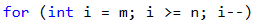

След като сме инициализирали **`for`** цикъла, идва ред на **третата** част от задачата - **проверка** на условието дали даденото **число се дели на 2 и на 3 без остатък**. Това ще направим с една обикновена **`if`** проверка, която ще оставим на читателя сам да построи.

Другата **уловка** в тази задача е, че освен горната проверка, трябва да направим **още** една - дали **числото е равно на "спиращото" число**, подадено ни от конзолата на третия ред. За да се стигне до тази проверка, числото, което проверяваме, трябва да премине през горната. По тази причина ще построим още една **`if`** конструкция, която ще **вложим в предходната**. Ако условието е **вярно**, заданието е да спрем програмата да печата, което в конкретния случай можем да направим с оператор **`break`**, който ще ни **изведе** от **`for`** цикъла.
 
Съответно, ако **условието** на проверката дали числото съвпада със "спиращото" число върне резултат **`false`**, по задание нашата програма трябва да **продължи да печата**. Това всъщност покрива и **четвъртата и последна** част от нашата програма.

#### Tестване в Judge системата
Тествайте решението си тук: [https://judge.softuni.bg/Contests/Practice/Index/515#2](https://judge.softuni.bg/Contests/Practice/Index/515#2)

### Задача: специални числа

Да се напише програма, която **въвежда едно цяло число N** и генерира всички възможни **"специални" числа** от **1111** до **9999**. За да бъде **"специалнo"** едно число, то трябва да отговаря на **следното условие**:
-	**N да се дели на всяка една от неговите цифри без остатък.**

**Пример:** при **N = 16, 2418** е специално число:
-	16 / 2 = 8 **без остатък**
-	16 / 4 = 4 **без остатък**
-	16 / 1 = 16 **без остатък**
-	16 / 8 = 2 **без остатък**

#### Входни данни

Входът се чете от конзолата и се състои от **едно цяло число** в интервала **[1…600000]**.

#### Изходни данни
На конзолата трябва да се отпечатат **всички магически числа**, разделени с **интервал**.

#### Примерен вход и изход

|Вход|Изход|Коментари|
|---|---|---|
|3|1111 1113 1131 1133 1311 1313 1331 1333 3111 3113 3131 3133 3311 3313 3331 3333|3 / 1 = 3 без остатък 3 / 3 = 1 без остатък 3 / 3 = 1 без остатък 3 / 3 = 1 без остатък|

|Вход|Изход|Вход|Изход|
|---|---|---|---|
|11|1111|16|1111 1112 1114 1118 1121 1122 1124 1128 1141 1142 1144 1148 1181 1182 1184 1188 1211 1212 1214 1218 1221 1222 1224 1228 1241 1242 1244 1248 1281 1282 1284 1288 1411 1412 1414 1418 1421 1422 1424 1428 1441 1442 1444 1448 1481 1482 1484 1488 1811 1812 1814 1818 1821 1822 1824 1828 1841 1842 1844 1848 1881 1882 1884 1888 2111 2112 2114 2118 2121 2122 2124 2128 2141 2142 2144 2148 2181 2182 2184 2188 2211 2212 2214 2218 2221 2222 2224 2228 2241 2242 2244 2248 2281 2282 2284 2288 2411 2412 2414 2418 2421 2422 2424 2428 2441 2442 2444 2448 2481 2482 2484 2488 2811 2812 2814 2818 2821 2822 2824 2828 2841 2842 2844 2848 2881 2882 2884 2888 4111 4112 4114 4118 4121 4122 4124 4128 4141 4142 4144 4148 4181 4182 4184 4188 4211 4212 4214 4218 4221 4222 4224 4228 4241 4242 4244 4248 4281 4282 4284 4288 4411 4412 4414 4418 4421 4422 4424 4428 4441 4442 4444 4448 4481 4482 4484 4488 4811 4812 4814 4818 4821 4822 4824 4828 4841 4842 4844 4848 4881 4882 4884 4888 8111 8112 8114 8118 8121 8122 8124 8128 8141 8142 8144 8148 8181 8182 8184 8188 8211 8212 8214 8218 8221 8222 8224 8228 8241 8242 8244 8248 8281 8282 8284 8288 8411 8412 8414 8418 8421 8422 8424 8428 8441 8442 8444 8448 8481 8482 8484 8488 8811 8812 8814 8818 8821 8822 8824 8828 8841 8842 8844 8848 8881 8882 8884 8888|

#### Насоки и подсказки

Решете задачата самостоятелно използвайки наученото от предишните две. Спомнете си разликата между операторите за **целочислено деление ( __/__ )** и **деление с остатък ( __%__ )** в C#.

#### Тестване в Judge системата

Тествайте решението си тук: [https://judge.softuni.bg/Contests/Practice/Index/515#3](https://judge.softuni.bg/Contests/Practice/Index/515#3)

### Задача: цифри

Да се напише програма, която прочита от конзолата 1 цяло число в интервала [**100...999**], и след това го принтира определен брой пъти - модифицирайки го преди всяко принтиране по следния начин:
- Ако числото се дели на **5** без остатък, **извадете** от него **първата му цифра**.
- Ако числото се дели на **3** без остатък, **извадете** от него **втората му цифра**.
- Ако нито едно от горните условия не е вярно, **прибавете** към него **третата му цифра**.

Принтирайте на конзолата **N брой реда**, като всеки ред има **M на брой числа**, които са резултат от горните действия. Нека:
- N = сбора на първата и втората цифра на числото.
- M = сбора на първата и третата цифра на числото.

#### Входни данни

Входът се чете от **конзолата** и е цяло число в интервала [**100...999**].

#### Изходни данни

На конзолата трябва да се отпечатат **всички цели числа**, които са резултат от дадените по-горе изчисления в съответния брой редове и колони, както в примерите.

#### Примерен вход и изход

|Вход|Изход|Коментари|
|---|---|---|
|132|129 126 123 120 119 121 123 120 119 121 123 120|(1 + 3) = 4 и (1 + 2) = 3 &rarr; 4 реда по 3 числа на всеки ред Входното число 132  132 &rarr; деление на 3 &rarr; 132 - 3 = = 129 &rarr; деление на 3 &rarr; 129 - 3 =  = 126 &rarr; деление на 3 &rarr; 126 - 3 =  = 123 &rarr; деление на 3 &rarr; 123 - 3 =  = 120 &rarr; деление на 5 &rarr; 120 - 1 =  ..... 121 &rarr; нито на 5, нито на 3 &rarr; 121 + 2 = 123|

|Вход|Изход|Коментари|
|---|---|---|
|376|382 388 394 400 397 403 409 415 412 418 424 430 427 433 439 445 442 448 454 460 457 463 469 475 472 478 484 490 487 493 499 505 502 508 514 520 517 523 529 535 532 538 544 550 547 553 559 565 562 568 574 580 577 583 589 595 592 598 604 610 607 613 619 625 622 628 634 640 637 643 649 655 652 658 664 670 667 673 679 685 682 688 694 700 697 703 709 715 712 718|10 реда по 9 числа на всеки Входното число 376 &rarr; нито на 5, нито на 3 &rarr; 376 + 6 &rarr; = = 382 &rarr; нито на 5, нито на 3 &rarr; 382 + 6 = = 388 + 6 = 394 + 6 = 400 &rarr; деление на 5 &rarr; 400 - 3 = 397|

#### Насоки и подсказки
Решете задачата **самостоятелно**, използвайки наученото от предишните. Не забравяйте, че ще е нужно да дефинирате **отделна** променлива за всяка цифра на входното число.

#### Тестване в Judge системата
Тествайте решението си тук: [https://judge.softuni.bg/Contests/Practice/Index/515#4](https://judge.softuni.bg/Contests/Practice/Index/515#4)
