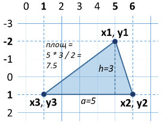

# Глава 8. Подготовка за практически изпит

В **настоящата глава** ще разгледаме няколко **задачи** с ниво на **трудност**, каквото може да очаквате от **задачите** на практическия **изпит** по Основи на програмирането. Ще **преговорим** и **упражним** всички знания, които сте придобили от настоящата книга и през курса “Programing Basics”.

## Видео

  Гледайте видео-урок по тази глава тук: <a target="_blank"
  href="https://www.youtube.com/watch?v=Cw-75W5Az4I">
  https://www.youtube.com/watch?v=Cw-75W5Az4I</a>.

## Практически изпит по Основи на програмирането

Курсът **“Programing Basics”** приключва с **практически изпит**. Включени са **6** задачи, като ще имате **4 часа**, за да ги решите. **Всяка** от задачите на изпита ще **засяга** една от изучаваните **теми** по време на курса. Темите на задачите са както следва:

- Задача с прости сметки (без проверки).
- Задача с единична проверка.
- Задача с по-сложни проверки.
- Задача с единичен цикъл.
- Задача за чертане на фигурка на конзолата.
- Задача с вложени цикли.

## Система за онлайн оценяване (Judge)

**Всички изпити и домашни** се **тестват** автоматизирано през онлайн **Judge система**: [https://judge.softuni.bg/](https://judge.softuni.bg/). За **всяка** от задачите има **открити** (нулеви) тестове, които ще ви помогнат да разберете какво се очаква от задачата и да поправите грешките си, както и **състезателни** тестове, които са **скрити** и проверяват дали задачата ви работи правилно. В Judge системата **се влиза** с вашия **softuni.bg акаунт**.

**Как** работи тестването в Judge системата? **Качвате** сорс кода и от менюто под него избирате да се компилира като **C#** програма. Програмата се **тества** с поредица тестове, като за всеки **успешен** тест получавате **точки**.

## Задачи с прости пресмятания

**Първата** задача на практическия изпит по Основи на програмирането обхваща **прости пресмятания без проверки и цикли**. Ето няколко примера:

### Задача: Лице на триъгълник в равнината

<table>
   <tr>
      <td width="60%">
        <b>Триъгълник в равнината</b> е зададен чрез координатите на трите си върха. Първо е зададен <b>върхът (x1, y1)</b>. След това са зададени останалите два върха: <b>(x2, y2)</b> и <b>(x3, y3)</b>, които <b>лежат на обща хоризонтална права</b> (т.е. имат еднакви Y координати). Напишете програма, която пресмята <b>лицето на триъгълника</b> по координатите на трите му върха.
      </td>
      <td>
         
      </td>
   </tr>
</table>

#### Вход
От конзолата се четат **6 цели числа** (по едно на ред):
**x1, y1, x2, y2, x3, y3.**
-	Всички входни числа са в диапазона [**-1000…1000**].
-	Гарантирано е, че **y2 = y3**.

#### Изход
**Лицето на триъгълника** да се отпечата на конзолата.

#### Примерен вход и изход

|Вход|Изход|Чертеж|Обяснения|
|----|----|----|----|
|5 -2 6 1 1 1|7.5||Страната на триъгълника **а** = 6 - 1 = **5** Височината на триъгълника **h** = 1 - (-2) = **3** Страната на триъгълника **S** = a \* h / 2 = 5 \* 3 / 2 = **7.5**|

|Вход|Изход|Чертеж|Обяснения|
|----|----|----|----|
|4 1 -1 -3 3 -3|8||Страната на триъгълника **а** = 3 - (-1) = **4** Височината на триъгълника **h** = 1 - (-3) = **4** Страната на триъгълника **S** = a \* h / 2 = 4 \* 4 / 2 = **8**|

#### Насоки и подсказки

Изключително важно при подобен тип задачи, при които се подават някакви координати, е да обърнем внимание на **реда**, в който се подават, както и правилно да осмислим кои от координатите ще използваме и по какъв начин. В случая, на входа се подават **x1, y1, x2, y2, x3, y3** в този си ред. Ако не спазваме тази последователност, решението става грешно. Първо пишем кода, който чете подадените данни:

Трябва да пресметнем **страната** и **височината** на триъгълника. От картинките, както и от условието **`y2 = y3`** забелязваме, че едната **страна** винаги е успоредна на хоризонталната ос. Това означава, че нейната **дължина** е равна на дължината на отсечката между нейните координати **`x2` и `x3`**, която е равна на разликата между по-голямата и по-малката координата. Аналогично можем да изчислим и **височината**. Тя винаги ще е равна на разликата между **`y1` и `y2`**(или **`y3`**, тъй като са равни). Тъй като не знаем дали винаги **`x2`** ще е по-голям от **`x3`**, или **`y1`** ще е под или над страната на триъгълника, ще използваме **абсолютните стойности** на разликата, за да получаваме винаги положителни числа, понеже една отсечка не може да има отрицателна дължина.

По познатата ни от училище формула за намиране на **лице на триъгълник** ще пресметнем лицето. Важно нещо, което трябва да съобразим, е въпреки че на входа получаваме само цели числа, **лицето** не винаги ще е цяло число. Затова за лицето използваме променлива от тип **`double`**. Налага се да конвертираме и дяснaта страна на уравнението, понеже ако подадем цели числа, като параметри на уравнението резултатът ни също ще е цяло число.

Единственото, което остава, е да отпечатаме лицето на конзолата.

#### Тестване в Judge системата
Тествайте решението си тук: [https://judge.softuni.bg/Contests/Practice/Index/516#0](https://judge.softuni.bg/Contests/Practice/Index/516#0)

### Задача: Пренасяне на тухли

Строителни работници трябва да пренесат общо x **тухли**. **Работниците** са **w** на брой и работят едновременно. Те превозват тухлите в колички, всяка с **вместимост m** тухли. Напишете програма, която прочита целите числа **x**, **w** и **m** и пресмята **колко най-малко курса** трябва да направят работниците, за да превозят тухлите.

#### Вход

От конзолата се четат **3 цели числа** (по едно на ред):
- **Броят тухли x** се чете от първия ред.
- **Броят работници w** се чете от втория ред.
- **Вместимостта на количката m** се чете от третия ред.

Всички входни числа са цели и в диапазона [**1…1000**].

#### Изход

Да се отпечата на конзолата **минималният брой курсове**, необходими за превозване на тухлите.

#### Примерен вход и изход

|Вход|Изход|Обяснения|
|----|----|----|
|120 2 30|2|Имаме **2** работника, всеки вози по **30** тухли на курс. Общо работниците возят по **60** тухли на курс. За да превозят **120** тухли, са необходими точно **2** курса.|

|Вход|Изход|Обяснения|
|----|----|----|
|355 3 10|12|Имаме **3** работника, всеки вози по **10** тухли на курс. Общо работниците возят по **30** тухли на курс. За да превозят **310** тухли, са необходими точно **12** курса: **11** пълни курса превозват **330** тухли и последният **12**-ти курс пренася последните **25** тухли.|

|Вход|Изход|Обяснения|
|----|----|----|
|5 12 30|1|Имаме **5** работника, всеки вози по **30** тухли на курс. Общо работниците возят по **150** тухли на курс. За да превозят **5** тухли, е достатъчен само **1** курс (макар и непълен, само с 5 тухли).|

#### Насоки и подсказки

Входът е стандартен, като единствено трябва да внимаваме за последователността, в която приемаме данните.

Пресмятаме колко **тухли** носят работниците на 1 курс.

Като разделим общия брой на **тухлите, пренесени за 1 курс**, ще получим броя **курсове**, необходими за пренасянето им. Трябва да съобразим, че при деление на цели числа се пренебрегва остатъка и се закръгля винаги надолу. За да избегнем това ще конвертираме дяснaта страна на уравнението към **`double`** и ще използваме функцията **`Math.Ceiling(...)`**, за да закръглим получения резултат винаги нагоре. Когато тухлите могат да се пренесат с **точен брой курсове**, делението ще връща точно число и няма да има нищо за закръгляне. Съответно, когато не е така, резултатът от делението ще е **броя на точните курсове**, но с десетична част. Десетичната част ще се закръгли нагоре и така ще се получи нужният **1 курс** за оставащите тухли.

Накрая принтираме резултата на конзолата.

#### Тестване в Judge системата

Тествайте решението си тук: [https://judge.softuni.bg/Contests/Practice/Index/516#1](https://judge.softuni.bg/Contests/Practice/Index/516#1)

## Задачи с единична проверка

**Втората** задача на практическия изпит по Основи на програмирането обхваща **условна конструкция и прости премятания**. Ето няколко примера:

### Задача: Точка върху отсечка

Върху хоризонтална права е разположена **хоризонтална отсечка**, зададена с **x** координатите на двата си края: **first** и **second**. Точка е разположена върху същата хоризонтална права и е зададена с x координатата си. Напишете програма, която проверява дали точката е **вътре или вън от отсечката** и изчислява **разстоянието до по-близкия край** на отсечката.

#### Вход

От конзолата се четат **3 цели числа** (по едно на ред):
- На първия ред стои числото first – **единия край на отсечката**.
- На втория ред стои числото second – **другия край на отсечката**.
- На третия ред стои числото point – **местоположението на точката**.

Всички входни числа са цели и в диапазона [**-1000…1000**].

#### Изход

Резултатът да се отпечата на конзолата:
- На първия ред да се отпечата “**in**” или “**out**” – дали точката е върху отсечката или извън нея.
- На втория ред да се отпечата разстоянието от точката до най-близкия край на отсечката.

#### Примерен вход и изход

|Вход|Изход|Визуализация|
|---|---|---|
|10 5 7|in 2||

|Вход|Изход|Визуализация|
|---|---|---|
|8 10 5|out 3||

|Вход|Изход|Визуализация|
|---|---|---|
|1 -2 3|out 2||

#### Насоки и подсказки

Четем входа от конзолата.

Тъй като не знаем коя **точка** е от ляво и коя е от дясно, ще си направим две променливи, които да ни отбелязват това. Тъй като **лявата точка** е винаги тази с по-малката **х координата**, ще ползваме **`Math.Min(...)`**, за да я намерим. Съответно, **дясната** е винаги тази с по-голяма **х координата** и ползваме **`Math.Max(...)`**. Ще намерим и разстоянието от **точката x** до **двете точки**. Понеже не знаем положението им една спрямо друга, ще използваме **`Math.Abs(...)`**, за да получим положителен резултат.

По-малкото от двете **разстояния** ще намерим ползвайки **`Math.Min(...)`**.

Остава да намерим дали **точката** е на линията или извън нея. **Точката** ще се намира на линията винаги, когато тя **съвпада** с някоя от другите две точки или **х координатата ѝ** се намира между тях. В противен случай, **точката** се намира извън линията. След проверката изкарваме едното от двете съобщения, спрямо това коя проверка е удовлетворена.

Накрая изкарваме **разстоянието**, намерено преди това.

#### Тестване в Judge системата

Тествайте решението си тук: [https://judge.softuni.bg/Contests/Practice/Index/516#2](https://judge.softuni.bg/Contests/Practice/Index/516#2)

### Задача: Точка във фигура

Да се напише програма, която проверява дали дадена точка (с кординати **x** и **y**) е **вътре** или **извън** следната фигура:
 

#### Вход

От конзолата се четат **2 цели числа** (по едно на ред): **x** и **y**.

Всички входни числа са цели и в диапазона **[-1000…1000]**.

#### Изход

Да се отпечата на конзолата “**in**” или “**out**” – дали точката е **вътре** или **извън** фигурата (на контура е вътре).

#### Примерен вход и изход

|Вход|Изход|Вход|Изход|
|----|----|----|----|
|8 -5|in|6 -3|in|

|Вход|Изход|Вход|Изход|
|----|----|----|----|
|11 -5|out|11 2|out|

#### Насоки и подсказки

За да разберем дали **точката** е във фигурата, ще разделим **фигурата** на 2 четириъгълника:

Достатъчно условие е **точката** да се намира в един от тях, за да се намира във **фигурата**.

Приемаме входните данни:

Ще създадем две променливи, които ще отбелязват дали **точката** се намира в някой от правоъгълниците.

При отпечатването на съобщението ще проверим дали някоя от променливите е приела стойност **`true`**. Достатъчно е **само една** от тях да е **`true`**, за да се намира точката във фигурата.

#### Тестване в Judge системата

Тествайте решението си тук: [https://judge.softuni.bg/Contests/Practice/Index/516#3](https://judge.softuni.bg/Contests/Practice/Index/516#3)

## Задачи с по-сложни проверки

**Третата** задача на практическия изпит по Основи на програмирането включва **няколко вложени проверки и прости премятания**. Ето няколко примера:

### Задача: Дата след 5 дни

Дадени са две числа **d** (ден) и **m** (месец), които формират **дата**. Да се напише програма, която отпечатва датата, която ще бъде **след 5 дни**. Например 5 дни след **28.03** е датата **2.04**. Приемаме, че месеците: април, юни, септември и ноември имат по 30 дни, февруари има 28 дни, а останалите имат по 31 дни. Месеците да се отпечатат с **водеща нула**, когато са едноцифрени (например 01, 08, 12).

#### Вход

Входът се чете от конзолата и се състои от два реда:
-	На първия ред стои едно цяло число **d** в интервала [**1…31**] – ден. Номерът на деня не надвишава броя дни в съответния месец (напр. 28 за февруари).
-	На втория ред стои едно цяло число **m** в интервала [**1…12**] – месец. Месец 1 е януари, месец 2 е февруари, …, месец 12 е декември. Месецът може да съдържа водеща нула (напр. април може да бъде изписан като 4 или 04).

#### Изход

Отпечатайте на конзолата един единствен ред, съдържащ дата след 5 дни във формат **ден.месец**. Месецът трябва да бъде двуцифрено число с водеща нула, ако е необходимо. Денят трябва да е без водеща нула.

#### Примерен вход и изход

|Вход|Изход|Вход|Изход|
|---|---|---|---|
|28 03|2.04|27 12|1.01|

|Вход|Изход|Вход|Изход|
|---|---|---|---|
|25 1|30.01|26 02|3.03|

#### Насоки и подсказки

Приемаме си входа от конзолата.

За да си направим по-лесно проверките, ще си създадем една променлива, която ще съдържа **броя дни**, които има в месеца, който сме задали.

Увеличаваме **деня** с 5.

Проверяваме дали **денят** не е станал по-голям от броя дни, които има в съответния **месец**. Ако това е така, трябва да извадим дните от месеца от получения ден, за да получим нашият ден на кой ден от следващия месец съответства.

След като сме минали в **следващия месец**, това трябва да се отбележи, като увеличим първоначално зададения с 1. Трябва да проверим, дали той не е станал по-голям от 12 и ако е така, да коригираме. Тъй като няма как да прескочим повече от **един месец**, когато увеличаваме с 5 дни, долната проверка е достатъчна.

Остава само да принтираме резултата на конзолата. Важно е да **форматираме изхода** правилно, за да се появява водещата нула в първите 9 месеца. Това става, като добавим **форматиращ стринг** ":D2" след втория елемент.

#### Тестване в Judge системата

Тествайте решението си тук: [https://judge.softuni.bg/Contests/Practice/Index/516#4](https://judge.softuni.bg/Contests/Practice/Index/516#4)

### Задача: Суми от 3 числа

Дадени са **3 цели числа**. Да се напише програма, която проверява дали **сумата на две от числата е равна на третото**. Например, ако числата са **3**, **5** и **2**, сумата на две от числата е равна на третото: **2 + 3 = 5**.

#### Вход

От конзолата се четат **три цели числа**, по едно на ред. Числата са в диапазона [**1…1000**].

#### Изход

-	Да се отпечата на конзолата един ред, съдържащ решението на задачата във формат “**A + B = C**”, където **A**, **B** и **C** са измежду входните три числа и  **A ≤ B**.
-	Ако задачата няма решение, да се отпечата „**No**“ на конзолата.

#### Примерен вход и изход

|Вход|Изход|Вход|Изход|
|---|---|---|---|
|3 5 2|2 + 3 = 5|2 2 4|2 + 2 = 4|

|Вход|Изход|Вход|Изход|
|---|---|---|---|
|1 1 5|No|2 6 3|No|

#### Насоки и подсказки

Приемаме си входа от конзолата.

Трябва да проверим дали **сумата** на някоя двойка числа е равна на третото. Имаме три възможни случая:
* A + B = C
* A + C = B 
* B + C = A

Ще си напишем **рамка**, която после ще допълним с нужния код. Ако никое от горните три условия не е изпълнено, ще зададем на програмата да принтира "**No**".

Сега остава да разберем реда, в който ще се изписват **двете събираеми** на изхода на програмата. За целта ще направим **вложено условие**, което проверява кое от двете числа е по-голямото. При първия случай, ще стане по този начин:

Аналогично, ще допълним и другите два случая. Пълният код на проверките и изходът на програмата ще изглеждат така:

#### Тестване в Judge системата

Тествайте решението си тук: [https://judge.softuni.bg/Contests/Practice/Index/516#5](https://judge.softuni.bg/Contests/Practice/Index/516#5)

## Задачи с единичен цикъл

**Четвъртата** задача на практическия изпит по Основи на програмирането включва **единичен цикъл с проста логика** в него. Ето няколко примера:

### Задача: Суми през 3

Дадени са **n** цели числа **a1, a2, …, an**. Да се пресметнат сумите:
-	**sum1 = a1 + a4 + a7** + … (сумират се числата, започвайки от първото със стъпка 3).
-	**sum2 = a2 + a5 + a8** + … (сумират се числата, започвайки от второто със стъпка 3).
-	**sum3 = a3 + a6 + a9** + … (сумират се числата, започвайки от третото със стъпка 3).

#### Вход

Входните данни се четат от конзолата. На първия ред стои цяло число **n (0 ≤ n ≤ 1000)**. На следващите **n** реда стоят **n** цели числа в интервала [**-1000…1000**]: **a1, a2, …, an**.

#### Изход

На конзолата трябва да се отпечатат 3 реда, съдържащи търсените 3 суми, във формат като в примерите.

#### Примерен вход и изход

|Вход|Изход|Вход|Изход|Вход|Изход|
|---|---|---|---|---|---|
|2 3 5 |sum1 = 3 sum2 = 5 sum3 = 0|4 7 -2 6 12|sum1 = 19 sum2 = -2 sum3 = 6|5 3 5 2 7 8|sum1 = 10 sum2 = 13 sum3 = 2| 

#### Насоки и подсказки

Ще вземем **броя на числата** от конзолата и ще декларираме **начални стойности** на трите суми.

Тъй като не знаем предварително колко числа ще обработваме, ще си ги взимаме едно по едно в **цикъл**, който ще се повтори **n на брой пъти** и ще ги обработваме в тялото на цикъла.

За да разберем в коя от **трите суми** трябва да добавим числото, ще разделим **поредния му номер на три** и ще използваме **остатъка**. Ще използваме променливата **`i`**, която следи **броя завъртания** на цикъла, за да разберем на кое поред число сме. Когато остатъкът от **`i/3`** е **нула**, това означава, че ще добавяме това число към **първата** сума, когато е **1** към **втората** и когато е **2** към **третата**.

Накрая, ще изкараме резултата на конзолата в изисквания **формат**.

#### Тестване в Judge системата

Тествайте решението си тук: [https://judge.softuni.bg/Contests/Practice/Index/516#6](https://judge.softuni.bg/Contests/Practice/Index/516#6)

### Задача: Поредица от нарастващи елементи

Дадена е редица от **n** числа: **a1**, **a2**, **…**, **an**. Да се пресметне **дължината на най-дългата нарастваща поредица** от последователни елементи в редицата от числа.

#### Вход

Входните данни се четат от конзолата. На първия ред стои цяло число **n** (**0 ≤ n ≤ 1000**). На следващите **n** реда стоят **n** цели числа в интервала [**-1000…1000**]: **a1**, **a2**, **…**, **an**.

#### Изход

На конзолата трябва да се отпечата едно число – **дължината** на най-дългата нарастваща редица.

#### Примерен вход и изход

|Вход|Изход|Вход|Изход|Вход|Изход|Вход|Изход|
|---|---|---|---|---|---|---|---|
|3 5 2 4|2|4 2 8 7 6|2|4 1 2 4 4|3|4 5 6 7 8|2|

|Вход|Изход|Вход|Изход|
|---|---|---|---|
|4 1 2 4 4|3|4 5 6 7 8|2|

#### Насоки и подсказки

За решението на тази задача трябва да помислим малко **по-алгоритмично**. Дадена ни е **редица от числа** и трябва да проверяваме дали всяко **следващо**, ще бъде **по-голямо от предното** и ако е така да броим колко дълга е редицата, в която това условие е изпълнено. След това трябва да намерим **коя редица** от всички такива е **най-дълга**. За целта, нека да си направим няколко променливи, които ще ползваме през хода на задачата. 

Променливата **`n`** е **броя числа**, които ще получим от конзолата. В **`countTempLongest`** ще запазваме **броя на елементите** в нарастващата редица, която **броим в момента**. Напр. при редицата: 5, 6, 1, 2, 3 **`countTempLongest`** ще бъде 2, когато сме стигнали **втория елемент** от броенето (5, **6**, 1, 2, 3) и ще стане 3, когато стигнем **последния елемент** (5, 6, 1, 2, **3**), понеже нарастващата редица 1, 2, 3 има 3 елемента. Ще използваме **`countLongest`**, за да запазим **най-дългата** нарастваща редица. Останалите променливи са **`a`** - числото, на което се намираме **в момента**, и **`aPrev`** - **предишното число**, което ще сравним с **`a`**, за да разберем дали редицата **расте**.

Започваме да въртим числата и проверяваме дали настоящото число **`а`** е по-голямо от предходното **`aPrev`**. Ако това е изпълнено, значи редицата **е нарастваща** и трябва да увеличим броя ѝ с **1**. Това запазваме в променливата, която следи дължината на редицата, в която се намираме в момента, а именно - **`countTempLongest`**. Ако числото **`а`** **не е по-голямо** от предходното, това означава, че започва **нова редица** и трябва да стартираме броенето от **1**. Накрая, след всички проверки, **`aPrev`** става **числото**, което използваме **в момента**, и започваме цикъла от начало със **следващото** въведено **`а`**.

Остава да разберем коя от всички редици е **най-дълга**. Това ще направим с проверка в цикъла дали **редицата**, в която се намираме **в момента**, е станала по-дълга от дължината на **най-дългата намерена до сега**. Целият цикъл ще изглежда така:

Накрая принтираме дължината на **най-дългата** намерена редица.

#### Тестване в Judge системата

Тествайте решението си тук: [https://judge.softuni.bg/Contests/Practice/Index/516#7](https://judge.softuni.bg/Contests/Practice/Index/516#7)

## Чертане на фигурки на конзолата

**Петата** задача на практическия изпит по Основи на програмирането изисква **използване на един или няколко вложени цикъла за рисуване** на някаква фигурка на конзолата. Може да се изискват логически размишления, извършване на прости пресмятания и проверки. Задачата проверява способността на студентите да мислят логически и да измислят прости алгоритми за решаване на задачи, т.е. да мислят алгоритмично. Ето няколко примера за изпитни задачи:

### Задача: Перфектен диамант

Да се напише програма, която прочита от конзолата цяло число **n** и чертае **перфектен диамант** с размер **n** като в примерите по-долу.

#### Вход

Входът е цяло число **n** в интервала [**1…1000**].

#### Изход

На конзолата трябва да се отпечата диамантът като в примерите.

#### Примерен вход и изход

|Вход|Изход|Вход|Изход|
|----|----|----|----|
|2|<code>&nbsp;&#42;&nbsp;</code> <code>&#42;-&#42;</code> <code>&nbsp;&#42;&nbsp;</code>|3|<code>&nbsp;&nbsp;&#42;&nbsp;&nbsp;</code> <code>&nbsp;&#42;-&#42;&nbsp;</code> <code>&#42;-&#42;-&#42;</code> <code>&nbsp;&#42;-&#42;&nbsp;</code> <code>&nbsp;&nbsp;&#42;&nbsp;&nbsp;</code> |

|Вход|Изход|Вход|Изход|
|---|---|---|---|
|4|<code>&nbsp;&nbsp;&nbsp;&#42;&nbsp;&nbsp;&nbsp;</code> <code>&nbsp;&nbsp;&#42;-&#42;&nbsp;&nbsp;</code> <code>&nbsp;&#42;-&#42;-&#42;&nbsp;</code> <code>&#42;-&#42;-&#42;-&#42;</code> <code>&nbsp;&#42;-&#42;-&#42;&nbsp;</code> <code>&nbsp;&nbsp;&#42;-&#42;&nbsp;&nbsp;</code> <code>&nbsp;&nbsp;&nbsp;&#42;&nbsp;&nbsp;&nbsp;</code> |5|<code>&nbsp;&nbsp;&nbsp;&nbsp;&#42;&nbsp;&nbsp;&nbsp;&nbsp;</code> <code>&nbsp;&nbsp;&nbsp;&#42;-&#42;&nbsp;&nbsp;&nbsp;</code> <code>&nbsp;&nbsp;&#42;-&#42;-&#42;&nbsp;&nbsp;</code> <code>&nbsp;&#42;-&#42;-&#42;-&#42;&nbsp;</code> <code>&#42;-&#42;-&#42;-&#42;-&#42;</code> <code>&nbsp;&#42;-&#42;-&#42;-&#42;&nbsp;</code> <code>&nbsp;&nbsp;&#42;-&#42;-&#42;&nbsp;&nbsp;</code> <code>&nbsp;&nbsp;&nbsp;&#42;-&#42;&nbsp;&nbsp;&nbsp;</code> <code>&nbsp;&nbsp;&nbsp;&nbsp;&#42;&nbsp;&nbsp;&nbsp;&nbsp;</code> |

#### Насоки и подсказки

В задачите с чертане на фигурки най-важното, което трябва да преценим е **последователността**, в която ще рисуваме. Кои елементи се **повтарят** и с какви **стъпки**. Ясно може да забележим, че **горната и долната** част на диаманта са **еднакви**. Най-лесно ще решим задачата, като направим **един цикъл**, който чертае **горната част**, и след това още **един**, който чертае **долната** (обратно на горната).

Ще си прочетем числото **`n`** от конзолата.

Започваме да рисуваме **горната половина** на диаманта. Ясно виждаме, че **всеки ред** започва с няколко **празни места и <code>*</code>**. Ако се загледаме по-внимателно, ще забележим, че **празните места** са винаги равни на **`n - броя на реда`** (на първия ред са n-1, на втория - n-2 и т.н.) Ще започнем с това да нарисуваме броя **празни места**, както и **първата звездичка**. Нека не забравяме да използваме **`Console.Write(...)`** вместо **`Console.WriteLine(...)`**, за да оставаме на **същия ред**. На края на реда пишем **`Console.WriteLine(...)`**, за да преминем на **нов ред**. Забележете, че започваме да броим от **1, а не от 0**. След това ще остане само да добавим няколко пъти **`-*`**, за да **довършим реда**. 

Остава да **довършим всеки ред** с нужния брой **`-*`** елементи. На всеки ред трябва да добавим **`i - 1`** такива **елемента** (на първия 1-1 -> 0, на втория 1 и т.н.)

За да изрисуваме **долната част** на диаманта, трябва да обърнем **горната** на обратно. Ще броим от **`n - 1`**, тъй като ако започнем от **`n`**, ще изрисуваме средния ред два пъти. Не забравяйте да смените **стъпката** от **`++` на `--`**.

#### Тестване в Judge системата

Тествайте решението си тук: [https://judge.softuni.bg/Contests/Practice/Index/516#8](https://judge.softuni.bg/Contests/Practice/Index/516#8)

### Задача: Правоъгълник със звездички в центъра

Да се напише програма, която прочита от конзолата цяло число **n** и чертае **правоъгълник** с размер **n с две звездички в центъра**, като в примерите по-долу.

#### Вход

Входът е цяло число **n** в интервала [**2…1000**].

#### Изход

На конзолата трябва да се отпечата правоъгълникът като в примерите.

#### Примерен вход и изход

|Вход|Изход|Вход|Изход|
|---|---|---|---|
|2|<code>&#37;&#37;&#37;&#37;</code> <code>&#37;&#42;&#42;&#37;</code> <code>&#37;&#37;&#37;&#37;</code> |3|<code>&#37;&#37;&#37;&#37;&#37;&#37;</code> <code>&#37;&nbsp;&nbsp;&nbsp;&nbsp;&#37;</code> <code>&#37;&nbsp;&#42;&#42;&nbsp;&#37;</code> <code>&#37;&nbsp;&nbsp;&nbsp;&nbsp;&#37;</code> <code>&#37;&#37;&#37;&#37;&#37;&#37;</code> |

|Вход|Изход|Вход|Изход|
|---|---|---|---|
|4|<code>&#37;&#37;&#37;&#37;&#37;&#37;&#37;&#37;</code> <code>&#37;&nbsp;&nbsp;&nbsp;&nbsp;&nbsp;&nbsp;&#37;</code> <code>&#37;&nbsp;&nbsp;&#42;&#42;&nbsp;&nbsp;&#37;</code> <code>&#37;&nbsp;&nbsp;&nbsp;&nbsp;&nbsp;&nbsp;&#37;</code> <code>&#37;&#37;&#37;&#37;&#37;&#37;&#37;&#37;</code> |5|<code>&#37;&#37;&#37;&#37;&#37;&#37;&#37;&#37;&#37;&#37;</code> <code>&#37;&nbsp;&nbsp;&nbsp;&nbsp;&nbsp;&nbsp;&nbsp;&nbsp;&#37;</code> <code>&#37;&nbsp;&nbsp;&nbsp;&nbsp;&nbsp;&nbsp;&nbsp;&nbsp;&#37;</code> <code>&#37;&nbsp;&nbsp;&nbsp;&#42;&#42;&nbsp;&nbsp;&nbsp;&#37;</code> <code>&#37;&nbsp;&nbsp;&nbsp;&nbsp;&nbsp;&nbsp;&nbsp;&nbsp;&#37;</code> <code>&#37;&nbsp;&nbsp;&nbsp;&nbsp;&nbsp;&nbsp;&nbsp;&nbsp;&#37;</code> <code>&#37;&#37;&#37;&#37;&#37;&#37;&#37;&#37;&#37;&#37;</code> |

#### Насоки и подсказки

Прoчитаме входните данни от задачата.

Първото нещо, което лесно забелязваме, е че **първият и последният ред** съдържат **`2 * n`** символа **`%`**. Ще започнем с това и после ще нарисуваме средата на четириъгълника.

От дадените примери виждаме, че **средата** на фигурата винаги има **нечетен брой** редове. Забелязваме, че когато е зададено **четно число**, броят на редовете е равен на **предишното нечетно** (2 -> 1, 4 -> 3 и т.н.). Създаваме си променлива, която представлява броя редове, които ще има нашият правоъгълник, и я коригираме, ако числото **`n` е четно**. След това ще нарисуваме **правоъгълника без звездичките**. Всеки ред има за **начало и край** символа **`%`** и между тях **`2 * n - 2`** празни места (ширината е **`2 * n`** и вадим 2 за двата процента в края). Не забравяйте да преместите кода за **последния ред след цикъла**.

Остава само **в тялото** на цикъла да добавим и **звездичките**. Ще направим проверка дали сме на **средния ред**. Ако сме на средния, ще рисуваме **реда** заедно **със звездичките**, ако не - ще рисуваме **нормален ред**. Редът със звездичките има **`n - 2`** **празни места** (**`n`** е половината дължина и махаме звездичката и процента), **две звезди** и отново **`n - 2` празни места**. Двата процента в началото и в края на реда си ги оставяме извън проверката.

#### Тестване в Judge системата

Тествайте решението си тук: [https://judge.softuni.bg/Contests/Practice/Index/516#9](https://judge.softuni.bg/Contests/Practice/Index/516#9)

## Задачи с вложени цикли

**Последната** (шеста) задача от практическия изпит по Основи на програмирането изисква използване на **няколко вложени цикъла и по-сложна логика в тях**. Задачата проверява способността на студентите да мислят алгоритмично и да решават нетривиални задачи, изискващи съставянето на цикли. Ето няколко примера за изпитни задачи:

### Задача: Четворки нарастващи числа

По дадена двойка числа **a** и **b** да се генерират всички четворки **n1, n2, n3, n4,** за които **a ≤ n1 < n2 < n3 < n4 ≤ b**.

#### Вход

Входът съдържа две цели числа **a** и **b** в интервала [**0…1000**], по едно на ред.

#### Изход

Изходът съдържа всички търсени **четворки числа**, в нарастващ ред, по една на ред.

#### Примерен вход и изход

|Вход|Изход|Вход|Изход|
|---|---|---|---|
|3 7|3 4 5 6 3 4 5 7 3 4 6 7 3 5 6 7 3 5 6 7 4 5 6 7|15 20|15 16 17 18 15 16 17 19 15 16 17 20 15 16 18 19 15 16 18 20 15 16 19 20 15 17 18 19 15 17 18 20 15 17 19 20 15 18 19 20 16 17 18 19 16 17 18 20 16 17 19 20 16 18 19 20 17 18 19 20 |

|Вход|Изход|Вход|Изход|
|---|---|---|---|
|5 7|No|10 13|10 11 12 13|

#### Насоки и подсказки

Ще прочетем входните данни от конзолата. Създаваме и допълнителната променлива **`count`**, която ще следи дали има **съществуваща редица числа**.

Най-лесно ще решим задачата, ако логически я разделим **на части**. Ако се изисква да изведем всички редици от едно число между **`a`** и **`b`**, ще го направим с **един цикъл**, който изкарва всички числа от **`а`** до **`b`**. Нека помислим как ще стане това с **редици от две числа**. Отговорът е лесен - ще ползваме **вложени цикли**. 

Тъй като всяко **следващо число** от редицата трябва да е **по-голямо** от **предишното**, вторият цикъл ще се върти от **`i + 1`** (следващото по-голямо число). Съответно, ако **не съществува редица** от две нарастващи числа (**`a`** и **`b`** са равни), вторият цикъл  **няма да се изпълни** и няма да се разпечата нищо на конзолата. **Аналогично**, остава да направим **вложените цикли** и за **четири числа**. Ще добавим и **брояча**, който инициализирахме в началото, за да знаем дали **съществува** такава **редица**.

Накрая ще проверим дали **броячът** е равен на **0** и ще принтираме **No** на конзолата, ако е така.

#### Тестване в Judge системата

Тествайте решението си тук: [https://judge.softuni.bg/Contests/Practice/Index/516#10](https://judge.softuni.bg/Contests/Practice/Index/516#10)

### Задача: Генериране на правоъгълници

По дадено число **n** и **минимална площ m** да се генерират всички правоъгълници с цели координати в интервала [**-n…n**] с площ поне **m**. Генерираните правоъгълници да се отпечатат в следния формат:

**(left, top) (bottom, right) -> area**

Правоъгълниците се задават чрез горния си ляв и долния си десен ъгъл. В сила са следните неравенства:
-	**-n ≤ left < right ≤ n**
-	**-n ≤ top < bottom ≤ n**

#### Вход

От конзолата се въвеждат две числа, по едно на ред:

-	Цяло число **n** в интервала [**1…100**] – задава минималната и максималната координата на връх.
-	Цяло число **m** в интервала [**0…50000**] – задава минималната площ на генерираните правоъгълници.

#### Изход

-	На конзолата трябва да се отпечатат описаните правоъгълници във формат като в примерите по-долу.
-	Ако за числата **n** и **m** няма нито един правоъгълник, да се изведе **“No”**.
-	Редът на извеждане на правоъгълниците е без значение.

#### Примерен вход и изход

|Вход|Изход|Вход|Изход|
|---|---|---|---|
|1 2|(-1, -1) (0, 1) -> 2 (-1, -1) (1, 0) -> 2 (-1, -1) (1, 1) -> 4 (-1, 0) (1, 1) -> 2 (0, -1) (1, 1) -> 2|2 17|No|

|Вход|Изход|
|---|---|
|3 36|(-3, -3) (3, 3) -> 36|

#### Насоки и подсказки

Нека приемем входните данни от конзолата. Ще създадем един **брояч** и една **променлива**, която ще използваме за пресмятането на **обема на четириъгълника**.

Изключително важно е да успеем да си представим задачата, преди да започнем да я решаваме. В нашия случай се изисква да търсим правоъгълници в координатна система. Нещото, което знаем е, че **лявата точка** винаги ще има координата **`х`, по-малка** от **дясната**. Съответно **горната** винаги ще има **по-малка** координата **`у`** от **долната**. За да намерим всички правоъгълници, ще трябва да направим **цикъл**, подобен на този от предходната задача, но този път **не всеки следващ цикъл** ще започва от **следващото число**, защото някои от **координатите** може да са **равни** (например **`left`** и **`top`**).

С променливите **`i`** и **`k`** ще следим координатите по **хоризонталата**, а с **`j`** и **`l`** - по **вертикалата**. Важното тук е да знаем кои координати кои са, за да можем да изчислим правилно страните на четириъгълника. Сега трябва да намерим **лицето на правоъгълника** и да направим проверка дали то е **по-голямо** или **равно** на **`m`**. Едната **страна** ще е **разликата между `i` и `k`**, а **другата -  между `j` и `l`**. Тъй като координатите може да са отрицателни, ще ползваме **абсолютни стойности**. Отново добавяме и **брояча** в цикъла, като броим **само четириъгълниците**, които изписваме. Важно е да забележим, че поредността на изписване е **i**, **j**, **l**, **k**, тъй като така е зададено в условието.

Накрая принтираме **No**, ако не съществуват такива четириъгълници.

#### Тестване в Judge системата

Тествайте решението си тук: [https://judge.softuni.bg/Contests/Practice/Index/516#10](https://judge.softuni.bg/Contests/Practice/Index/516#10)
