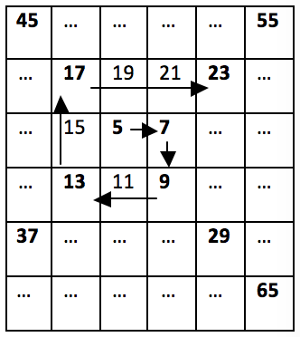

# Глава 9. Задачи за шампиони (част I)

В настоящата глава ще предложим на читателя няколко малко по-трудни задачи, които имат за цел да развият **алгоритмични умения** и **програмни техники** за решаване на задачи с по-висока сложност. Задачите са върху изучавания в книгата учебен материал, но по трудност надвишават обичайните задачи от приемните изпити в СофтУни. Ако искате да сте шампиони по основи на програмирането, ви препоръчваме да се научите да решавате подобни по-сложни задачи, за да ви е лесно на изпитите.

## Задачи от стар формат на приемния изпит

### Задача: пресичащи се редици

Имаме две редици: __редица на Трибоначи__, където всяко число е **сумата от предните три**, и __числовата спирала__, дефинирана чрез обхождане на матрица от числа като спирала (дясно, долу, ляво, горе, дясно, долу, ляво, горе и т.н.) и записване на текущите числа всеки път, когато направим завой. Намерете първото число, което се появява и в двете последователности.

#### Пример



Нека редицата на Трибоначи да започне с 1, 2 и 3. Това означава, че ще съдържа числата 1, 2, 3, 6, 11, 20, 37, 68, 125, 230, 423, 778, 1431, 2632, 4841, 8904, 16377, 30122, 55403, 101902 и т.н.

Също така, нека числата в спиралата да започнат с 5 и спиралата да се увеличава с 2 на всяка стъпка, тогава ще съдържа числата 5, 7, 9, 13, 17, 23, 29, 37 и т.н. След като 37 е първото число, което се среща в редицата на Трибоначи и в спиралата, това е отговорът.

#### Входни данни

Входните данни трябва да бъдат прочетени от конзолата.
* На първите три реда от входа, ще прочетете __три цели числа__, представляващи **първите три числа** в редицата на Трибоначи.
* На следващите два реда от входа, ще прочетете __две цели числа__, представляващи **първото число** и **стъпката** за всяка клетка на матрицата за спиралата от числа.

Входните данни винаги ще бъдат валидни и винаги ще са в описания формат. Няма нужда да ги проверявате.

#### Изходни данни

Резултатът трябва да бъде принтиран на конзолата.

На единствения ред от изхода трябва да принтирате __най-малкото число, което се среща и в двете последователности__. Ако няма число в __диапазона__ [**1...1 000 000**], което да се среща и в двете последователности, принтирайте "__No__".

#### Ограничения

* Всички числа във входа ще бъдат в диапазона [**1...1 000 000**].
* Позволено работно време за програмата: 0.25 секунди.
* Позволена памет: 16 MB.

#### Примерен вход и изход

| Вход | Изход  | Вход | Изход | Вход | Изход |
| ------ | -------- | ------ | ------------ | ------ | -------- |
|1<br>2<br>3<br>5<br>2<br>|37|13<br>25<br>99<br>5<br>2|13|99<br>99<br>99<br>2<br>2|No|


| Вход | Изход  | Вход | Изход      |
| ------ | ------- | ------ | ------------ |
|1<br>1<br>1<br>1<br>1|1|4<br>1<br>7<br>23<br>3|71|


#### Насоки и подсказки

##### Обработване на входа

Първата стъпка от решаването на задачата е да прочетем и обработим входа. Входните данни се състоят от __5 цели числа__: __3__ за редицата на Трибоначи и __2__ за числовата спирала.


След като имаме входните данни, трябва да помислим как ще генерираме числата в двете редици.

##### Генериране на редица на Трибоначи

За редицата на Трибоначи всеки път ще **събираме предишните три стойности** и след това ще отместваме стойностите на тези числа (трите предходни) с една позиция напред в редицата, т.е. стойността на първото трябва да приеме стойността на второто и т.н.


##### Генериране на числова спирала

Трябва да измислим **зависимост** между числата в числовата спирала, за да можем лесно да генерираме всяко следващо число, без да се налага да разглеждаме матрици и тяхното обхождане. Ако разгледаме внимателно картинката от условието, можем да забележим, че __на всеки 2 "завоя" в спиралата числата, които прескачаме, се увеличават с 1__, т.е. от 5 до 7 и от 7 до 9 не се прескача нито 1 число, а директно **събираме със стъпката** на редицата. От 9 до 13 и от 13 до 17 прескачаме едно число, т.е. събираме два пъти стъпката. От 17 до 23 и от 23 до 29 прескачаме две числа, т.е. събираме три пъти стъпката и т.н.

Така виждаме, че при първите две имаме **`последното числото + 1 \* стъпката`**, при следващите две събираме с **`2 \* стъпката`** и т.н.
Всеки път, когато искаме да стигнем до следващото число от спиралата, ще трябва да извършваме такива изчисления.


Това, за което трябва да се погрижим, е **на всеки две числа нашият множител** (нека го наречем "коефициент") **да се увеличава с 1**, което може да се постигне с проста проверка, като тази по-долу:


##### Намиране на общо число за двете редици

След като знаем как да генерираме числа и в двете редици, можем да пристъпим към обединението им и изграждането на крайното решение. Как ще изглежда то - на __всяка стъпка__ ще проверяваме дали __числата от двете редици съвпадат__. Ако това е така, ще принтираме на конзолата числото и ще прекратим изпълнението на нашата програма. В противен случай ще видим текущото число на __коя редица е по-малко и ще генерираме следващото, там където "изоставаме"__. Идеята е, че **ще генерираме числа от редицата, която е "по-назад"**, докато не прескочим текущото число на другата редица и след това обратното, а ако междувременно намерим съвпадение, да прекратим изпълнението.

По условие имаме ограничението, че числата от редиците ще бъдат в __диапазона от 1 до 1 000 000__. Следователно, ще генерираме числа само в този диапазон. Структурата на нашето решение ще изглежда така:


Преди показания **`while`** цикъл ще трябва да инициализираме променливите **`spiralIncrement`**, **`spiralStepMul`**, **`spiralCurrent`** и **`tribonacciCurrent`**. __Много внимавайте__ с подбора на начална стойност за **`tribonacciCurrent`**, защото това може да доведе до пропускане на стойности и липса на точки в Judge системата. След като цялото решение е готово, опитайте с различни начални стойности и се опитайте да си обясните от къде идват разликите в точките.

Решението към момента би трябвало да ни дава точки, но със сигурност не и 100. Какво пропускаме? Пропускаме факта, че още в началото **началното число на спиралата може да бъде равно на някое от трите начални числа от редицата на Трибоначи**.


##### Финални щрихи

Последното нещо, което все още не сме обработили, е случаят, в който няма **нито едно намерено число, което да съвпада**. След изпълнението на нашия **`while` цикъл**, трябва да добавим **`Console.WriteLine("No");`**. Обърнете внимание, че __когато принтираме при намиране на съвпадащи числа, е важно да прекратим изпълнението на цялата програма__, а не само на нашия цикъл, защото може да получим извеждане на **`No`** всеки път, а не само когато няма принтирано число.

#### Тестване в Judge системата

Тествайте решението си тук: [https://judge.softuni.bg/Contests/Practice/Index/518#0](https://judge.softuni.bg/Contests/Practice/Index/518#0)

### Задача: магически дати

Да приемем, че ни е зададена __дата__ във формат "**дд-мм-гггг**", напр. 17-03-2007. Изчисляваме __теглото на тази дата__, като вземем всичките ѝ цифри, умножим всяка цифра с останалите и накрая съберем всички получени резултати. В нашия случай имаме 8 цифри: **17032007**, така че теглото е  1\*7 + 1\*0 + 1\*3 + 1\*2 + 1\*0 + 1\*0 + 1\*7 + 7\*0 + 7\*3 + 7\*2 + 7\*0 + 7\*0 + 7\*7 + 0\*3 + 0\*2 + 0\*0 + 0\*0 + 0\*7 + 3\*2 + 3\*0 + 3\*0 + 3\*7 + 2\*0 + 2\*0 + 2\*7 + 0\*0 + 0\*7 + 0\*7 = 144.

Нашата задача е да напишем програма, която намира всички __магически дати - дати между две определени години, отговарящи на дадено магическо тегло__. Датите трябва да бъдат принтирани в нарастващ ред във формат "**дд-мм-гггг**". Ще използваме традиционен календар (годините имат 12 месеца, всеки месец има 28, 29, 30 или 31 дни).

#### Входни данни

Входните данни трябва да бъдат прочетени от конзолата. Състоят се от 3 реда:

*	Първият ред съдържа цяло число: __начална година__.
*	Вторият ред съдържа цяло число: __крайна година__.
*	Третият ред съдържа цяло число: __магическо тегло__.

Входните данни винаги ще бъдат валидни и винаги ще са в описания формат. Няма нужда да ги проверяваме.

#### Изходни данни

Резултатът трябва да бъде принтиран на конзолата, като последователни дати във __формат "дд-мм-гггг"__, подредени по азбучен ред. Всеки низ трябва да е на отделен ред. В случай, че няма съществуващи магически дати, принтираме "__No__".

#### Ограничения

* Началната и крайната година са цели числа в периода [**1900-2100**].
* Магическото тегло е цяло число в диапазона [**1...1000**].
* Позволено работно време за програмата: 0.25 секунди.
* Позволена памет: 16 MB.


#### Примерен вход и изход

| Вход | Изход      | Вход | Изход      |
|------|------------|------|------------|
|2007<br>2007<br>144|17-03-2007<br>13-07-2007<br>31-07-2007|2003<br>2004<br>1500<br>|No|

| Вход | Изход      | Вход | Изход      |
|------|------------|------|------------|
|2012<br>2014<br>80|09-01-2013<br>17-01-2013<br>23-03-2013<br>11-07-2013<br>01-09-2013<br>10-09-2013<br>09-10-2013<br>17-10-2013<br>07-11-2013<br>24-11-2013<br>14-12-2013<br>23-11-2014<br>13-12-2014<br>31-12-2014|2011<br>2012<br>14<br>|01-01-2011<br>10-01-2011<br>01-10-2011<br>10-10-2011|

#### Насоки и подсказки

Започваме от входните данни. В случая имаме __3 цели числа__, които трябва да се прочетат от конзолата, като с това се изчерпва въвеждането и обработването на входа за задачата.

Разполагайки с началната и крайната година, е хубаво да разберем как ще минем през всяка дата, без да се объркваме от това колко дена има в месеца и дали е високосна година и т.н.

##### Обхождане на всички дати

За обхождането ще се възползваме от функционалността, която ни дава **`DateTime`** класът. Ще си дефинираме **променлива за началната дата**, което можем да направим, използвайки конструктора, който приема година, месец и ден. Знаем, че годината е началната година, която сме прочели от конзолата, а месеца и деня трябва да са съответно януари и 1-ви.


След като имаме началната дата, искаме да направим **цикъл, който се изпълнява, докато не превишим крайната година** (или докато не преминем 31 декември в крайната година, ако сравняваме целите дати), като на всяка стъпка увеличава с по 1 ден.

За да увеличаваме с 1 ден при всяко завъртане, ще използваме метода от **`DateTime` - `AddDays(...)`**, __който добавя брой дни към текущата дата и връща новополучената__. (***Note:*** тъй като методът връща "новата" дата, е важно да имаме присвояване на резултата, а не само извикване на метода). Методът ще се грижи вместо нас кога трябва да прескочи в следващия месец, колко дни има даден месец и всичко останало.

В крайна сметка нашият цикъл може да изглежда по следния начин:


***Note***: Може да постигнем същия резултат с **`for` цикъл**, инициализацията на датата отива в първата част на **`for`**, условието се запазва, а стъпката е увеличаването с 1 ден. Също така условието може да се замени като се направи **променлива за крайната дата**, т.е. 31 декември в крайната година и да се сравняват директно двете дати.

##### Пресмятане на теглото

Всяка дата се състои от точно __8 символа(цифри)__ - **2 за деня**, **2 за месеца** и **4 за годината**. Това означава, че всеки път ще имаме едно и също пресмятане и може да се възползваме от това, за **да дефинираме формулата статично** (т.е. да не обикаляме с цикли, реферирайки различни цифри от датата, а да изпишем цялата формула). За да успеем да я изпишем, ще ни трябват **всички цифри от датата** в отделни променливи, за да направим всички нужни умножения. Използвайки операциите деление и взимане на остатък върху отделните компоненти на датата, а именно **`Day`**, **`Month`** и **`Year`**, можем да извлечем всяка цифра.


Остава да направим изчислението, което ще ни даде магическото тегло на дадена дата. За да __не изписваме всички умножения__, както е показано в примера, ще приложим просто групиране. Това, което трябва да направим, е да умножим всяка цифра с тези, които са след нея. Вместо да изписваме **`d1 * d2 + d1 * d3 ... + d1 * d8`**, може да съкратим този израз до **`d1 * (d2 + d3 ... + d8)`**, следвайки математическите правила за групиране, когато имаме умножение и събиране. Прилагайки същото опростяване за останалите умножения, получаваме следната формула:


##### Изход

След като имаме пресметнато теглото на дадена дата, трябва **да проверим дали съвпада с търсеното от нас магическо тегло**, за да знаем, дали трябва да се принтира или не. Проверката може да се направи със стандартен **`if`** блок, като трябва да се внимава при принтирането датата да е в правилния формат. Тук може да имаме два подхода:

Първият начин е да използваме метода **`ToString(...)`**, на който можем да **подадем формат на датата**, т.е. дали дните да се изписват с водеща нула или не, дали месеците да се изписват с водещи нули или не, с думи или с цифри, с кратък запис или с пълно име и т.н.


Вторият вариант е да вземем отделните компоненти на датата **`Day`**, **`Month`** и **`Year`**, както направихме при пресмятането, и да си оформим изхода чрез **форматиращ стринг**.


__Note:__ Тъй като обхождаме датите от началната година към крайната, те винаги ще бъдат подредени във възходящ ред.

##### Финални щрихи

Остава едно условие, за да може задачата да е напълно завършена. Ако няма нито една дата, която да е с подаденото тегло, трябва да принтираме **`No`**. За целта ще добавим един флаг (променлива от булев тип) **`printed`**, на който ще дадем стойност **`true`**, когато влезем в условието за принтиране и начална стойност **`false`**.
В края на задача ще добавим следното условие, за да принтираме **`No`** при нужда.


#### Тестване в Judge системата

Тествайте решението си тук: [https://judge.softuni.bg/Contests/Practice/Index/518#1](https://judge.softuni.bg/Contests/Practice/Index/518#1)

### Задача: пет специални букви

Дадени са две числа: __начало__ и __край__. Напишете програма, която __генерира всички комбинации от 5 букви__, всяка от групата {'a', 'b', 'c', 'd', 'e'}, така че теглото на тези 5 букви да е число в интервала [начало...край] включително. Принтирайте ги по азбучен ред, на един ред, разделени с интервал.

__Теглото на една буква__ е изчислено по следния начин: weight('__а__') = __5__; weight('__b__') = __-12__; weight('__c__') = __47__; weight('__d__') = __7__; weight('__e__') = __-32__. __Теглото на редицата__ от букви c1c2…cn е изчислено, като се премахват всички букви, които се повтарят (от дясно наляво), и след това се изчисли формулата:

```csharp 
weight(c1c2…cn) = 1 * weight(c1) + 2 * weight(c2) + … + n * weight(cn)
```

**Например**, теглото на "**bcddc**" се изчислява по следния начин: 

Първо **премахваме повтарящите се букви** и получаваме "**bcd**". След това прилагаме формулата: **1 \* weight('b') + 2 \* weight('c') + 3 \* weight('d') = 1 \* (-12) + 2 \* 47 + 3 \* 7 = 103**.

**Друг пример**: **weight("cadea") = weight("cade") = 1 \* 47 + 2 \* 5 + 3 \* 7 - 4 \* 32 = -50**.

#### Входни данни

Входните данни трябва да бъдат прочетени от конзолата. Състоят се от два реда:
* Числото за __начало__ е на първия ред.
* Числото за __край__ е на втория ред.

Входните данни винаги ще бъдат валидни и винаги ще са в описания формат. Няма нужда да ги проверявате.

#### Изходни данни

Резултатът трябва да бъде принтиран на конзолата като поредица от низове, __подредени по азбучен ред__. Всеки низ трябва да бъде отделен от следващия с едно разстояние. Ако теглото на нито един от 5 буквените низове не съществува в зададения интервал, принтирайте "__No__".

#### Ограничения

* Числата за __начало__ и __край__ да бъдат цели числа в диапазона [**-10000...10000**].
* Позволено работно време за програмата: 0.25 секунди.
* Позволена памет: 16 MB.

#### Примерен вход и изход

| Вход | Изход       | Коментар             |
| ------ | ------------- | ---------------------- |
|40<br>42|bcead bdcea |weight("bcead") = 41<br>weight("bdcea") = 40|

| Вход | Изход         |
| ------ |---------------|
|-1<br>1| bcdea cebda eaaad eaada eaadd eaade eaaed eadaa eadad eadae eadda eaddd eadde eadea eaded eadee eaead eaeda eaedd eaede eaeed eeaad eeada eeadd eeade eeaed eeead|

| Вход | Изход      |
| ------ |------------|
|200<br>300|baadc babdc badac badbc badca badcb badcc badcd baddc bbadc bbdac bdaac bdabc bdaca bdacb bdacc bdacd bdadc bdbac bddac beadc bedac eabdc ebadc ebdac edbac|

| Вход | Изход  |
| ------ | -------- |
|300<br>400| No|

#### Насоки и подсказки

Като всяка задача, започваме решението с **прочитане и обработване на входните данни**. В случая имаме __две цели числа__, които можем да обработим с комбинация от методите **`int.Parse(...)`** и **`Console.ReadLine()`**. Приемайки, че имаме двете цели числа в нашето приложение, можем да продължим нататък.

В задачата имаме няколко основни момента - **генерирането на всички комбинации** с дължина 5 включващи 5-те дадени букви, **премахването на повтарящите се букви** и **пресмятането на теглото** за дадена вече опростена дума.

##### Генериране на всички комбинации

Преди да стигнем до генериране на стрингове с дължина, ще разгледаме малко по-прости примери.
За да генерираме __всички комбинации с дължина 1__ използвайки 5 символа, бихме използвали __1 цикъл от 1..5__, като всяко число от цикъла ще искаме да отговаря на един символ. За да генерираме __всички комбинации с дължина 2__ използвайки 5 символа (т.е. "aa", "ab", "ac",..,"ba",..), бихме направили __два вложени цикъла, всеки обхождащ цифрите от 1 до 5__, като отново ще направим, така че всяка цифра да отговаря на конкретен символ. По същия начин бихме продължили да добавяме цикли за всяка единица дължина, която добавяме (ако имаме съмнения как ще се обходят всички комбинации, нека тестваме с дължина 1 и 2, принтирайки само индексите, за да видим какъв е резултата).


Имайки всички 5-цифрени комбинации, трябва да намерим начин да "превърнем" петте цифри в дума с буквите от '**a**' до '**e**'. Един от начините да го направим е, като си **предефинираме прост стринг съдържащ буквите**, които имаме:


и __за всяка цифра взимаме буквата от конкретната позиция__. По този начин числото __00000__ ще стане __"aaaaa"__, числото __02423__ ще стане __"acecd"__. Можем да направим стринга от 5 букви по следния начин:


**_Note_**: Можем да преобразуваме цифрите до букви, използвайки това, че буквите са подредени в **ASCII таблицата**. Изразът **`'а' + i`** ще ни даде резултата '**a**', ако **`i`** е равно на 0, '**c**', ако **`i`** е равно на 2 и т.н.

Така имаме всички 5-буквени комбинации и можем да продължим със следващата част от задачата!

__*Note*:__ Тъй като сме подбрали **`pattern`** и циклите по подходящ начин, обикаляме думите в азбучен ред и няма нужда от допълнително сортиране преди извеждане.

##### Премахването на повтарящи се букви

След като имаме вече готовия стринг, трябва да премахнем всички повтарящи се символи от дясно наляво. Ще направим тази операция, като __добавяме буквите от ляво надясно в нов стринг и всеки път преди да добавим буква ще проверяваме дали вече я има__ - ако я има ще я пропускаме, а ако я няма ще я добавяме.
За начало ще добавим първата буква към началния стринг.


След това ще обиколим останалите 4 с цикъл, проверявайки всеки път дали ги има със следното условие и метода **`IndexOf(...)`**.


Методът **`IndexOf(...)`** връща __индексa на конкретния елемент, ако бъде намерен или **`-1`**, ако елементa не бъде намерен__. Следователно всеки път, когато получим **`-1`**, ще означава, че все още нямаме тази буква в новия стринг с уникални букви и можем да я добавим, а ако получим стойност различна от **`-1`**, ще означава, че вече имаме буквата и няма да я добавяме.

##### Пресмятане на теглото

Пресмятането на теглото е просто __обхождане на уникална дума__, получена в миналата стъпка, като за всяка буква трябва да вземем теглото ѝ и да я умножим по позицията. За всяка буква в обхождането трябва да пресметнем с каква стойност ще умножим позицията ѝ. Най-лесно това би станало чрез използването на **`switch`**.


След като имаме стойността на дадената буква, следва да я **умножим по позицията ѝ**. Тъй като индексите в стринга се различават с 1 от реалните позиции, т.е. индекс 0 е позиция 1, индекс 1 е позиция 2 и т.н., ще добавим 1 към индексите.


Всички получени междинни резултати трябва да бъдат добавени към __обща сума за всяка една 5-буквена комбинация__.

##### Оформяне на изхода

Дали дадена дума трябва да се принтира се определя по нейната тежест. Трябва ни условие, което да определи дали __текущата тежест е в интервала__ [**начало..край**], подаден ни на входа в началото на програмата. Ако това е така, принтираме __пълната__ дума (__внимавайте__ да не принтирате думата от уникални букви. Тя ни бе необходима само за пресмятане на тежестта!). Думите са __разделени с интервал__, затова внимавайте при изписването на конзолата да използвате **`Write(...)`** метода вместо **`WriteLine(...)`**.


##### Финални щрихи

Условието е изпълнено __с изключение случаите, в които нямаме нито една дума в подадения интервал__. За да разберем дали сме принтирали,  ще добавим един флаг (променлива от булев тип) **`printed`**, на който ще дадем стойност **`true`**, когато влезем в условието за принтиране и начална стойност **`false`**.
За да бъде изпълнена цялата задача, трябва да добавим следното условие на края на нашата задача:


#### Тестване в Judge системата

Тествайте решението си тук: [https://judge.softuni.bg/Contests/Practice/Index/518#2](https://judge.softuni.bg/Contests/Practice/Index/518#2)
