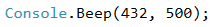
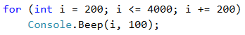
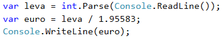

# Глава 1. Първи стъпки в програмирането

В тази глава ще разберем какво е програмирането в неговата същина. Ще се запознаем с програмните езици и ще разберем какво представляват, а също така ще разгледаме средите за разработка на софтуер и как да работим с тях - в частност с Visual Studio. Предстои да направим първата си програма на програмния език C#, а след това ще се упражним с няколко задачи - да създадем конзолна и графична програма и уеб приложение. Ще се научим как да проверяваме кода си в Judge системата (по-нататък ще разгледаме какво представлява тя по-подробно) и накрая ще видим какви са типичните грешки, които не трябва да допускаме при писането на код.


## Видео

<div class="video-player">
  Гледайте видеоурок по тази глава тук: <a target="_blank"
  href="https://www.youtube.com/watch?v=LgT10WCBw0M">
  https://www.youtube.com/watch?v=LgT10WCBw0M</a>.
</div>
<script src="/assets/js/video.js"></script>

## Какво означава "да програмираме"?

За да разберем какво означава да програмираме, първо трябва да разберем какво представлява компютърната програма. Това е **поредица от команди**, подредени една след друга в определен ред. Командите се въвеждат чрез използването на даден програмен език (например C#, Java, JavaScript, Python, PHP, C, C++). За да стане това, трябва да бъдем запознати със **синтаксиса и семантиката на езика**, с който ще работим. Също така ни е необходима и **среда за разработка** (например Visual Studio), за да може кодът ни да бъде интерпретиран правилно.

Редно е да изясним какво точно представляват средите за разработка, компилаторите и дори самите програмни езици. <br/>
Езикът за програмиране е **изкуствен език**, предназначен за **задаване на команди**, които искаме компютърът да прочете и обработи. Чрез тях можем да създаваме програми, които да **контролират поведението на технологичния апарат**. <br/>
**Компилаторът превежда кода** от програмен език, като за всяка от конструкциите избира подходящ, предварително подготвен фрагмент на машинен език. Заедно тези фрагменти съставят програмата. Междувременно **текстът бива проверяван за грешки**. След това всичко се компилира и програмата се изпълнява. <br/>
Средата за програмиране (**Integrated Development Environment - IDE**, интегрирана среда) е съвкупност от традиционни инструменти за разработване на всяка от функциите по създаване на едно приложение. В нея обикновено са включени **езикът за програмиране**, **компилатор**, **редактор**, **изпълнителна система**, **система за поддържане на библиотеки**, както и други полезни добавки. Средите за програмиране са удобни за използване, защото съдържат всичко необходимо за обработването на програмата, без да се напуска средата на редактора. Има среди, в които са организирани две или повече системи за програмиране (например Visual Studio), всяка от които е свързана с различен програмен език. <br/>

Програмата в своята същност е **набор от инструкции**, които карат компютъра да свърши определена задача. Те се въвеждат от програмиста и се **изпълняват безусловно от машината**.

Съществуват различни видове езици за програмираме. С една част от тях могат да бъдат написани **самите инструкции**, които **управляват процесора**, или инструкции, които **управляват RAM паметта** на компютъра. Пример за такъв език е "**Assembler**". С друга част могат да бъдат създадени операционна система, драйвер за видеокарта и т.н. 
Самият софтуер, който използваме ежедневно, като музикален плеър, видеоплеър, GPS програма и т.н., се пише на езици като C#, Java, Python, C, C++, HTML5 и др. 

За да може да се пише на HTML (език, с който могат да се създават и обработват уеб сайтове), ни трябва единствено текстов редактор. В него се въвеждат самите инструкции, които впоследствие браузърът разбира и "рендира" (изобразява). При други езици като **C#** или **Java**, освен текстов редактор, са нужни и други инструменти за създаването на програми.

C# е език, който е компилируем, което означава, че пишем самите инструкции. Именно тези инструкции, чрез помощна програма, се преобразуват във файл, който е изпълним (executable). За да пишем на език като **C#** ни трябва редактор, в който да пишем кода и **.NET Framework**. <br/>
**.NET Framework** представлява виртуална машина, аналогична на компютър. Казано по друг начин, това е съвкупност от библиотеки, класове, обекти, **CSC** - компилатор, **CLR** (Common Language Runtime) и др. <br/>
Компилаторът преобразува нашия код във разбираем за **CLR** език наречен **CIL** (Common Intermediate Language). Този език от своя страна се преобразува от **CLR** в изпълнима програма (**exe**), която нашият Windows "разбира" и може да се изпълни. <br/>

### Компютърни програми - компилация и изпълнение

Както вече споменахме, програмата е **последователност от команди**, иначе казано тя съдържа пресмятания, проверки, повторения и всякакви подобни операции, които са необходими, за постигане на желаната цел. Всичко се пише в текстов формат, а самият текст се нарича **сорс код** (source code). Той се компилира до **изпълним файл** (например Program.cs се компилира до Program.exe) или се **изпълнява директно** (например JavaScript сорс кодът се изпълнява от браузъра).

### Компютърни програми – примери

#### Пример: Програма, която свири музикалната нота "ла" (за 0.5 секунди)



#### Пример: Програма, която свири поредица от музикални ноти



#### Пример: Програма, която конвертира от левове в евро



## Как да напишем конзолна програма

### Среда за разработка

На първо място, за да програмираме ни е нужна **среда за разработка** - **Integrated Development Environment** (IDE). 
За C# използваме **Visual Studio** за операционната система Windows и **MonoDevelop** за Linux или Max OS X. За Java е подходяща **IntelliJ Idea**, за PHP - **PHP Storm** и т.н.

Започваме с инсталацията на интегрираната среда, а именно **Microsoft Visual Studio Community**. 

Линк към програмата: https://visualstudio.com/products/visual-studio-community-vs 

Може да се използват и по-стари версии на Visual Studio, но **не е препоръчително**, тъй като в тях не се съдържат някои от по-новите опции и инструменти при разработка.

Съществуват и алтернативни среди за разработка онлайн. 

Линкове:
* C# – .NET Fiddle: [https://dotnetfiddle.net/](https://dotnetfiddle.net/)
* Java: [https://www.compilejava.net/](https://www.compilejava.net/)
* JavaScript: може да се пише директно в конзолата на даден браузър

### Пример: Създаване на конзолна програма "Hello C#"

Стартираме Visual Studio.<br/>
Нов конзолен проект: [**File**] &rarr; [**New**] &rarr; [**Project**] &rarr; [**Visual C#**] &rarr; [**Windows**] &rarr; [**Console Application**]


#### Писане на програмен код

Сорс кодът на програма се пише в секцията **`Main(string[] args)`**, между отварящата и затварящата скоба "`{ }`". <br/>
Натискаме [**Enter**] след **отварящата скоба** `{` и **започваме да пишем**. Кодът на програмата се пише **отместен навътре**, като това е част от оформянето на текста, за по-голямо удобство при повторен преглед и/или дебъгване.


Пишем следния код:


#### Стартиране на програмата

За стартиране на програмата натискаме [**Ctrl + F5**].
Ако няма грешки, програмата ще се изпълни.
Резултатът ще се изпише на конзолата (в черния прозорец):


#### Тестване на програмата в Judge системата

Тестването на задачи е автоматизирано и се осъществява посредством Интернет, през сайта на Judge системата: [https://judge.softuni.bg/](https://judge.softuni.bg/). Оценяването на задачите става в реално време. Всяка задача минава поредица от тестове, като всеки успешно преминат тест дава предвидените за него точки. Тестовете, които се подават на задачите, са скрити.

Горната програма може да тествате тук: [https://judge.softuni.bg/Contests/Practice/Index/503#0](https://judge.softuni.bg/Contests/Practice/Index/503#0)

Поставяме целия код на програмата в черното поле и избираме **C# code**, както е на показано тук:


Изпращаме решението за оценяване с бутона [**Submit**]. Системата връща резултат след няколко секунди в таблицата с изпратени решения:

* Брой точки (между 0 и 100), когато предаденият код се компилира успешно
* Или съобщение за грешка по време на компилация


#### Как да се регистрирам в SoftUni Judge?

Използваме идентификацията си за softuni.bg.


## Типични грешки в C# програмите

Една от често срещаните грешки при начинаещите е писането **извън тялото** на **``Main()``** метода, защото интегрираната среда или компилаторът не би могъл правилно да разчете зададените команди в програмата.

Друга грешка е бъркането на **главни и малки букви**, а те имат значение при извикване на командите и тяхното правилно функциониране.

Липсата на **точка и запетая** (**;**) в края на командите е един от вечните проблеми на програмиста. Пропускането на този знак води до **неправилно функциониране на програмата** и **често проблемът остава незабелязан**.

Липсваща **кавичка** или **липса на отваряща или затваряща скоба** също може да се окаже проблем. Kакто и при точката и запетаята, така и тук проблемът води до **неправилно функциониране на програмата** или въобще до нейното неизпълнение. Този пропуск трудно се забелязва при по-обемен код.


## Какво научихме от тази глава?

На първо място научихме **какво е програмирането** - **задаване на команди, изписани на компютърен език**, които машината разбира и може да изпълни. 
Също така разбрахме какво е **компютърната програма** - **поредица от команди**, подредени в определен ред.
Запознахме се с **езика за програмиране C#** на базисно ниво и как **да създаваме прости приложения** с Visual Studio.
Проследихме и **подредбата на програмния код**, като например, че командите главно се задават в секцията **``static void Main(string[] args)``** между **отварящата и затварящата къдрава скоба**. Видяхме как да печатаме с **`Console.WriteLine(...)`** и как да стартираме програмата си с [**Ctrl + F5**].


## Упражнения: първи стъпки в коденето

### Задача: Конзолна програма “Expression”

Да се напише конзолна C# програма, която **пресмята** и **отпечатва** стойността на следния числен израз:

<p align="center"> (3522 + 52353) * 23 - (2336 * 501 + 23432 - 6743) * 3 </p>

Забележка: **не е разрешено да се пресметне стойността предварително** (например с Windows Calculator).

#### Насоки и подсказки

Правим **нов C# конзолен проект** с име “Expression”.	Намираме метода **``static void Main(string[] args)``** и **влизаме в неговото тяло** между `{` и `}`. След това трябва да **напишем кода**, който да изчисли горния числен израз и да отпечата на конзолата стойността му. Подаваме горния числен израз в скобите на командата **``Console.WriteLine(...)``**:


Стартираме програмата с [**Ctrl+F5**] и проверяваме дали резултатът е същия:


#### Тестване в Judge системата

Тествайте решението си тук: [https://judge.softuni.bg/Contests/Practice/Index/503#0](https://judge.softuni.bg/Contests/Practice/Index/503#1)


### Задача: Числата от 1 до 20

Да се напише C# конзолна програма, която **отпечатва числата от 1 до 20** на отделни редове на конзолата.

#### Насоки и подсказки

Създаваме **конзолно C# приложение** с име “Nums1To20“:


В **`static void Main()`** метода пишем 20 команди **``Console.WriteLine()``**, всяка на отделен ред , за да отпечатаме числата от 1 до 20.


#### Тестване в Judge системата

Тествайте решението си тук: [https://judge.softuni.bg/Contests/Practice/Index/503#2](https://judge.softuni.bg/Contests/Practice/Index/503#2)

Можем ли да напишем програмата по по-умен начин, така че да не повтаряме 20 пъти една и съща команда? Потърсете в Интернет информация за "**`for`-loop C#**".


### Задача: Триъгълник от 55 звездички

Да се напише C# конзолна програма, която **отпечатва триъгълник от 55 звездички**, разположени на 10 реда:

```
*
**
***
****
*****
******
*******
********
*********
**********
```

#### Насоки и подсказки

Създаваме **ново конзолно C# приложение** с име “TriangleOf55Stars”. В него трябва да напишем код, който печата триъгълника от звездички, например чрез 10 команди, подобни на **``Console.WriteLine("*")``**.

#### Тестване в Judge системата

Тествайте решението си тук: [https://judge.softuni.bg/Contests/Practice/Index/503#3](https://judge.softuni.bg/Contests/Practice/Index/503#3)


Опитайте да **подобрите решението**, така че да няма много повтарящи се команди. Може ли това да стане с `for`-цикъл?


### Задача: Лице на правоъгълник

Да се напише C# програма, която **прочита** от конзолата **две числа a и b**, **пресмята** и **отпечатва** лицето на правоъгълник със страни a и b. 

#### Примерен вход и изход

| a | b | area |
| --- | --- | --- |
| 2 | 7 |  14  |
| 7 | 8 |  56  |
| 12 | 5 |  60  |

#### Насоки и подсказки

Правим нова **конзолна C# програма**. За да **прочетем двете числа**, използваме  следния код:


Да се допише програмата по-горе, за да пресмята лицето на правоъгълника и да го проверява.

#### Тестване в Judge системата

Тествайте решението си тук: [https://judge.softuni.bg/Contests/Practice/Index/503#4](https://judge.softuni.bg/Contests/Practice/Index/503#4)


### \* Задача: Квадрат от звездички

Да се напише C# конзолна програма, която **прочита** от конзолата **цяло положително число N** и **отпечатва** на конзолата **квадрат от N звездички**, като в примерите по-долу.

#### Примерен вход и изход

| Вход  |    Изход   	| Вход  |    Изход   	| Вход  |    Изход   	| 
|-----|-----------|-----|-----------|-----|----------|
|  3  	|<code>\*\*\*</code><br><code>\*&nbsp;\*</code><br><code>\*\*\*</code>|  4  |<code>\*\*\*\*</code><br><code>\*&nbsp;&nbsp;\*</code><br><code>\*&nbsp;&nbsp;\*</code><br><code>\*\*\*\*</code>| 5  	|<code>\*\*\*\*\*</code><br><code>\*&nbsp;&nbsp;&nbsp;\*</code><br><code>\*&nbsp;&nbsp;&nbsp;\*</code><br><code>\*&nbsp;&nbsp;&nbsp;\*</code><br><code>\*\*\*\*\*</code>|

#### Насоки и подсказки

Правим нова **конзолна C# програма**. За да прочетем числото N (2 ≤ N ≤100), използваме следния код:


Да се допише програмата по-горе, за да отпечатва квадрат, съставен от звездички. Може да се наложи да се използват `for`-цикли. Потърсете информация в Интернет.

#### Тестване в Judge системата

Тествайте решението си тук: [https://judge.softuni.bg/Contests/Practice/Index/503#5](https://judge.softuni.bg/Contests/Practice/Index/503#5)


### Конзолни, графични и уеб приложения

При **конзолните приложения** (Console Applications), както и сами можете да се досетите, **всички операции** се **извършват през конзолата**. Там се **въвеждат входните данни**, които се прочитат от приложението, там се **отпечатват и изходните данни** след или по време на изпълнение на програмата.

Докато конзолните приложения **ползват текстовата конзола**, уеб приложенията (Web Аpplications) **използват уеб-базиран потребителски интерфейс**. За да се **постигне тяхното изпълнение** са ни необходими две неща - **уеб сървър** и **уеб браузър**. Като **браузърът** ни играе главната роля по **обработката на зададените в програмата команди**.

Графичните (GUI) приложения имат **визуален потребителски интерфейс**. Графичните приложения (настолни приложения или, иначе казано, desktop apps) **се състоят от един или повече графични прозореца**, в които се намират определени **контроли** (текстови полета, бутони, картинки, таблици и други), **служещи за улеснение** на обикновения потребител.


## Упражнения: графични и уеб приложения

Сега предстои да направим едно просто уеб и едно просто графично приложение, за да можем да надникнем в това, какво ще можем да създаваме и как ще изглежда то. Няма да разглеждаме детайлите по конструкциите из основи, а само ще хвърлим поглед върху подредбата и функционалността на създаденото от нас. След като напреднем със знанията, ще бъдем способни да правим големи и сложни софтуерни приложения и системи.


### Задача: Графично приложение „Суматор за числа“

Да се напише **графично (GUI) приложение**, което **изчислява сумата на две числа**:


При въвеждане на две числа в първите две текстови полета и натискане на бутона [**Calculate**] се изчислява тяхната сума и резултатът се показва в третото текстово поле.
За нашето приложение ще използваме **технологията Windows Forms**, която позволява създаване на **графични приложения за Windows**, в среда за разработка **Visual Studio** и с **език** за програмиране **C#**.

Във Visual Studio създаваме **нов C# проект от тип „Windows Forms Application“**:


При създаването на Windows Forms приложение ще се появи **редактор за потребителски интерфейс**, в който могат да се слагат **различни визуални елементи** (например кутийки с текст и бутони):


Изтегляме от лентата вляво (Toolbox) **три текстови полета** (`TextBox`), **два надписа** (`Label`) и **един бутон** (`Button`), след което ги подреждаме в прозореца на приложението. След това **променяме имената на всяка от контролите**. Това става от **прозорчето “Properties”** вдясно, чрез промяна на полето (`Name`):


*	Имена на текстовите полета: **`textBox1`**, **`textBox2`**, **`textBoxSum`**
* Име на бутона: **`buttonCalculate`**
*	Име на формата: **`FormCalculate`**

**Променяме заглавията** (**`Text`** свойството) на контролите:

*	buttonCalculate -> Calculate
*	label1 -> +
*	label2 -> =
*	Form1 -> Sumator


**Преоразмеряваме и подреждаме контролите**, за да изглеждат по-добре:


Опитваме да пуснем приложението с [**Ctrl+F5**]. То би трябвало да стартира, но да **не функционира напълно**, защото не сме написали какво се случва при натискане на бутона.


Сега е време да напишем кода, който **сумира числата** от първите две полета и **показва резултата** в третото поле. За целта кликваме **два пъти върху бутона [Calculate]**. Ще се появи място, в което да напишем какво да се случва при натискане на бутона:


Написваме следния C# код между отварящата и затварящата скоба `{ }`, където е курсорът:


Този код **взима първото число** от полето **`textBox1`** и го запазва **в променливата `num1`**, запазва **второто число** от полето **`textBox2`** в **променливата `num2`**, след това **сумира `num1` и `num2` в променливата ``sum``** и накрая **извежда текстовата стойност на променливата `sum`** в полето `textBoxSum`.


Стартираме отново програмата с [**Ctrl+F5**] и проверяваме дали работи коректно. Правим опит да сметнете **4 + 5**, а след това **-12.5 + 1.3**:

 

Пробваме и с **невалидни числа**, напр. “aaa” и “bbb”. Изглежда има проблем: 

 

Проблемът идва от **прехвърлянето на текстово поле в число**. Ако стойността в полето **не е число, програмата дава грешка**. Можем да поправим кода, за да коригираме този проблем:


Горният код **прихваща грешките при работа с числа** (хваща изключенията) и в случай на грешка **извежда стойност `error`** в полето с резултата. Стартираме отново програмата с [**Ctrl+F5**] и я пробваме дали работи. Този път **при грешно число резултатът е `error`** и програмата не се чупи:

 


### Уеб приложение „Суматор за числа“

Напишете уеб приложение, което **изчислява сумата на две числа**. При **въвеждане на две числа** в първите две текстови полета и натискане на бутона [**Calculate**] се **изчислява тяхната сума** и резултатът се показва в третото текстово поле. Уеб приложението би могло да изглежда по следния начин:


За разлика от конзолните приложения, които четат и пишат данните си във вид на текст на конзолата, уеб приложенията имат **уеб базиран потребителски интерфейс**. Уеб приложенията се **зареждат от някакъв Интернет адрес** (URL) чрез стандартен уеб браузър. Потребителите пишат входните данни в страница, визуализирана от уеб приложението, данните се обработват на уеб сървър и резултатите се показват отново в страницата в уеб браузъра.
За нашето уеб приложение ще използваме **технологията ASP.NET MVC**, която позволява създаване на **уеб приложения с езика за програмиране C#** в средата за разработка Visual Studio.

Във Visual Studio създаваме **нов C# проект от тип „ASP.NET Web Application“**:


Избираме **тип** на приложението - **“MVC”**:


Намираме файла **Views\Home\Index.cshtml**. В него се намира **изгледът (view) за главната страница** на нашето уеб приложението:


Изтриваме стария код от **файла Index.chtml** и пишем следния код: 


Този код **създава една уеб форма с три текстови полета и един бутон в нея**. В полетата се зареждат стойности, които се изчисляват предварително в обекта **`ViewBag`**. Указано е, че при натискане на бутона [**Calculate**] ще се извика действието **/home/calculate (действие calculate от home контролера)*.

Ето как трябва да изглежда **файлът Index.cshtml** след промяната:


Остава да се напише **действието** (action), което **сумира числата при натискане на бутона** [**Calculate**]. Отваряме файла **Controllers\HomeController.cs** и добавяме следния код в тялото на **HomeController** класа:


Този код осъществява действието “**calculate**”. То приема два параметъра **`num1`** и **`num2`** и ги записва в обекта **`ViewBag`**, след което **изчислява и записва** тяхната сума. Записаните във `ViewBag` стойности след това **се използват от изгледа**, за да се покажат в **трите текстови полета** във формата за сумиране на числа в уеб страницата от приложението.

Ето как трябва да изглежда **файлът HomeController.cs** след промяната:


Приложението е готово. Можем да го стартираме с [**Ctrl+F5**] и да тестваме дали работи:


