# Глава 2. Прости пресмятания с числа - изпитни задачи

##  Учебна зала
**Учебна зала** има правоъгълен размер **w** на **h** метра, без колони във вътрешността си. Залата е разделена на две части – лява и дясна, с коридор приблизително по средата. В лявата и в дясната част има **редици с бюра**. В задната част на залата има голяма **входна врата**. В предната част на залата има **катедра** с подиум за преподавателя. Едно **работно място** заема **70 на 120 cm** (маса с размер 70 на 40 cm + място за стол и преминаване с размер 70 на 80 cm). **Коридорът** е широк поне **100 cm**. Изчислено е, че заради **входната врата** (която е с отвор 160 cm) **се губи точно 1 работно място**, а заради **катедрата** (която е с размер 160 на 120 cm) се губят точно **2 работни места**. Напишете програма, която въвежда размери на учебната зала и изчислява **броя работни места в нея** при описаното разположение (вж. фигурата).

### Входни данни
От конзолата се четат **2 числа**, по едно на ред: **h** (дължина в метри) и **w** (широчина в метри).

Ограничения: **3 ≤ h ≤ w ≤ 100**.

### Изходни данни
Да се отпечата на конзолата едно цяло число: **броят места** в учебната зала.

### Примерен вход и изход
| **Вход**   | **Изход** | **Чертеж** | **Обяснения**                                                                                                                                                                                                                                                                                                                                                                                          |
|---------|-------|--------|----------------------------------------------------------------------------------------------------------------------------------------------------------------------------------------------------------------------------------------------------------------------------------------------------------------------------------------------------------------------------------------------------|
| 15 <br> 8.9  |  129  | 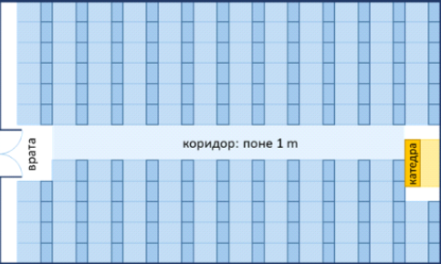       | Залата е дълга 1500 cm. В тях могат да бъдат разположени **12 реда** (12 * 120 cm = 1440 + 60 cm остатък). <br> Залата е широка 890 cm. От тях 100 cm отиват за коридора в средата. В останалите 790 cm могат да се разположат по **11 бюра на ред** (11 * 70 cm = 770 cm + 20 cm остатък). <br> **Брой места = 12 * 11 - 3** = 132 - 3 = **129** (имаме 12 реда по 11 места = 132 минус 3 места за катедра и входна врата). | 
| 8.4 <br> 5.2 | 39    | 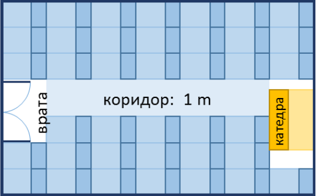       | Залата е дълга 840 cm. В тях могат да бъдат разположени **7 реда** (7 * 120 cm = 840, без остатък). <br> Залата е широка 520 cm. От тях 100 cm отиват за коридора в средата. В останалите 420 cm могат да се разположат по **6 бюра на ред** (6 * 70 cm = 420 cm, без остатък). <br> **Брой места = 7 * 6 - 3** =,42 - 3 = **39** (имаме 7 реда по 6 места = 42 минус 3 места за катедра и входна врата).|

### Насоки и подсказки
#### Идея за решение

#### Избор на типове данни

#### Решение

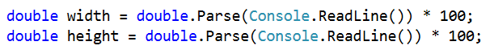


### Тестване в Judge системата
Тествайте решението си тук: https://judge.softuni.bg/Contests/Practice/Index/169#0

##  Зеленчукова борса

Градинар продава реколтата от градината си на зеленчуковата борса. Продава **зеленчуци за N лева на килограм** и **плодове за M лева за килограм**. Напишете програма, която **да пресмята приходите от реколтата в евро** (ако приемем, че **едно евро** е равно на **1.94лв**).

### Входни данни
От конзолата се четат **4 числа**, по едно на ред:
* Първи ред – Цена за килограм зеленчуци – число с плаваща запетая
* Втори ред – Цена за килограм плодове – число с плаваща запетая
* Трети ред – Общо килограми на зеленчуците – цяло число
* Четвърти ред – Общо килограми на плодовете – цяло число

**Ограничения: Всички числа ще са в интервала от 0.00 до 1000.00**

### Изходни данни
Да се отпечата на конзолата **едно число с плаваща запетая: приходите от всички плодове и зеленчуци в евро**.

### Примерен вход и изход
| **Вход**  | **Изход**            | **Обяснения**                                                                                                                                                                                                                                         |
|-------|------------------|---------------------------------------------------------------------------------------------------------------------------------------------------------------------------------------------------------------------------------------------------|
| 0.194 <br> 19.4 <br> 10 <br> 10 | 101 | Зелечуците струват – 0.194лв. * 10кг. = 1.94лв. <br> Плодовете струват – 19.4лв. * 10кг.  = 194лв. <br> Общо – 195.94лв. = 101 евро |

| **Вход**        | **Изход**            |
|-------------|------------------|
| 1.5 <br> 2.5 <br> 10 <br> 10 | 20.6185567010309 | 

### Насоки и подсказки

#### Идея за решение
Нека първо разгледаме зададеното ни условие. Както при всяка една задача по програмиране, е **важно да си изградим идея за решението ѝ преди да започнем да пишем код**. В случая от нас се иска да пресметнем колко е **общият приход** от реколтата. Той е равен на **сбора от печалбата от плодовете и зеленчуците**; тях можем да изчислим като умножим **цената на килограм по количеството им**. Входните данни са дадени в лева, а за изхода се изисква да бъде в евро. По условие едно евро е равно на 1.94 лeва, следователно за да получим исканата **изходна стойност, трябва да разделим сбора на 1.94**.

#### Избор на типове данни
След като сме изяснили идеята си за решаването на задачата, можем да пристъпим към избора на подходящи типове данни. Да разгледаме **входа**: дадени са **две цели числа** за общия брой килограми на зеленчуците и плодовете, съответно променливите, които декларираме, за да пазим техните стойности, ще бъдат от тип `int`; като цени е указано, че ще бъдат подадени **две числа с плаваща запетая**, т. е. променливите ще бъдат от тип `double`. 

Може да декларираме също две променливи, в които да пазим стойността на печалбата от плодовете и зеленчуците поотделно. Тъй като умножаваме променлива от тип `int` (общо килограми) с такава от тип `double` (цена), техният тип трябва да бъде `double`. Нека поясним това: по принцип **операторите работят с аргументи от един и същи тип**. Следователно за да извършим операция като умножение върху два различна типа данни, ни се налага да ги преобразуваме към един и същ. Когато в един израз има типове с различен обхват, преобразуването винаги се извършва към този с най-голям обхват, в този случай това е `double`. Тъй като няма опасност от загуба на данни, **преобразуването е неявно** (имплицитно) и става автоматично от компилатора.  

Като **изход** се изисква също **число с плаваща запетая**, т. е. резултатът ще пазим в променлива от тип `double`.

#### Решение 
Време е да пристъпим към решението. Мислено можем да го разделим на три подзадачи: **прочитане на входните данни**, **извършване на изчисленията** и **извеждане на изход** на конзолата. 

За да приемем входните данни декларираме променливи, като внимаваме да изберем техните имена така, че те да ни подсказват каква стойност съдържа променливата. С `Console.ReadLine()` четем стойностите от конзолата, а с `int.Parse()` и `double.Parse()` преобразуваме зададената стрингова стойност в съответно `int` и `double`.

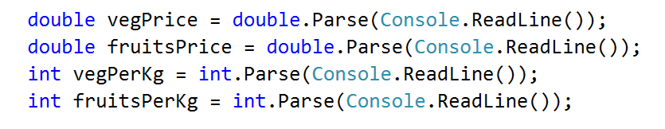

Извършваме необходимите изчисления: 

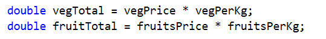

В условието на задачата не е зададено специално форматиране на изхода, следователно трябва просто да изчислим исканата стойност и да я отпечатаме на конзолата. Както в математиката, в програмирането делението има приоритет пред събирането, за задачата обаче трябва първо да сметнем сбора на двете получени стойности и след това да разделим на 1.94. За да дадем предимство на събирането, може да използваме скоби. С `Console.WriteLine()` отпечатваме изхода на конзолата. 

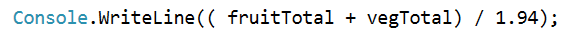

Вече сме готови със задачата и може да тестваме решението ѝ. 

### Тестване в Judge системата
Тествайте решението си тук: https://judge.softuni.bg/Contests/Practice/Index/179#0

##  Ремонт на плочки

**На площадката** пред жилищен блок трябва **да се поставят плочки**. **Площадката** е с форма **на квадрат със страна N метра**. **Плочките** са **широки „W“ метра** и **дълги „L“ метра**. На площадката има една пейка с **ширина M метра и дължина O метра**. Под нея **не е нужно** да се слагат плочки. **Всяка плочка** се поставя за **0.2 минути**.

Напишете **програма**, която **чете от конзолата размерите** на **площадката, плочките и пейката** и пресмята **колко плочки са необходими** да се покрие площадката и пресмята **времето за поставяне на всички плочки**.

**Пример: площадка с размер 20м.** има **площ 400кв.м**. **Пейка** широка **1м.** и дълга **2м.**, заема площ **2кв.м.** Една **плочка** е **широка 5м.** и **дълга 4м.** има **площ = 20кв.м.** **Площта** която трябва да се покрие е **400 – 2 = 398 кв.м.** Необходими са **398 / 20 = 19.90 плочки**. Необходимото **време** е **19.90 * 0.2 = 3.98 минути.**

### Входни данни
От конзолата се четат **5 числа**:
* **N – дължината** на **страна** от **площадката** в интервала **[1...100]**
* **W – широчината** на една **плочка** в интервала **[0.1...10.00]**
* **L – дължината** на една **плочка** в интервала **[0.1...10.00]**
* **М – широчината** на **пейката** в интервала **[0...10]**
* **О – дължината** на **пейката** в интервала **[0...10]**

### Изходни данни
Да се отпечатат на конзолата **две числа**: **броят плочки** необходим за ремонта и **времето за поставяне**, всяко на нов ред.

### Примерен вход и изход

| **Вход**  | **Изход**            | **Обяснения**                                                                                                                                                                                                                                         |
|-------|------------------|---------------------------------------------------------------------------------------------------------------------------------------------------------------------------------------------------------------------------------------------------|
| 20 <br> 5 <br> 4 <br> 1 <br> 2 | 19.9 <br> 3.98 | **Обща площ** = 20 * 20 = **400**; площ на **пейката** = 1 * 2 = **2** <br> **Площ за покриване** = 400 – 2 = **398** <br> **Площ на плочки** = 5 * 4 = **20** <br> **Необходими плочки** = 398 / 20 = **19.9** <br> **Необходимо време** = 19.9 * 0.2 = **3.98** |

| **Вход**        | **Изход**            |
|-------------|------------------|
| 40 <br> 0.8 <br> 0.6 <br> 3 <br> 5 | 3302.08333333333 <br> 660.416666666667 | 

### Насоки и подсказки
#### Идея за решение
Нека да си направим чертеж, за да поясним условието на задачата. Той може да изглежда по следния начин:

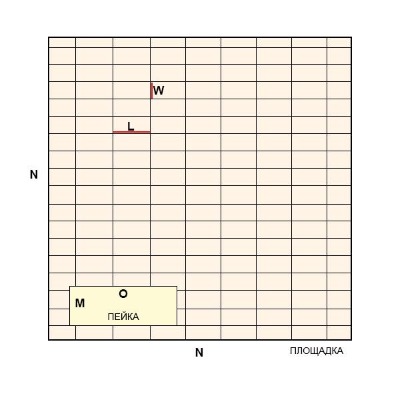

В задачата се изисква да пресметнем броя плочки, който трябва да се постави, както и времето, за което това ще се извърши. За да изчислим броя, е необходимо да сметнем **площта, която трябва да се покрие** и да я **разделим на лицето на една плочка**.  По условие площадката е квадратна, следователно общата площ ще намерим като умножим страната ѝ по себе си. 

#### Избор на типове данни

#### Решение

Първото, което трябва да направим, е да разгледаме входните данни за задачата. Важно е да внимаваме за последователността, в която са дадени, както и да преценим какъв тип данни е да използваме за всяка променлива. В случая дължината на страна от площадката, широчината и дължината на пейката са дадени като цели числа, следователно за да запазим техните стойности може да декларираме променливи от тип `int`; като широчина и дължина на плочките ще ни бъдат подадени реални числа с цяла и дробна част, затова за тях използваме `double`. С `Console.ReadLine()` четем стойностите от конзолата, а с `int.Parse()` и `double.Parse()` преобразуваме зададената стрингова стойност в съответно `int` и `double`.

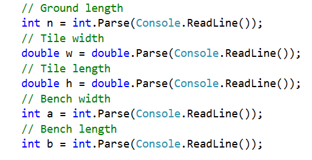

След като сме инициализирали променливите и сме запазили съответните стойности в тях, пристъпваме към изчисленията. Нека първо пресметнем лицето на площадката. По условие тя е с форма на квадрат, затова трябва да умножим страната ѝ по себе си. След това пресмятаме площта, която заема пейката, също като умножим двете ѝ страни. Като извадим площта на пейката от тази на цялата площадка, получаваме площта, която трябва да се ремонтира. Тъй като стойностите на променливите `n`, `a` и `b`, с които работим, са запазени в променливи от тип `int`, за резултатите от изчисленията може да дефинираме променливи също от този тип.  


Площта на единична плочка получаваме като умножим едната ѝ страна по другата (`w * h`). За финал изчисляваме стойностите, които трябва да отпечатаме на конзолата. Броят на необходимите плочки получаваме като разделим площта, която трябва да се покрие, на площта на единична плочка. При деление на две числа, от които едното е реално, резултатът е реално число с цяла и дробна част; за да са коректни изчисленията ни следователно запазваме резултата в променлива от тип `double`. По условие времето необходимо за една плочка е 0.2 минути; времето за поставяне на всички плочки получаваме като умножим броя на плочките по тази стойност. С `Console.WriteLine()` отпечатваме стойностите. 

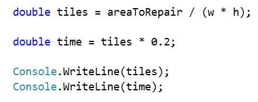

### Тестване в Judge системата
Тествайте решението си тук: https://judge.softuni.bg/Contests/Practice/Index/181#0

##  Парички

Преди време **Пешо си е купил биткойни**. Сега ще ходи на екскурзия из Европа **и ще му трябва евро**. Освен биткойни има **и китайски юани**. Пешо иска **да обмени парите си в евро** за екскурзията. Напишете програма, която **да пресмята колко евро може да купи спрямо следните валутни курсове**
* **1 биткойн = 1168 лева.**
* **1 китайски юан = 0.15 долара.**
* **1 долар = 1.76 лева.**
* **1 евро = 1.95 лева.**

Обменното бюро има **комисионна от 0 до 5 процента от крайната сума в евро**

### Входни данни
От конзолата се четат 3 числа:
* На **първия ред – броят биткойни. Цяло число в интервала [0…20]**
* На **втория ред – броят китайски юани. Реално число в интервала [0.00… 50 000.00]**
* На **третия ред – комисионната. Реално число в интервала [0.00 ... 5.00]**

### Изходни данни
На конзолата **да се отпечата 1 число - резултатът от обмяната на валутите. Не е нужно** резултатът **да се закръгля**.

### Примерен вход и изход
| **Вход**  | **Изход**            | **Обяснения**                                                                                                                                                                                                                                         |
|-------|------------------|---------------------------------------------------------------------------------------------------------------------------------------------------------------------------------------------------------------------------------------------------|
| 1 <br> 5 <br> 5 | 569.668717948718 | 1 биткойн = **1168 лева** <br> 5 юана = 0.75 долара <br> 0.75 долара = **1.32 лева** <br> **1168 + 1.32 = 1169.32 лева = 599.651282051282 евро** <br> **Комисионна:** 5% от 599.651282051282 = **29.9825641025641** <br> **Резултат**: 599.651282051282 - 29.9825641025641 = **569.668717948718 евро** |

| **Вход**        | **Изход**            | **Вход**         | **Изход**            |
|-------------|------------------|--------------|------------------|
| 20 <br> 5678 <br> 2.4 | 12442.2442010256 | 7 <br> 50200.12 <br> 3 | 10659.4701177436 |

### Насоки и подсказки
#### Идея за решение
Нека отново помислим първо за начина, по който можем да решим задачата, преди да започнем да пишем код. Виждаме, че ще ни бъдат подадени **броят биткойни и броят китайски юани**. За изходната стойност е указано да бъде в **евро**. В условието са посочени и валутните курсове, с които трябва да работим. Забелязваме, че към евро можем да преобразуваме само сума в лева, следователно трябва **първо да сметнем цялата сума, която Пешо притежава в лева** и **след това да изчислим изходната стойност**. 

Тъй като ни е дадена информация за валутния курс на биткойни срещу лева, можем директно да направим това преобразуване. От друга страна за да получим стойността на китайските юани в лева, трябва първо да ги конвертираме в долари, а след това доларите - в лева. Накрая ще съберем двете получени стойности и ще пресметнем на колко евро съответстват. 

Остава последната стъпка: да пресметнем колко ще бъде комисионната и да извадим получената сума от общата. Като комисионна ще ни бъде подадено реално число, което ще представлява определен процент от общата сума. Нека още в началото разделим подаденото число на 100, за да изчислим процентната му стойност. Нея ще умножим по сумата в евро, а резултатът ще извадим от същата тази сума. Получената сума ще отпечатаме на конзолата. 

#### Избор на типове данни
Биткойните са дадени като цяло число, следователно за тяхната стойност може да декларираме променлива от тип `int`. Като брой китайски юани и комисионна ще получим реално число, следователно за тях използваме `double`. Тъй като `double` e типът данни с по-голям обхват, а изходът също ще бъде реално число, ще използваме него също и за останалите променливи, които създаваме. 

#### Решение
След като сме си изградили идея за решението на задачата и сме избрали структурите от данни, с които ще работим, е време да пристъпим към писането на код. Както и в предните задачи, можем да разделим решението на три подзадачи: **прочитане на входните данни**, **извършване на изчисленията** и **извеждане на изход** на конзолата. 

Декларираме променливите, които ще използваме, като отново внимаваме да изберем **смислени имена**, които подсказват какво съдържат те. Инициализираме техните стойности: с `Console.ReadLine()` четем подадените числа на конзолата и парсваме въведения от потребителя стринг към `int` и `double`. 

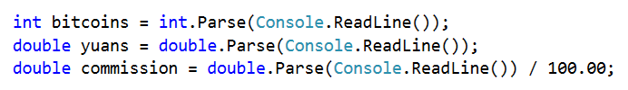

Извършваме необходимите изчисления: 

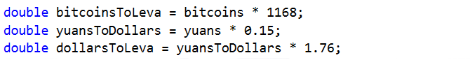

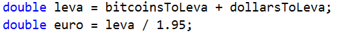

Накрая пресмятаме стойността на комисионната и я изваждаме от сумата в евро. Нека обърнем внимание на начина, по който можем да изпишем това: `euro -= commission * euro` e съкратен начин за изписване на  `euro = euro - (commission * euro);`. В случая използваме **комбиниран оператор за присвояване** `-=`, който изважда стойността от операнда вдясно от този вляво. Операторът за умножение `*` има по-висок приоритет от комбинирания оператор, затова изразът `commission * euro` се изпълнява първи, след което неговата стойност се изважда. (Светлин Наков, Веселин Колев и колектив: "Въведение в програмирането със C#", стр. 150; повече за операторите може да прочетете [тук](http://www.introprogramming.info/intro-csharp-book/read-online/glava3-operatori-i-izrazi/#_Toc298863965))

В условието на задачата не е зададено специално форматиране или закръгляне на резултата, следователно трябва просто да изчислим изхода и да го отпечатаме на конзолата. 

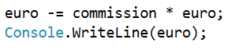

Разписано по този начин, решението на задачата е доста подробно. Тъй като условието като цяло не е сложно, бихме могли на теория да напишем един голям израз, в който директно след получаване на входните данни да сметнем изходната стойност; такъв израз би изглеждал например ето така: 

```cs
double euro = (bitcoins * 1168 + yuans * 0.15 * 1.76) / 1.95 - ((bitcoins * 1168 + yuans * 0.15 * 1.76) / 1.95 * commission);
```

Този код би дал правилен резултат, **но се чете трудно**. Няма да ни е лесно да разберем какво прави и дали съдържа грешки, както и как да поправим някоя такава. По-добра практика е **вместо един сложен израз да напишем няколко прости** и да запишем резултатите от тях в променливи със подходящи имена. Така кодът е ясен и по-лесно променяем. 

Вече сме готови със задачата и може да тестваме решението ѝ. 

### Тестване в Judge системата
Тествайте решението си тук: https://judge.softuni.bg/Contests/Practice/Index/233

##  Дневна печалба

Иван е програмист в **американска компания** и **работи** от вкъщи **средно N дни в месеца** като изкарва **средно по M долара на ден**. В края на годината Иван **получава бонус**, който е **равен на 2.5 месечни заплати. От спечеленото през годината му се удържат 25% данъци**. Напишете програма, която да **пресмята, колко е чистата средна печалба на Иван на ден в лева**, тъй като той харчи изкараното в България. Приема се, че **в годината има точно 365 дни. Курсът на долара** спрямо лева ще **се чете от конзолата**.

### Входни данни
От конзолата се четат **3 числа**: 
* На **първия ред – работни дни в месеца. Цяло число в интервала [5…30]**
* На **втория ред – изкарани пари на ден. Реално число в интервала [10.00… 2000.00]**
* На **третия ред – курсът на долара спрямо  лева /1 долар = X лева/. Реално число в интервала [0.99… 1.99]**

### Изходни данни
На конзолата **да се отпечата 1 число – средната печалба на ден в лева**. Резултатът да се **ФОРМАТИРА до втория знак след запетаята**.

### Примерен вход и изход
| **Вход**  | **Изход**            | **Обяснения**                                                                                                                                                                                                                                         |
|-------|------------------|---------------------------------------------------------------------------------------------------------------------------------------------------------------------------------------------------------------------------------------------------|
| 21 <br> 75.00 <br> 1.59 | 74.61 | **1 месечна заплата** 21 * 75 = **75 долара** <br> **Годишен доход** = 1575*12 + 1575*2.5 = **22837.5 долара** <br> **Данък** = 25% от 22837.5 = **5709.375** <br> **Чист годишен доход** = 17128.125 долара = **27233.71875 лв** <br> **Средна печалба на ден** = 27233.71875 / 365 = **74.61 лева** |

| **Вход**        | **Изход**            | **Вход**         | **Изход**            |
|-------------|------------------|--------------|------------------|
| 15 <br> 105 <br> 1.71 | 80.24 | 22 <br> 199.99 <br> 1.50 | 196.63 |

### Насоки и подсказки
#### Идея за решение
Нека първо сметнем **колко е месечната заплата** на Иван. Това ще направим като умножим работните дни в месеца по парите, които той печели на ден. Умножаваме получения резултат първо по 12, за да изчислим колко е заплатата му за 12 месеца, а след това и по 2.5, за да пресметнем бонуса. Като съберем двете получени стойности ще изчислим **общия му годишен доход**. От него **трябва да извадим 25%**. Това може да направим като умножим общия доход по 0.25 и извадим резултата от него. Спрямо дадения ни курс **преобразуваме доларите в лева**, след което **разделяме резултата на дните в годината**, за които приемаме че са 365.     

#### Избор на типове данни
Работните дни за месец са дадени като **цяло число**, следователно за тяхната стойност може да декларираме променлива от тип `int`. За изкараните пари, както и за курса на долара спрямо лева ще получим **реално число**, следователно за тях използваме `double`. Тъй като `double` e типът данни с по-голям обхват, а за изходната стойност също се изисква реално число с цяла и дробна част, ще използваме него и за останалите променливи, които създаваме. 

#### Решение
Отново: след като имаме идея как да решим задачата и сме помислили за типовете данни, с които ще работим, пристъпваме към писането на програмата. Както и в предните задачи, можем да разделим решението на три подзадачи: **прочитане на входните данни**, **извършване на изчисленията** и **извеждане на изход** на конзолата. 

Декларираме променливите, които ще използваме, като отново се стараем да изберем подходящи имена. С `Console.ReadLine()` четем подадените числа на конзолата и преобразуваме въведения от потребителя стринг към `int` и `double` с `int.Parse()` и `double.Parse()`. 


Извършваме изчисленията: 

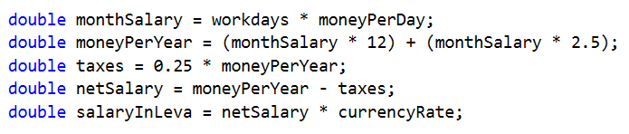

По принцип бихме могли да напишем израза, с който пресмятаме общия годишен доход и без скоби; тъй като умножението е операция с по-висок приоритет от събирането, то ще се извърши първо. Въпреки това **писането на скоби се препоръчва, когато използваме повече оператори**, тъй като така кодът става **по-лесно четим** и възможността да се допусне грешка е по-малка. 

Накрая остава да изведем резултата на конзолата. Забелязваме, че се **изисква форматиране на числената стойност до втория знак след десетичната запетая**. За целта може да използваме **placeholder, т. е. място, което ще бъде заместено с конкретна стойност при отпечатването**. В C# за placeholder се ползва цифра, оградена с къдрави скоби. Тъй като **в програмирането броенето започва от 0**, изразът `{0}` означава, че на негово място, ще бъде поставен първият подаден аргумент. Цяло или дробно число можем да форматираме със спецификаторите **F** или **f**. След него следва цяло положително число, което указва броя на знаците след десетичната запетая:  

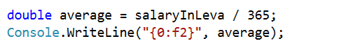

Готови сме и с тази задача. Да тестваме решението ѝ. 

### Тестване в Judge системата
Тествайте решението си тук: https://judge.softuni.bg/Contests/Practice/Index/274#0

## Общи насоки

По условие първата задача от изпита ще изисква от нас само извършването на прости аримтетични действия, т. е. не е нужно да ползваме условни конструкции и да правим проверки: входните данни ще бъдат такива, каквито са описани в условието и е излишно да правим проверка за тях
