# Глава 3. Прости проверки

В настоящата глава ще разгледаме **условните конструкции в езика C#**, чрез които нашата програма може да има различно действие, в зависимост от дадено условие. Ще обясним синтаксиса на условните оператори за проверки (**`if`** и **`if-else`**) с подходящи примери и ще видим в какъв диапазон живее една променлива (нейният **`scope`**). Накрая ще разгледаме техники за **дебъгване**, чрез които лесно да проследяваме пътя, който извървява нашата програма по време на своето изпълнение.

## Видео

<div class="video-player">
  Гледайте видео-урок по тази глава тук: <a target="_blank" href="https://www.youtube.com/watch?v=uwW_ueaOt7M">https://www.youtube.com/watch?v=uwW_ueaOt7M</a>.
</div>
<script src="/assets/js/video.js"></script>

## Сравняване на числа

В програмирането можем да сравняваме стойности чрез следните **оператори**:

*	Оператор **`<`** (по-малко).

*	Оператор **`>`** (по-голямо).

*	Оператор **`<=`** (по-малко или равно).

*	Оператор **`>=`** (по-голямо или равно).

*	Оператор **`==`** (равно).

При сравнение резултатът е булева стойност - **`True`** или **`False`**, в зависимост от това дали сравнението е вярно или грешно.

### Пример: 

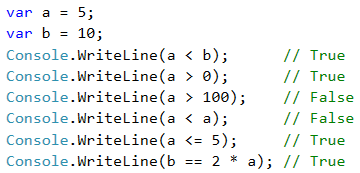

### Оператори за сравнение

<table>
<tr>
<th>Оператор</th> <th>Означение</th> <th>Работи за</th>
</tr>
<tr>
<td>Проверка за равенство</td><td align="center"> == </td><td rowspan="2"> числа, стрингове, дати</td>
</tr>
<tr>
<td>Проверка за различие</td><td align="center"> != </td>
</tr>
<tr>
<td>По-голямо</td><td align="center"> > </td><td rowspan="4">числа, дати, други сравними типове</td>
</tr>
<tr>
<td>По-голямо или равно</td><td align="center"> >= </td>
</tr>
<tr>
<td>По-малко</td><td align="center"> &lt; </td>
</tr>
<tr>
<td>По-малко или равно</td><td align="center"> &lt;= </td>
</tr>
</table>

### Пример:

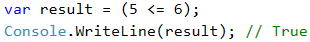

## Прости проверки

В програмирането често **проверяваме дадени условия** и извършваме различни действия, според резултата от проверката. Това става чрез проверката **`if`**, която има следната конструкция:

```csharp
if (булев израз)
{
    // тяло на условната конструкция;  
}
```

### Пример: Отлична оценка

Въвеждаме оценка в конзолата и проверяваме дали тя е отлична (**`≥ 5.50`**).

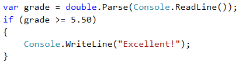

#### Тестване в Judge системата

Тествайте решението си тук: [https://judge.softuni.bg/Contests/Practice/Index/506#0](https://judge.softuni.bg/Contests/Practice/Index/506#0)

## Проверки с if-else конструкция

Конструкцията **`if`** може да съдържа и **`else`** клауза, с която да окажем конкретно действие в случай, че булевият израз (който е зададен в началото **`if (булев израз)`**) върне отрицателен резултат (**`false`**). Така построена, **условната конструкция** наричаме **`if-else`** и поведението ѝ е следното: ако резултатът от условието е **позитивен** (**`true`**) - извършваме едни действия, a когато е **негативен** (**`false`**) - други. Форматът на конструкцията е:

```csharp
if ()
{
    // тяло на условната конструкция;
}
else
{
    // тяло на else-конструкция;
}

```

### Пример: Отлична оценка или не

Подобно на горния пример, въвеждаме оценка, проверяваме дали е отлична, но **изписваме резултат и в двата случая**.

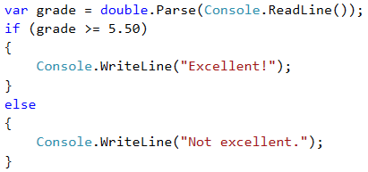

#### Тестване в Judge системата

Тествайте решението си тук: [https://judge.softuni.bg/Contests/Practice/Index/506#1](https://judge.softuni.bg/Contests/Practice/Index/506#1)

## За къдравите скоби { } след if / else

Когато имаме **само една команда** в тялото на **`if` конструкцията**, можем да **пропуснем къдравите скоби**, обозначаващи тялото на условния оператор. Когато искаме да изпълним **блок от код** (група команди), къдравите скоби са **задължителни**. В случай че ги изпуснем, ще се изпълни **само първият ред** след **`if` клаузата**.

<table><tr><td></td>
<td>Добра практика е, <strong>винаги да слагаме къдрави скоби</strong>, понеже това прави кода ни по-четим и по-подреден.</td>
</tr></table>

Ето един пример, в който изпускането на къдравите скоби води до объркване:

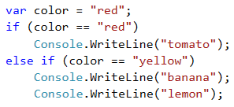

Изпълнението на горния код ще изведе следния резултат на конзолата:

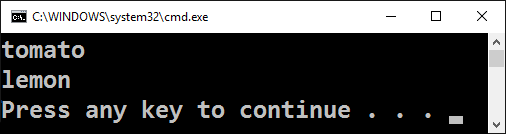

С къдрави скоби:

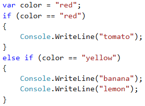

На конзолата ще бъде отпечатано следното:

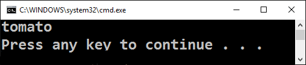

### Пример: Четно или нечетно

Да се напише програма, която проверява, дали дадено цяло число е **четно** (even) или **нечетно** (odd).

Задачата можем да решим с помощта на една **`if-else`** конструкция и оператора **`%`**, който връща **остатък при деление** на две числа.

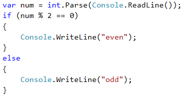

#### Тестване в Judge системата

Тествайте решението си тук: [https://judge.softuni.bg/Contests/Practice/Index/506#2](https://judge.softuni.bg/Contests/Practice/Index/506#2)

### Пример: По-голямото число

Да се напише програма, която чете две цели числа и извежда по-голямото от тях.

Първата ни задача е да **прочетем** двете числа. След което, чрез проста **`if-else`** конструкция, в съчетание с **оператора за по-голямо** (**`>`**), да направим проверка. Част от кода е замъглена умишлено, за да изпробваме наученото до момента.

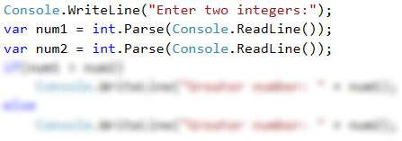

#### Тестване в Judge системата

Тествайте решението си тук: [https://judge.softuni.bg/Contests/Practice/Index/506#3](https://judge.softuni.bg/Contests/Practice/Index/506#3)

## Живот на променлива

Всяка една променлива си има обхват, в който съществува, наречен **variable scope**. Този обхват уточнява къде една променлива може да бъде използвана. В езика C# областта, в която една променлива съществува, започва от реда, на който сме я **дефинирали** и завършва до първата затваряща къдрава скоба **}** (на метода, на **`if` конструкцията** и т.н.). За това е важно да знаем, че **всяка променлива, дефинирана вътре в тялото на `if`, няма да бъде достъпна извън него**, освен ако не сме я дефинирали по-нагоре в кода.

В примерa по-долу, на последния ред, на който се опитваме да отпечатаме променливата **`salary`**, която е дефинирана в **`if` конструкцията**, ще получим **грешка**, защото нямаме достъп до нея.

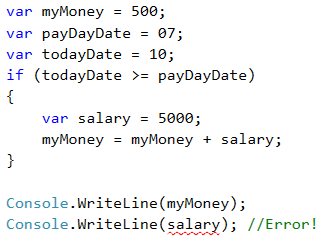

## Серии от проверки

Понякога се налага да извършим серия от проверки, преди да решим какви действия ще изпълнява нашата програма. В такива случаи, можем да приложим конструкцията **`if-else if...-else` в серия**. За целта използваме следния формат: 

```csharp
if (условие)
{
    // тяло на условната конструкция;
}
else if (условие2)
{
    // тяло на условната конструкция;
}
else if (условие3)
{
    // тяло на условната конструкция;
}
...
else
{
    // тяло на else-конструкция;
}
```

### Пример: От 1 до 9 на английски

Да се изпишат с английски текст числата от 1 до 9.

Програмната логика от примера по-горе **последователно сравнява** входното число от конзолата с цифрите от 1 до 9, като **всяко следващо сравнение се извършва, само в случай че предходното сравнение не е било истина**. В крайна сметка, ако никое от **`if`**  условията не е изпълнено, се изпълнява последната **`else` клаузa**.

#### Тестване в Judge системата

Тествайте решението си тук: [https://judge.softuni.bg/Contests/Practice/Index/506#4](https://judge.softuni.bg/Contests/Practice/Index/506#4)

## Упражнения: Прости проверки

### Задача: Бонус точки 

Дадено е **цяло число** – брой точки. Върху него се начисляват **бонус точки** по правилата, описани по-долу. Да се напише програма, която пресмята **бонус точките** за това число и **общия брой точки** с бонусите.

- Ако числото е **до 100** включително, бонус точките са 5.
- Ако числото е **по-голямо от 100**, бонус точките са **20%** от числото.
- Ако числото е **по-голямо от 1000**, бонус точките са **10%** от числото.
- Допълнителни бонус точки (начисляват се отделно от предходните):
 - За **четно** число -> + 1 т.
 - За число, което **завършва на 5** -> + 2 т.
 
#### Примерен вход и изход

| Вход | Изход |
| --- | ---- |
| 20 | 6<br>26 |
| 175 | 37<br>212 |
| 2703 | 270.3<br>2973.3 |
| 15875 | 1589.5<br>17464.5 |

#### Насоки и подсказки

Основните и допълнителните бонус точки можем да изчислим с поредица от няколко **`if-else-if-else`** проверки. Като за **основните бонус точки имаме 3 случая** (когато въведеното число е до 100, между 100 и 1000 и по-голямо от 1000), а за **допълнителните бонус точки - още 2 случая** (когато числото е четно и нечетно).

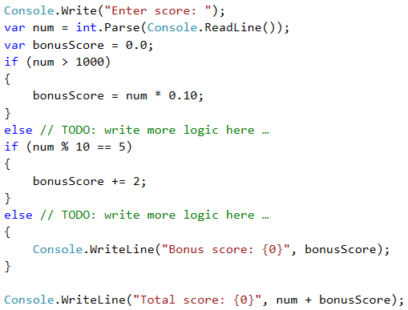

Ето как би могло да изглежда решението на задачата:

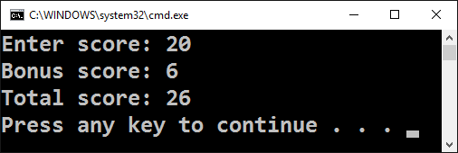

#### Тестване в Judge системата

Тествайте решението си тук: [https://judge.softuni.bg/Contests/Practice/Index/506#5](https://judge.softuni.bg/Contests/Practice/Index/506#5)

### Задача: Сумиране на секунди

Трима спортни състезатели финишират за някакъв **брой секунди** (между **1** и **50**). Да се напише програма, която въвежда времената на състезателите и пресмята **сумарното им време** във формат "минути:секунди". Секундите да се изведат с **водеща нула** (2 -> "02", 7 -> "07", 35 -> "35").

#### Примерен вход и изход

| Вход | Изход |
| --- | ---- |
| 35<br>45<br>44 | 2:04 |
| 22<br>7<br>34 | 1:03 |
| 50<br>50<br>49 | 2:29 |
| 14<br>12<br>10 | 0:36 |

#### Насоки и подсказки

Първо сумираме трите числа, за да получим общия резултат в секунди. Понеже **1 минута = 60** секунди, ще трябва да изчислим броя минути и броя секунди в диапазона от 0 до 59:
- Ако резултатът е между 0 и 59, отпечатваме 0 минути + изчислените секунди.
- Ако резултатът е между 60 и 119, отпечатваме 1 минута + изчислените секунди минус 60.
- Ако резултатът е между 120 и 179, отпечатваме 2 минути + изчислените секунди минус 120.
- Ако секундите са по-малко от 10, изваждаме водеща нула преди тях.

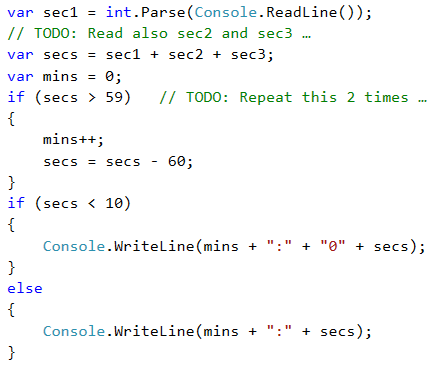

### Тестване в Judge системата

Тествайте решението си тук: [https://judge.softuni.bg/Contests/Practice/Index/506#6](https://judge.softuni.bg/Contests/Practice/Index/506#6)

### Задача: Конвертор за мерни единици

Да се напише програма, която **преобразува разстояние** между следните **8 мерни единици**: **`m`, `mm`, `cm`, `mi`, `in`, `km`, `ft`, `yd`**. Използвайте съответствията от таблицата по-долу:

| Входна eдиница | Изходна eдиница |
| :-------------: | :--------------: |
| 1 meter (m) | 1000 millimeters (mm) |
| 1 meter (m) | 100 centimeters (cm) |
| 1 meter (m) | 0.000621371192 miles (mi) |
| 1 meter (m) | 39.3700787 inches (in) |
| 1 meter (m) | 0.001 kilometers (km) |
| 1 meter (m) | 3.2808399 feet (ft)  |
| 1 meter (m) | 1.0936133 yards (yd) |

Входните данни се състоят от три реда:

- Първи ред: число за преобразуване.
- Втори ред: входна мерна единица.
- Трети ред: изходна мерна единица (за резултата).

#### Примерен вход и изход

| Вход | Изход |
| --- | ---- |
| 12 <br>km <br>ft | 39370.0788 |
| 150 <br>mi <br>in | 9503999.99393599 |
| 450 <br>yd <br>km | 0.41147999937455 |

#### Насоки и подсказки

Прочитаме си входните данни, като към прочитането на мерните единици можем да добавим функцията **`ToLower()`**, която ще направи всички букви малки. Както виждаме от таблицата в условието, можем да конвертираме само **между метри и някаква друга мерна единица**. Следователно трябва първо да изчислим числото за преобразуване в метри. Затова трябва да направим набор от проверки, за да определим каква е входната мерна единица, а след това и за изходната мерна единица.

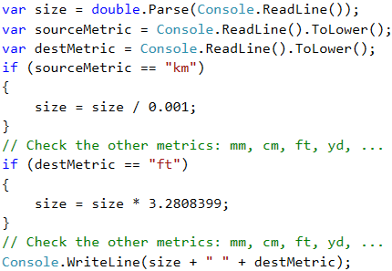

#### Тестване в Judge системата

Тествайте решението си тук: [https://judge.softuni.bg/Contests/Practice/Index/506#7](https://judge.softuni.bg/Contests/Practice/Index/506#7)

## Дебъгване - прости операции с дебъгер

### Какво е "дебъгване"?

Това е процесът на „**закачане**“ към изпълнението на програмата, който ни позволява да проследим поетапно процеса на изпълнение. Можем да следим **ред по ред** какво се случва с нашата програма, какъв път следва, какви стойности имат дефинираните променливи и много други неща, които ни позволяват да откриваме грешки (**бъгове**).

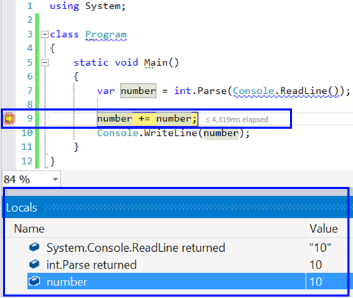

### Дебъгване във Visual Studio

Чрез натискане на бутона [**F10**], стартираме програмата в **debug режим**. Преминаваме към **следващия ред** отново с [**F10**]. 

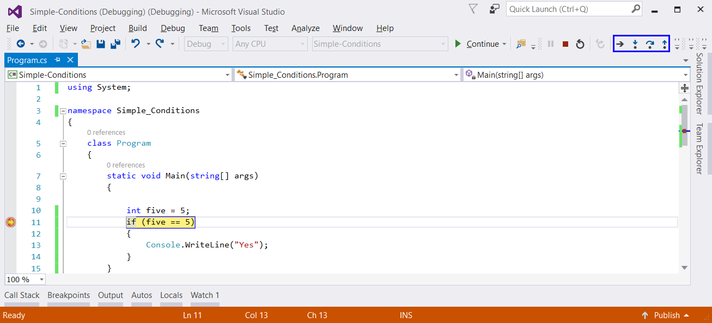

Чрез [**F9**] създаваме стопери – така наречените **breakpoints**, до които можем да стигнем директно използвайки [**F5**] при стартирането на програмата.

## Упражнения: Прости проверки

Нека затвърдим наученото в тази глава с няколко задачи.

### Празно Visual Studio решение (Blank Solution)

Създаваме празно решение (**Blank Solution**) във Visual Studio, за да организираме по-добре решенията на задачите от упражненията – всяка задача ще бъде в отделен проект и всички проекти ще бъдат в общ solution.

Стартираме Visual Studio. Създаваме нов **Blank Solution:** [**File**] -> [**New**] -> [**Project**].

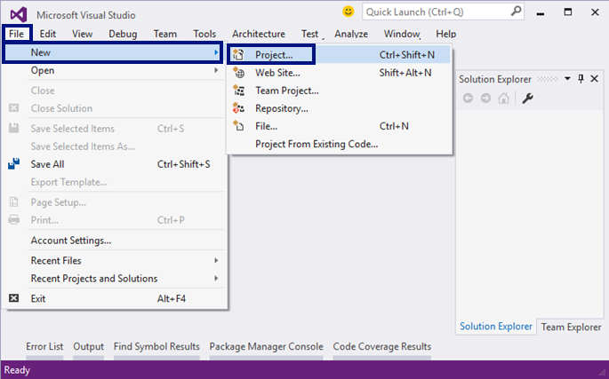

Избираме от диалоговия прозорец [**Templates**] -> [**Other Project Types**] -> [**Visual Studio Solutions**] -> [**Blank Solution**] и даваме подходящо име на проекта, например “Simple-Conditions”:  

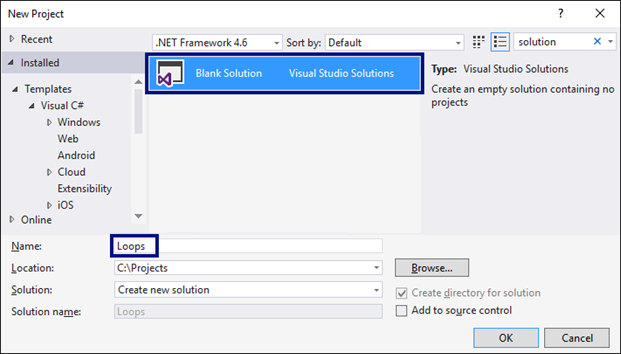

Сега имаме създаден празен Visual Studio Solution (без проекти в него):  


### Задача: Проверка за отлична оценка

Първата задача от тази тема е, да се напише **конзолна програма**, която **въвежда оценка** (десетично число) и отпечатва “**Excellent!**”, ако оценката е **5.50** или по-висока.

#### Примерен вход и изход

| Вход | Изход |
| --- | ---- |
| 6 | Excellent! |
| 5 | (няма изход) |
| 5.5 | Excellent! |
| 5.49 | (няма изход) |

#### Насоки и подсказки

Създаваме **нов проект** в съществуващото Visual Studio решение. В **Solution Explorer** кликваме с десен бутон на мишката върху **Solution 'Simple-Conditions'**. Избираме [**Add**] -> [**New Project**]:  

 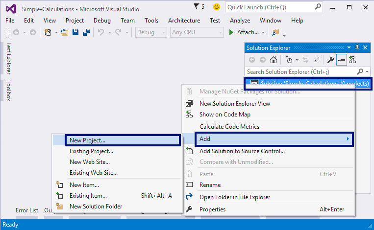

Ще се отвори диалогов прозорец за избор на тип проект за създаване. Избираме **C# конзолно приложение** и задаваме име, например “Excellent-Result”:  

 
 
Вече имаме solution с едно конзолно приложение в него. Остава да напишем кода за решаване на задачата.

За целта отиваме в тялото на метода **`Main(string[] args)`** и пишем следния код:

 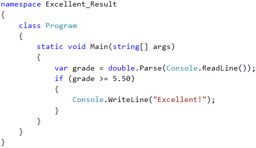

**Стартираме** програмата с [**Ctrl+F5**], за да я **тестваме** с различни входни стойности:

 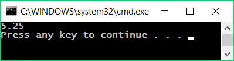

 

#### Тестване в Judge системата

Тествайте решението си тук: [https://judge.softuni.bg/Contests/Practice/Index/506#0](https://judge.softuni.bg/Contests/Practice/Index/506#0)

 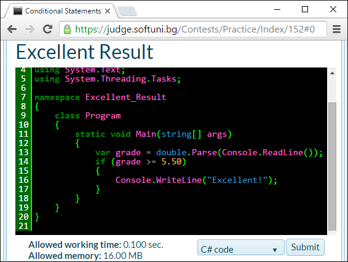 

 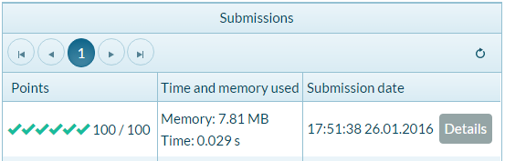

### Задача: Отлична оценка или не

Следващата задача от тази тема е да се напише **конзолна програма**, която **въвежда оценка** (десетично число) и отпечатва “**Excellent!**”, ако оценката е **5.50** или по-висока, или “**Not excellent.**” в противен случай.

#### Примерен вход и изход

| Вход | Изход |
| --- | ---- |
| 6 | Excellent! |
| 5 | Not excellent. |
| 5.5 | Excellent! |
| 5.49 | Not excellent. |

#### Насоки и подсказки

Първо създаваме **нов C# конзолен проект** в решението “**Simple-Conditions**”.

 - Кликаме с мишката върху решението в Solution Explorer и избираме [**Add**] -> [**New Project**].
 
 - Избираме [**Visual C#**] -> [**Windows**] -> [**Console Application**] и задаваме име “Excellent-or-Not”.
 
Следва да **напишем кода** на програмата. Може да си помогнем с примерния код от картинката:  

 

Включваме режим на **автоматично превключване към текущия проект** като кликнем върху главния solution с десния бутон на мишката и изберем [**Set StartUp Projects…**]:  

 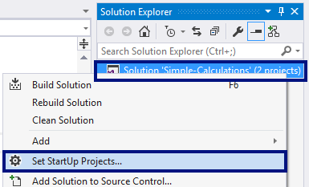

 Ще се появи диалогов прозорец, от който трябва да се избере [**Startup Project**] -> [**Current selection**]:

 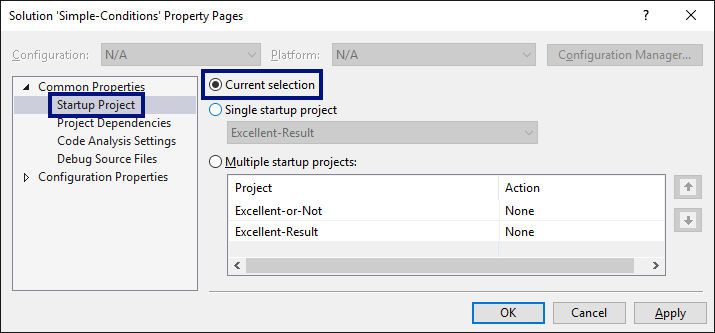

Сега **стартираме програмата**, както обикновено с [**Ctrl+F5**] и я тестваме дали работи коректно:

 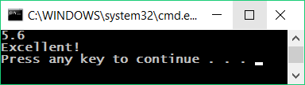
 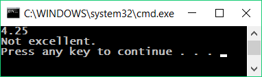

#### Тестване в Judge системата

Тествайте решението си тук: [https://judge.softuni.bg/Contests/Practice/Index/506#1](https://judge.softuni.bg/Contests/Practice/Index/506#1)

 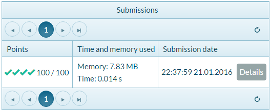

### Задача: Четно или нечетно

Да се напише програма, която въвежда **цяло число** и печата дали е **четно** или **нечетно**.

#### Примерен вход и изход

| Вход | Изход |
| --- | ---- |
| 2 | even |
| 3 | odd |
| 25 | odd |
| 1024 | even |

#### Насоки и подсказки

Отново, първо добавяме **нов C# конзолен проект** в съществуващия solution. В метода **`static void Main()`** трябва да напишем, кода на програмата. Проверката дали дадено число е четно, може да се реализира с оператора **`%`**, който ще ни върне **остатъка при целочислено деление на 2** по следния начин: **`var isEven = (num % 2 == 0)`**.

Остава да **стартираме** програмата с [**Ctrl+F5**] и да я тестваме:  

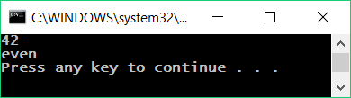

#### Тестване в Judge системата

Тествайте решението си тук: [https://judge.softuni.bg/Contests/Practice/Index/506#2](https://judge.softuni.bg/Contests/Practice/Index/506#2)

### Задача: Намиране на по-голямото число

Да се напише програма, която въвежда **две цели числа** и отпечатва по-голямото от двете.

#### Примерен вход и изход

| Вход | Изход |
|-----|------|
|5<br>3| 5 |
|3<br>5| 5 |
|10<br>10| 10 |
|-5<br>5| 5 |

#### Насоки и подсказки

Както обикновено, първо трябва да добавим **нов C# конзолен проект** в съществуващия solution. За кода на програмата ни е необходима единична **`if-else`** конструкция. Може да си помогнете частично с кода от картинката, който е умишлено замъглен, за да помислите как да го допишете сами:  


След като сме готови с имплементацията на решението, **стартираме** програмата с [**Ctrl+F5**] и я тестваме:


#### Тестване в Judge системата

Тествайте решението си тук: [https://judge.softuni.bg/Contests/Practice/Index/506#3](https://judge.softuni.bg/Contests/Practice/Index/506#3)

### Задача: Изписване на число до 9 с думи

Да се напише програма, която въвежда **цяло число в диапазона** [**0…9**] и го **изписва с думи** на английски език. Ако числото е извън диапазона, изписва “**number too big**”.

#### Примерен вход и изход

| Вход | Изход |
| --- | ---- |
| 5 | five |
| 1 | one |
| 9 | nine |
| 10 | number too big |

#### Насоки и подсказки

Може да използваме поредица **`if-else`** конструкции, с които да разгледаме възможните **11 случая**.

#### Тестване в Judge системата

Тествайте решението си тук: [https://judge.softuni.bg/Contests/Practice/Index/506#4](https://judge.softuni.bg/Contests/Practice/Index/506#4)

### Задача: Познай паролата

Да се напише програма, която **въвежда парола** (един ред с произволен текст) и проверява дали въведеното **съвпада** с фразата “**s3cr3t!P@ssw0rd**”. При съответствие да се изведе “**Welcome**”, а при несъответствие да се изведе “**Wrong password!**”. 

#### Примерен вход и изход

| Вход | Изход |
| --- | ---- |
| qwerty | Wrong password! |
| s3cr3t!P@ssw0rd | Welcome |
| s3cr3t!p@ss | Wrong password! |

#### Насоки и подсказки

Използвайте **`if-else`** конструкцията.

#### Тестване в Judge системата

Тествайте решението си тук: [https://judge.softuni.bg/Contests/Practice/Index/506#8](https://judge.softuni.bg/Contests/Practice/Index/506#8)

### Задача: Число от 100 до 200

Да се напише програма, която **въвежда цяло число** и проверява дали е **под 100**, **между 100 и 200** или **над 200**. Да се отпечатат съответно съобщения, като в примерите по-долу.

#### Примерен вход и изход

| Вход | Изход |
| --- | ---- |
| 95 | Less than 100 |
| 120 | Between 100 and 200 |
| 210 | Greater than 200 |

#### Тестване в Judge системата

Тествайте решението си тук: [https://judge.softuni.bg/Contests/Practice/Index/506#9](https://judge.softuni.bg/Contests/Practice/Index/506#9)


### Задача: Еднакви думи

Да се напише програма, която **въвежда две думи** и проверява дали са еднакви. Да не се прави разлика между главни и малки букви. Да се изведе “**yes**” или “**no**”. 

#### Примерен вход и изход

| Вход | Изход |
| --- | ---- |
| Hello<br>Hello | yes |
| SoftUni<br>softuni | yes |
| Soft<br>Uni | no |
| beer<br>vodka | no |
| HeLlO<br>hELLo | yes |

#### Насоки и подсказки

Преди сравняване на думите, ги обърнете в долен регистър, за да не оказва влияние размера на буквите (главни/малки): **`word = word.ToLower()`**.

#### Тестване в Judge системата

Тествайте решението си тук: [https://judge.softuni.bg/Contests/Practice/Index/506#10](https://judge.softuni.bg/Contests/Practice/Index/506#10)

### Задача: Информация за скоростта

Да се напише програма, която **въвежда скорост** (десетично число) и отпечатва **информация за скоростта**. При скорост **до 10** (включително), отпечатайте “**slow**”. При скорост **над 10** и **до 50**, отпечатайте “**average**”. При скорост **над 50 и до 150**, отпечатайте “**fast**”. При скорост **над 150 и до 1000**, отпечатайте “**ultra fast**”. При по-висока скорост, отпечатайте “**extremely fast**”.

#### Примерен вход и изход

| Вход | Изход |
| --- | ---- |
| 8 | slow |
| 49.5 | average |
| 126 | fast |
| 160 | ultra fast |
| 3500 | extremely fast |

#### Тестване в Judge системата

Тествайте решението си тук: [https://judge.softuni.bg/Contests/Practice/Index/506#11](https://judge.softuni.bg/Contests/Practice/Index/506#11)


### Задача: Лица на фигури

Да се напише програма, която **въвежда размерите на геометрична фигура** и **пресмята лицето й**. Фигурите са четири вида: квадрат (**square**), правоъгълник (**rectangle**), кръг (**circle**) и триъгълник (**triangle**). На първия ред на входа се чете вида на фигурата (`square`, `rectangle`, `circle`, `triangle`). Ако фигурата е **квадрат**, на следващия ред се чете едно число – дължина на страната му. Ако фигурата е **правоъгълник**, на следващите два реда се четат две числа – дължините на страните му. Ако фигурата е **кръг**, на следващия ред се чете едно число – радиусa на кръга. Ако фигурата е **триъгълник**, на следващите два реда се четат две числа – дължината на страната му и дължината на височината към нея. Резултатът да се закръгли до **3 цифри след десетичния знак**. 

#### Примерен вход и изход

| Вход | Изход |
| --- | ---- |
| square<br>5 | 25 |
| rectangle<br>7<br>2.5 | 17.5 |
| circle<br>6 | 113.097 |
| triangle<br>4.5<br>20 | 45 |

#### Тестване в Judge системата

Тествайте решението си тук: [https://judge.softuni.bg/Contests/Practice/Index/506#12](https://judge.softuni.bg/Contests/Practice/Index/506#12)

### Задача: Време + 15 минути

Да се напише програма, която **въвежда час и минути** от 24-часово денонощие и изчислява колко ще е **часът след 15 минути**. Резултатът да се отпечата във формат **`hh:mm`**. Часовете винаги са между 0 и 23, а минутите винаги са между 0 и 59. Часовете се изписват с една или две цифри. Минутите се изписват винаги с по две цифри и с **водеща нула**, когато е необходимо.

#### Примерен вход и изход

| Вход | Изход |
| --- | ---- |
| 1<br>46 | 2:01 |
| 0<br>01 | 0:16 |
| 23<br>59 | 0:14 |
| 11<br>08 | 11:23 |
| 12<br>49 | 13:04 |

#### Насоки и подсказки

Добавете 15 минути и направете няколко проверки. Ако минутите надвишат 59, **увеличете часовете** с 1 и **намалете минутите** с 60. По аналогичен начин разгледайте случая, когато часовете надвишат 23. При печатането на минутите, **проверете за водеща нула**.

#### Тестване в Judge системата

Тествайте решението си тук: [https://judge.softuni.bg/Contests/Practice/Index/506#13](https://judge.softuni.bg/Contests/Practice/Index/506#13)

### Задача: Еднакви 3 числа

Да се напише програма, в която се въвеждат 3 числа и се отпечатва дали те са еднакви (yes / no).

#### Примерен вход и изход

| Вход | Изход |
| --- | ---- |
| 5<br>5<br>5 | yes |
| 5<br>4<br>5 | no |
| 1<br>2<br>3 | no |

#### Тестване в Judge системата

Тествайте решението си тук: [https://judge.softuni.bg/Contests/Practice/Index/506#14](https://judge.softuni.bg/Contests/Practice/Index/506#14)

### Задача: * Изписване на число от 0 до 100 с думи

Да се напише програма, която превръща число в диапазона [**0…100**] в текст. 

#### Примерен вход и изход

| Вход | Изход |
| --- | ---- |
| 25 | twenty five |
| 42 | forty two |
| 6  | six |

#### Тестване в Judge системата

Тествайте решението си тук: [https://judge.softuni.bg/Contests/Practice/Index/506#15](https://judge.softuni.bg/Contests/Practice/Index/506#15)

## Графични и Web приложения: Конвертор за валути

Нека разгледаме как да създадем графично (**GUI**) приложение за **конвертиране на валути**. Приложението ще изглежда приблизително като на картинката по-долу:  

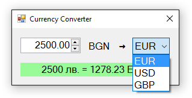

Този път създаваме нов **Windows Forms Application** с име “Currency-Converter”:

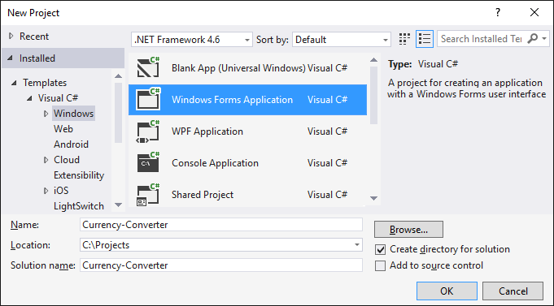

**Нареждаме следните контроли** във формата: 
* Една кутийка за въвеждане на число (**`NumericUpDown`**)
* Един падащ списък с валути (**`ComboBox`**)
* Текстов блок за резултата (**`Label`**) 
* Няколко надписа (**`Label`**)

Нагласяме **размерите** и свойствата им, за да изглеждат долу-горе като на картинката:
 
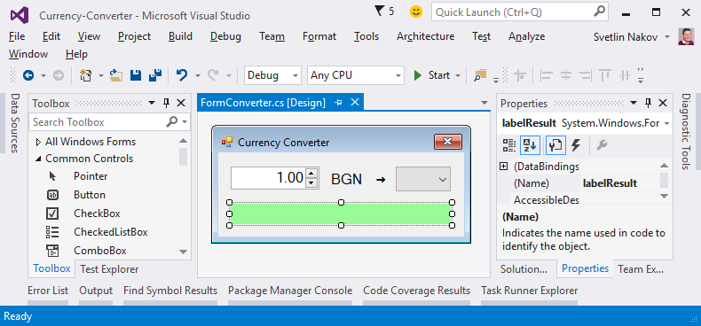
 
Задаваме следните **настройки на контролите**:

* **За главната форма** (**Form**), която съдържа всички контроли:
  * **`(name)`** = **`FormConverter`**
  * **`Text`** = "**`Currency Converter`**"
  * **`Font.Size`** = **`12`**
  * **`MaximizeBox`** = **`False`**
  * **`MinimizeBox`** = **`False`**
  * **`FormBorderStyle`** = **`FixedSingle`**
<br>

* За **полето за въвеждане на число** (**`NumericUpDown`**):
  * **`(name)`** = **`numericUpDownAmount`**
  * **`Value`** = **`1`**
  * **`Minimum`** = **`0`**
  * **`Maximum`** = **`1000000`**
  * **`TextAlign`** = **`Right`**
  * **`DecimalPlaces`** = **`2`**
<br>  

* За **падащия списък с валутите** (**`ComboBox`**):
  * **`(name)`** = **`comboBoxCurrency`**
  * **`DropDownStyle`** = **`DropDownList`**
  * **`Items`** =
    * **EUR**
    * **USD**
    * **GBP**
<br> 

* За **текстовия блок за резултата** (**`Label`**):
  * **`(name)`** = **`labelResult`**
  * **`AutoSize`** = **`False`**
  * **`BackColor`** = **`PaleGreen`**
  * **`TextAlign`** = **`MiddleCenter`**
  * **`Font.Size`** = **`14`**
  * **`Font.Bold`** = **`True`**
     
Трябва да хванем следните **събития**, за да напишем C# кода, който ще се изпълни при настъпването им:

* Събитието **`ValueChanged`** на контролата за въвеждане на число **`numericUpDownAmount`**: 

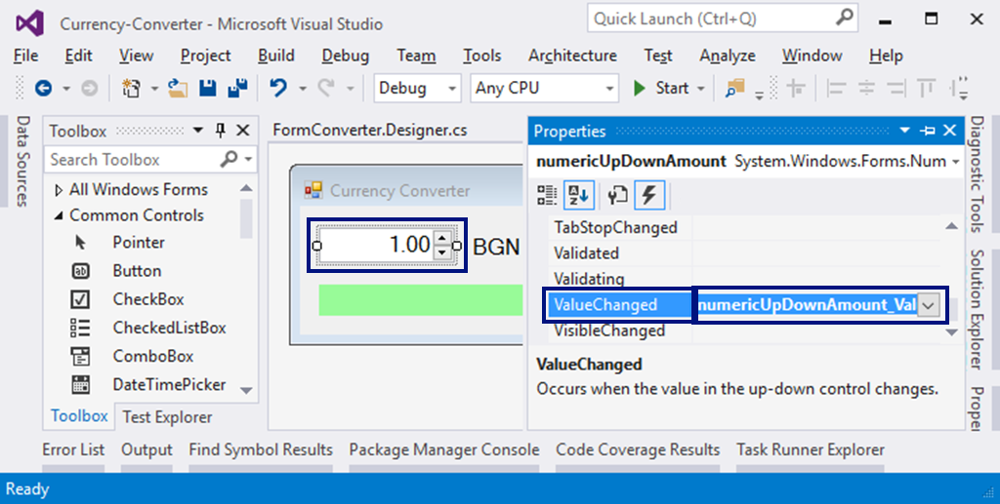

* Събитието **`Load`** на формата **`FormConverter`**
* Събитието **`SelectedIndexChanged`** на падащия списък за избор на валута **`comboBoxCurrency`**
  
Ще използваме следния **C# код** за обработка на събитията:

```csharp
private void FormConverter_Load(object sender, EventArgs e)
{
  this.comboBoxCurrency.SelectedItem = "EUR";
}
        
private void numericUpDownAmount_ValueChanged(object sender, EventArgs e)
{
  ConvertCurrency();
}
        
private void comboBoxCurrency_SelectedIndexChanged(object sender, EventArgs e)
{
  ConvertCurrency();
}
```

Задачата на горния код е да избере при стартиране на програмата валута “**EUR**” и при промяна на стойностите в полето за сума или при смяна на валутата, да изчисли резултата, извиквайки **`ConvertCurrency()`** метода.

Следва да напишем действието **`ConvertCurrency()`** за конвертиране на въведената сума от лева в избраната валута:
 
```csharp
private void ConvertCurrency()
{
  var originalAmount = this.numericUpDownAmount.Value;
  var convertedAmount = originalAmount;
  if (this.comboBoxCurrency.SelectedItem.ToString() == "EUR")
      {
        convertedAmount = originalAmount / 1.95583m;
      }
  else if (this.comboBoxCurrency.SelectedItem.ToString() == "USD")
      {
        convertedAmount = originalAmount / 1.80810m;
      }
  else if (this.comboBoxCurrency.SelectedItem.ToString() == "GBP")
      {
        convertedAmount = originalAmount / 2.54990m;
      }
  this.labelResult.Text = originalAmount + " лв. = " +
  Math.Round(convertedAmount, 2) + " " + this.comboBoxCurrency.SelectedItem;
}
```

Горният код взима **сумата** за конвертиране от полето **`numericUpDownAmount`** и **избраната валута** за резултата от полето **`comboBoxCurrency`**. След това с **условна конструкция**, според избраната валута, сумата се дели на **валутния курс** (който е фиксиран твърдо в сорс кода). Накрая се генерира текстово **съобщение с резултата** (закръглен до 2 цифри след десетичния знак) и се записва в зелената кутийка **`labelResult`**.
