# Глава 4. По-сложни проверки - изпитни задачи

### Задача: Навреме за изпит

**Условие:** Студент трябва да отиде **на изпит в определен час** (например в 9:30 часа). Той идва в изпитната зала в даден **час на пристигане** (например 9:40). Счита се, че студентът е дошъл **навреме**, ако е пристигнал в часа на изпита или до половин час преди това. Ако е пристигнал по-рано повече от 30 минути, той е **подранил**. Ако е дошъл след часа на изпита, той е **закъснял**. 

Напишете програма, която въвежда време на изпит и време на пристигане и отпечатва дали студентът е дошъл **навреме**, дали е **подранил** или е **закъснял** както и **с колко часа или минути** е подранил или закъснял.

### Входни данни

От конзолата се четат **четири цели числа** (по едно на ред):

- Първият ред съдържа **час на изпита** – цяло число от 0 до 23.
- Вторият ред съдържа **минута на изпита** – цяло число от 0 до 59.
- Третият ред съдържа **час на пристигане** – цяло число от 0 до 23.
- Четвъртият ред съдържа **минута на пристигане** – цяло число от 0 до 59.

### Изходни данни

На първият ред отпечатайте:

- &quot;**Late**&quot;, ако студентът пристига по-късно от часа на изпита.
- &quot;**On time**&quot;, ако студентът пристига точно в часа на изпита или до 30 минути по-рано.
- &quot;**Early**&quot;, ако студентът пристига повече от 30 минути преди часа на изпита.

Ако студентът пристига с поне минута разлика от часа на изпита, отпечатайте на следващия ред:

- &quot;**mm minutes before the start**&quot; за идване по-рано с по-малко от час.
- &quot;**hh:mm hours before the start**&quot; за подраняване с 1 час или повече. Минутите винаги печатайте с 2 цифри, например &quot;1:05&quot;.
- &quot;**mm minutes after the start**&quot; за закъснение под час.
- &quot;**hh:mm hours after the start**&quot; за закъснение от 1 час или повече. Минутите винаги печатайте с 2 цифри, например &quot;1:03&quot;.

### Примерен вход и изход

| Вход | Изход | Вход | Изход |
|:---|:---|:---|:---|
|9   30   9   50|Late   20 minutes after the start|16   00   15   00|Early   1:00 hours before the start|
|9   00   8   30|On time   30 minutes before the start|9   00   10   30|Late   1:30 hours after the start|
|14   00   13   55|On time   5 minutes before the start|11   30   8   12|Early   3:18 hours before the start|

| Вход | Изход | 
|:---|:---|
|10   00   10   00|On time|
|11   30   10   55|Early   35 minutes before the start|
|11   30   12   23|Late   59 minutes after the start|

### Насоки и подсказки

<table><tr><td></td>
<td>Препоръчително е да прочетете няколко пъти заданието на дадена задача, като си водите записки, преди да започнете писането на код.</td>
</tr></table>

#### 1. Обработка на входните данни

Съгласно заданието очакваме да ни бъдат подадени в **четири** поредни реда различни **цели числа**. Разглеждайки дадените параметри можем да се спрем на `int`, като тип, тъй като той удовлетворява очакваните стойности. Едновременно **четем** входа и **парсваме** стринговата стойност към избраният от нас тип данни за **цяло число**.

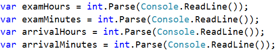

Разглеждайки очаквания изход можем да създадем променливи, които да съдържат различните видове изходни данни, с цел да избегнем използването на т.нар. **"magic strings"** в кода.

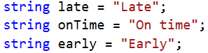

#### 2. Изчисления

След като прочетохме входа, можем да започнем да разписваме логиката за изчисление на резултата. Нека първо да изчислим **началния час** на изпита **в минути** за по-лесно и точно сравнение.

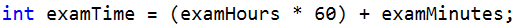

Нека изчислим по същата логика и **времето на пристигане** на студента.

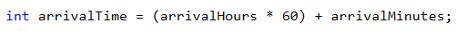

Остава ни да пресметнем разликата в двете времена, за да можем да определим **кога** и с **какво време спрямо изпита** е пристигнал студентът.

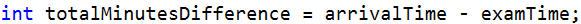

Следващата ни стъпка е да направим необходимите проверки и изчисления, като накрая ще изведем резултата от тях. Нека разделим изхода на **две** части. 

- Първо да покажем кога е пристигнал студентът - дали е **подранил**, **закъснял** или е **навреме**. 
За целта ще се спрем на `if - else if` конструкция. 
-  След това ще покажем **времевата разлика**, ако студентът пристигне в **различно време** от началния **час на изпита**. 

С цел да спестим една допълнителна проверка (**else**), можем по подразбиране да приемем, че студентът е закъснял. 

След което, съгласно условието, проверяваме дали разликата във времената е **повече от 30 минути**. Ако това е така приемаме, че е **подранил**. Ако не влезем в първото условие, то следва да проверим само дали **разликата е по-малка или равна на 0**, с което проверяваме условието, студента да е дошъл в рамките на от **0 до 30 мин**. преди изпита. 

При всички останали случаи приемаме, че студентът е **закъснял**, което сме направили **по подразбиране**, и не е нужна допълнителна проверка.

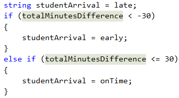

За финал ни остава да разберем и покажем и с **каква разлика от времето на изпита е пристигнал**, както и дали тази разлика е **преди или след изпита**.

Правим проверка дали разликата ни е **над** един час, за да изпишем съответно часове и минути в желаният по задание **формат**, или е **под** един час, за да покажем **само минути** като формат и описание. 

Остава да направим още една проверка дали времето на пристигане на студента е **преди** или **след** началото на изпита.

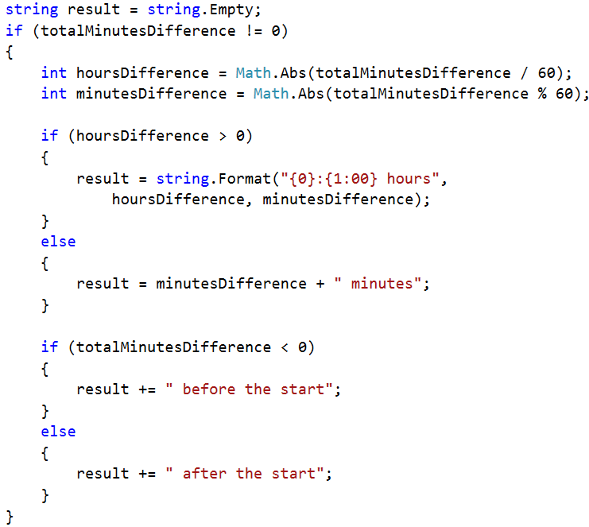

#### 3. Показване на резултата

И накрая остава да изведем резултата на конзолата. Тъй като по задание ако студентът е дошъл точно на време (**без нито една минута разлика**) не трябва да изваждаме втори резултат, правим **проверка**.

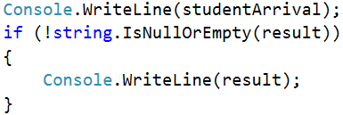

<table><tr><td></td>
<td>Реално за целите на задачата извеждането на резултата <strong>на конзолата</strong> може да бъде направен и в по-ранен етап - още при самите изчисления. Това като цяло не е много добра практика. <strong>Защо?</strong>
  
Нека разгледаме идеята, че кодът ни не е 10 реда, а 100 или 1000! И някой ден се наложи извеждането на резултата да не бъде в конзолата, а да бъде записан във <strong>файл</strong>, или показан на <strong>уеб приложение</strong>. Тогава на колко места в кодът ще трябва да бъдат нанесени корекции поради тази смяна? И дали няма да пропуснем някое място!
  
<strong>Съвет:</strong> Винаги си мислете за кода с логическите изчисления, като за отделна част от входните и изходните данни. Така че да може да работи без значение как му се подават данните и къде ще трябва да бъде показан резултата.</td>
</tr></table>

### Тестване в Judge системата

Тествайте вашето решение тук:  [https://judge.softuni.bg/Contests/Practice/Index/509#0](https://judge.softuni.bg/Contests/Practice/Index/509#0) 

### Задача: Пътешествие

Странно, но повечето хора си плануват от рано почивката. Млад програмист разполага с **определен бюджет** и свободно време в даден **сезон**.

**Условие:** Напишете програма, която да приема **на входа бюджета и сезона**, а **на изхода** да изкарва, **къде ще почива** програмистът и **колко ще похарчи**.

**Бюджетът определя дестинацията, а сезонът определя колко от бюджетът ще изхарчи**. Ако е **лято** ще почива на **къмпинг**, а **зимата в хотел**. Ако е в **Европа**, **независимо от сезона** ще почива в **хотел**. Всеки **къмпинг** или **хотел**, **според дестинацията**, има **собствена цена**, която отговаря на даден **процент от бюджета**:

- При **100лв. или по-малко** – някъде в **България**
  - **Лято** – **30%** от бюджета
  - **Зима** – **70%** от бюджета
- При **1000лв. или по малко** – някъде на **Балканите**
  - **Лято** – **40%** от бюджета
  - **Зима** – **80%** от бюджета
- При **повече от 1000лв**. – някъде из **Европа**
  - При пътуване из Европа, независимо от сезона ще похарчи **90% от бюджета**.

### Входни данни

Входът се чете от конзолата и се състои от **два реда** :

- **Първи ред** – Бюджет, **реално число** в интервала **[10.00...5000.00]**.
- **Втори ред** – Един от двата възможни сезона: **&quot;summer&quot; **или** &quot;winter&quot;**

### Изходни данни

На конзолата трябва да се отпечатат **два реда**.

- **Първи ред** – „**Somewhere in [дестинация]**&quot; измежду &quot;**Bulgaria**&quot;, &quot;**Balkans**&quot; и &quot;**Europe**&quot;
- **Втори ред** – &quot;{**Вид почивка**} – {**Похарчена сума**}&quot;
  - **Почивката** може да е между &quot;**Camp**&quot; и &quot;**Hotel**&quot;
  - **Сумата** трябва да е **закръглена с точност до втория знак след запетаята**.

### Примерен вход и изход

| Вход | Изход |
|:---|:---|
|50   summer|Somewhere in Bulgaria   Camp - 15.00|
|75   winter|Somewhere in Bulgaria   Hotel - 52.50|
|312   summer|Somewhere in Balkans   Camp - 124.80|
|678.53   winter|Somewhere in Balkans   Hotel - 542.82|
|1500   summer|Somewhere in Europe   Hotel - 1350.00|

### Насоки и подсказки

#### 1. Обработка на входните данни

Прочитайки внимателно условието разбираме, че очакваме **два** реда с входни данни. Първият параметър е **реално число**, за което е хубаво да изберем подходящ тип на променливата. За по-голяма точност на изчисленията ще се спрем на `decimal` като тип за бюджета, а за сезона - `string`. 

<table><tr><td></td>
<td>Винаги преценяйте какъв тип стойност се подава при входните данни, както и към какъв тип трябва да бъдат парснати тези данни, за да работят правилно създадените от вас програмни конструкции! Когато в задачата е необходимо да направите парични изчисления, използвайте <strong><em>decimal</em></strong>, за по-голяма точност.</td>
</tr></table>

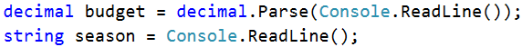

#### 2. Изчисления

Нека си създадем и инициализираме нужните за логиката и изчисленията променливи.

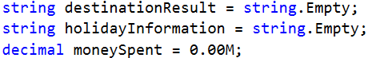

Можем, подобно на примера в предната задача, да инициализираме променливите с някои от изходните резултати, с цел спестяване на допълнително инициализиране.

Разглеждайки отново условието на задачата забелязваме, че основното разпределение за това къде ще почиваме се определя от **стойността на подаденият бюджет**, т.е. основната ни логика ще бъде: ако бюджетът е **по-малък** от дадена стойност, или ако е **по-малък** от друга стойност, или е **повече** от дадена гранична стойност. 

Спрямо това как си подредим логическата схема (в какъв ред ще обхождаме граничните стойности) ще имаме повече или по-малко проверки в условията. **Помислете защо!**

След това е необходимо да направим проверка за стойността на **подадения сезон**, спрямо нея ще определим какъв процент от бюджета ще бъде похарчен, както и къде ще почиваме - в **хотел** или на **къмпинг**.

Пример за един от възможните подходи за решение е:

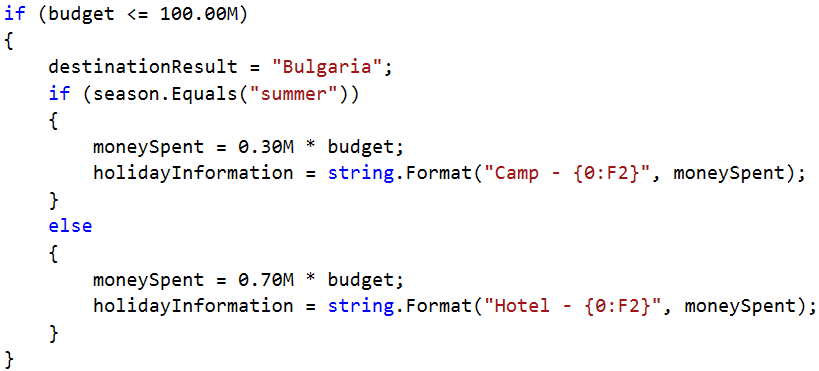

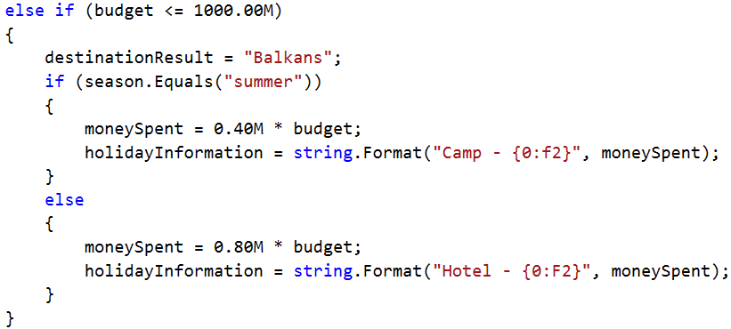

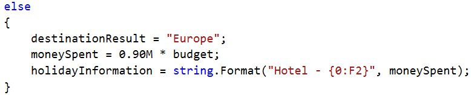

Винаги можем да инициализираме дадена стойност на параметъра и след това да направим само една проверка дали има нужда да бъде сменена. **Това ни спестява една логическа стъпка**.

**Например блокът:**

**може да бъде представен по следния начин:**

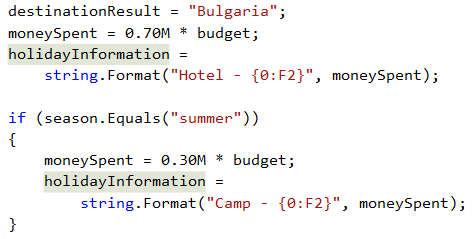

#### 3. Показване на резултата

Остава ни да покажем изчисления резултат на конзолата:

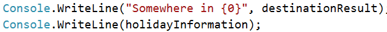

### Тестване в Judge системата

Тествайте вашето решение тук: [https://judge.softuni.bg/Contests/Practice/Index/509#1](https://judge.softuni.bg/Contests/Practice/Index/509#1)

### Задача: Операции между числа

**Условие:** Напишете програма, която чете **две цели числа (N1 и N2)** и **оператор** с който да се **извърши** дадена **математическа операция** с тях. Възможните операции са: **Събиране (+)**, **Изваждане (-)**, **Умножение (\*)**, **Деление (/)** и **Модулно деление (%)**. При **събиране**, **изваждане** и **умножение** на конзолата **трябва да се отпечатат резултата** и дали той е **четен** или **нечетен**. При **обикновеното деление** – **резултата**. При **модулното деление** – **остатъка**. Трябва да се има предвид, че **делителят може да е равен на 0 (нула)**, а **на нула не се дели**. В този случай трябва да се отпечата **специално съобщение**.

### Входни данни

От конзолата се прочитат **3 реда**:

- **N1** – **цяло число** в интервала **[0...40 000]**
- **N2** – **цяло число** в интервала **[0...40 000]**
- **Оператор** – **един символ** измеду: &quot;**+**&quot;, &quot;**-**&quot;, &quot;**\***&quot;, &quot;**/**&quot;, &quot;**%**&quot;

### Изходни данни

Да се отпечата на конзолата **един ред**:

- Ако операцията е **събиране**, **изваждaне** или **умножение**:
  - **&quot;{N1} {оператор} {N2} = {резултат} – {even/odd}&quot;**
- Ако операцията е **деление**:
  - **&quot;{N1} / {N2} = {резултат}&quot;** – резултатът е **форматиран **до** втория знак след десетичната запетая**
- Ако операцията е **модулно деление**:
  - **&quot;{N1} % {N2} = {остатък}&quot;**
- В случай на **деление с 0(нула)**:
  - **&quot;Cannot divide {N1} by zero&quot;**

### Примерен вход и изход

| Вход | Изход | Вход | Изход |
|:---|:---|:---|:---|
|123   12   /|123 / 12 = 10.25|112   0   /|Cannot divide 122 by zero|
|10   3   %|10 % 3 = 1|10   0   %|Cannot divide 10 by zero|

| Вход | Изход |
|:---|:---|
|10   12   +|10 + 12 = 22 - even|
|10   1   -|10 - 1 = 9 - odd|
|7   3   *|7 * 3 = 21 - odd|

### Насоки и подсказки

#### 1. Обработка на входните данни

След прочитане на условието разбираме, че очакваме **три** реда с входни данни. На първите **два** реда ни се подават **цели числа** (в указаният от заданието диапазон), а на третия, **аритметичен символ**. 

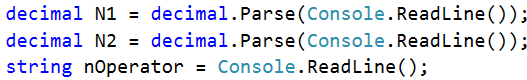

#### 2. Изчисления

Нека си създадем и инициализираме нужните за логиката и изчисленията променливи. В едната ще пазим **резултата от изчисленията**, а другата ще използваме за **крайния изход** на програмата.

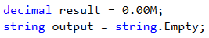

Прочитайки внимателно условието разбираме, че има случаи, в които не трябва да правим **никакви** изчисления, а просто да изведем резултат.

Следователно първо може да проверим дали второто число е **0** (нула), както и дали операцията е **деление** или **модулно деление**, след което да инициализираме резултата:

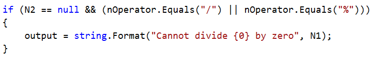

Нека сложим резултата, като стойност при инициализацията на `output` параметъра. По този начин може да направим само **една проверка** дали е необходимо да **преизчислим** и **заменим** този резултат. 

Спрямо това кой подход изберем следващата ни проверка ще бъде или обикновен `else` или единичен `if`. В тялото на тази проверка можем да разделим логиката спрямо **структурата** на очаквания **резултат** с допълнителни проверки за начина на изчисление на резултата спрямо подаденият оператор. 

От условието можем да видим, че за **събиране (+)**, **изваждане (-)** или **умножение (\*)** очакваният резултат има обща структура: **"{N1} {оператор} {N2} = {резултат} – {even/odd}"**, докато за **деление (/)** и за **модулно деление (%)** резултатът има отделна специфична структура.

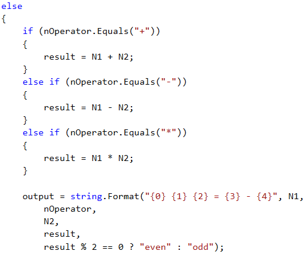

И завършваме с проверките за деление и модулно деление.

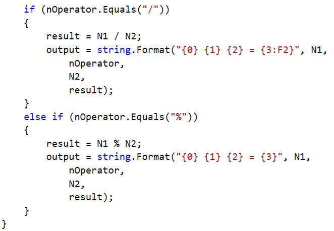

При кратки и ясни проверки, както в горния пример за четно и нечетно число е възможно да се използват **тернарни оператори**. Нека разгледаме възможната проверка **с** и **без** тернарен оператор.

**Без използване на тернарен оператор:**

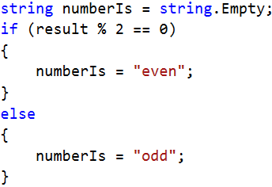

**С използване на тернарен оператор:**

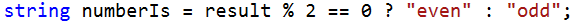

#### 3. Показване на резултата

Накрая ни остава да покажем изчисленият резултат на конзолата:

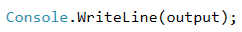

### Тестване в Judge системата

Тествайте вашето решение тук: [https://judge.softuni.bg/Contests/Practice/Index/509#2](https://judge.softuni.bg/Contests/Practice/Index/509#2)

### Задача: Билети за мач

Когато пуснали **билетите за Евро 2016**, **група запалянковци** решили да си закупят. **Билетите имат две категории с различни цени**:

- **VIP** – **499.99** лева.
- **Normal** – **249.99** лева.

Запалянковците **имат определен бюджет**, a **броят на хората** в групата **определя какъв процент от бюджета** трябва **да се задели за транспорт**:

- **От 1 до 4** – **75% от бюджета**.
- **От 5** до **9** – **60% от бюджета**.
- **От 10 до 24** – **50% от бюджета**.
- **От 25 до 49** – **40% от бюджета**.
- **50 или повече** – **25% от бюджета**.

**Напишете програма**, която да **пресмята дали с останалите пари от бюджета** могат да си **купят билети за избраната категория**. И **колко пари** ще им **останат или ще са им нужни**.

### Входни данни

Входът се чете от **конзолата** и съдържа **точно 3 реда**:

- На **първия** ред е **бюджетът** – **реално число в интервала [1 000.00 ... 1 000 000.00]**
- На **втория** ред е **категорията** – &quot;**VIP**&quot; или &quot;**Normal**&quot;
- На **третия** ред е **броят на хората в групата** – **цяло число в интервала [1 ... 200]**

### Изходни данни

Да се **отпечата** на конзолата **един ред**:

- Ако **бюджетът е достатъчен**:
  - &quot; **Yes! You have {N} leva left.** &quot; – където **N са останалите пари** на групата.
- Ако **бюджетът НЕ Е достатъчен**:
  - &quot; **Not enough money! You need {М} leva.** &quot; – където **М е сумата, която не достига**.

**Сумите** трябва да са **форматирани с точност до два знака след десетичната запетая**.

### Примерен вход и изход

| Вход | Изход |
|:---|:---|
|1000   Normal   1|Yes! You have 0.01 leva left.|

|Обяснения|
|:---|
|**1 човек : 75%** от бюджета отиват за **транспорт**. **Остават:** 1000 – 750 = **250**.   Категория **Normal**: билетът **струва 249.99 * 1 = 249.99**   249.99 < 250: **остават му** 250 – 249.99 = **0.01**|

| Вход | Изход |
|:---|:---|
|30000   VIP   49|Not enough money! You need 6499.51 leva.|

|Обяснения|
|:---|
|**49 човека: 40%** от бюджета отиват за **транспорт**.   Остават: 30000 – 12000 = 18000.   Категория **VIP**: билетът **струва** 499.99 * 49.   **24499.510000000002** < 18000.   **Не стигат** 24499.51 - 18000 = **6499.51**|

### Насоки и подсказки

#### 1. Обработка на входните данни

Нека прочетем внимателно условието и да разгледаме какво се очаква да получим, като **входни данни**, какво се очаква да **върнем, като резултат**, както и кои са **основните стъпки** при разбиването **на логическата схема**.

Като за начало нека обработим и запазим входните данни в **подходящи** за това **параметри**:

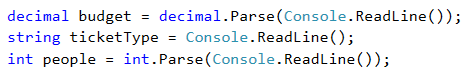

#### 2. Изчисления

Нека създадем и инициализираме нужните за изчисленията променливи:

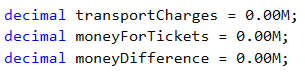

Нека отново прегледаме условието. Трябва да направим **две** различни блок изчисления. 

От първите изчисления трябва да разберем каква част от бюджета ще трябва да заделим за **транспорт**. За логиката на тези изчисления забелязваме, че има значение единствено **броят на хората в групата**. Следователно ще направим логическата разбивка спрямо броят на запалянковците.

Ще използваме условна конструкция - поредица `if-else if-else if-......`.

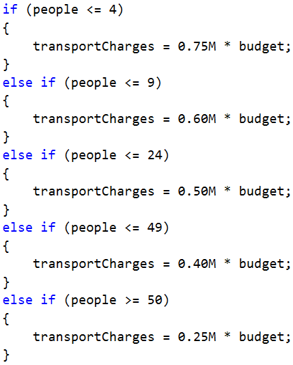

От вторите изчисления трябва да намерим каква сума ще ни е необходима за закупуване на **билети за групата**. Според условието това ни зависи единствено от типа на билетите, които трябва да закупим. 

Нека използваме `switch-case` условна конструкция.

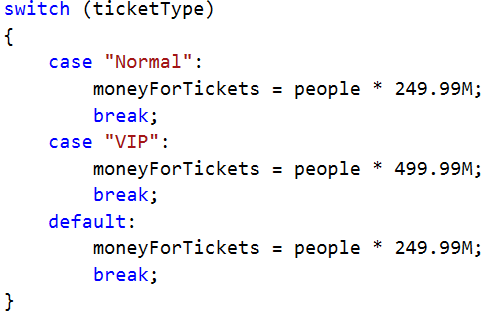

След като сме изчислили какви са **транспортните разходи** и **разходите за билети** ни остава да изчислим крайният резултат и да разберем **ще успее** ли групата от запалянковци да отиде на Евро 2016 или **няма да успее** при така подадените параметри. 

За извеждането на резултата, за да си спестим една проверка (`else`) в конструкцията приемаме, че групата **по подразбиране** ще **може** да отиде на Евро 2016.

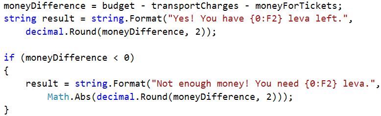

#### 3. Показване на резултата

Накрая ни остава да покажем изчисленият резултат на конзолата:

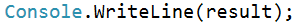

### Тестване в Judge системата

Тествайте вашето решение тук: [https://judge.softuni.bg/Contests/Practice/Index/509#3](https://judge.softuni.bg/Contests/Practice/Index/509#3)

### Задача: Хотелска стая

Хотел предлага **два вида стаи**: **студио и апартамент**.

Напишете програма, която изчислява **цената за целия престой за студио и апартамент**. **Цените** зависят от **месеца** на престоя:

| **Май и октомври** | **Юни и септември** | **Юли и август** |
|:---|:---|:---|
|Студио – **50** лв./нощувка|Студио – **75.20** лв./нощувка|Студио – **76** лв./нощувка|
|Апартамент – **65** лв./нощувка|Апартамент – **68.70** лв./нощувка|    Апартамент – **77** лв./нощувка|

Предлагат се и следните **отстъпки**:

- За **студио**, при **повече** от **7** нощувки през **май и октомври**: **5% намаление**.
- За **студио**, при **повече** от **14** нощувки през **май и октомври**: **30% намаление**.
- За **студио**, при **повече** от **14** нощувки през **юни и септември**: **20% намаление**.
- За **апартамент**, при **повече** от **14** нощувки, **без значение от месеца: 10% намаление**.

### Входни данни

Входът се чете от **конзолата** и съдържа **точно два реда**:

- На **първия** ред е **месецът** – **May**, **June**, **July**, **August**, **September** или **October**
- На **втория** ред е **броят на нощувките** – **цяло число в интервала** **[0...200]**

### Изходни данни

Да се **отпечатат** на конзолата **два реда**:

- На **първия ред**: &quot;**Apartment: { цена за целият престой } lv**&quot;.
- На **втория ред**: &quot;**Studio: { цена за целият престой } lv**&quot;.

**Цената за целия престой да е форматирана с точност до два знака след десетичната запетая**.

### Примерен вход и изход

| Вход | Изход |
|:---|:---|
|May   15|Apartment: 877.50 lv.   Studio: 525.00 lv.|

| Обяснения |
|:---|
|През **май**, при повече от **14 нощувки**, намаляме цената на **студиото с 30%** (50 – 15 = 35), а на **апартамента – с 10%** (65 – 6.5 =58.5).   Целият престой в **апартамент – 877.50** лв.   Целият престой **в студио – 525.00** лв.|

| Вход | Изход |
|:---|:---|
|June   14|Apartment: 961.80 lv.   Studio: 1052.80 lv|
|August   20|Apartment: 1386.00 lv.   Studio: 1520.00 lv.|

### Насоки и подсказки

#### 1. Обработка на входните данни

Съгласно условието на задачата очакваме да получим два реда входни данни - на първия ред **месеца, през който се планува престой**, а на втория, **броя нощувки**.

Нека обработим и запазим входните данни в подходящи за това параметри:

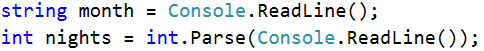

#### 2. Изчисления

След това да създадем и инициализираме нужните за изчисленията променливи:

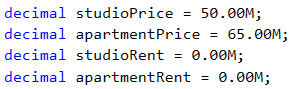

Разглеждайки отново условието забелязваме, че основната ни логика зависи от това какъв **месец** ни се подава, като и от броя на **нощувките**.

Като цяло има различни подходи и начини да се направят въпросните проверки, но нека се спрем на основна условна конструкция `switch-case`, като в различните `case` блокове ще използваме съответно условни конструкции `if` и `if-else`.

Нека започнем с първата група месеци: **Май** и **Октомври**. За тези два месеца **цената на престой ни е еднаква** и за двата типа настаняване - в **студио** и в **апартамент**. Съответно ни остава само да направим вътрешна проверка спрямо **броят нощувки**, за да преизчислим ако се налага **съответната цена**.

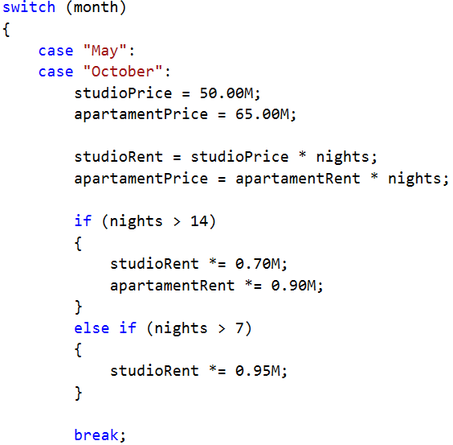

За следващите месеци **логиката** и **изчисленията** ни ще са донякъде **идентични**. 

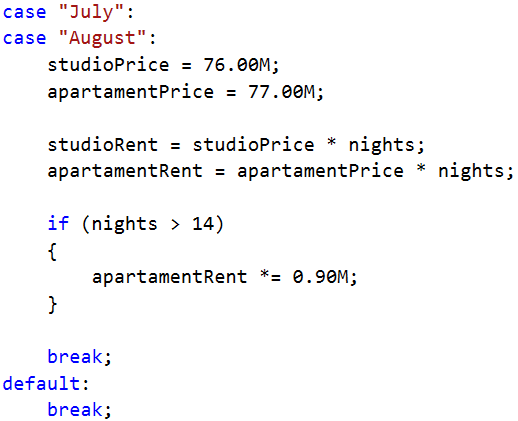

След като изчислим какви са съответните цени и крайна стойност за престоя нека да си извадим крайните изчисления в изходните ни **параметри** - `studioInfo` и `apartmentInfo`.

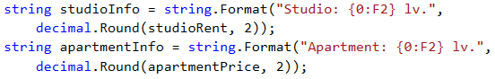

За изчисленията на изходните ни параметри използваме **методът** `decimal.Round(Decimal, Int32)`.
Този метод **закръгля десетично** число до **зададен брой цифри** след десетичната запетая. Като за целта на метода подаваме данни от тип `decimal` (studioRent, apartamentPrice) и цяло число (`int`). В нашия случай ще закръглим десетичното число до **две цифри** след десетичната запетая.

#### 3. Показване на резултата

Накрая ни остава да покажем изчислените резултати на конзолата:

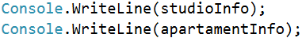

### Тестване в Judge системата

Тествайте вашето решение тук: [https://judge.softuni.bg/Contests/Practice/Index/509#4](https://judge.softuni.bg/Contests/Practice/Index/509#4)
