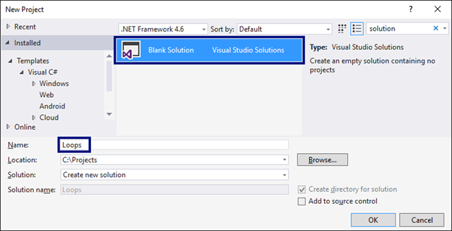

# Глава 5. Повторения (цикли)

В настоящата глава ще се запознаем с конструкциите за **повторение на група команди**, известни в програмирането с понятието "**цикли**". Ще напишем няколко цикъла с използване на оператора `for` в най-простата му форма. Ще решим няколко практически задачи, изискващи повторение на поредица от действия, като използваме цикли.

## Видео

<div class="video-player">
  Гледайте видео-урок по тази глава тук: <a target="_blank"
  href="https://www.youtube.com/watch?v=Xjwjk9yS4uw">
  https://www.youtube.com/watch?v=Xjwjk9yS4uw</a>.
</div>
<script src="/assets/js/video.js"></script>

## Повторения на блокове код (for-цикъл)

В програмирането често пъти се налага **да изпълним блок с команди няколко пъти**. За целта в езиците за програмиране се използват **цикли**. Да разгледаме един пример за `for` цикъл: 


Цикълът започва с **оператора** `for` и преминава през всички стойности за дадена променлива в даден интервал, например всички числа от 1 до 10 включително, и за всяка стойност изпълнява поредица команди \(тяло на цикъла\).

В декларацията на цикъла може да се зададе **начална стойност** и **крайна стойност**. **Тялото на цикъла** обикновено се огражда с къдрави скоби `{ }` и представлява блок с една или няколко команди. На фигурата по-долу е показана структурата на един `for` цикъл:


В повечето случаи един `for` цикъл се завърта от `1` до `n` (например от 1 до 10). Целта на цикъла е да се премине последователно през числата 1, 2, 3, ..., n и за всяко от тях да се изпълни някакво действие. В примера по-горе променливата `i` приема стойности от 1 до 10 и в тялото на цикъла сe отпечатва текущата стойност. Цикълът се повтаря 10 пъти и всяко от тези повторения се нарича "**итерация**".

### Задача: Числа от 1 до 100

Да се напише програма, която **печата числата от 1 до 100**. Програмата не приема вход и отпечатва числата от 1 до 100 едно след друго, по едно на ред.

Можем да решим задачата с `for` цикъл, с който преминаваме с променливата `i` по числата от 1 до 100 и ги печатаме:


**Стартирайте** програмата с [Ctrl+F5] и я **тествайте**:


### Тестване в Judge системата
https://judge.softuni.bg/Contests/Practice/Index/510#0

Трябва да получите **100 точки** (напълно коректно решение).

## Code Snippet за for цикъл във Visual Studio

Докато програмираме, постоянно се налага да пишем цикли, десетки пъти всеки ден. Затова в повечето среди за разработка (IDE) има **шаблони за код** (**code snippets**) за писане на цикли. Един такъв шаблон е **шаблонът за `for` цикъл във Visual Studio**. Напишете `for` в редактора за C\# код във Visual Studio и **натиснете два пъти \[Tab\]**. Visual Studio ще разгъне за вас шаблон и ще напише цялостен `for` цикъл:


**Опитайте сами**, за да усвоите умението да ползвате шаблона за код за `for` цикъл във Visual Studio.

### Задача: Числа до 1000, завършващи на 7

Да се напише програма, която намира всички числа в интервала \[1…1000\], които завършват на 7. 

Задачата можем да решим като комбинираме `for` **цикъл** за преминаваме по числата от 1 до 1000 и **проверка** за всяко число дали завършва на 7. Има и други решения, разбира се, но нека решим задачата чрез **завъртане на цикъл + проверка**:


### Тестване в Judge системата
https://judge.softuni.bg/Contests/Practice/Index/510#1

### Задача: Всички латински букви

Да се напише програма, която отпечатва буквите от латинската азбука: **a, b, c, …, z**.
Тук трябва да се отбележи, че `for` циклите не работят само с числа. Може да решим задачата като завъртим `for` цикъл, който преминава последователно през всички букви от латинската азбука:


### Тестване в Judge системата
https://judge.softuni.bg/Contests/Practice/Index/510#2

### Задача: Сумиране на числа

Да се напише програма, която **въвежда `n` цели числа и ги сумира**.

* От първия ред на входа се въвежда броят числа `n`.
* От следващите `n` реда се въвежда по едно число.
* Числата се сумират и накрая се отпечатва резултатът.

Примери:

| Вход | Изход |
| :--- | :--- |
| 2<br>10<br>20 | 30 |
| 3<br>-10<br>-20<br>-30 | -60 |
| 4<br>45<br>-20<br>7<br>11<br> | 43 |
| 1<br>999 | 999 | 
| 0 | 0 |

Можем да решим задачата за сумиране на числа по следния начин:
 - Четем входното число `n`.
 - Започваме първоначално със сума `sum` = 0.
 - Въртим цикъл от 1 до `n` и на всяка стъпка от цикъла четем число `num` и го добавяме към сумата `sum`.
 - Накрая отпечатваме получената сума `sum`.
 
Ето го и сорс кодa на решението:


### Тестване в Judge системата
https://judge.softuni.bg/Contests/Practice/Index/510#3

### Задача: Най-голямо число

Да се напише програма, която въвежда **n цели числа** (**n** > 0) и намира **най-голямото** измежду тях. На първия ред на входа се въвежда броят числа **n**. След това се въвеждат самите числа, по едно на ред. Примери:

| Вход | Изход |
| :--- | :--- |
| 2<br>100<br>99 | 100 | 
| 3<br>-10<br>20<br>-30 | 20 |
| 4<br>45<br>-20<br>7<br>99<br> | 99 | 
| 1<br>999 | 999 |
| 2<br>-1<br>-2 | -1 |

Първо въвеждаме едно число **n** (броят числа, които предстои да бъдат въведени). Задаваме на текущия максимум **max** първоначална неутрална стойност, например **-10000000000000**. С помощта на `for` цикъл, който итерираме **n-1 пъти**, прочитаме по едно цяло число **num**. Ако прочетеното число **num** е по-голямо от текущия максимум **max**, запомняме **num** в **max**. На края в **max** трябва да се е запазило най-голямото число. Отпечатваме го на конзолата.


### Тестване в Judge системата
https://judge.softuni.bg/Contests/Practice/Index/510#4


### Задача: Най-малко число

Да се напише програма, която въвежда **n цели числа** (**n** > 0) и намира **най-малкото** измежду тях. Първо се въвежда броят числа **n**, след тях още **n** числа по едно на ред. Примери:

| Вход | Изход | 
| :--- | :--- |
| 2<br>100<br>99 | 99 |
| 3<br>-10<br>20<br>-30 | -30 |
| 4<br>45<br>-20<br>7<br>99<br> | -20 |

Задачата е абсолютно аналогична с предходната:


### Тестване в Judge системата
https://judge.softuni.bg/Contests/Practice/Index/510#5


### Задача: Лява и дясна сума

Да се напише програма, която въвежда **2 &#42; n цели числа** и проверява дали **сумата на първите n числа** (лява сума) е равна на **сумата на вторите n числа** (дясна сума). При равенство се печата **"Yes" + сумата**, иначе се печата **"No" + разликата**. Разликата се изчислява като положително число (по абсолютна стойност). Примери:

| Вход | Изход | Вход | Изход |
| :--- | :--- | :--- | :--- | 
| 2<br>10<br>90<br>60<br>40 | Yes, sum = 100 | 2<br>90<br>9<br>50<br>50 | No, diff = 1 |

Първо въвеждаме числото **n**, след това първите **n** числа (**лявата** половина) и ги сумираме. Продължаваме с въвеждането на още **n** числа (**дясната** половина) и намираме и тяхната сума. Изчисляваме **разликата** между намерените суми по абсолютна стойност: **Math.Abs(leftSum - rightSum)**. Ако разликата е **0**, отпечатваме **"Yes" + сумата**, в противен случай - отпечатваме **"No" + разликата**.


### Тестване в Judge системата
https://judge.softuni.bg/Contests/Practice/Index/510#6


### Задача: Четна / нечетна сума

Да се напише програма, която въвежда **n цели числа** и проверява дали **сумата на числата на четни позиции** е равна на **сумата на числата на нечетни позиции**. При равенство печата **"Yes" + сумата**, иначе печата **"No" + разликата**. Разликата се изчислява по абсолютна стойност. Примери:

| Вход | Изход |
| :--- | :--- |
| 4<br>10<br>50<br>60<br>20 | Yes<br>Sum = 70 |
| 4<br>3<br>5<br>1<br>-2 | No<br>Diff = 1 |
| 3<br>5<br>8<br>1 | No<br>Diff = 2 |

Въвеждаме числата едно по едно и изчисляваме двете **суми** (на числата на **четни** позиции и на числата на **нечетни** позиции). Както в предходната задача, изчисляваме абсолютната стойност на разликата и отпечатваме резултата (**"Yes" + сумата** при разлика 0 или **"No" + разликата** в противен случай).


### Тестване в Judge системата
https://judge.softuni.bg/Contests/Practice/Index/510#7

### Задача: Сумиране на гласните букви

Да се напише програма, която въвежда **текст** (стринг), изчислява и отпечатва **сумата от стойностите на гласните букви** според таблицата по-долу:

| a | e | i | o | u | 
| :--- | :--- | :--- | :--- | :--- |
| 1 | 2 | 3 | 4 | 5 |

Примери:

| Вход | Изход | Вход | Изход | 
| :--- | :--- | :--- | :--- |
| hello | 6<br>(e+o = 2+4 = 6) | bamboo | 9<br>(a+o+o = 1+4+4 = 9) |
| hi | 3<br>(i = 3) | beer | 4<br>(e+e = 2+2 = 4) |

Прочитаме входния текст **s**, нулираме сумата и завъртаме цикъл от **0** до **s.Length-1** (дължината на текста -1). Проверяваме всяка буква **s[i]** дали е гласна и съответно добавяме към сумата стойността ѝ.


### Тестване в Judge системата
https://judge.softuni.bg/Contests/Practice/Index/510#8


## Какво научихме от тази глава?

Можем да повтаряме блок код с for-цикъл:


Можем да четем поредица от n числа от конзолата:


## Упражнения: повторения (цикли)

### 0. Празно Visual Studio решение (Blank Solution)

1. Създайте празно решение **(Blank Solution)** във Visual Studio за да организирате кода от задачите за упражнение. Целта на този **blank solution** e да съдържа **по един проект за всяка задача** от упражненията.
  
  

2.	Задайте **да се стартира по подразбиране текущият проект** (не първият в решението). Кликнете с десен бутон на мишката върху **Solution 'Loops' -> [Set StartUp Projects…] -> [Current selection]**.


### 1. Елемент, равен на сумата на останалите

Да се напише програма, която въвежда **n цели числа** и проверява дали сред тях съществува число, което е равно на сумата на всички останали. Ако има такъв елемент, се отпечатва **"Yes" + неговата стойност**, в противен случай - **"No" + разликата между най-големия елемент и сумата на останалите** (по абсолютна стойност). Примери:

| Вход | Изход | Коментари |
| :--- | :--- | :--- |
| 7<br>3<br>4<br>1<br>1<br>2<br>12<br>1 | Yes<br>Sum = 12 | 3 + 4 + 1 + 2 + 1 + 1 = 12 |
| 4<br>6<br>1<br>2<br>3 | Yes<br>Sum = 6 | 1 + 2 + 3 = 6 |
| 3<br>1<br>1<br>10 | No<br>Diff = 8 | &#124;10 - (1 + 1)&#124; = 8 |
| 3<br>5<br>5<br>1 | No<br>Diff = 1 | &#124;5 - (5 + 1)&#124; = 1 |
| 3<br>1<br>1<br>1 | No<br>Diff = 1 | &nbsp; |

### Тестване в Judge системата
https://judge.softuni.bg/Contests/Practice/Index/510#9

**Подсказка**: изчислете **сумата** на всички елементи, намерете **най-големия** от тях и проверете търсеното условие.

### 2. Четни / нечетни позиции

Напишете програма, която чете **n числа** и пресмята **сумата**, **минимума** и **максимума** на числата на **четни** и **нечетни** позиции (броим от 1). Когато няма минимален / максимален елемент, отпечатайте **"No"**. Примери:

| Вход | Изход | Вход | Изход |
| :--- | :--- | :--- | :--- |
| 6<br>2<br>3<br>5<br>4<br>2<br>1 | OddSum=9,<br>OddMin=2,<br>OddMax=5,<br>EvenSum=8,<br>EvenMin=1,<br>EvenMax=4 | 2<br>1.5<br>-2.5 | OddSum=1.5,<br>OddMin=1.5,<br>OddMax=1.5,<br>EvenSum=-2.5,<br>EvenMin=-2.5,<br>EvenMax=-2.5 |
| 1<br>1 | OddSum=1,<br>OddMin=1,<br>OddMax=1,<br>EvenSum=0,<br>EvenMin=No,<br>EvenMax=No | 0 | OddSum=0,<br>OddMin=No,<br>OddMax=No,<br>EvenSum=0,<br>EvenMin=No,<br>EvenMax=No |
| 5<br>3<br>-2<br>8<br>11<br>-3 | OddSum=8,<br>OddMin=-3,<br>OddMax=8,<br>EvenSum=9,<br>EvenMin=-2,<br>EvenMax=11 | 4<br>1.5<br>1.75<br>1.5<br>1.75 | OddSum=3,<br>OddMin=1.5,<br>OddMax=1.5,<br>EvenSum=3.5,<br>EvenMin=1.75,<br>EvenMax=1.75 |
| 1<br>-5 | OddSum=-5,<br>OddMin=-5,<br>OddMax=-5,<br>EvenSum=0,<br>EvenMin=No,<br>EvenMax=No | 3<br>-1<br>-2<br>-3 | OddSum=-4,<br>OddMin=-3,<br>OddMax=-1,<br>EvenSum=-2,<br>EvenMin=-2,<br>EvenMax=-2 |

### Тестване в Judge системата
https://judge.softuni.bg/Contests/Practice/Index/510#10

**Подсказки**:

•	Задачата обединява няколко предходни задачи: намиране на **минимум**, **максимум** и **сума**, както и обработка на елементите от **четни и нечетни позиции**. Припомнете си ги.

•	Работете с **дробни числа** (не цели). Сумата, минимумът и максимумът също са дробни числа.

•	Използвайте **неутрална начална стойност** при намиране на минимум / максимум, например **1000000000.0** и **-1000000000.0**. Ако получите накрая неутралната стойност, печатайте **“No”**.

### 3. Еднакви двойки

Дадени са **2 &#42; n числа**. Първото и второто формират **двойка**, третото и четвъртото също и т.н. Всяка двойка има **стойност** – сумата от съставящите я числа. Напишете програма, която проверява **дали всички двойки имат еднаква стойност**. В случай, че е еднаква отпечатайте **"Yes, value=…" + стойността**, в противен случай отпечатайте **максималната разлика** между две последователни двойки в следния формат - **"No, maxdiff=…" + максималната разлика**. Примери:


| Вход | Изход | Коментари |
| :--- | :--- | :--- | 
| 3<br>1<br>2<br>0<br>3<br>4<br>-1| Yes, value=3 | стойности = {3, 3, 3}<br>еднакви стойности | 
| 2<br>1<br>2<br>2<br>2 | No, maxdiff=1 | стойности = {3, 4}<br>разлики = {1}<br>макс. разлика = 1 |
| 4<br>1<br>1<br>3<br>1<br>2<br>2<br>0<br>0 | No, maxdiff=4 | стойности = {2, 4, 4, 0}<br>разлики = {2, 0, 4}<br>макс. разлика = 4 |
| 1<br>5<br>5 | Yes, value=10 | стойности = {10}<br>една стойност<br>еднакви стойности |
| 2<br>-1<br>0<br>0<br>-1 | Yes, value=-1 | стойности = {-1, -1}<br>еднакви стойности | 
| 2<br>-1<br>2<br>0<br>-1 | No, maxdiff=2 | стойности = {1, -1}<br>разлики = {2}<br>макс. разлика = 2 |

### Тестване в Judge системата
https://judge.softuni.bg/Contests/Practice/Index/510#11

**Подсказки**:

•	Прочитайте входните числа **по двойки**. За всяка двойка пресмятайте **сумата**.

•	Докато четете входните двойки, за всяка двойка без първата пресмятайте **разликата с предходната**. За целта пазете в отделна променлива сумата на предходната двойка.

•	Намерете **най-голямата разлика** между две двойки. Ако е **0**, отпечатайте **“Yes”** + стойността, иначе - **“No”** + разликата.

## Упражнения: графични и уеб приложения

### 4. Чертане с костенурка – графично GUI приложение

Целта на следващото упражнение е да си поиграем с една **библиотека за рисуване**, известна като **“графика с костенурка” (turtle graphics)**. Ще изградим графично приложение, в което ще **рисуваме различни фигури**, придвижвайки нашата **“костенурка”** по екрана чрез операции от типа “отиди напред 100 позиции”, “завърти се надясно на 30 градуса”, “отиди напред още 50 позиции”. Приложението ще изглежда приблизително така:


1.	Запознайте се с **концепцията за рисуване “Turtle Graphics”**. Можете да разгледате следните източници:

      •	Дефиниция на понятието “turtle graphics” – http://c2.com/cgi/wiki?TurtleGraphics

      •	Статия за “turtle graphics” в Wikipedia – https://en.wikipedia.org/wiki/Turtle_graphics

      •	Интерактивен онлайн инструмент за чертаене с костенурка – https://blockly-games.appspot.com/turtle

2.	Създайте нов **C# Windows Forms проект**:
 
  

3.	Инсталирайте **NuGet** пакета **"Nakov.TurtleGraphics"** към вашия Windows Forms проект.

  От Visual Studio може да се добавят **външни библиотеки** (пакети) към вашите C# проекти. Те добавят допълнителна функционалност към вашите приложения. Официалното хранилище (repository) за C# библиотеки се поддържа от Microsoft и се нарича **NuGet** (http://www.nuget.org/).

  Кликнете върху проекта в **Solution Explorer** и изберете **[Manage NuGet Packages…]**:
 
  

  Ще се отвори прозорец за търсене и инсталиране на **NuGet** пакети. Потърсете пакети по ключова дума **“nakov”**. Ще излязат няколко пакета. Изберете пакет **“Nakov.TurtleGraphics”**. Натиснете **[Install]** за да го инсталирате към вашия C# проект:
 
  

  Към вашия C# проект вече в включена външната библиотека **“Nakov.TurtleGraphics”**. Тя дефинира един клас **Turtle**, който представлява **костенурка за рисуване**. За да го използвате, трябва да добавите в C# кода за вашата форма (**Form1.cs**) следния код най-отгоре в началото на файла:
  
  

4.	Сега сложете **три бутона** във формата и нагласете **имената** и **свойствата** им, както е посочено по-долу:
 
  

5.	Кликнете два пъти върху бутона **[Draw]**, за да въведете кода, който да се изпълни при натискането му. Напишете следния код:

  

  Този код мести и върти костенурката, която в началото е в центъра на екрана (в средата на формата), и чертае равностранен триъгълник. Може да го редактирате и да си поиграете с него.

6.	**Стартирайте** приложението с **[Ctrl+F5]**. Тествайте го дали работи (натиснете **[Draw]** бутона няколко пъти):

  

7.	Сега можете да напишете **по-сложна програма за костенурката**: 

  

8.	**Стартирайте** приложението с **[Ctrl+F5]**. Тествайте дали работи новата програма за костенурката:

  

  Вече костенурката чертае по-сложни фигури чрез приятно анимирано движение.

9.	Напишете кода и за останалите два бутона. Целта на бутона **[Reset]** е да изтрие графиката и да започне да чертае на чисто:

  

10.	Целта на бутона **[Show / Hide Turtle]** е да показва или скрива костенурката: 

  

11.	**Стартирайте** приложението с **[Ctrl+F5]**. Тествайте дали работят правилно всички бутони.

### 5. * Чертане на шестоъгълник с костенурката

Добавете бутон **[Hexagon]**, който чертае правилен шестоъгълник:


**Подсказка:** В цикъл повторете 6 пъти следното: ротация на 60 градуса, движение напред 100.

### 6. * Чертане на звезда с костенурката

Добавете бутон **[Star]**, който чертае звезда с 5 върха (**петолъчка**) като на фигурата по-долу:


**Подсказка:**

  •	Сменете цвета: ```Turtle.PenColor = Color.Green```.

  •	В цикъл повторете 5 пъти следното: движение напред 200, ротация на 144 градуса.

### 7. * Чертане на спирала с костенурката

Добавете бутон **[Spiral]**, който чертае спирала с 20 върха като на фигурата по-долу:


**Подсказка:** Чертайте в цикъл като движите напред и завъртате. С всяка стъпка увеличавайте постепенно дължината на движението напред и завъртайте на 60 градуса.

### 8. * Чертане на слънце с костенурката

Добавете бутон **[Sun]**, който чертае слънце с 36 върха като на фигурата по-долу:


### 9. * Чертане на спирален триъгълник с костенурката

Добавете бутон **[Triangle]**, който чертае три триъгълника с по 22 върха като на фигурата по-долу:


**Подсказка:** Чертайте в цикъл като движите напред и завъртате. С всяка стъпка увеличавайте с 10 дължината на движението напред и завъртайте на 120 градуса. Повторете 3 пъти за трите триъгълника.
