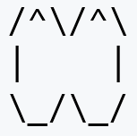
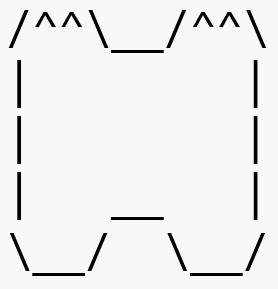
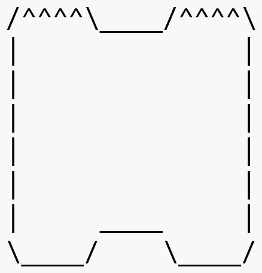
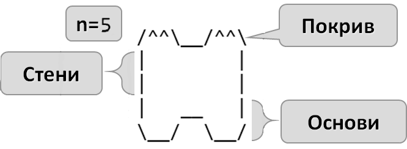
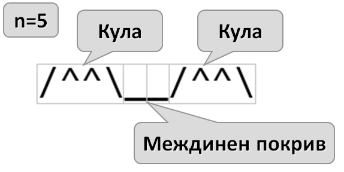
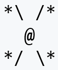
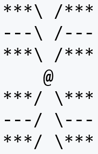
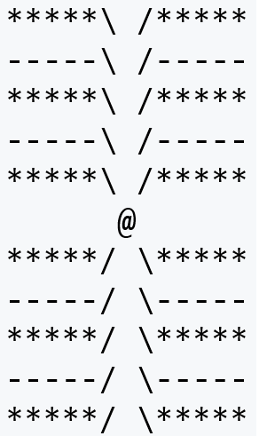
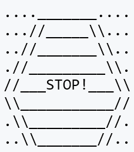
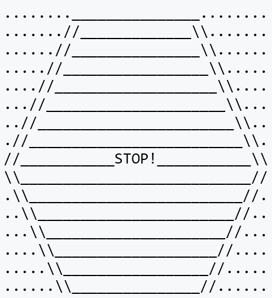

# Глава 6. Чертане на фигурки с цикли - изпитни задачи
В тази глава ще решим няколко задачи, включващи чертане на фигури с цикли, и ще разгледаме най-често срещаните бъгове.
## Чертане на крепост
*Пета задача от междинния изпит на 6 март 2016.*

Зададена ни е следната задача :
Да се напише програма, която прочита от конзолата цяло число **n** и чертае крепост с ширина **2 * n** колони и височина **n** реда. Лявата и дясната колона във вътрешността си са широки **n / 2**.

### Входни данни
Входът е цяло число **n** в интервала **[3…1000].**
### Изходни данни
Да се отпечатат на конзолата **n** текстови реда, изобразяващи **крепостта**, точно както в примерите.
### Примерен вход и изход
Следват няколко тестови примера, които ще са главният ни ориентир за писането на кода:

<div style="display:inline-block; border: 1px solid blue">Вход</div>
<div style="display:inline-block; border: 1px solid green">Изход</div>

<div style="display:inline-block; border: 1px solid blue">3</div>
<div style="display:inline-block; border: 1px solid green"></div>

<div style="display:inline-block; border: 1px solid blue">Вход</div>
<div style="display:inline-block; border: 1px solid green">Изход</div>

<div style="display:inline-block; border: 1px solid blue">4</div>
<div style="display:inline-block; border: 1px solid green"></div>

<div style="display:inline-block; border: 1px solid blue">Вход</div>
<div style="display:inline-block; border: 1px solid green">Изход</div>

<div style="display:inline-block; border: 1px solid blue">5</div>
<div style="display:inline-block; border: 1px solid green"></div>

<div style="display:inline-block; border: 1px solid blue">Вход</div>
<div style="display:inline-block; border: 1px solid green">Изход</div>

<div style="display:inline-block; border: 1px solid blue">8</div>
<div style="display:inline-block; border: 1px solid green"></div>

### Насоки и подсказки
За да "обединим" примерите в един алгоритъм, ще трябва да изследваме какво се повтаря във всеки пример. Разлгеждайки тестовите примери по редове, може да  разграничим различни групирания от редове.




Общи за примерите са три групи от редове :
- таван
- стени
- основи

**Таванът** винаги се състои само от **един** ред, а пък **основите** винаги - от **два**. Oсновите се рисуват на последните два реда.

Броят на редовете, на които са нарисувани стени, е различен за различните примери. Използвайки условието, можем да изчислим броят на стените:

```
редове за цялата крепост: n
редове за покрив: 1
редове за основи: 2
редове за стени: n - 3
```
Броят на редовете за стени ще е каквото когато махнем редовете за покрив и основи.

#### Рисуване на покрива
След като сме установили нужният брой от редове за всяка "част" от крепостта, ще започнем да пишем кодът, който ще я "рисува".

За тази цел, ще разделим тавана на няколко части, които са по лесни за рисуване:




Примерите ни показват, че покривът може да бъде разделен на **кули** и **междинна част**. Всяка кула се състои от начало **"/"**, среда **"^"** и край **"\\"**. Виждаме, че броят на средите "^" е равен на `n/2`.

Следователно, символите в една кула ще бъдат `n/2 + 2`.


TODO: Add Console.Write explanation

Следователно размерът на междинната част ще е `широчина на крепост - 2*широчина на кула`


След като сме нарисували и междинният покрив на замъкът, ни остава само да нарисуваме още една кула.

TODO: Add Console.WriteLine()


#### Рисуване на стените
Знаем, че трябва да начертаем `n-3` реда за стени.


Един такъв ред се състои от символ **"|"** в началото, няколко интервала и символ **"|"** в края. Следователно, броят на интервалите е равен на `n*2 - 2`


За да отидем на нов ред в конзолата, извикваме `Console.WriteLine()` без параметри.

#### Рисуване на основите

Основите се състоят от последните два реда.

Предпоследният ред е подобен на обикновен ред за стена, но по средата той съдържа няколко долни черти. Броят на долните черти е същият като този на покрива. Също така, ще рисуваме няколко интервала преди и след долните черти.

`Брой интервали = широчина на крепоста - широчина на междинна част - 2`


Последният ред от крепоста ни, наподобява първият.

### Тестване в Judge системата
TODO: Add adress

## Пеперуда
*Пета задача от междинния изпит на 26 март 2016.*

Да се напише програма, която прочита от конзолата цяло число **n** и чертае пеперуда с ширина **2 * n - 1** колони и височина **2 * (n - 2) + 1** реда като в примерите по-долу.  Лявата и дясната ѝ част са широки **n - 1**.

### Входни данни
Входът е цяло число **n** в интервала **[3…1000]**.
### Изходни данни
Да се отпечатат на конзолата **2 * (n - 2) + 1**  текстови реда, изобразяващи пеперудата.
### Примерен вход и изход

<div style="display:inline-block; border: 1px solid blue">Вход</div>
<div style="display:inline-block; border: 1px solid green">Изход</div>

<div style="display:inline-block; border: 1px solid blue">3</div>
<div style="display:inline-block; border: 1px solid green"></div>

<div style="display:inline-block; border: 1px solid blue">Вход</div>
<div style="display:inline-block; border: 1px solid green">Изход</div>

<div style="display:inline-block; border: 1px solid blue">5</div>
<div style="display:inline-block; border: 1px solid green"></div>

<div style="display:inline-block; border: 1px solid blue">Вход</div>
<div style="display:inline-block; border: 1px solid green">Изход</div>

<div style="display:inline-block; border: 1px solid blue">7</div>
<div style="display:inline-block; border: 1px solid green"></div>

### Насоки и подсказки
Примерният вход и изход ни показват, че има 2 вида редове:
1. Редове от звездички
2. Редове от тирета

Всеки един от тези редове е разделен от интервал на две еднакви части съставени от **n - 1** символа. В началото или в края на всяка една от тези части има наклонена една черта. Без наклонената черта ни остават **n - 2** символа, които са или звезда или тире. Може да сведем изрисуването на един единствен ред до следното:
```
Рисуване на n-2 звезди или тирета
Рисуване на \ /
Рисуване на n-2 звезди или тирета
```
Нека i е броят на ред, като считаме първият ред за нулев. Ще забележим, че ако i е четно число, тогава редът включва звезди, а ако i е нечетно число - редът включва тирета.

По средата на пеперудата има специален ред, който се състои от интервали и един единствен символ **@**. Преди него трябва да нарисуваме `n-1` интервали, което ни е зададено по условие като размерът на едно крило на пеперудата.

Височината на цялата фигура е `2 * (n-2) + 1`. Следователно, ще трябва да рисуваме само `2 * (n-2)` реда със звездички или тирета. Преди и след специалният ред ще трябва да рисуваме по `n-2` реда.

### Тестване в Judge системата

## Диамант
Да се напише програма, която прочита от конзолата цяло число **n** и **символ** и чертае **диамант** като този на примерите по долу.

### Входни данни
Входът се прочита от конзолата:
* На първият ред се прочита нечетното число **n** - размерът на диаманта.
* На вторият ред се прочита символът, от който фигурата трябва да е изградена.

### Изходни данни
Да се отпечатат на конзолата **n** текстови реда, съдържащи диамантът.

### Примерен вход и изход
<div style="display:inline-block; border: 1px solid blue">Вход</div>
<div style="display:inline-block; border: 1px solid green">Изход</div>

<div style="display:inline-block; border: 1px solid blue">5 <br> *</div>
<div style="display:inline-block; border: 1px solid green">
--*--<br>
-***-<br>
*****<br>
-***-<br>
--*--<br>
</div><br>

<div style="display:inline-block; border: 1px solid blue">Вход</div>
<div style="display:inline-block; border: 1px solid green">Изход</div>

<div style="display:inline-block; border: 1px solid blue">7 <br> @</div>
<div style="display:inline-block; border: 1px solid green">
---@---<br>
--@@@--<br>
-@@@@@-<br>
@@@@@@@<br>
-@@@@@-<br>
--@@@--<br>
---@---<br>
</div><br>

<div style="display:inline-block; border: 1px solid blue">Вход</div>
<div style="display:inline-block; border: 1px solid green">Изход</div>

<div style="display:inline-block; border: 1px solid blue">13 <br> a</div>
<div style="display:inline-block; border: 1px solid green">
------a------<br>
-----aaa-----<br>
----aaaaa----<br>
---aaaaaaa---<br>
--aaaaaaaaa--<br>
-aaaaaaaaaaa-<br>
aaaaaaaaaaaaa<br>
-aaaaaaaaaaa-<br>
--aaaaaaaaa--<br>
---aaaaaaa---<br>
----aaaaa----<br>
-----aaa-----<br>
------a------<br>
</div><br>

### Насоки и подсказки
Както в задачата за Знак "Стоп", може да разделим фигурата ни на две части : 
* Горна, в която диамантът се разширява
* Долна, в която диамантът се свива

Също така, нека да считаме средният ред, на който няма точки, към горната част.

#### Рисуване на горната част на фигурата
Нека броят на точки на един ред е i. На първият ред от горната част има `n-1` точки, а на последният, който е среден за фигурата, има 0 точки. На всеки ред точките са с 2 по-малко от предходният.

Тогава, на един ред трябва да начертаем `n-1` символа от диаманта и по `i/2` точки преди и след диаманта.

#### Рисуване на долната част на фигурата
За долната част знаем, че на първият ред от нея има 2 точки, а на последният има `n-1` точки. Също така знаем, че на всеки ред има с 2 точки повече от предходният.

Ако приемем, че i е броят на точките на един ред, ще трябва на всеки ред да рисуваме по `n-1` символа от диаманта и по `i/2` точки преди и след диаманта.

### Тестване в Judge системата

## Знак "Стоп"

Да се напише програма, която прочита от конзолата **цяло число N** и чертае **предупредителен знак STOP** с размери като в примерите по-долу.

### Входни данни

Входът е **цяло число N** в интервала **[3…1000]**.

### Изходни данни

Да се отпечатат на конзолата текстови редове, изобразяващи **предупредителния знак STOP**, точно както в примерите.

### Примерен вход и изход

<div style="display:inline-block; border: 1px solid blue">Вход</div>
<div style="display:inline-block; border: 1px solid green">Изход</div>

<div style="display:inline-block; border: 1px solid blue">3</div>
<div style="display:inline-block; border: 1px solid green"></div>

<div style="display:inline-block; border: 1px solid blue">Вход</div>
<div style="display:inline-block; border: 1px solid green">Изход</div>

<div style="display:inline-block; border: 1px solid blue">5</div>
<div style="display:inline-block; border: 1px solid green"></div>

<div style="display:inline-block; border: 1px solid blue">Вход</div>
<div style="display:inline-block; border: 1px solid green">Изход</div>

<div style="display:inline-block; border: 1px solid blue">7</div>
<div style="display:inline-block; border: 1px solid green"></div>

### Насоки и подсказки
В зависимост от идентичноста на редовете може ги разделим на:
1. Начален ред
2. Редове на които знакът се разширява
3. Ред със надпис STOP!
4. Редове на които знакът се смалява

#### Начален ред
Началният ред се състои от долни черти определящи таванът на знакът и точки преди и след това. Точките преди и след знакът са **n+1** на брой, а долните черти са **2 &#42; n + 1** на брой.

Използвайки откритото до момента можем да намерим и широчината на цялата фигура, като намерим сбора от широчините на частите от реда с точки и частите от реда с долни черто. Широчината на цялата фигура ще бъде `2(n+1) + 2*n + 1`. Ако разкрием скобите може да сведем уравнението до `4*n + 3`. Тази информация ще ние е от полза когато рисуваме по долната част от фигурата.

#### Редове, на които знакът се разширява
Нека да разгледаме областа от фигурата след началният ред и преди редът, на който пише стоп.

На първият ред, на тази част, има `n * 2` точки. На всеки следващ ред има с 2 по-малко . Това продължава надолу докато останат 0. От това разбираме, че броят на редовете, в които широчината на знакът расте е равен на **n**. 

Обхождайки редовете от горната част, може за всеки да изчислим широчината на знакът. Ако i е броят точки на даден ред, получаваме, че `широчина на знакът за ред = широчина на фигура - 2 * i`.

Когато заместим във формулата получаваме : `широчина на знак за ред = 4 * n + 3 - 2 * i`

На всеки ред има 4 наклонени черти. Следователно долните черти са `широчината на знакът за ред - 4`.

#### Ред със надис STOP!

Точките на редът със надпис "STOP!" са 0, а броят на наклонените черти е 4. Широчината на надписът е равна на 5 символа, което значи, че мястото за долни черти е `широчина на фигурата - 9`. Тези долни черти ще рисуваме на две части - преди и след надписът "STOP!" 

#### Редове, на които знакът се смалява
Остава ни да начертаем долната част на фигурата, на която знакът се смалява. На първият ред, има 0 точки а на посленият има `n+1`. Също така, на всеки ред има с 2 точки повече от предишният. Следователно, ще трябва да нарисуваме `(n+1)/2` реда, като на всеки ред точките стават повече.
 
### Тестване в Judge системата

## TODO: да се добавят още 2-3 изпитни задачи за чертане на фигурки