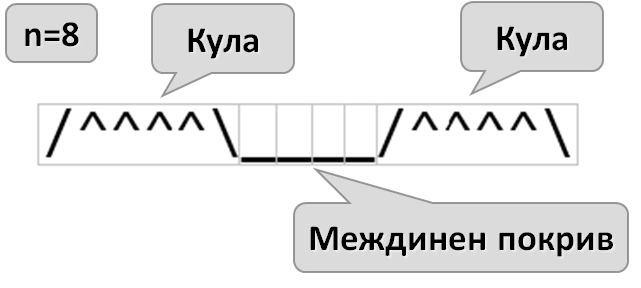

# Глава 6. Чертане на фигурки с цикли - изпитни задачи
В тази глава ще решим няколко задачи, включващи чертане на фигури с цикли, ще се запознаем с някои основни стратегии и ще разгледаме най-често срещаните бъгове. 
## Чертане на крепост
Зададена ни е следната задача
Да се напише програма, която прочита от конзолата цяло число **n** и чертае крепост с ширина **2 * n** колони и височина **n** реда. Лявата и дясната колона във вътрешността си са широки **n / 2**.

### Входни данни
Входът е цяло число **n** в интервала **[3…1000].**
### Изходни данни
Да се отпечатат на конзолата **n** текстови реда, изобразяващи **крепостта**, точно както в примерите.
### Примерен вход и изход
Следват няколко тестови примера, които ще са главният ни ориентир за писането на кода:

TODO: По добър начин за изобразяване на входно-изходни данни

### Насоки и подсказки
#### 1. Анализ на условието
За да може да "обединиме" примерите в един алгоритъм, ще трябва да изследваме какво се повтаря във всеки пример. Разлгеждайки тестовите примери по редове, може да  разграничим различни групирания от редове.


Разграничаваме три различни групи редове :
- таван
- стени
- основи

Също така виждаме, че **таванът** винаги се състои само от **един** ред, а пък **основите** винаги - от **два**. Голяма част от основите се рисуват на последният ред, но средната им част винаги се намира на предпоследният.

Забелязваме, че броят на редовете, на които са нарисувани само стени, не е еднакъв за различните примери. Използвайки даденото ни по условие, можем да изчислим броят на редовете (височината) на стените:

```
редове за цялата крепост: n
редове за покрив: 1
редове за основи: 2
редове за стени: n - 3
```
Редовете за стените ще са равни на височината на цялата крепост **(n)** без височината на покрива и основите.


#### 2.Рисуване на покрива
След като сме установили нужният брой от редове за всяка "част" от крепостта, ще започнем да пишем кодът, който ще я "рисува".

За тази цел, ще разделим тавана на няколко части, които са по лесни за рисуване:




Примерите ни показват, че покривът може да бъде разделен на **кули** и **междинна част**. Всяка кула се състои от начало **"/"**, среда **"^"** и край **"\\"**. Броят на символите за начало и край винаги е равен на едно. Като допълнение можем да забележим, че броят на средите "^" е равен на числото n/2 приравнено надолу. Например:
TODO: Оправяне на таблица
|n | Бр. "^" | Обяснение
|--- | --- | ---
|3 | 1 | 3/2=1.5
|4 | 2 | 4/2=2
|5 | 2 | 5/2=2.5
|8 | 4 | 8/2=4

Следователно, символите в една кула ще бъдат `Math.floor(n/2) + 2`.
**Забележка** : Math.floor - приравнява надолу.

***TODO***: да се направи картинка

Можем да изчислим размерът на междинната част:

```
Междинна широчина = широчина на крепост - 2*широчина на кула

Междинна широчина = 2*n - 2*( Math.floor(n/2) + 2 )
```


Ако заместим във формулата, ще забележим, че в примерите за **n<=4** междинната част се състои от **0** символа.

#### 3.Рисуване на стените

Един ред от стената се състои от символ **"|"** в началото, няколко интервала и символ **"|"** в края. Следователно, броят на интервалите ще бъде равен на `широчината на крепоста - 2` или `2*n - 2`.

TODO: Добавяне на код, по стъпките.

#### 4.Рисуване на основите

В частта на основите влизат последните два реда, тъй като свързващата част между основите на кулите не е част от последният ред. 

Предпоследният ред е подобен на обикновен ред за стена, но по средата той съдържа няколко символа за междинна част. Широчината на междинната част на основите е равна на широчината на междинната част на покрива. Преди и след междинната част състояща се от **"_"**, ще трябва да рисуваме няколко интервала. Точният им брой можем да намерим като от широчината на цялата крепост, извадим широчината на междинната част и мястото заемано от символите изграждащи стената **"|"**.

`Брой интервали = широчина на крепоста - широчина на междинна част - 2`

Ще разделим интервалите на две части, и ще рисуваме половината преди междинната част и половината след междинната част.

TODO: Да се добави обяснение защо интервалите винаги ще могат да се делят на 2

Последният ред от крепоста ни, наподобява първият. Него можем да направим като вземем кодът, който рисува първият ред и променим някои от символите.

### Тестване в Judge системата


## Пеперуда

TODO: описание

TODO: картинка

### Входни данни

### Изходни данни

### Примерен вход и изход

### Насоки и подсказки

### Тестване в Judge системата


## Знак "Стоп"

TODO: описание

TODO: картинка

### Входни данни

### Изходни данни

### Примерен вход и изход

### Насоки и подсказки

### Тестване в Judge системата


## TODO: да се добавят още 2-3 изпитни задачи за чертане на фигурки

