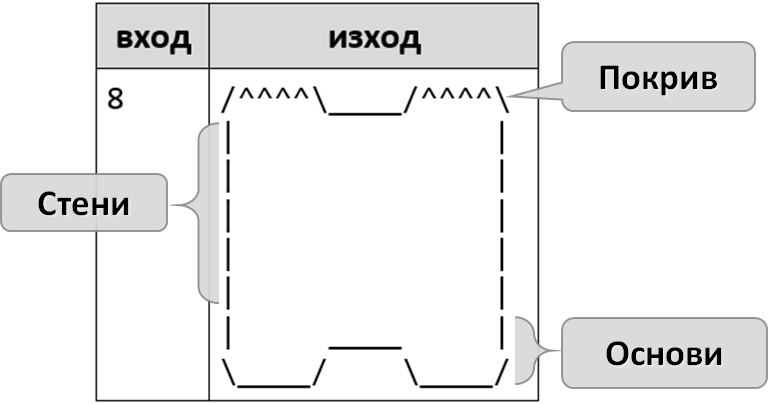
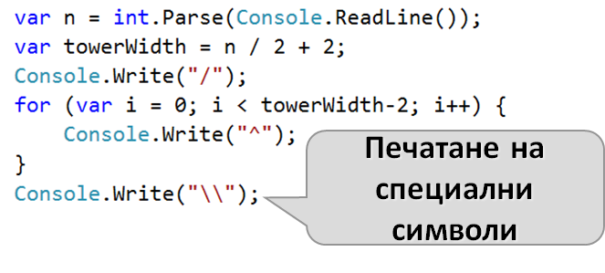
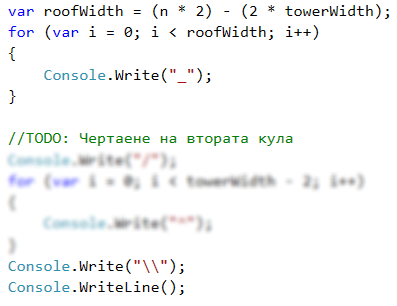
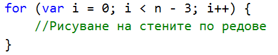
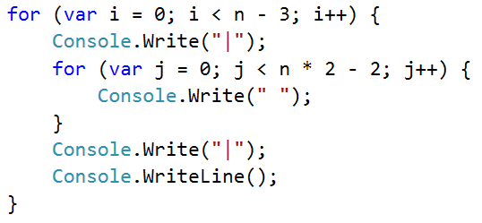
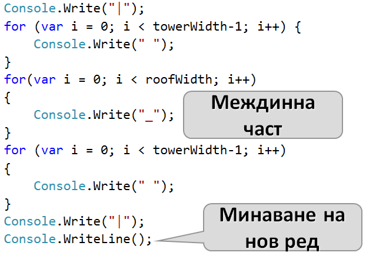
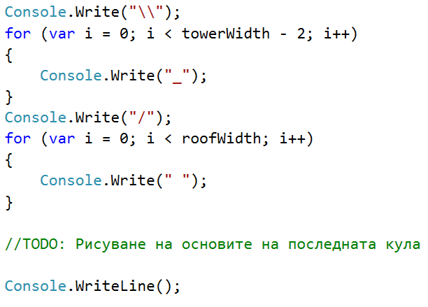

# Глава 6. Чертане на фигурки с цикли - изпитни задачи
В тази глава ще решим няколко задачи, включващи чертане на фигури с цикли, и ще разгледаме най-често срещаните бъгове.
## Чертане на крепост
*Пета задача от междинния изпит на 6 март 2016.*

Зададена ни е следната задача :
Да се напише програма, която прочита от конзолата цяло число **n** и чертае крепост с ширина **2 * n** колони и височина **n** реда. Лявата и дясната колона във вътрешността си са широки **n / 2**.

### Входни данни
Входът е цяло число **n** в интервала **[3…1000].**
### Изходни данни
Да се отпечатат на конзолата **n** текстови реда, изобразяващи **крепостта**, точно както в примерите.
### Примерен вход и изход
Следват няколко тестови примера, които ще са главният ни ориентир за писането на кода:

#### Вход:
<pre>
3
</pre>

#### Изход:
<pre>
/^\/^\
|    |
\_/\_/
</pre>

---

#### Вход:
<pre>
4
</pre>

#### Изход:
<pre>
/^^\/^^\
|      |
|      |
\__/\__/
</pre>

---

#### Вход:
<pre>
5
</pre>

#### Изход:
<pre>
/^^\__/^^\
|        |
|        |
|   __   |
\__/  \__/
</pre>

---

#### Вход:
<pre>
8
</pre>

#### Изход:
<pre>
/^^^^\____/^^^^\
|              |
|              |
|              |
|              |
|              |
|     ____     |
\____/    \____/
</pre>

### Насоки и подсказки
За да "обединим" примерите в един алгоритъм, ще трябва да изследваме какво се повтаря във всеки пример. Разлгеждайки тестовите примери по редове, може да  разграничим различни групирания от редове.

Общи за примерите са три групи от редове :
* таван
* стени
* основи

Таванът се рисува не първия ред, а основите на последните два.

Стените са каквото остава от височината на крепоста когато махнем основите и тавана.
Броят им ще е `n-3`.

#### Рисуване на покрива
След като сме установили нужният брой от редове за всяка "част" от крепостта, ще започнем да пишем кодът, който ще я "рисува".

За тази цел, ще разделим тавана на няколко части, които са по лесни за рисуване:

Таванът се състои от две кули и междинна част, която ги свързва. Всяка кула се състои от начало **"/"**, среда **"^"** и край **"\\"**. Броят на средите "^" е равен на `n/2`.

Когато добавим и наклонените черти (**"/"**,**"\\"**), широчината на една кула става `n/2+2`

***Чертане на първата кула:***

<table><tr><td></td>
<td>Използваме <b>Console.Write()</b> за да печатаме няколко пъти върху един ред от конзолата.</td>
</tr></table>

<table><tr><td></td>
<td>За да вкараме наклонена наляво черта в низ използваме <b>\\</b>. </td>
</tr></table>

Широчината на свързващата част между двете кули или "покрива" е това, което остава от широчината на цялата крепост като от нея махнем двете кули.

`Покрив = широчината на крепост - 2 * широчина на кула`.

***Чертане на покрива:***

Остава ни да нарисуваме втората кула. След като свършим с чертането на покрива, минаваме на нов ред.

<table><tr><td></td>
<td>Можем да минем на нов ред със <b>Console.WriteLine().</b></td>
</tr></table>

#### Рисуване на стените
Ще трябва да рисуваме `n-3` еднакви редове.

Един такъв ред се състои от двe ограждащи прави черти **"|"** и `2*n - 2` интервала.

#### Рисуване на основите

Основите се състоят от последните два реда.

На предпоследният ред трябва да нарисуваме ред за стена със няколко долни черти по средата. Те са толкова колкото са долните черти при покрива.

Броят на символи преди и след междинната част е равен на широчината на кула. Като изключим ограждащите символи те са `широчина на кула - 1`

Тях ще печатаме на две равни части преди и след междинната част.

Последният ред от крепоста наподобява първият. Трябва да нарисуваме основи на кулите и няколко интервала между тях.

### Тестване в Judge системата
TODO: Add adress

## Пеперуда
*Пета задача от междинния изпит на 26 март 2016.*

Да се напише програма, която прочита от конзолата цяло число **n** и чертае пеперуда с ширина **2 * n - 1** колони и височина **2 * (n - 2) + 1** реда като в примерите по-долу.  Лявата и дясната ѝ част са широки **n - 1**.

### Входни данни
Входът е цяло число **n** в интервала **[3…1000]**.
### Изходни данни
Да се отпечатат на конзолата **2 * (n - 2) + 1**  текстови реда, изобразяващи пеперудата.
### Примерен вход и изход

#### Вход:
<pre>
3
</pre>

#### Изход:
<pre>
*\ /*
  @
*/ \*
</pre>

---

#### Вход:
<pre>
5
</pre>

#### Изход:
<pre>
***\ /***
---\ /---
***\ /***
    @
***/ \***
---/ \---
***/ \***
</pre>

---

#### Вход:
<pre>
7
</pre>

#### Изход:
<pre>
*****\ /*****
-----\ /-----
*****\ /*****
-----\ /-----
*****\ /*****
      @
*****/ \*****
-----/ \-----
*****/ \*****
-----/ \-----
*****/ \*****
</pre>

### Насоки и подсказки
Пеперудата се състои от редове от тирета или звездички(крила) и един специален среден ред(тяло).

Без тялото ще трябва да чертаем `2*(n-2)` редове със звездички или черти. Ще ги чертаем поравно преди и след тялото.

Звездичките или тиретата на един ред от крилата са `широчина на пеперуда - 3` или `2*n - 4` и ще ги рисуваме на две равни части.

Започвайки номерацията на редовете от 0, ще трябва да чертаем звездичките на четни, а тиретата на нечетни редове.

Тялото на пеперудата се състои от интервали и един единствен символ `@`. Преди него трябва да рисуваме толкова интервали колкото са половината от тиретата или звездичките на един обикновен ред.

### Тестване в Judge системата

## Знак "Стоп"

Да се напише програма, която прочита от конзолата **цяло число N** и чертае **предупредителен знак STOP** с размери като в примерите по-долу.

### Входни данни

Входът е **цяло число N** в интервала **[3…1000]**.

### Изходни данни

Да се на конзолата текстови редове, изобразяващи **предупредителния знак STOP**, точно както в примерите.

### Примерен вход и изход

#### Вход:
<pre>
3
</pre>

#### Изход:
<pre>
...._______....
...//_____\\...
..//_______\\..
.//_________\\.
//___STOP!___\\
\\___________//
.\\_________//.
..\\_______//..
</pre>

---

#### Вход:
<pre>
6
</pre>

#### Изход:
<pre>
......._____________.......
......//___________\\......
.....//_____________\\.....
....//_______________\\....
...//_________________\\...
..//___________________\\..
.//_____________________\\.
//_________STOP!_________\\
\\_______________________//
.\\_____________________//.
..\\___________________//..
...\\_________________//...
....\\_______________//....
.....\\_____________//.....
</pre>

---

#### Вход:
<pre>
7
</pre>

#### Изход:
<pre>
........_______________........
.......//_____________\\.......
......//_______________\\......
.....//_________________\\.....
....//___________________\\....
...//_____________________\\...
..//_______________________\\..
.//_________________________\\.
//___________STOP!___________\\
\\___________________________//
.\\_________________________//.
..\\_______________________//..
...\\_____________________//...
....\\___________________//....
.....\\_________________//.....
......\\_______________//......
</pre>

### Насоки и подсказки
В зависимост от идентичноста на редовете може ги разделим на:
1. Начален ред
2. Редове на които знакът се разширява
3. Ред със надпис STOP!
4. Редове на които знакът се смалява

#### Начален ред
Началният ред се състои от долни черти определящи таванът на знакът и точки преди и след това. Точките преди и след знакът са **n+1** на брой, а долните черти са **2 &#42; n + 1** на брой.

Използвайки откритото до момента можем да намерим и широчината на цялата фигура, като намерим сбора от широчините на частите от реда с точки и частите от реда с долни черто. Широчината на цялата фигура ще бъде `2(n+1) + 2*n + 1`. Ако разкрием скобите може да сведем уравнението до `4*n + 3`. Тази информация ще ние е от полза когато рисуваме по долната част от фигурата.

#### Редове, на които знакът се разширява
Нека да разгледаме областа от фигурата след началният ред и преди редът, на който пише стоп.

На първият ред, на тази част, има `n * 2` точки. На всеки следващ ред има с 2 по-малко . Това продължава надолу докато останат 0. От това разбираме, че броят на редовете, в които широчината на знакът расте е равен на **n**. 

Обхождайки редовете от горната част, може за всеки да изчислим широчината на знакът. Ако i е броят точки на даден ред, получаваме, че `широчина на знакът за ред = широчина на фигура - 2 * i`.

Когато заместим във формулата получаваме : `широчина на знак за ред = 4 * n + 3 - 2 * i`

На всеки ред има 4 наклонени черти. Следователно долните черти са `широчината на знакът за ред - 4`.

#### Ред със надис STOP!

Точките на редът със надпис "STOP!" са 0, а броят на наклонените черти е 4. Широчината на надписът е равна на 5 символа, което значи, че мястото за долни черти е `широчина на фигурата - 9`. Тези долни черти ще рисуваме на две части - преди и след надписът "STOP!" 

#### Редове, на които знакът се смалява
Остава ни да начертаем долната част на фигурата, на която знакът се смалява. На първият ред, има 0 точки а на посленият има `n+1`. Също така, на всеки ред има с 2 точки повече от предишният. Следователно, ще трябва да нарисуваме `(n+1)/2` реда, като на всеки ред точките стават повече.
 
### Тестване в Judge системата

## Стрелка
https://softuni.bg/trainings/2/programming-basics-mar-2014 вариант 6
//TODO : Add better link

Да се напише програма, която прочита от конзолата цялото нечетно число **n** и чертае вертикална стреалка, точно както в примерите.

### Входни данни
Входът е цяло нечетно число **n** в интервала **[3…79]**.

### Изходни данни
Да се отпечата на конзолата вертикална стрелка, при която **"#"(диез)** индикира стрелката, а **"."(точка)** - останалото.

### Примерен вход и изход

#### Вход:
<pre>
3
</pre>

#### Изход:
<pre>
.###.
.#.#.
##.##
.#.#.
..#..
</pre>

---

#### Вход:
<pre>
5
</pre>

#### Изход:
<pre>
..#####..
..#...#..
..#...#..
..#...#..
###...###
.#.....#.
..#...#..
...#.#...
....#....
</pre>

---

#### Вход:
<pre>
9
</pre>

#### Изход:
<pre>
....#########....
....#.......#....
....#.......#....
....#.......#....
....#.......#....
....#.......#....
....#.......#....
....#.......#....
#####.......#####
.#.............#.
..#...........#..
...#.........#...
....#.......#....
.....#.....#.....
......#...#......
.......#.#.......
........#........
</pre>

### Насоки и подсказки

### Тестване в Judge системата

## Окръжност
https://softuni.bg/trainings/2/programming-basics-mar-2014 вариант 9
//TODO : Add better link

Да се напише програма, която прочита от конзолата цяло нечетно число **n** и радиус **r** и чертае окръжност в центъра на полето с радиус **r**.

### Входни данни
**N** е цяло нечетно число в интервала **[3…39]**.

**R** e цяло число в интервала **[1…n/2]**.

### Изходни данни
Да се отпечатат на конзолата **n** реда с по **n** символа. Всеки символ представлява точка. За всяка точка трябва да печатате едно от две възможни състояния - **точка "."** ако дадената точка лежи извън полето или **звезда " * "** ако дадената точка лежи в окръжноста.

**Подсказка:** използвайте Питагоровата Теорема (вижте http://goo.gl/HwqOuU).
### Примерен вход и изход

#### Вход:
<pre>
5
2
</pre>

#### Изход:
<pre>
..*..
.***.
*****
.***.
..*..
</pre>

---

#### Вход:
<pre>
9
3
</pre>

#### Изход:
<pre>
.........
....*....
..*****..
..*****..
.*******.
..*****..
..*****..
....*....
.........
</pre>

---

#### Вход:
<pre>
11
1
</pre>

#### Изход:
<pre>
...........
...........
...........
...........
.....*.....
....***....
.....*.....
...........
...........
...........
...........
</pre>

---

#### Вход:
<pre>
19
6
</pre>

#### Изход:
<pre>
...................
...................
...................
.........*.........
......*******......
.....*********.....
....***********....
....***********....
....***********....
...*************...
....***********....
....***********....
....***********....
.....*********.....
......*******......
.........*.........
...................
...................
...................
</pre>

### Насоки и подсказки
Задачата може да се реши като рисуваме **n** реда с по **n** символа и за всеки един чрез Питагоровата Теорема изчисляваме растоянието от центъра на окръжноста. Сравнявайки разстоянието с радиусът **r**, установяваме дали разглежданата точка лежи в окръжността и рисуваме съотвения символ.

### Тестване в Judge системата

## TODO: да се добавят още 2-3 изпитни задачи за чертане на фигурки