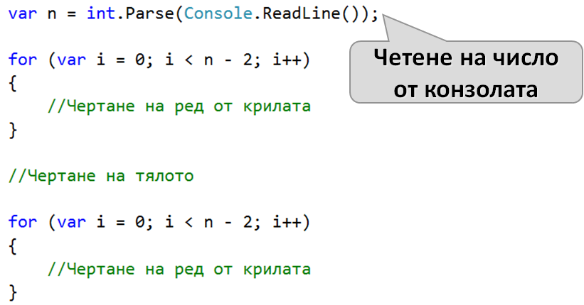
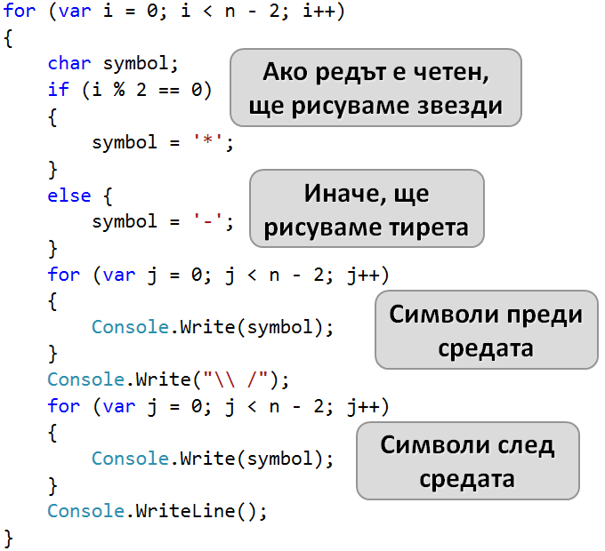
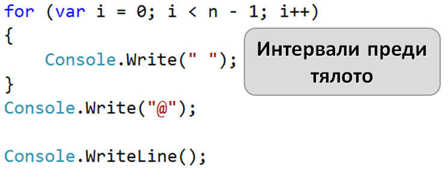
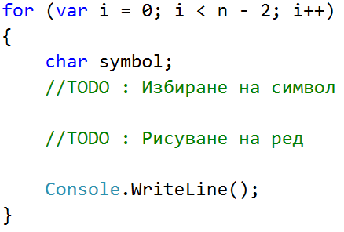
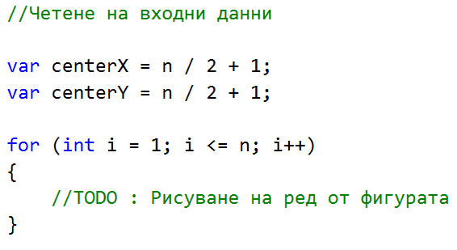

# Глава 6. Чертане на фигурки с цикли - изпитни задачи

## Чертане на крепост

Да се напише програма, която прочита от конзолата **цяло число n** и чертае **крепост** с ширина **2 * n колони** и височина **n реда** като в примерите по-долу. Лявата и дясната колона във вътрешността си са широки **n / 2**.

### Входни данни
Входът е **цяло число n** в интервала **[3…1000]**.

### Изходни данни
Да се отпечатат на конзолата **n** текстови реда, изобразяващи **крепостта**, точно както в примерите.

### Примерен вход и изход
Следват няколко тестови примера, които ще са главният ни ориентир за писането на кода:

#### Вход:
```
3
```

#### Изход:
```
/^\/^\
|    |
\_/\_/
```

---

#### Вход:
```
4
```

#### Изход:
```
/^^\/^^\
|      |
|      |
\__/\__/
```

---

#### Вход:
```
5
```

#### Изход:
```
/^^\__/^^\
|        |
|        |
|   __   |
\__/  \__/
```

---

#### Вход:
```
8
```

#### Изход:
```
/^^^^\____/^^^^\
|              |
|              |
|              |
|              |
|              |
|     ____     |
\____/    \____/
```

### Насоки и подсказки

В условието на задачата е дадена **информация за входа и изхода**. Съответно, *първият ред* от решението ще съдържа декларирането и инициализирането на **променлива**, в която ще пазим **стойността на входните данни**. **Упоменато** е, че съдържа **цяло число**, затова и променливата, която ще бъде декларирана, е от тип `int`


След като вече сме декларирали и инициализирали входните данни, трябва да разделим крепостта на три части:
* покрив
* стени
* основа

От примерите можем да разберем, че покрива е съставен от **две кули** и **междинна част**. Всяка кула се състои от начало `/`, среда `^` и край `\\`.

!Използваме "\\" вместо "\", защото наклонената черта наляво е специален символ и за да я избегнем я удвояваме

<table><tr><td></td>
<td>Използваме <b>\\</b> вместо <b>\</b>, защото наклонената наляво черта е специален символ и за да я избегнем я удвояваме</td>
</tr></table>

Средата е с размер равен на `n / 2`, следователно можем да отделим тази стойност в отделна **променлива**. Тя ще пази **стойността** на средата на кулата.


Декларираме си и втора **променлива**, в която ще пазим **стойността** на частта **между двете кули**. Междинната част на покрива е с размер  `2 * n - 2 * colSize - 4`


За да изпечатаме на конзолата покирва, ще използваме функцията `new string`, която приема два параметъра `(char, int)` и съединява даден символ, n брой пъти.


Стените в крепостта се състоят от начало `|`, среда " " и край `|`. Средaта от празно място е със големина `2 * n - 2`. Броят на редовете за стени, можем да определим от дадените ни примери - `n -3`


За да нарисуваме предпоследният ред, който е част от основата, трябва да изпечатаме начало `|`, среда " " + `_` + " " и край `|`. За да направим това можем да преизползваме вече декларираните от нас променливи `colSize` и `midSize`.


Добавяме към стойността на празните места `+ 1`, защото в примерите имаме едно празно място повече.

Структурата на основата на крепостта е еднаква с тази покрива. Съставена е от две кули и междинна част. Кулата има начало `\\`, среда `_` и край `/`.


### Тестване в Judge системата
https://judge.softuni.bg/Contests/Practice/Index/513#0


## Пеперуда

Да се напише програма, която прочита от конзолата цяло число **n** и чертае пеперуда с ширина **2 * n - 1** колони и височина **2 * (n - 2) + 1** реда като в примерите по-долу.  Лявата и дясната ѝ част са широки **n - 1**.

### Входни данни
Входът е цяло число **n** в интервала **[3…1000]**.
### Изходни данни
Да се отпечатат на конзолата **2 * (n - 2) + 1**  текстови реда, изобразяващи пеперудата.
### Примерен вход и изход

#### Вход:
```
3
```

#### Изход:
```
*\ /*
  @
*/ \*
```

---

#### Вход:
```
5
```

#### Изход:
```
***\ /***
---\ /---
***\ /***
    @
***/ \***
---/ \---
***/ \***
```

---

#### Вход:
```
7
```

#### Изход:
```
*****\ /*****
-----\ /-----
*****\ /*****
-----\ /-----
*****\ /*****
      @
*****/ \*****
-----/ \-----
*****/ \*****
-----/ \-----
*****/ \*****
```

### Насоки и подсказки
Пеперудата се състои от редове от тирета или звездички(крила) и един специален среден ред(тяло).

Без тялото ще трябва да чертаем `2*(n-2)` редове със звездички или черти. Ще ги чертаем поравно преди и след тялото.



Звездичките или тиретата на един ред от крилата са `широчина на пеперуда - 3` или `2*n - 4` и ще ги рисуваме на две равни части.

Започвайки номерацията на редовете от 0, ще чертаем звездичките на четни, а тиретата на нечетни редове. 



Тялото на пеперудата се състои от интервали и един единствен символ `@`. Преди него трябва да рисуваме толкова интервали колкото са половината от тиретата или звездичките на един обикновен ред.



След като сме нарисували тялото ни остава само да нарисуваме и долната половина от пеперудата по подобие на горната.



### Тестване в Judge системата
https://judge.softuni.bg/Contests/Practice/Index/513#1

## Знак "Стоп"

Да се напише програма, която прочита от конзолата **цяло число N** и чертае **предупредителен знак STOP** с размери като в примерите по-долу.

### Входни данни

Входът е **цяло число N** в интервала **[3…1000]**.

### Изходни данни

Да се на конзолата текстови редове, изобразяващи **предупредителния знак STOP**, точно както в примерите.

### Примерен вход и изход

#### Вход:
```
3
```

#### Изход:
```
...._______....
...//_____\\...
..//_______\\..
.//_________\\.
//___STOP!___\\
\\___________//
.\\_________//.
..\\_______//..
```

---

#### Вход:
```
6
```

#### Изход:
```
......._____________.......
......//___________\\......
.....//_____________\\.....
....//_______________\\....
...//_________________\\...
..//___________________\\..
.//_____________________\\.
//_________STOP!_________\\
\\_______________________//
.\\_____________________//.
..\\___________________//..
...\\_________________//...
....\\_______________//....
.....\\_____________//.....
```

---

#### Вход:
```
7
```

#### Изход:
```
........_______________........
.......//_____________\\.......
......//_______________\\......
.....//_________________\\.....
....//___________________\\....
...//_____________________\\...
..//_______________________\\..
.//_________________________\\.
//___________STOP!___________\\
\\___________________________//
.\\_________________________//.
..\\_______________________//..
...\\_____________________//...
....\\___________________//....
.....\\_________________//.....
......\\_______________//......
```

### Насоки и подсказки
##TODO : Преработка на обяснение
В зависимост от редовете, на фигурата има:
1. Начален ред
2. Редове на които знакът се разширява
3. Ред със надпис STOP!
4. Редове на които знакът се смалява

#### Начален ред
Началният ред се състои от долни черти определящи таванът на знакът и точки преди и след това. Точките са `n+1` на брой, а долните черти са `2 * n + 1` на брой.

Използвайки откритото до момента можем да намерим и широчината на цялата фигура, като намерим сбора от широчините на частите от реда с точки и частите от реда с долни черти. Широчината на цялата фигура ще бъде `2(n+1) + 2*n + 1` или `4*n + 3`. Тази информация ще ние е от полза когато рисуваме по долната част от фигурата.

#### Редове, на които знакът се разширява
Нека да разгледаме областа от фигурата след началният ред и преди редът, на който пише стоп.

На първият ред, на тази част, има `n * 2` точки. На всеки следващ ред има с 2 по-малко . Това продължава надолу докато останат 0. От това разбираме, че броят на редовете, в които широчината на знакът расте е равен на **n**. 

Обхождайки редовете от горната част, може за всеки да изчислим широчината на знакът. Ако i е броят точки на даден ред, получаваме, че `широчина на знакът за ред = широчина на фигура - 2 * i`.

Когато заместим във формулата получаваме : `широчина на знак за ред = 4 * n + 3 - 2 * i`

На всеки ред има 4 наклонени черти. Следователно долните черти са `широчината на знакът за ред - 4`.

#### Ред със надис STOP!

Точките на редът със надпис "STOP!" са 0, а броят на наклонените черти е 4. Широчината на надписът е равна на 5 символа, което значи, че мястото за долни черти е `широчина на фигурата - 9`. Тези долни черти ще рисуваме на две части - преди и след надписът "STOP!" 

#### Редове, на които знакът се смалява
Остава ни да начертаем долната част на фигурата, на която знакът се смалява. На първият ред, има 0 точки а на посленият има `n+1`. Също така, на всеки ред има с 2 точки повече от предишният. Следователно, ще трябва да нарисуваме `(n+1)/2` реда, като на всеки ред точките стават повече.

### Тестване в Judge системата
https://judge.softuni.bg/Contests/Practice/Index/513#2

## Стрелка

Да се напише програма, която прочита от конзолата цялото нечетно число **n** и чертае вертикална стреалка, точно както в примерите.

### Входни данни
Входът е цяло нечетно число **n** в интервала **[3…79]**.

### Изходни данни
Да се отпечата на конзолата вертикална стрелка, при която **"#"(диез)** индикира стрелката, а **"."(точка)** - останалото.

### Примерен вход и изход

#### Вход:
```
3
```

#### Изход:
```
.###.
.#.#.
##.##
.#.#.
..#..
```

---

#### Вход:
```
5
```

#### Изход:
```
..#####..
..#...#..
..#...#..
..#...#..
###...###
.#.....#.
..#...#..
...#.#...
....#....
```

---

#### Вход:
```
9
```

#### Изход:
```
....#########....
....#.......#....
....#.......#....
....#.......#....
....#.......#....
....#.......#....
....#.......#....
....#.......#....
#####.......#####
.#.............#.
..#...........#..
...#.........#...
....#.......#....
.....#.....#.....
......#...#......
.......#.#.......
........#........
```

### Насоки и подсказки
Фигурата се състои от `2*n - 1` реда, всеки от по `2*n - 1` символа.

Първият ред от фигурата е началото на стрелката и се състои от `n` символа образуващи стрелката и `n-1` точки, разделени поравно в началото и края на реда.

Следва да начертаем `n-2` идентични реда, в които ще трябва да нарисуваме сегмент от стрелката съставен от 2 символа за стрелка и `n-2` точки, както и ще трябва да нарисуваме `n-1` точки, разделени поравно в началото и края на реда.

Следващият ред е съставен от `n-2` точки по средата и символи за стрелка. Броят на символите за стрелка е останалото, когато от широчината на фигурата извадим броят на точките на този ред.

Последните `n-2` са част от върхът на стрелката. На първият ред от върхът, има сегмент от стрелката (съставен от два символа за стрелка и точки) обграден от две точки. На всеки следващ ред точките преди и след сегментът стават с по 1 повече, а точките във сегментът се увеличават с 2.

На последният ред има символ за стрелка и по `n` точки преди и след него.

### Тестване в Judge системата


## Окръжност

Да се напише програма, която прочита от конзолата цяло нечетно число **n** и радиус **r** и чертае окръжност в центъра на полето с радиус **r**.

### Входни данни
**N** е цяло нечетно число в интервала **[3…39]**.

**R** e цяло число в интервала **[1…n/2]**.

### Изходни данни
Да се отпечатат на конзолата **n** реда с по **n** символа. Всеки символ представлява точка. За всяка точка трябва да печатате едно от две възможни състояния - **точка "."** ако дадената точка лежи извън полето или **звезда " * "** ако дадената точка лежи в окръжноста.

**Подсказка:** използвайте Питагоровата Теорема (вижте http://goo.gl/HwqOuU).
### Примерен вход и изход

#### Вход:
```
5
2
```

#### Изход:
```
..*..
.***.
*****
.***.
..*..
```

---

#### Вход:
```
9
3
```

#### Изход:
```
.........
....*....
..*****..
..*****..
.*******.
..*****..
..*****..
....*....
.........
```

---

#### Вход:
```
11
1
```

#### Изход:
```
...........
...........
...........
...........
.....*.....
....***....
.....*.....
...........
...........
...........
...........
```

---

#### Вход:
```
19
6
```

#### Изход:
```
...................
...................
...................
.........*.........
......*******......
.....*********.....
....***********....
....***********....
....***********....
...*************...
....***********....
....***********....
....***********....
.....*********.....
......*******......
.........*.........
...................
...................
...................
```

### Насоки и подсказки
Задачата може да се реши като рисуваме **n** реда с по **n** символа и за всеки един чрез Питагоровата Теорема изчисляваме растоянието от центъра на окръжноста. Сравнявайки разстоянието с радиусът **r**, установяваме дали разглежданата точка лежи в окръжността и рисуваме съотвения символ.



### Тестване в Judge системата
https://judge.softuni.bg/Contests/Practice/Index/513#4
