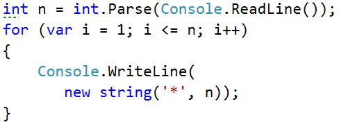
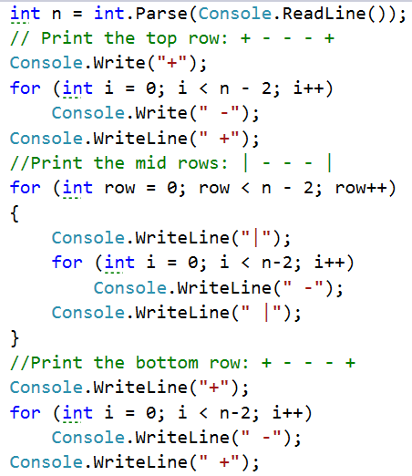

# Глава 6. Чертане на фигурки с цикли

В настоящата глава ще разгледаме как да използваме **`for`** цикли за **чертане** на различни **фигурки на конзолата**. Ще използваме **единични и вложени цикли** (цикли един в друг), за да чертаем прости или не чак толкова прости фигурки в конзолата.

## Видео

<div class="video-player">
  Гледайте видео-урок по тази глава тук: <a target="\_blank"
  href="https://www.youtube.com/watch?v=x7zXRCpkebo">
  https://www.youtube.com/watch?v=x7zXRCpkebo</a>.

</div>
<script src="/assets/js/video.js"></script>

### Задача: Правоъгълник от 10 x 10 звездички

Да се начертае в конзолата правоъгълник от **10 x 10** звездички.

#### Входни данни
Не се чете нищо от конзолата.

#### Изходни данни
Да се изпечатат в конзолата **10** реда с по **10** звездички.

#### Примерен изход

<code>\*\*\*\*\*\*\*\*\*\*</code><br><code>\*\*\*\*\*\*\*\*\*\*</code><br><code>\*\*\*\*\*\*\*\*\*\*</code><br><code>\*\*\*\*\*\*\*\*\*\*</code><br><code>\*\*\*\*\*\*\*\*\*\*</code><br><code>\*\*\*\*\*\*\*\*\*\*</code><br><code>\*\*\*\*\*\*\*\*\*\*</code><br><code>\*\*\*\*\*\*\*\*\*\*</code><br><code>\*\*\*\*\*\*\*\*\*\*</code><br><code>\*\*\*\*\*\*\*\*\*\*</code>

#### Насоки и посказки

```cs
for (var i = 1; i <= 10; i++)
{
   Console.WriteLine(new string('*', 10));
}
```
// TODO: image

Как работи примерът?
Инициализира се **цикъл с променлива `i = 1`**, която ще се увеличава на всяка итерация на цикъла, докато е **по-малка или равна на 10**. Така кодът в тялото на цикълът ще се изпълни **10 пъти**. В тялото на цикъла се печата на нов ред в конзолата **`new string('*',10)`**, което създава низ от 10 звездички.

#### Тестване в Judge системата

Тествайте решението си тук: https://judge.softuni.bg/Contests/Practice/Index/155#0

### Задача: Правоъгълник от N x N звездички

Да се начертае в конзолата правоъгълник от **N x N** звездички.

#### Входни данни

Входът е цялоto число **N**.

#### Изходни данни

Да се изпечатат в конзолата **N** реда с по **N** звездички.

#### Примерен вход и изход

#### Насоки и подсказки

```cs
int n = int.Parse(Console.ReadLine());
for (var i = 1; i <= n; i++)
{
   Console.WriteLine(
      new string('*', n));
}
```
// TODO: image


## Вложени цикли

Вложените цикли представляват конструкция от няколко цикъла, разположени един в друг.

Пример: външен цикъл по ред (по row) и вътрешен цикъл по колона (по col).

```cs
for (var row = 1; row <= n; row++)
{
   for (var col = 1; col <= n; col++)
      Console.Write("*");
   Console.WriteLine();
}
```
//TODO: image


След инициализацията на първия цикъл ще започне да се изпълнява неговото тяло, което съдържа втория (вложения) цикъл. Той сам по себе си печата на екрана `n` на брой звездички. След което външния цикъл ще продължи, ще отпечата един празен ред на конзолата, ще се извърши обновяване на неговата променлива и отново ще бъде изпълнен целия втори цикъл. Вътрешният цикъл ще се изпълни толкова пъти, колкото се изпълнява тялото на външния цикъл тоест `n` пъти.

//TODO: Да се добявят обяснения.

//TODO: Да се премахне кодът, който може да се копира.



### Тестване в Judge системата

Тествайте решението си тук: https://judge.softuni.bg/Contests/Practice/Index/155#1

## Квадрат от звездички

Да се начертае на конзолата квадрат от **N x N** звездички:

### Входни данни

Входът е цялотo число **N**.

### Изходни данни

Да се изпечатат в конзолата **N** реда с по **N * 2** символа.

### Примерен вход и изход

### Насоки и подсказки

//TODO: Да се добавят обяснения

```cs
var n = int.Parse(Console.ReadLine());
for (var r = 1; r <= n; r++)
{
   Console.Write("*");
   for (var c = 1; c < n; c++)
      Console.Write(" *");
   Console.WriteLine();
}
```

//TODO: Да се премахне или оправи кодът, който може да се копира.


### Тестване в Judge системата

Тествайте решението си тук: https://judge.softuni.bg/Contests/Practice/Index/155#2

## Триъгълник от долари

Да се начертае триъгълник от долари с размер **N**.

### Входни данни

Входът е цялотo число **N**.

### Изходни данни

Да се изпечата в конзолата триъгълник с размер **N** като в примерите по долу.

### Примерен вход и изход

N = 2
<pre>
$
$ $
</pre>

N = 3
<pre>
$
$ $
$ $ $
</pre>

N = 4
<pre>
$
$ $
$ $ $
$ $ $ $
</pre>

N = 5
<pre>
$
$ $
$ $ $
$ $ $ $
$ $ $ $ $
</pre>

### Насоки и подсказки

//TODO: Да се добавят обяснения.

```cs
var n = int.Parse(Console.ReadLine());
for (var row = 1; row <= n; row++)
{
   Console.Write("$");
   for (var col = 1; col < row; col++)
      Console.Write(" $");
   Console.WriteLine();
}
```

//TODO: Да се оправи или премахне кодът, който може да се копира.

//TODO: Да се добави картинка.

### Тестване в Judge системата

Тествайте решението си тук: https://judge.softuni.bg/Contests/Practice/Index/155#3

## Квадратна рамка

Да се начертае в конзолата квадратна рамка с размер **N**.

### Входни данни

Входът е цялотo число **N**.

### Изходни данни

Да се изпечата в конзолата  квадратна рамка с размери **N * N** като в примерите по-долу.

### Примерен вход и изход

N = 3
<pre>
+ - +
| - |
+ - +
</pre>

N = 4
<pre>
+ - - +
| - - |
| - - |
+ - - +
</pre>

N = 5
<pre>
+ - - - +
| - - - |
| - - - |
| - - - |
+ - - - +
</pre>

N = 6
<pre>
+ - - - - +
| - - - - |
| - - - - |
| - - - - |
| - - - - |
+ - - - - +
</pre>

### Насоки и подсказки

//TODO: Да се удължат обясненията.

Можем да решим задачата по следния начин:
- Четем от конзолата числото `n`.
- Отпечатваме горната част: първо `+`, после n-2 пъти ` -` и накрая `+`.
- Отпечатваме средната част: печатаме n-2 реда като първо `|`, после n-2 пъти ` -` и накрая `|`. Това можем да постигнем с вложени цикли.
- Отпечатваме долната част: първо `+`, после n-2 пъти ` -` и накрая `+`.

```cs
// Print the top row: + - - - +
Console.Write("+");
for (int i = 0; i < n-2; i++)
   Console.Write(" -");
Console.WriteLine(" +");
for (int row = 0; row < n - 2; row++)
   // TODO: print the mid rows: | - - - |
// TODO: print the bottom row: + - - - +
```

//TODO: Да се премахне или оправи кодът, който може да се копира.



### Тестване в Judge системата

Тествайте решението си тук: https://judge.softuni.bg/Contests/Practice/Index/155#4

## Ромбче от звездички

Да се начертае в конзолата ромбче от звездички с размер **N**.

### Входни данни

Входът е цялотo число **N**.

### Изходни данни

Да се изпечата в конзолата ромбче като в примерите по-долу.

### Примерен вход и изход

N = 1
<pre>
*
</pre>

N = 2
<pre>
 *
* *
 *
</pre>

N = 3
<pre>
  *
 * *
* * *
 * *
  *
</pre>

N = 4
<pre>
   *
  * *
 * * *
* * * *
 * * *
  * *
   *
</pre>

### Насоки и подсказки

//TODO: Да се добавят обяснения.

```cs
for (var row = 1; row <= n; row++)
{
    for (var col = 1; col <= n-row; col++)
        Console.Write(" ");
    Console.Write("*");
    for (var col = 1; col < row; col++)
        Console.Write(" *");
    Console.WriteLine();
}
// TODO: print the down side of the rhomb
```

//TODO: Да се премахне или оправи кодът, който може да се копира.

//TODO: Да се добави картинка.

### Тестване в Judge системата

Тествайте решението си тук: https://judge.softuni.bg/Contests/Practice/Index/155#5

## Коледна елха

Напишете програма, която чете число **n** и печата коледна елха на **n+1** реда като в примерите по-долу.

### Входни данни

Входът е цялотo число **N**.

### Изходни данни

Да се изпечата в конзолата елха като в примерите по-долу.

### Примерен вход и изход

N = 1
<pre>
  |
* | *
</pre>

N = 2
<pre>
   |
 * | *
** | **
</pre>

N = 3
<pre>
    |
  * | *
 ** | **
*** | ***
</pre>

N = 4
<pre>
     |
   * | *
  ** | **
 *** | ***
**** | ****
</pre>

### Насоки и подсказки

//TODO: Да се добавят обяснения.

```cs
int n = int.Parse(Console.ReadLine());
for (int i = 0; i <= n; i++)
{
   var stars = new string('*', i);
   var spaces = new string(' ', n - i);
   Console.Write(spaces);
   Console.Write(stars);
   Console.Write(" | ");
   Console.Write(stars);
   Console.WriteLine(spaces);
}
```

//TODO: Да се добави картинка.

//TODO: Да се премахне кодът, който може да се копира.

### Тестване в Judge системата

Тествайте решението си тук: https://judge.softuni.bg/Contests/Practice/Index/155#6

## Чертане на по-сложни фигури

Работа с вложени цикли и проверки.

//TODO: Да се удължи обяснението.

//TODO: Може би да се премахне. Не виждам много смисъл от тази част - Димитър Татарски (tatarski)

## Слънчеви очила

Да се напише програма, която чете цяло число **N** (3 ≤ n ≤ 100) и печата слънчеви очила с размер  **5 * N x N** като в примерите.

### Входни данни

Входът е цялотo число **N**.

### Изходни данни

Да се изпечата в конзолата фигура като в примерите по-долу.

### Примерен вход и изход

N = 3
<pre>
******   ******
*////*|||*////*
******   ******
</pre>

N = 4
<pre>
********    ********
*//////*||||*//////*
*//////*    *//////*
********    ********
</pre>

### Насоки и подсказки

//TODO: Да се добавят обяснения.

```cs
// Print the top part
Console.Write(new string('*', 2 * n));
Console.Write(new string(' ', n));
Console.WriteLine(new string('*', 2 * n));
for (int i = 0; i < n - 2; i++)
{
   // TODO: print the middle part
}
// Print the bottom part
Console.Write(new string('*', 2 * n));
Console.Write(new string(' ', n));
Console.WriteLine(new string('*', 2 * n));
```

Печатане на средната част:

```cs
// Print the middle part
for (int i = 0; i < n - 2; i++)
{
   // TODO: print *///////*
   if (i == (n-1) / 2 - 1)
      Console.Write(new string('|', n));
   else
      Console.Write(new string(' ', n));
   // TODO: print *///////*
   Console.WriteLine();
}
```

//TODO: Да се добави картинка

//TODO: Да се оправи или премахне кодът, който може да се копира.

### Тестване в Judge системата

Тествайте решението си тук: https://judge.softuni.bg/Contests/Practice/Index/155#7

## Къщичка

Напишете програма, която чете цяло число **N** и печата къщичка с размер **N * N**.

### Входни данни

От конзолата се чете числото **N**.

### Изходни данни

Да се отпечата къщичка с размери **N * N** като в примерите по-долу.

### Примерен вход и изход

N = 3
<pre>
-*-
***
|*|
</pre>

N = 4
<pre>
-**-
****
|**|
|**|
</pre>

N = 5
<pre>
--*--
-***-
*****
|***|
|***|
</pre>

N = 8
<pre>
---**---
--****--
-******-
********
|******|
|******|
|******|
|******|
</pre>

### Насоки и подсказки

#### Каква информация ни носи условието?

Това което знаем от условието на задачата е че къщата ще ни е с размер **n x n**

Това което може да видим от примерният вход и изход е че:

//TODO: Преоразмеряване на снимките

* Къщичката е разделена на 2 части. **Покрив и основа**. 
* Когато **n** е четно число, върха на къщичката е "тъп". 
* Когато **n** е нечетно число, **покрива** е с 1 ред по-дълъг от **основата**.

**Покривът**:
* Е съставен от: **Звездички** и **Долни черти**
* в най-високата си част има една или две звездички, спрямо това дали **n** e четно: или нечетно, и много долни черти
* в най-ниската си част има много звездички и малко никакви долни черти
* С всеки един ред по-надолу, **звездичките** се увеличават с 2, а **долните черти** намаляват с 2

**Основата**:
* Е дълга **n** на брой редове
* Е съставена от: **Звездички** и **Черти**
* Редовете представляват сандвич от 2 **черти**, от началото и в края на реда, и **звездички** между чертите с дължина `**n** - 2`.  

#### След като знаем условието, как ще решим задачата?

Прочитаме **n** от конзолата и го превръщаме в тип **Integer**.  


<table><tr><td></td>
<td><b>Много е важно да проверяваме дали са валидни входните данни!</b> В тези задачи не е проблем директно да обръщаме прочетеното от конзолата в тип <b>Integer</b>, защото изрично е казано че ще получаваме валидни целочислени числа. Ако обаче правите истински приложения е добра практика да проверявате данните. Какво ще стане ако вместо потребителя въведе число въведе буквата "А"?</td>
</tr></table>

За да начертаем **покрива**:
* Записваме колко ще е началният брой **звездички** в промелива **stars**.
  * Ако **n** е четно число ще са 2 броя.
  * Ако е нечетно ще е 1 брой.


Изчисляваме дължината на **покрива**. Тя е равна на половината от **n**. Резултата го записваме в променливата **roofHeight**


Важно е да се отбележи че, когато **n** е нечетно число, дължината на покрива е по-голяма, с 1 ред, от тази на **основата**. В **C#** когато два целочислени типа се делят и има остатък, то резултата ще е числото без остатъка.

Пример:

``` cs
int result = 3 / 2;
//Резултата от делението ще е 1.
//Ако искаме да закръглим нагоре ще трябва да използваме следният код:
int result = (int)Math.Ceiling(3 / 2f);
//В този пример делението не е от 2 целочислени числа. "f" пред число показва че даденото число от тип "float" (число с плаваща запетая). Резултата от "3 / 2f" е 1.5f.
//Math.Cleiling(...) закръгля делението нагоре. В нашият случай - 1.5f ще стане 2.
//(int) <-- се слага за да може да трнасформираме типа обратно в Integer
```

След като сме изчислили дължината на покрива, завъртаме един цикъл от 0 до **roofHeight**.
На всяка итерация ще:
* Изчисляваме броя **долни черти** които ще трябва да чертаем. Броят ще е равен на (**n** - **stars**). Записваме го в променлива **padding** ;
* Отпечатваме на конзолата: "**долни черти**" (**padding** / 2 на брой пъти) + "**звездички**" (**stars** пъти) + "**долни черти**" (**padding** / 2 пъти). 
* Преди да свърши итерацията на цикъла добавяме 2 към **stars** (броя на **звездичките**). 

<table><tr><td></td>
<td>Не е добра идея да правим събирания на много на брой символни низове по показания по-горе начин. За повече информация посетете [връзката до wikipedia](https://bg.wikipedia.org/wiki/%D0%9D%D0%B8%D0%B7#String_Builder)</td>
</tr></table>

След като свършим с **покрива** е време за **основата**.
Тя е по-лесна за печатане:
* Започваме с цикъл от 0 до n (изключено).
* Отпечатваме на конзолата: "|" + "\*" (**n** - 2 на брой пъти) + "|"


Ако всичко сме написали както трябва, задачата ни е решена.


### Тестване в Judge системата

Тествайте решението си тук: https://judge.softuni.bg/Contests/Practice/Index/155#8

## Диамант

Да се напише програма, която чете цяло число **n** и печата диамант като в примерите по долу.

### Входни данни

От конзолата се чете числото **n**.

### Изходни данни

Да се отпечата диамант с размери **n * n** като в примерите по-долу.

### Примерен вход и изход

N = 1
<pre>
*
</pre>

N = 2
<pre>
**
</pre>

N = 3
<pre>
-*-
*-*
-*-
</pre>

N = 4
<pre>
-**-
*--*
-**-
</pre>

N = 5
<pre>
--*--
-*-*-
*---*
-*-*-
--*--
</pre>

N = 6
<pre>
--**--
-*--*-
*----*
-*--*-
--**--
</pre>

N = 7
<pre>
---*---
--*-*--
-*---*-
*-----*
-*---*-
--*-*--
---*---
</pre>

N = 8
<pre>
---**---
--*--*--
-*----*-
*------*
-*----*-
--*--*--
---**---
</pre>

N = 9
<pre>
----*----
---*-*---
--*---*--
-*-----*-
*-------*
-*-----*-
--*---*--
---*-*---
----*----
</pre>


### Насоки и подсказки

#### Каква информация ни носи условието?

Това което знаем от условието на задачата е че къщата ще ни е с размер **n x n**

Това което може да видим от примерният вход и изход е че:

* Всички редове съдържат точно по **n** символа.
* Във всички редове, с изключение на горните върхове, има по **2 звездички**.
* Диаманта може да се раздели на 2 части:
 * **Горна**. Тя е започва от горният връх до средата
 * **Долна**. Тя е започва от реда след средата до най-долният връх (включително)

* **Горната** част:
 * Ако **n** е **четно** - то тя започва с **1 звезди**
 * Ако **n** е **нечетно** - то тя започва с **2 звезди**
 * Със всеки ред по-надолу, звездичките се отдалечават една от друга
 * Пространството между, преди и след **звездите** е запълнено с **долни черти**.

* **Долната** част:
 * Със всеки ред по-надолу, звездичките се събират една със друга. Това означва че пространството (**долните черти**) между тях намалява, а пространството (**долните черти**) отляво и отдясно се увеличава.
* В най-долната си част е с 1 или 2 **звезди**, спрямо това дали **n** е четно или не.

* **Горната** и **Долната** част на диаманта:
 * На всеки ред са заобиколени от външни **долни черти** с изключение на средният ред.
 * На всеки ред има пространнство между 2те **звезди** с изключение на първият и последният ред (понякога **звездата е 1**)

#### Как ще решим задачата?

Прочитаме **n** от конзолата и го превръщаме в тип ``Integer``.  


Започваме да чертаем горната част на диаманта.
Първото нещо което трябва да направим е да изчислим началната стойност на външната бройка (чертите от външната част на **звездите**) на **долните черти** (``leftRight``). Тя е равна на ``n / 2`` закръглено надолу. Причината да е така е защото  Примерно ако ``n = 5`` то ``leftRight = 2``.


След като сме изчислили ``leftRight`` започваме да чертаем горната част на диаманта.
Може да започнем като завъртим един цикъл от ``0`` до ``n / 2 (закръглено надолу)``.  

На всяка итерация на цикъла ние ще:
1. Рисуваме по конзолата левите **долни черти** (с дължина ``leftRight``) и веднага след тях първата **звезда**. 
2. Ще изчислим разстоянието между 2те **звезди**. Може да го изчислим като извадим от **n** дължината на външните **долни черти** както и числото 2 (бройката на **звездите**. т.е. очертанията на диаманта.). Резултата от тази разлика я записваме в променлива ``mid``. 
3. Ако ``mid`` е по-малко от 0 то тогава знаем че на реда трябва да има 1 звезда. Ако е по-голямо или равно на 0 то тогава трябва да начертаем **долни черти** с дължина ``mid`` и една **звезда** след тях.
4. Рисуваме по конзолата десните външни **долни черти** с дължина ``leftRight``. 
5. В края на цикъла намаляваме ``leftRight`` с 1 (**звездите** се отдалечават).

Готови сме с горната част.

Рисуването на долната част е доста подобна на рисуването на горната част.
Разликите са:
* Вместо да намаляваме ``leftRight`` с 1 към краят на цикъла, ще увеличаваме ``leftRight`` с 1 в началото на цикъла.
* Цикъла ще е от 0 до ``(n / 2 (закръглено надолу)) - 1``.   


<table><tr><td></td>
<td>Повторението на код се смята за лоша практика, защото става доста труден за поддръжка. Представете си ако имахме парче код, примерно логиката за чертането на ред от диаманта, на още няколко пъти и се бяхме решили да направим промяна. Щеше да е необходимо да минем през всичките места и да направим промените. Представете си ако трябваше да използвате код не 1, 2, 3 пъти, а десетки пъти. <p>
Начин за справяне с този проблем е като се използват [методи](https://bg.wikipedia.org/wiki/%D0%9C%D0%B5%D1%82%D0%BE%D0%B4_(%D0%BF%D1%80%D0%BE%D0%B3%D1%80%D0%B0%D0%BC%D0%B8%D1%80%D0%B0%D0%BD%D0%B5)) </td>
</tr></table>

Ако всичко сме написали както трябва, задачата ни е решена.


### Тестване в Judge системата

Тествайте решението си тук: https://judge.softuni.bg/Contests/Practice/Index/155#9

## Упражнения: чертане на фигурки с цикли

//TODO: да се стъпи върху задачите от файла "6. Drawing-with-Loops-Exercises.docx".
//TODO: повтарящите се задачи да се слеят с текста по-горе.

## Упражнения: чертане на фигурки в уеб среда

### Рейтинги – визуализация в уеб среда

Да се разработи ASP.NET MVC уеб приложение за визуализация на рейтинг (число от 0 до 100). Чертаят се от 1 до 10 звездички (с половинки). Звездичките да се генерират с `for`-цикъл:


1\.	Във Visual Studio създайте `ново ASP.NET MVC уеб приложение` с език C#. Добавете нов проект от [Solution Explorer] -> [Add] -> [New Project…] . Дайте смислено име, например `“WebApp-Ratings”`:


Изберете тип на уеб приложението `“MVC”`:


2\.	Редактирайте файла `Views/Home/Index.cshtml`. Изтрийте всичко и въведете кода от картинката:


Този код създава уеб форма `<form>` с едно поле `“rating”` за въвеждане на число в интервала [0…100] и бутон `[Draw]` за изпращане на данните от формата към сървъра. Действието, което ще обработи данните, се казва `/Home/DrawRatings`, което означава метод `“DrawRatings”` в контролер `“Home”`, който се намира във файла `“HomeController.cs”`. След формата се отпечатва съдържанието на ViewBag.Stars. Кодът, който ще се съдържа в него, ще бъде динамично генериран от контролера `HTML` с поредица от звездички.

3\.	Добавете метод `“DrawRatings”` в контролера `“HomeController”`. Отворете файла `Controllers/ HomeController.cs` и добавете следния код:


Горният код взима въведеното число `rating`, прави малко пресмятания и изчислява броя `пълни звездички`, броя `празни звездички` и броя `половинки звездички`, след което генерира `HTML код`, който нарежда няколко картинки със звездички една след друга, за да сглоби от тях картинката с рейтинга. Подготвеният HTML код се записва във `ViewBag.Stars` за визуализация от изгледа `Index.cshtml`. Допълнително се запазва и изпратеният рейтинг (като число) във `ViewBag.Rating`, за да се зададе в полето за рейтинг в изгледа.
За да се оеринтирате по-добре в проекта, може да си помогнете с картинката от Visual Studio по-долу:


4\.	От `[Solution Explorer]` направете папка `“images”` в проекта:

Сега добавете картинките със звездичките (те са част от заданието за домашно). Копирайте ги от Windows Explorer и ги поставете в папката `“images”` в `[Solution Explorer]` във Visual Studio с `copy / paste`.


5\.	Стартирайте проекта с [Ctrl+F5] и му се порадвайте:


## Какво научихме от тази глава?

//TODO: Да се удължи секцията.

Можем да чертаем фигури с вложени for-цикли:

```cs
for (var r = 1; r <= 5; r++)
{
   Console.Write("*");
   for (var c = 1; c < 5; c++)
      Console.Write(" *");
   Console.WriteLine();
}
```

//TODO: Добавяне на картинка (както е в слайдовете)
