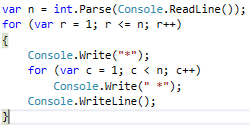

# Глава 6. Чертане на фигурки с цикли

В настоящата глава ще разгледаме как да използваме for-цикли за чертане на различни фигурки на конзолата. Ще използваме единични и вложени цикли (цикли един в друг), за да чертаем прости и не чак толкова прости фигурки по конзолата.

TODO


## Правоъгълник от 10 x 10 звездички

Да се начертае на конзолата правоъгълник от 10 x 10 звездички:
```cs
for (var i = 1; i <= 10; i++)
{
   Console.WriteLine(new string('*', 10));
}
```

Как работи примерът?
10 пъти печата стринг, който се състои от 10 на брой звездички

Тестване на решението: https://judge.softuni.bg/Contests/Practice/Index/155#0


## Правоъгълник от N x N звездички

Да се начертае на конзолата правоъгълник от N x N звездички:
```cs
int n = int.Parse(Console.ReadLine());
for (var i = 1; i <= n; i++)
{
   Console.WriteLine(
      new string('*', n));
}
```


Тестване на решението: https://judge.softuni.bg/Contests/Practice/Index/155#1


## Вложени цикли

Вложени цикли == цикъл съдържа в себе си друг цикъл
Двата цикъла въртят различни променливи
Пример: външен цикъл (по row) и вътрешен цикъл (по col)
```cs
for (var row = 1; row <= n; row++)
{
   for (var col = 1; col <= n; col++)
      Console.Write("*");
   Console.WriteLine();
}
```


## Квадрат от звездички

Да се начертае на конзолата квадрат от N x N звездички:


```cs
var n = int.Parse(Console.ReadLine());
for (var r = 1; r <= n; r++)
{
   Console.Write("*");
   for (var c = 1; c < n; c++)
      Console.Write(" *");
   Console.WriteLine();
}
```
Тестване на решението: https://judge.softuni.bg/Contests/Practice/Index/155#2


## Триъгълник от долари

Да се начертае триъгълник от долари с размер n

TODO: примерен вход и изход

Решение:
```cs
var n = int.Parse(Console.ReadLine());
for (var row = 1; row <= n; row++)
{
   Console.Write("$");
   for (var col = 1; col < row; col++)
      Console.Write(" $");
   Console.WriteLine();
}
```
Тестване на решението: https://judge.softuni.bg/Contests/Practice/Index/155#3


## Квадратна рамка

Да се начертае на конзолата квадратна рамка с размер n

TODO: примерни вход и изход

Решение:
```cs
// Print the top row: + - - - +
Console.Write("+");
for (int i = 0; i < n-2; i++)
   Console.Write(" -");
Console.WriteLine(" +");
for (int row = 0; row < n - 2; row++)
   // TODO: print the mid rows: | - - - |
// TODO: print the bottom row: + - - - +
```

Тестване на решението: https://judge.softuni.bg/Contests/Practice/Index/155#4


## Ромбче от звездички

Да се начертае ромбче от звездички с размер n

TODO: примерни вход и изход

Решение:
```cs
for (var row = 1; row <= n; row++)
{
    for (var col = 1; col <= n-row; col++)
        Console.Write(" ");
    Console.Write("*");
    for (var col = 1; col < row; col++)
        Console.Write(" *");
    Console.WriteLine();
}
// TODO: print the down side of the rhomb
```
Тестване на решението: https://judge.softuni.bg/Contests/Practice/Index/155#5


## Коледна елха

Напишете програма, която въвежда число n (1 ≤ n ≤ 100) и печата коледна елха с размер n като в примерите по-долу:

TODO: примерни вход и изход

Решение:
```cs
int n = int.Parse(Console.ReadLine());
for (int i = 0; i <= n; i++)
{
   var stars = new string('*', i);
   var spaces = new string(' ', n - i);
   Console.Write(spaces);
   Console.Write(stars);
   Console.Write(" | ");
   Console.Write(stars);
   Console.WriteLine(spaces);
}
```
Пращане на решения: https://judge.softuni.bg/Contests/Practice/Index/155#6

## Чертане на по-сложни фигури

Работа с вложени цикли и проверки


## Слънчеви очила

Напишете програма, която въвежда цяло число n (3 ≤ n ≤ 100) и печата слънчеви очила с размер 5*n x n като в примерите:

N = 3

******   ******
*////*|||*////*
******   ******

N = 4

********    ********
*//////*||||*//////*
*//////*    *//////*
********    ********

Пращане на решения: https://judge.softuni.bg/Contests/Practice/Index/155#7

Решение:
```cs
// Print the top part
Console.Write(new string('*', 2 * n));
Console.Write(new string(' ', n));
Console.WriteLine(new string('*', 2 * n));
for (int i = 0; i < n - 2; i++)
{
   // TODO: print the middle part
}
// Print the bottom part
Console.Write(new string('*', 2 * n));
Console.Write(new string(' ', n));
Console.WriteLine(new string('*', 2 * n));
```
Печатане на средната част:
```cs
// Print the middle part
for (int i = 0; i < n - 2; i++)
{
   // TODO: print *///////*
   if (i == (n-1) / 2 - 1)
      Console.Write(new string('|', n));
   else
      Console.Write(new string(' ', n));
   // TODO: print *///////*
   Console.WriteLine();
}
```

## Къщичка

Напишете програма, която въвежда число n (2 ≤ n ≤ 100) и печата къщичка с размер n x n:

N = 3

-*-
***
|*|

N = 4

-**-
****
|**|
|**|

N = 5

--*--
-***-
*****
|***|
|***|

N = 8

---**---
--****--
-******-
********
|******|
|******|
|******|
|******|

Пращане на решения: https://judge.softuni.bg/Contests/Practice/Index/155#8
```cs
Решение:
var stars = 1;
if (n % 2 == 0) stars++;
for (int i = 0; i < (n+1) / 2; i++)
{ // Draw the roof
  var padding = (n - stars) / 2);
  Console.Write(new string('-', padding);
  Console.Write(new string('*', stars));
  Console.WriteLine(new string('-', padding);
  stars = stars + 2;
}
for (int i = 0; i < n / 2; i++)
{ // Draw the house body: |*****| }
```

## Диамант

Напишете програма, която въвежда цяло число n (1 ≤ n ≤ 100) и печата диамант с размер n:
n = 1   
*
***
n = 2
**
***
n = 3

-*-
*-*
-*-
***
n = 4

-**-
*--*
-**-
***
n = 5

--*--
-*-*-
*---*
-*-*-
--*--
***
n = 6

--**--
-*--*-
*----*
-*--*-
--**--
***
n = 7

---*---
--*-*--
-*---*-
*-----*
-*---*-
--*-*--
---*---
***
n = 8

---**---
--*--*--
-*----*-
*------*
-*----*-
--*--*--
---**---
***
n = 9

----*----
---*-*---
--*---*--
-*-----*-
*-------*
-*-----*-
--*---*--
---*-*---
----*----
***
Пращане на решения: https://judge.softuni.bg/Contests/Practice/Index/155#9
```cs
var leftRight = (n - 1) / 2;
for (int i = 1; i <= (n-1) / 2; i++)
{ 
  // Draw the top part
  Console.Write(new string('-', leftRight));
  Console.Write("*");
  var mid = n - 2 * leftRight - 2;
  if (mid >= 0)
  {
    Console.Write(new string('-', mid));
    Console.Write("*");
  }
  Console.WriteLine(new string('-', leftRight));
  leftRight--;
}
// TODO: Draw the bottom part
```

## Какво научихме от тази глава?

Можем да чертаем фигури с вложени for-цикли:
```cs
for (var r = 1; r <= 5; r++)
{
   Console.Write("*");
   for (var c = 1; c < 5; c++)
      Console.Write(" *");
   Console.WriteLine();
}
```

TODO: картинка (както е в слайдовете)


## Упражнения: чертане на фигурки с цикли

TODO: да се стъпи върху задачите от файла "6. Drawing-with-Loops-Exercises.docx".
TODO: повтарящите се задачи да се слеят с текста по-горе.

### 0. Празно Visual Studio решение (Blank Solution)

### 1. Правоъгълник от 10 x 10 звездички

### 2. Правоъгълник от N x N звездички

### 3. Квадрат от звездички

### 4. Триъгълник от долари

### 5. Квадратна рамка

### 6. Ромбче от звездички

### 7. Коледна елха

### 8. Слънчеви очила

### 9. Къщичка

### 10. * Диамант


## Упражнения: чертане на фигурки в уеб среда

### Рейтинги – визуализация в уеб среда

TODO: да се извади съдържанието от файла "6. Drawing-with-Loops-Exercises.docx".
