# Глава 7. По-сложни цикли

// **TODO**: Да се сложат картинки вместо plain text C#, където е нужно (задачи). Може да се направи последно.

След като научихме какво представляват и за какво служат по-простите цикли, сега предстои да се запознаем с по-сложни такива. Те ще разширят познанията ни и ще ни помагат в решаването на по-трудни и предизвикателни задачи. Видовете, които ще разгледаме, са: 

  * цикли **със стъпка**
  * `**while**` цикли
  * `**do-while**` цикли
  * **безкрайни** цикли

В настоящата тема ще разберем и какво представлява операторът **break**, както и как чрез него да прекъснем един цикъл. Също така, използвайки **try-catch** конструкцията, ще се научим да следим за грешки по време на изпълнението на програмата ни. 


## Видео

<div class="video-player">
  Гледайте видео-урок по тази глава тук: <a target="_blank"
  href="https://www.youtube.com/watch?v=IovQ8OTnYuQ">
  https://www.youtube.com/watch?v=IovQ8OTnYuQ</a>.
</div>
<script src="/assets/js/video.js"></script>


## Цикли със стъпка

В главата **"Повторения (цикли)"** научихме как работи `for` цикълът и вече знаем кога и с каква цел да го използваме. В тази тема ще обърнем внимание на една определена и много важна част от конструкцията му, а именно **стъпката**.  

### Какво представлява стъпката?

Стъпката е тази част от конструкцията на `for` цикъла, която указва с колко да се увеличи или намали стойността на текущата му променлива. Тя се декларира последна в скелета на `for`.

Най-често е с **размер (i) = 1** и в такъв случай, вместо да пишем `**i += 1**` или `**i -= 1**`, можем да използваме операторите 
`**i++**` или `**i--**`. Ако искаме стъпката ни да е **различна от 1**, при увеличение използваме оператора **`i +=` размера на стъпката**, а при намаляване **`i -=` размера на стъпката**. При стъпка 10, цикълът би изглеждал по следния начин: 

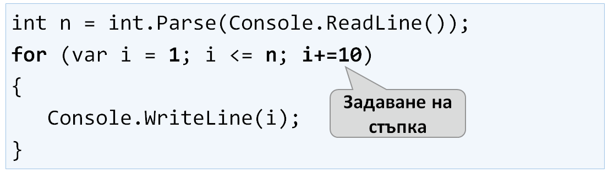

Следва поредица от примерни задачи, решението на които ще ни помогне да разберем по-добре употребата на **стъпката** в `for` цикъла.

### Задача: Числата от 1 до N през 3

**Условие**: Да се напише програма, която отпечатва числата **от 1 до n** със **стъпка 3**. Например, **ако n = 100**, то резултатът ще е: **1, 4, 7, 10, …, 94, 97, 100**.

Нека видим какви са нужните стъпки, за да може нашата програма да се изпълни коректно:

  1. Вземаме числото **n** от входа на конзолата.
  1. Създаваме `for` цикъл с размер на стъпката = 3.
  1. В **тялото на цикъла** отпечатваме стойността на текущата стъпка.
  
  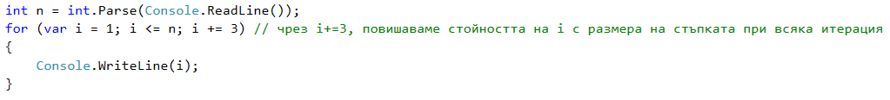
  
Тествайте вашето решение тук: https://judge.softuni.bg/Contests/Practice/Index/514#0.

### Задача: Числата от N до 1 в обратен ред

**Условие**: Да се напише програма, която отпечатва числата **от n до 1 в обратен ред** (стъпка -1). Например, **ако n = 100**, то резултатът ще е: **100, 99, 98, …, 3, 2, 1**.

Да погледнем нужните стъпки за коректното изпълнение на нашата програма:

  1. Вземаме числото **n** от входа на конзолата.
  1. Създаваме for цикъл с размер на стъпката = -1.
  1. В **тялото на цикъла** отпечатваме стойността на текущата стъпка.

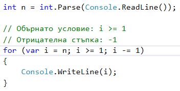

Тествайте вашето решение тук: https://judge.softuni.bg/Contests/Practice/Index/514#1

### Задача: Числата от 1 до 2^n с for-цикъл

В следващият пример ще разгледаме ползването на обичайната стъпка, с размер = 1.

**Условие**: Да се напише програма, която отпечатва числата **от 1 до 2^n** (две на степен n). Например, **ако n = 10**, то резултатът ще е **1, 2, 4, 8, 16, 32, 64, 128, 256, 512, 1024**.

Решението можем да тестваме в judge системата: https://judge.softuni.bg/Contests/Practice/Index/156#2

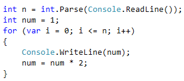

### Задача: Четни степени на 2

**Условие**: Да се отпечатат **четните** степени на 2 до 2^n: **2^0, 2^2, 2^4, 2^8, …, 2^n**. Например, ако **n = 10**, то резултатът ще е **1, 4, 16, 64, 256, 1024**.

Решението можем да тестваме в judge системата: https://judge.softuni.bg/Contests/Practice/Index/156#3

Ето какви са нужните **стъпки**, за да може нашата програма да се изпълни коректно:

  1. Създаваме променлива **num**, за текущото число, на която присвояваме начална **стойност 1**.
  1. За **стъпка** на цикъла слагаме стойност **2**.
  1. В **тялото на цикъла**:
      1. Отпечатваме стойността на текущото число.
      1. Увеличаваме текущото число според условието на задачата.

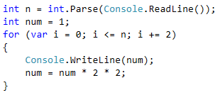

## While цикъл

Следващият цикъл, с който ще се запознаем се нарича **while**. Специфичното при него е, че продължава изпълнението си, докато дадено условие е истина. Като структура се различава от тази на `for` цикъла, но е също толкова ефикасен и нужен.

### Какво представлява while цикълът

**While** цикълът се използва, когато искаме да повтаряме извършването на определена логика, докато е в сила дадено условие. Под условие, разбираме всеки израз, който връща **true** или **false**. Когато условието стане грешно, **while** цикълът прекъсва изпълнението си и програмата продължава с реализацията на останалия код. Конструкцията на цикъла изглежда по този начин:

  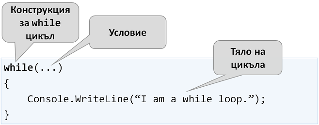

Следва поредица от примерни задачи, решението на които ще ни помогне да разберем по-добре употребата на цикъл `while`.

### Задача: Редица числа 2k+1

**Условие**: Да се напише програма, която отпечатва всички **числа ≤ n** от редицата: **1, 3, 7, 15, 31**..., като приемем, че всяко следващо число = **предишно число * 2 + 1**

Решението можем да тестваме в judge системата: https://judge.softuni.bg/Contests/Practice/Index/156#4

Нека видим какви са нужните **стъпки**, за да може нашата програма да се изпълни коректно:

  1. Създаваме променлива **num**, за текущото число, на която присвояваме начална **стойност 1**.
  1. За условие на цикъла слагаме **текущото число <= n**.
  1. В **тялото на цикъла**:
      1. Отпечатваме стойността на текущото число.
      1. Увеличаваме текущото число, ползвайки формулата от условието на задачата.

  
 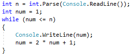

### Задача: Число в диапазона [1…100]

**Условие**: Да се въведе число в диапазона [1…100]. Ако въведеното число е невалидно, да се въведе отново.

В случая, за невалидно число ще считаме всяко такова, което **не е** в зададения диапазон.

Решението можем да тестваме в judge системата: https://judge.softuni.bg/Contests/Practice/Index/156#5

Нека видим и нужните **стъпки** за успешното изпълнение на програмата ни:

  1. Създаваме променлива **num**, на която присвояваме целочислената стойност получена от входа на конзолата.
  1. За условие на цикъла слагаме израз, който е **true**, ако числото от входа **не е** в диапазона посочен в условието.
  1. В **тялото на цикъла**:
      1. Отпечатваме съобщение със съдържание "**Invalid number!**" на конзолата.
      1. Присвояваме нова стойност за **num** от входа на конзолата.
  1. След като вече сме валидирали въведеното число, извън тялото на цикъла отпечатваме стойността на числото.

 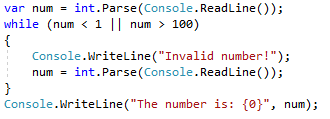

## Най-голям общ делител (НОД)

Преди да продължим към следващата задача, е необходимо да се запознаем с определението за най-голям общ делител (**НОД**).

**Определение за НОД**: Най-голям общ делител на две **естествени** числа **a** и **b** е най-голямото число, което дели **едновременно** и на **a**, и на **b** без остатък. Например:


| a | b | НОД | 
| :--- | :--- | :--- | 
| 24 | 16 | 8 |
| 67 | 18 | 1 |
| 12 | 24 | 12 |
| 15 | 9 | 3 |
| 10 | 10 | 10 |
| 100 | 88 | 4 |


## Алгоритъм на Евклид
В следващата задача ще ползваме един от първите публикувани алгоритми за намиране на НОД - **Алгоритъм на Евклид**:

**Докато** не достигнем остатък 0:

  1. Делим по-голямото число на по-малкото
  1. Взимаме остатъка от делението

**Псевдо код** за алгоритъма на Евклид:

```
while b ≠ 0
  var oldB = b;
  b = a % b;
  a = oldB;
print а;
```

### Задача: най-голям общ делител (НОД)

**Условие**: Да се въведат **цели** числа a и b и да се намери НОД(a, b).

Решението можем да тестваме в judge системата: https://judge.softuni.bg/Contests/Practice/Index/156#6

Ето какви са нужните **стъпки**, за да може нашата програма да се изпълни коректно:

  1. Създаваме променливи **a** и **b**, на които присвояваме **целочислени** стойности, взети от входа на конзолата.
  1. За условие на цикъла слагаме израз, който е **true**, ако числото b **е различно** от 0.
  1. В **тялото на цикъла** следваме указанията от псевдо кода:
      1. Създаваме временна променлива, на която присвояваме **текущата** стойност на b.
      1. Присвояваме нова стойност на b, която е остатъка от делението на a и b.
      1. На променливата a присвояваме **предишната** стойност на променливата b.
  1. След като цикъла приключи и сме установили НОД, го отпечатваме на екрана.

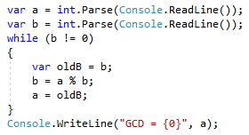

## Do… While цикъл

Следващият цикъл, с който ще се запознаем е **do... while**, в превод - **прави...докато**. По структура, той наподобява `while`, но има съществена разлика между тях. Тя се състои в това, че `do... while` ще изпълни тялото си **поне веднъж**. Защо се получава така? В конструкцията на `do... while` цикъла, условието винаги се проверява **след** тялото му, което от своя страна гарантира, че при първото завъртане на цикъла, кодът ще се изпълни, а валидацията ще се прилага върху всяка следваща итерация на `do...while`. 


Следва обичайната поредица от примерни задачи, чиито решения ще ни помогнат да разберем по-добре do... while цикъла.

### Задача: Изчисляване на факториел

**Условие:** За естествено число n да се изчисли **n! = 1 * 2 * 3 * … * n**. Например, ако **n = 5**, то резултатът ще бъде: 5! = 1 * 2 * 3 * 4 * 5 = **120**

Решението можем да тестваме в judge системата: https://judge.softuni.bg/Contests/Practice/Index/156#7

Ето какви са нужните **стъпки**, за да може нашата програма да се изпълни коректно:

  1. Създаваме променливата **n**, на която присвояваме целочислена стойност взета от входа на конзолата.
  1. Създаваме още една променлива - **fact** чиято начална стойност е 1. Нея ще използваме за изчислението и съхранението на факториела.
  1. За условие на цикъла ще ползваме **n > 1**, тъй като всеки път когато извършим изчисленията в тялото на цикъла, ще намаляваме стойността на **n** с -1.
  1. В тялото на цикъла:
      1. Присвояваме нова стойност на **fact**, която е резултат от умножението на текущата стойност на **fact** и текущата стойност за **n**.
      1. Намаляваме стойността на **n** с **-1**.
  1. Извън тялото на цикъла отпечатваме крайната стойност на факториела.

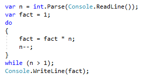

### Задача: Сумиране на цифрите на число

**Условие:** Да се сумират цифрите на цяло **положително** число **n**. Например, ако **n = 5634**, то резултатът ще бъде: 5 + 6 + 3 + 4 = **18**

Решението можем да тестваме в judge системата: https://judge.softuni.bg/Contests/Practice/Index/156#8

Ето какви са нужните **стъпки**, за да може нашата програма да се изпълни коректно:
  1. Създаваме променливата **n**, на която присвояваме въведеното от потребителя число.
  1. Създаваме втора променлива - **sum** чиято начална стойност е 0. Нея ще използваме за изчислението и съхранението на резултата.
  1. За условие на цикъла ще ползваме **n > 0**, понеже след всяко изчисление на резултата в тялото на цикъла, ще премахваме последната цифра от **n**.
  1. В тялото на цикъла:
      1. Присвояваме нова стойност на **sum**, която е резултат от събирането на текущата стойност на **sum** и последната цифра на **n**.
      1. Присвояваме нова стойност на **n**, която е резултат от премахването на последната цифра от **n**.
  1. Извън тялото на цикъла отпечатваме крайната стойност на сумата.

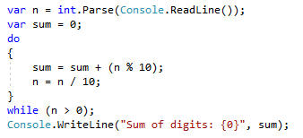

<table><tr><td></td>
<td>n % 10: <u><b>връща</b></u> последната цифра на числото n.<br>
n / 10: <u><b>изтрива</b></u>  последната цифра на n.</td>
</tr></table>

## Безкрайни цикли и оператор break

В настоящата глава се запознахме с различни видове цикли като научихме какви конструкции имат и как се прилагат. Следва да разберем какво е **безкраен цикъл**, кога възниква и как можем да **прекъснем** изпълнението му чрез оператора **break**.

### Безкраен цикъл. Що е то ?

Безкраен цикъл наричаме този цикъл, който **повтаря безкрайно** изпълнението на тялото си. При `while` и `do...while` циклите проверката за край е условен израз, който **винаги** връща **true**. Безкраен `for` възниква, когато **липсва** параметърът за **край**. 

Ето как изглежда **безкраен while** цикъл:

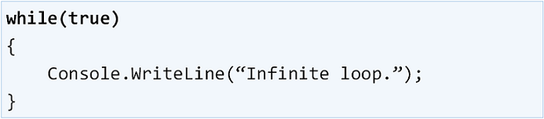

А така изглежда **безкраен for** цикъл:


// **TODO** Смяна на мястото на тази точка.
### Прости числа

В следващата задача се изисква да направим проверка за просто число. Преди да продължим към нея, обаче, нека си припомним какво са простите числа.

**Определение**: Едно число **(n)** е просто, ако се дели **единствено** на 1 и на себе си **без остатък**. Можем да приемем, че **n** е просто число, ако **не** се дели на число между 2 и n-1.

Примерни прости числа: 2, 3, 5, 7, 11, 13, 17, 19, 23, 29, 31, 37, 41, 43, …

За разлика от тях, непростите (композитни) числа са такива числа, чиято композиция е съставена от прости числа.

Ето няколко примерни непрости числа: 
  * 10 = 2 * 5,
  * 21 = 3 * 7, 
  * 143 = 13 * 11

**Алгоритъм за проверка** дали число е просто:
  1. Проверяваме дали n се дели на 2, 3, …, n-1 без остатък
      1. Ако се раздели, значи е композитно
      1. Ако не се раздели, значи е просто

<table><tr><td></td>
<td>Можем да оптимизираме алгоритъма, като вместо проверката да е до n-1, да се проверяват делителите до √𝒏</td>
</tr></table>

### Оператор break
Научихме, че безкрайният цикъл изпълнява определен код до безкрайност, но какво става, ако желаем в определен момент, при дадено условие, да излезем принудително от цикъла. Тук на помощ идва операторът **break**, в превод - **спри, прекъсни**.

В предстоящата задача ще разберем как това става на практика.

### Задача: Проверка за просто число. Оператор break

**Условие:** Да се провери дали едно число **n** е просто. Това ще направим като проверим дали **n** се дели на числата между 2 и √𝒏.

Решението можем да тестваме в judge системата: https://judge.softuni.bg/Contests/Practice/Index/156#9

Ето какви са нужните **стъпки**, за да може нашата програма да се изпълни коректно:
  1. Създаваме променливата **n**, на която присвояваме цяло число въведено от входа на конзолата.
  1. Създаваме булева променлива **isPrime** с начална стойност ``true``. Приемаме, че едно число е просто до доказване на противното.
  1. Създаваме `for` цикъл, на който като начална стойност за променливата на цикъла задаваме 2, за условие **текущата ѝ стойност <= √𝒏**. Стъпката на цикъла е обичайната = 1.
  1. В **тялото на цикъла**:
      1. Проверяваме дали **n** разделено на **текущата стойност** има остатък. Ако от делението **няма остатък**, то променяме isPrime на ``false`` и излизаме принудително от цикъла чрез оператор ``break``.
  1. В зависимост от стойността на isPrime отпечатваме дали числото е просто (``true``) или съответно непросто (``false``).


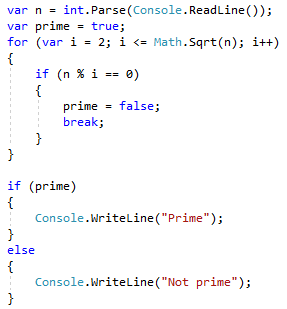

// **TODO**: Смяна на мястото на обяснението.
<table><tr><td></td>
<td>Операторът break спира изпълнението на цикъла към момента, в който е извикан. Това значи, че текущата итерация няма да бъде завършена и съответно останалата част от кода в тялото на цикъла няма да се изпълни.</td>
</tr></table>

### Задача: Оператор break в безкраен цикъл

**Условие:** Да се напише програма, която проверява дали едно число **n** е четно и ако е, да се отпечатва на екрана. За четно, считаме число, което се дели на 2 без остатък. При невалидно число да се връща към повторно въвеждане и да се изписва съобщение, което известява, че въведеното число не е четно.

// TODO: Проверка на задачата в judge?

Ето какви са нужните **стъпки**, за да може нашата програма да се изпълни коректно:

  1. Създаваме променлива **n** на която присвояваме начална стойност **0**.
  1. Създаваме безкраен ``while`` цикъл, като за условие ще сложим ``true``.
  1. В **тялото на цикъла**:
      1. Вземаме целочислена стойност от входа на конзолата и я присвояваме на **n**.
      1. Ако **числото е четно**, излизаме от цикъла чрез ``break``. 
      1. В **противен случай**:
          1. Извеждаме съобщение, което гласи, че числото **не е** четно.
          1. Итерациите продължават докато не се въведе четно число.
  1. Отпечатваме четното число на екрана.

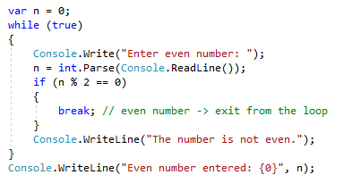

### Вложени цикли и операторът break
След като вече научихме какво са **вложените цикли** и как работи операторът **break**, е време да разберем как работят двете заедно. За по-добро разбиране нека, стъпка по стъпка, да направим **програма**, която трябва да направи всички възможни комбинации от **двойка числа**. Първото число от комбинацията е нарастващо от 1 до 3, а второто е намаляващо от 3 до 1. Задачата трябва да продължи изпълнението си, докато i + j **не** е равно на 2 (т.е. i = 1 и j = 1).

Желаният резултат е:

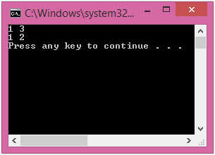

Решение:

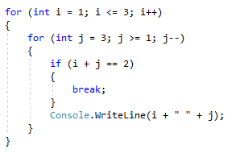

Ако оставим програмата ни по този начин, резултатът ни ще е **грешен** и ще е:

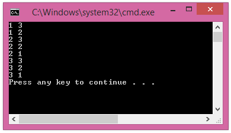

Защо се получава така? Както виждаме, в резултата **липсва “1 1”**. Когато програмата стига до там, че i = 1 и j = 1, тя влиза в `if` проверката и изпълнява **break** операцията. По този начин се излиза от вътрешния цикъл, но след това продължава изпълнението на външния. **i** нараства, програмата влиза във вътрешния цикъл и принтира резултата.

<table><tr><td></td>
<td>Когато във <b>вложен цикъл</b> използваме операторът <b>break</b>, той прекъсва изпълнението <b>само</b> на вътрешния цикъл.</td>
</tr></table>

Какво е правилното решение? Един начин за решаването на този проблем е чрез деклариране на **bool променлива**, която следи за това, дали трябва да продължава въртенето на цикъла. Цялото решение на задачата:

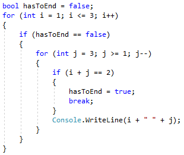

По този начин, когато i + j = 2, програмата ще направи променливата **hasToEnd = true** и ще излезе от вътрешния цикъл. При следващото завъртане на външния цикъл, чрез `if` проверката, програмата няма да може да стигне до вътрешния цикъл и ще прекъсне изпълнението си.

## Справяне с грешни числа: try…catch

Последното, с което ще се запознаем в тази глава е как да се справяме с грешни числа чрез конструкцията try...catch.

### Какво е try...catch ?

**Try...catch** е конструкция, която служи за проверка и реагиране при **изключения**.

**Изключенията** (exceptions) най-често представляват уведомление за дадено събитие, което нарушава нормалната работа на една програма. Когато настъпи такова събитие, се казва, че изключението е **"хвърлено" (throw exception)**. От там идва и израза **"улавям изключение" (catch exception)**.

### Конструкция на try...catch

Try...catch има различни видове конструкции, но за сега ще се запознаем само с най-основната: 

 

### Задача: Справяне с грешни числа чрез try...catch

В следващата задача ще видим нагледно, как да се справим в ситуация, в която потребителят въвежда вход, различен от число (например **string** вместо **int**) чрез try...catch.

**Условие:** Да се напише програма, която проверява дали едно число **n** е четно и ако е, да се отпечатва на екрана. При **невалидно въведено** число да се изписва съобщение, което известява, че въведения вход не е валидно число.

Решението можем да тестваме в judge системата: https://judge.softuni.bg/Contests/Practice/Index/156#10

Ето какви са нужните **стъпки**, за да може нашата програма да се изпълни коректно:

  1. Създаваме try...catch конструкция.
      1. В try блока пишем програмната логика за взимане на потребителския вход и проверката за четност.
      1. Ако **хванем изключение** при изпълнението на try блока, изписваме съобщение за невалидно въведено число.

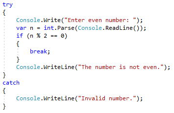

## Задачи с цикли

В тази глава се запознахме с няколко нови вида цикли, с които могат да се правят повторения с по-сложна програмна логика. Да решим няколко задачи, използвайки новите знания.

### Числа на Фибоначи

Числата на Фибоначи са следните: 1, 1, 2, 3, 5, 8, 13, 21, 34, …
F0 = 1
F1 = 1
Fn = Fn-1 + Fn-2

Пример: F(15) = 987
Да се въведе n и да се пресметна n-тото число на Фибоначи

Решение:

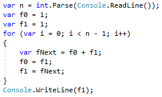

Тестване на решението: https://judge.softuni.bg/Contests/Practice/Index/156#11

### Пирамида от числа

Да се отпечатат числата 1…n в пирамида като в примерите:

|Вход      |Изход          |Вход      |Изход          |
|----------|---------------|----------|---------------|
|7         |1<br>2 3<br>4 5 6<br>7    |10    |1<br>2 3<br>4 5 6<br>7 8 9 10 |

Решение:

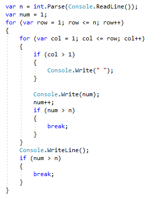

Тествайте вашето решение тук: https://judge.softuni.bg/Contests/Practice/Index/514#12

###   с числа

Да се отпечатат числата 1…n в таблица като в примерите:

n = 3

1 2 3
2 3 2
3 2 1

n = 4

1 2 3 4
2 3 4 3
3 4 3 2
4 3 2 1

TODO: да се вкарат входът и изходът в таблица

Решение:

var n = int.Parse(Console.ReadLine());
for (int row = 0; row < n; row++)
{
   for (int col = 0; col < n; col++)
   {
      var num = row + col + 1;
      if (num > n) num = 2 * n - num;
      Console.Write(num + " ");
   }
   Console.WriteLine();
}

Тестване на решението: https://judge.softuni.bg/Contests/Practice/Index/156#13


## Какво научихме от тази глава?

Можем да използваме for-цикли със **стъпка**:

```cs
for (var i = 1; i <= n; i+=3)
{
   Console.WriteLine(i);
}
```

Циклите `while` / `do-while` се повтарят докато е в сила дадено **условие**:

```cs
int num = 1;
while (num <= n)
{
   Console.WriteLine(num++);
}
```

Ако се наложи да прекъснем изпълнението на цикъл, го правим с оператора **break**:

```cs
var n = 0;
while (true)
{
   n = int.Parse(Console.ReadLine());
   if (n % 2 == 0)
   {
      break; // even number -> exit from the loop
   }
   Console.WriteLine("The number is not even.");
}
Console.WriteLine("Even number entered: {0}", n);
```

Вече знаем как да следим за грешки по време на изпълнението на програмата ни:

```cs
try
{
   Console.Write("Enter even number: ");
   n = int.Parse(Console.ReadLine());
}  
catch 
   Console.WriteLine("Invalid number."); 
}
// Ако int.Parse(…) гръмне, ще се изпълни catch { … } блокът
```


## Упражнения: работа с по-сложни цикли

TODO: да се ползва съдържанието от файла "7. Advanced-Loops-Exercises.docx".
TODO: да се слеят задачите, които се повтарят с текста по-горе.

### 0. Празно Visual Studio решение (Blank Solution)

1. Създайте празно решение **(Blank Solution)** във Visual Studio за да организирате кода от задачите за упражнение. Целта на този **blank solution** e да съдържа **по един проект за всяка задача** от упражненията.

  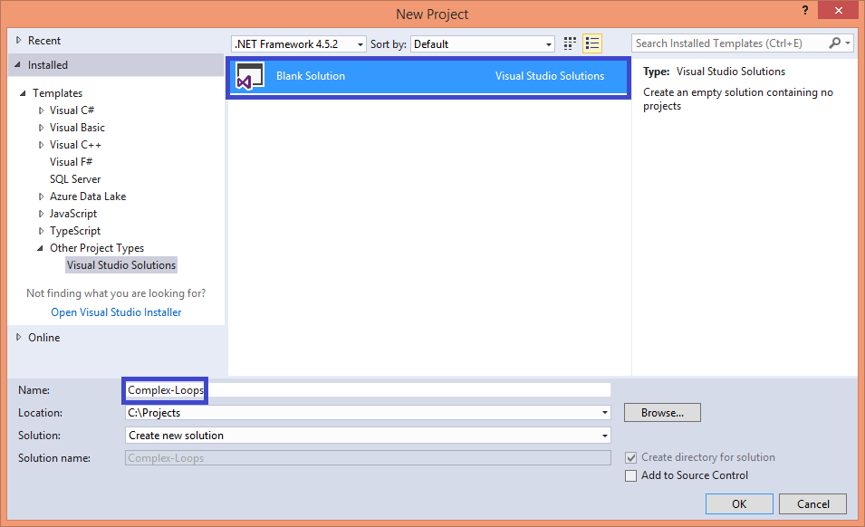

2.	Задайте **да се стартира по подразбиране текущия проект** (не първият в решението). Кликнете с десен бутон на мишката върху **Solution 'Complex-Loops' -> [Set StartUp Projects…] -> [Current selection]**.

 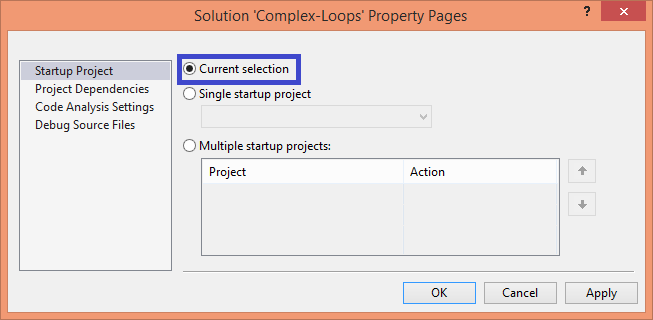


### 1. Числа от 2^0 до 2^n

### 2. Таблица с числа


## Упражнения: уеб приложения с по-сложни цикли

### Уеб игра „Обстреляй плодовете!“

**Условие**: Да се разработи **ASP.NET MVC уеб приложение** – игра, в която играчът **стреля по плодове**, подредени в таблица. Успешно уцелените плодове изчезват, а играчът получава точки за всеки уцелен плод. При уцелване на **динамит**, плодовете се взривяват и играта свършва (като във Fruit Ninja).
Стрелбата се извършва по колони, отгоре надолу или отдолу нагоре, а местоположението на удара (колоната под обстрел) се задава чрез скролер (scroll bar). Заради неточността на скролера, играчът не е съвсем сигурен по коя колона ще стреля. Така при всеки изстрел има шанс да не улучи и това прави играта по-интересна (подобно на прашката в Angry Birds).

Играта ни трябва да изглежда по този начин:

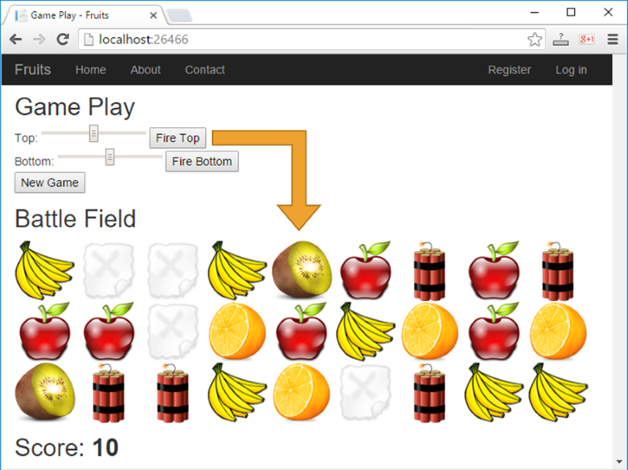 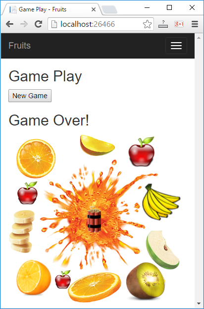

Ето какви са нужните **стъпки**, за да може нашата програма да се изпълни коректно:

1. Във Visual Studio създайте ново ASP.NET MVC уеб приложение с език C#. Добавете нов проект от [Solution Explorer]  [Add]  [New Project…] . Дайте смислено име, например “Fruits-Web-Game”:

  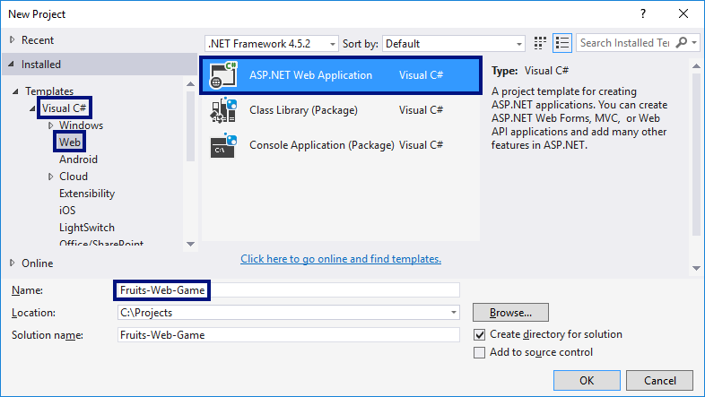 

  След това изберете тип на уеб приложението “MVC”:

  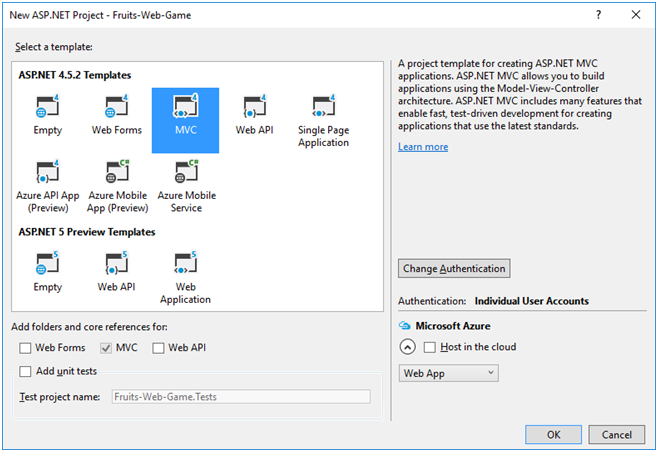 

2. Сега създавайте контролите за играта. Целта е да добавите **скролиращи ленти** (scroll bars), с които се играчът се прицелва, и бутон за старт на **нова игра**. Редактирайте файла **Views/Home/Index.cshtml**. Изтрийте всичко и въведете кода от картинката:
  
  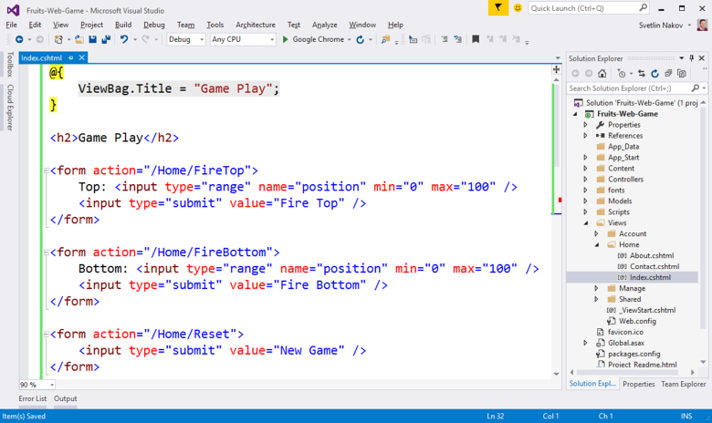 

  Този код създава уеб форма **\<form>** със скролер (поле) **“position”** за задаване на число в интервала [0…100] и бутон **[Fire Top]** за изпращане на данните от формата към сървъра. Действието, което ще обработи данните, се казва **“/Home/FireTop”**, което означава метод **“FireTop”** в контролер **“Home”**, който се намира във файла **“HomeController.cs”**. Следват още две подобни форми с бутони **[Fire Bottom]** и **[New Game]**.

3. Сега трябва да подготвите плодовете за рисуване в изгледа. Добавете кода от картинката в контролера: **Controllers/HomeController.cs**:

  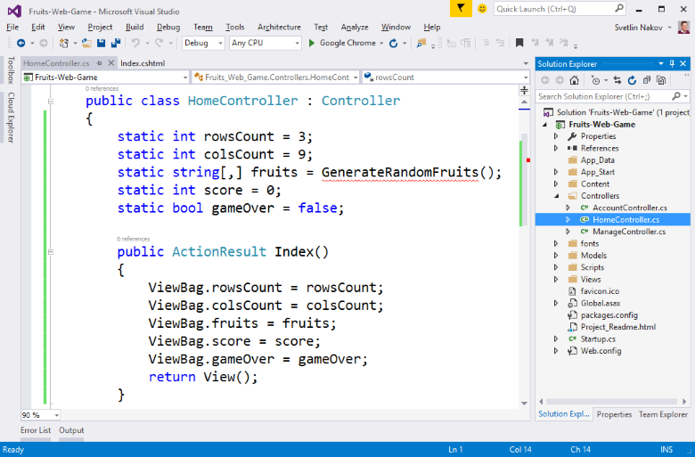 

  Горният код дефинира полета за **брой редове, брой колони**, за **таблицата с плодовете** (игралното поле), за натрупаните от играча **точки** и информация дали играта е активна или е **свършила** (поле **gameOver**). Игралното поле е с размери 9 колони на 3 реда и съдържа за всяко поле текст какво има в него: **apple, banana, orange, kiwi, empty или dynamite**.
  Главното действие **Index()** подготвя игралното поле за чертане като записва във **ViewBag** структурата елементите на играта и извиква изгледа, който ги чертае в страницата на играта в уеб браузъра като HTML.

4. Генерирайте случайни плодове. За да направите това, трябва да напишете метод **GenerateRandomFruits()** с кода от картинката
  по-долу. Този код записва в таблицата (матрицата) **fruits** имена на различни картинки и така изгражда игралното поле. Във всяка клетка от таблицата се записва една от следните стойности: **apple, banana, orange, kiwi, empty или dynamite**. След това, за да се нарисува съответното изображение в изгледа, към текста от таблицата ще се долепи **“.png”** и така ще се получи името на файла с картинката, която да се вмъкне в HTML страницата като част от игралното поле. Попълването на игралното поле (9 колони с по 3 реда) става в изгледа Index.cshtml** с два вложени **for**-цикъла (за ред и за колона).
  За да се генерират случайни плодове за всяка клетка се генерира **случайно число** между 0 и 8 (вж. класа Random() в .NET). Ако числото e 0 или 1, се слага **аpple**, ако е между 2 и 3, се слага **banan**a и т.н. Ако числото е 8, се поставя **dynamite**. Така плодовете се появяват 2 пъти по-често отколкото динамита. Ето и кода:

  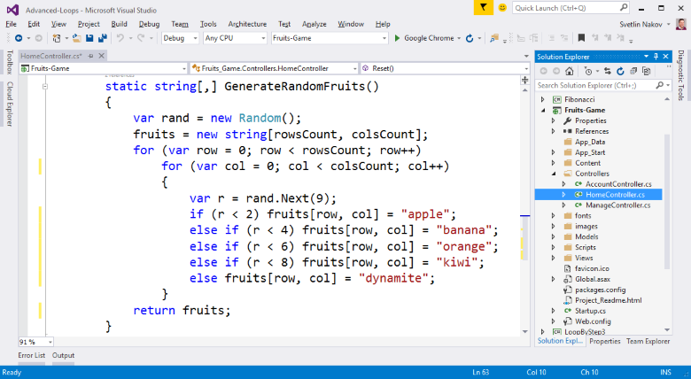 

5.	**Добавете картинките** за играта.

 От **[Solution Explorer]** направете папка **“images”** в коренната директория на проекта. Използвайте менюто **[Add] -> [New Folder]**. 
 
 Сега добавете **картинките** за играта (те са част от файловете със заданието за домашно). Копирайте ги от Windows Explorer и ги поставете в папката **“images”** в **[Solution Explorer]** във Visual Studio с **copy / paste**.

   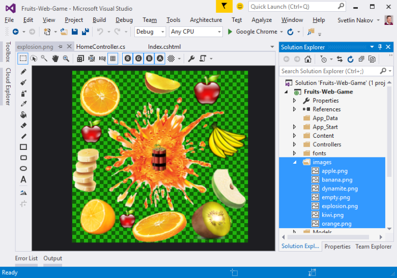 

6.	Чертане на плодовете в **Index.cshtml**
 За да **начертаете игралното поле** с подовете, трябва да завъртите **два вложени цикъла** (за редовете и за колоните). Всеки ред се състои от 9 на брой картинки, всяка от които съдържа **apple, banana** или друг плод или празно **(empty)** или динамит **(dynamite)**. Картинките се чертаят като се отпечата HTML таг за вмъкване на картинка от вида на **\**. Девет картинки се подреждат една след друга на всеки от редовете, а след тях се преминава на нов ред с **`<br>`**. Това се повтаря три пъти за трите реда. Накрая се отпечатват точките на играча. Ето как изглежда **кодът** за чертане на игралното поле и точките:

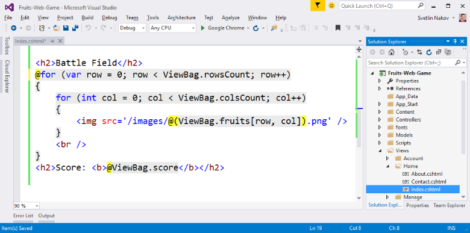 

Обърнете внимание на жълтите символи **@** – те служат за превключване между езика **C#** и езика **HTML** и идват от **Razor** синтаксиса за рисуване на динамични уеб страници.

7.	Нагласете текстовете във файла **/Views/Shared/_Layout.cshtml**. Заменете **“My ASP.NET Application”** с по-подходящи текстове, например **“Fruits”**:

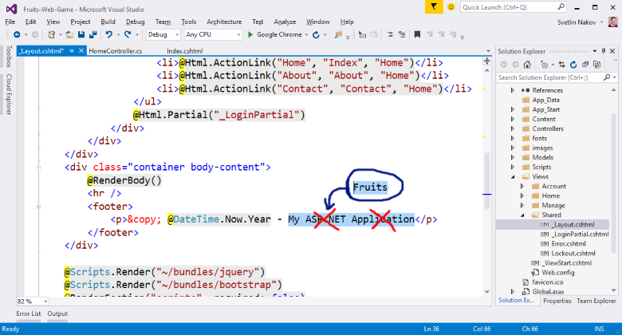 

8.	Стартирайте проекта с **[Ctrl+F5]** и му се порадвайте. Очаква се да бъде генерирано случайно игрово поле с плодове с размери 9 на 3 и да се визуализира в уеб страницата чрез поредица картинки:

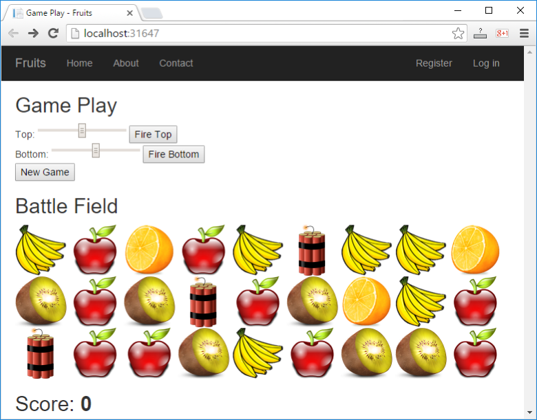 

Сега играта е донякъде направена: игралното поле се генерира случайни и се визуализира успешно (ако не сте допуснали грешка някъде). Остава да се реализира същината на играта: **стрелянето по плодовете**.

9.	Добавете действията **[New Game]** и **[Fire Top]** / **[Fire Top]** в контролера **“HomeController.cs”**:

 

Горният код дефинира три действия:
*	**Reset()** – стартира нова игра, като генерира новo случайно игрално поле с плодове и експлозиви, нулира точките на играча и прави играта валидна **(gameOver = false)**. Това действие е доста просто и може да се тества веднага с [Ctrl+F5], преди да се напишат другите.
*	**FireTop(position)** – стреля по ред **0** на позиция **position** (число от 0 до 100). Извиква се стреляне в посока **надолу** (+1) от ред **0** (най-горния). Самото стреляне е по-сложно като логика и ще бъде разгледано след малко.
*	**FireBottom(position)** – стреля по ред **2** на позиция **position** (число от 0 до 100). Извиква се стреляне в посока **нагоре** (-1) от ред **2** (най-долния).

10.	Имплементирайте "стрелянето" – метода **Fire(position, startRow, step)**:

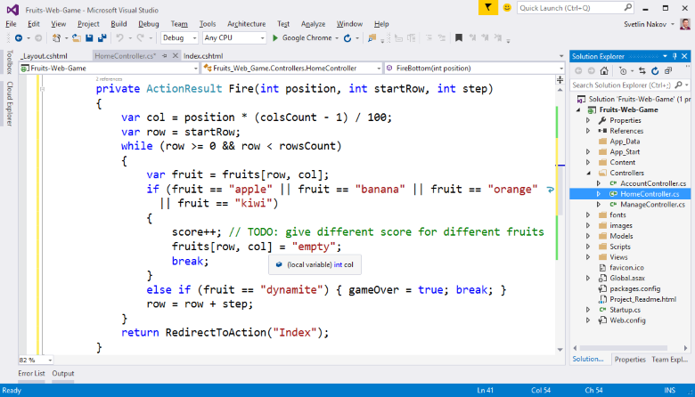

Стрелянето работи по следния начин: първо се изчислява номера на колоната **col**, към която играчът се е прицелил. Входното число от скролера (между 0 и 100) се намалява до число между 0 и 8 (за всяка от 9-те колони). Номерът на реда **row** е или 0 (ако изстрелът е отгоре) или броят редове минус едно (ако изстрелът е отдолу). Съответно посоката на стрелба (стъпката) е **1** (надолу) или **-1** (нагоре).

За да се намери къде изстрелът поразява плод или динамит, се преминава в цикъл през всички клетки от игралното в прицелената колона и от първия до последния атакуван ред. Ако се срещне плод, той изчезва (замества се с **empty**) и се дават точки на играча. Ако се срещне **dynamite**, играта се отбелязва като свършила.

Оставаме на по-запалените да имплементират по-сложно поведение, например да се дават различни точки при уцелване на различен плод, да се реализира анимация с експлозия (това не е твърде лесно), да се взимат точки при излишно стреляне в празна колона и подобни.

11.	**Тествайте** какво работи до момента като стартирате с [Ctrl+F5]:
  *	**Нова игра** -> бутонът за нова игра трябва да генерира ново игрално поле със случайно разположени плодове и експлозиви и да нулира точките на играча.
  *	**Стреляне отгоре** -> стрелянето отгоре трябва да премахва най-горният плод в уцелената колона или да предизвиква край на играта при динамит. Всъщност при край на играта все още нищо няма да се случва, защото в изгледа този случай още не се разглежда.
  * **Стреляне отдолу** -> стрелянето отдолу трябва да премахва най-долния плод в уцелената колона или да прекратява играта при уцелване на динамит.


 
12.	Имплементирайте **"Край на играта"**. За момента при край на играта нищо не се случа. Ако играчът уцели динамит, в контролера се отбелязва, че играта е свършила **(gameOver = true)**, но този факт не се визуализира по никакъв начин. За да заработи свършването на играта, е необходимо да добавим няколко проверки в изгледа:

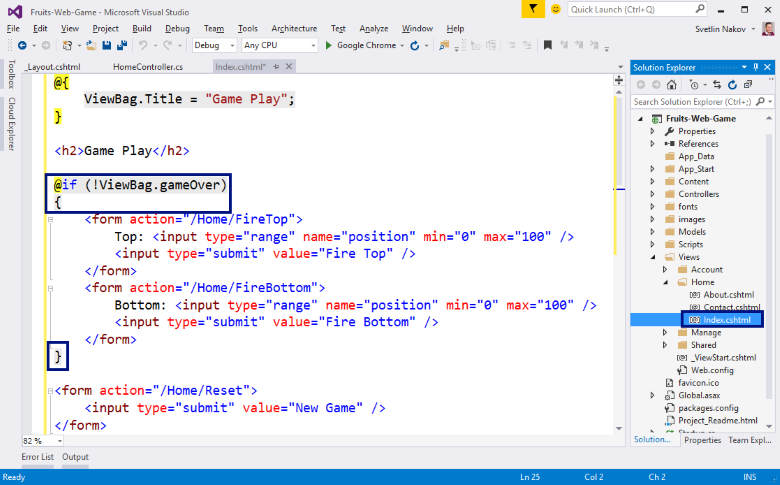

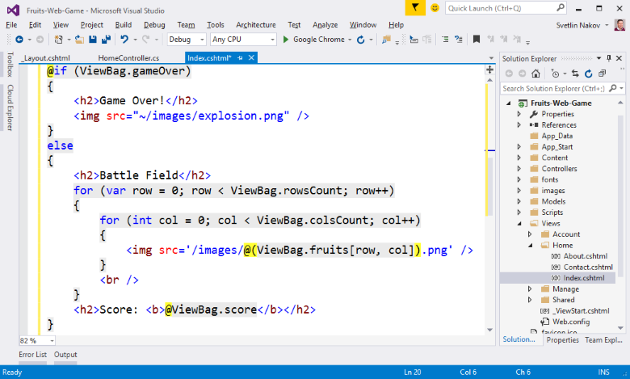

Кодът по-горе проверява дали е свършила играта и показва съответно контролите за стреляне и игралното поле (при активна игра) или картинка с експлодирали плодове при край на играта.

13.	След промяната в кода на изгледа стартирайте с [Ctrl+F5] и **тествайте** играта отново:

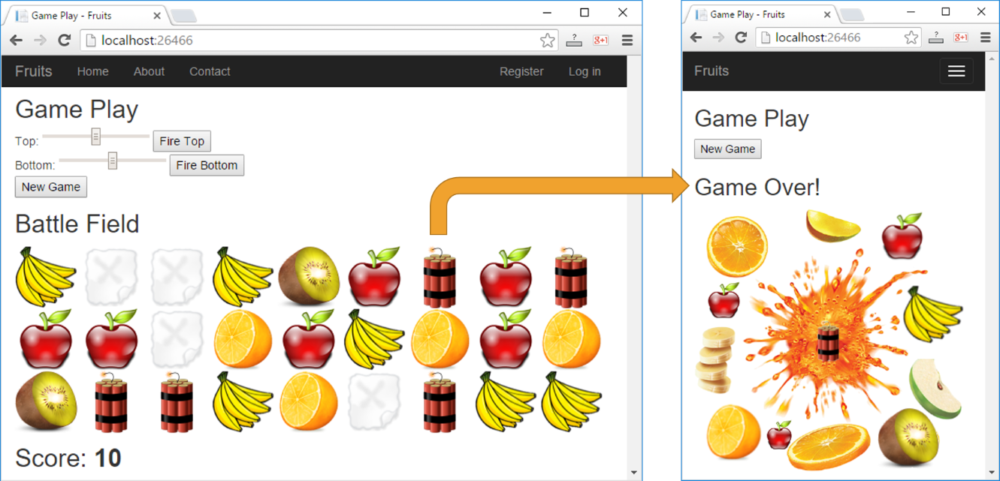

Този път при уцелване на динамит, трябва да се появи дясната картинка и да се позволява единствено действието “нова игра” (бутонът **[New Game]**).
