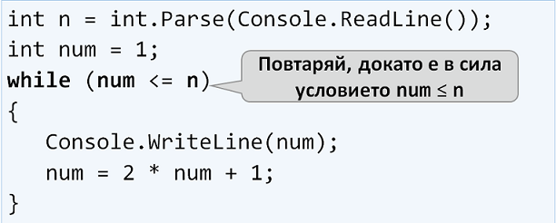

# Глава 7. По-сложни цикли

// **TODO**: Да се сложат картинки вместо plain text C#, където е нужно (задачи). Може да се направи последно.

След като научихме какво представляват и за какво служат по-простите цикли, сега предстои да се запознаем с по-сложни такива. Те ще разширят познанията ни и ще ни помагат в решаването на по-трудни задачи. Видовете, които ще разгледаме, са: 

  * цикли **със стъпка**
  * **while** цикли
  * **do-while** цикли
  * **безкрайни** цикли

В настоящата тема ще разберем и какво представлява операторът **break** и как, чрез него, да прекъснем един цикъл. Освен това, използвайки **try-catch** конструкцията, ще се научим да следим за грешки по време на изпълнението на програмата ни. 


## Видео

<div class="video-player">
  Гледайте видео-урок по тази глава тук: <a target="_blank"
  href="https://www.youtube.com/watch?v=IovQ8OTnYuQ">
  https://www.youtube.com/watch?v=IovQ8OTnYuQ</a>.
</div>
<script src="/assets/js/video.js"></script>


## Цикли със стъпка

В главата **"Повторения (цикли)"** научихме как работи `for` цикълът и вече знаем кога и с каква цел да го използваме. В тази тема ще обърнем внимание на една определена и много важна част от конструкцията му, а именно **стъпката**.  

### Какво представлява стъпката?

Стъпката е тази част от конструкцията на `for` цикъла, която указва с колко да се увеличи или намали стойността на текущата му променлива. Тя се декларира последна в скелета на `for`.

Най-често е с **размер(i) = 1**, в такъв случай, вместо да пишем **i += 1** или **i -= 1**, можем да използваме оператора 
**i++/i--**. Ако искаме стъпката ни да е **различна от 1**, при увеличение използваме оператора **i += размера на стъпката**, а при намаляне **i -= размера на стъпката**. При стъпка = 10, цикълът би изглеждал по следния начин: 


Следва поредица от примерни задачи, решението на които ще ни помогне да разберем по-добре употребата на **стъпката** в цикъл `for`.

### Задача: Числата от 1 до N през 3

**Условие**: Да се напише програма, която отпечатва числата **от 1 до n** със **стъпка 3**. Например, **ако n = 100**, то резултатът ще е: **1, 4, 7, 10, …, 94, 97, 100**.

Решението можем да тестваме в judge системата: https://judge.softuni.bg/Contests/Practice/Index/156#0.

Нека видим какви са нужните стъпки, за да може нашата програма да се изпълни коректно:

  1. Вземаме числото **n** от входа на конзолата.
  1. Създаваме for цикъл с размер на стъпката = 3.
  1. В **тялото на цикъла** отпечатваме стойността на текущата стъпка.
  
  ```cs
  var n = int.Parse(Console.ReadLine());

  // Чрез i += 3, повишаваме стойността на i с размера на стъпката след всяка итерация.
  for (var i = 1; i <= n; i += 3)
  {
      // TODO: Отпечатваме текущото число.
  }
  ```

### Задача: Числата от N до 1 в обратен ред

**Условие**: Да се напише програма, която отпечатва числата **от n до 1 в обратен ред** (стъпка -1). Например, **ако n = 100**, то резултатът ще е: **100, 99, 98, …, 3, 2, 1**.

Решението можем да тестваме в judge системата: https://judge.softuni.bg/Contests/Practice/Index/156#1

Да погледнем нужните стъпки за коректното изпълнение на нашата програма:

  1. Вземаме числото **n** от входа на конзолата.
  1. Създаваме for цикъл с размер на стъпката = -1.
  1. В **тялото на цикъла** отпечатваме стойността на текущата стъпка.

```cs
var n = int.Parse(Console.ReadLine());

// Чрез i -= 1, намаляваме стойността на i с размера на стъпката след всяка итерация.
for (var i = n; i >= 1; i -= 1)
{
    // TODO: Отпечатваме текущото число.
}
```

### Задача: Числата от 1 до 2^n с for-цикъл

В следващият пример ще разгледаме ползването на обичайната стъпка, с размер = 1.

**Условие**: Да се напише програма, която отпечатва числата **от 1 до 2^n** (две на степен n). Например, **ако n = 10**, то резултатът ще е **1, 2, 4, 8, 16, 32, 64, 128, 256, 512, 1024**.

Решението можем да тестваме в judge системата: https://judge.softuni.bg/Contests/Practice/Index/156#2

```cs
var num = 1;
for (var i = 0; i <= n; i++)
{
   // TODO: Отпечатваме текущото число.
   // TODO: Повдигаме текущото число на степен 2.
}
```

### Задача: Четни степени на 2

**Условие**: Да се отпечатат **четните** степени на 2 до 2^n: **2^0, 2^2, 2^4, 2^8, …, 2^n**. Например, ако **n = 10**, то резултатът ще е **1, 4, 16, 64, 256, 1024**.

Решението можем да тестваме в judge системата: https://judge.softuni.bg/Contests/Practice/Index/156#3

Ето какви са нужните **стъпки**, за да може нашата програма да се изпълни коректно:

  1. Създаваме променлива **num**, за текущото число, на която присвояваме начална **стойност 1**.
  1. За **стъпка** на цикъла слагаме стойност **2**.
  1. В **тялото на цикъла**:
      1. Отпечатваме стойността на текущото число.
      1. Увеличаваме текущото число според условието на задачата.

```cs
// Създаваме променлива за текущото число и ѝ присвояваме начална стойност 1.
int num = 1;

// Създаваме цикъл със стъпка 2
for (var i = 0; i <= n; i+=2)
{
  // TODO: Отпечатваме текущото число.
  // TODO: Увеличаваме текущото число според условието на задачата.
}
```
---

## While цикъл

Следващият цикъл, с който ще се запознаем се нарича **while**. 

### Какво представлява while цикълa

While цикълът се използва, когато искаме да повтаряме извършването на определена логика, докато е в сила дадено условие. Под условие, разбираме всеки израз, който връща true или false. Когато условието стане грешно, while цикълът прекъсва изпълнението си и програмата продължава с реализацията на останалия код. Конструкцията на цикъла изглежда по този начин:

  ```cs
  while (условие)
  {
    // Тяло на цикъла
  }
  ```

  

Следва поредица от примерни задачи, решението на които ще ни помогне да разберем по-добре употребата на цикъл `while`.

### Задача: Редица числа 2k+1

**Условие**: Да се напише програма, която отпечатва всички **числа ≤ n** от редицата: **1, 3, 7, 15, 31**..., като приемем, че всяко следващо число = **предишно число * 2 + 1**

Решението можем да тестваме в judge системата: https://judge.softuni.bg/Contests/Practice/Index/156#4

Нека видим какви са нужните **стъпки**, за да може нашата програма да се изпълни коректно:

  1. Създаваме променлива **num**, за текущото число, на която присвояваме начална **стойност 1**.
  1. За условие на цикъла слагаме **текущото число <= n**.
  1. В **тялото на цикъла**:
      1. Отпечатваме стойността на текущото число.
      1. Увеличаваме текущото число, ползвайки формулата от условието на задачата.
  
  ```cs
  // Създаваме променливата num и ѝ присовяваме стойност 1
  var num = 1;

  // Създаваме while цикъл с условие: текущото число <= n
  while (num <= n)
  {
    // TODO: Отпечатваме стойността на num.
    // TODO: Увеличаваме текущото число според формулата от условието на задачата.
  }
  ```

### Задача: Число в диапазона [1…100]

**Условие**: Да се въведе число в диапазона [1…100]. Ако въведеното число е невалидно, да се въведе отново.

В случая, за невалидно число ще считаме всяко такова, което **не е** в зададения диапазон.

Решението можем да тестваме в judge системата: https://judge.softuni.bg/Contests/Practice/Index/156#5

Нека видим и нужните **стъпки** за успешното изпълнение на програмата ни:

  1. Създаваме променлива **num**, на която присвояваме целочислената стойност получена от входа на конзолата.
  1. За условие на цикъла слагаме израз, който е **true**, ако числото от входа **не е** в диапазона посочен в условието.
  1. В **тялото на цикъла**:
      1. Отпечатваме съобщение със съдържание "**Invalid number!**" на конзолата.
      1. Присвояваме нова стойност за **num** от входа на конзолата.
  1. След като вече сме валидирали въведеното число, извън тялото на цикъла отпечатваме стойността на числото.

```cs
// Създаваме променливата num и ѝ присвояваме стойност от входа на конзолата.
var num = int.Parse(Console.ReadLine());
// TODO: Пишем израз, който да валидира, че въвеното число е в диапазона [1...100].
while (условие)
{
  // TODO: Отпечатваме "Invalid number!" на конзолата.
  // TODO: Присвояваме нова стойност на num от входа на конзолата.
}
  // TODO: Отпечатваме "The number is {num}" на конзолата.
```

## Най-голям общ делител (НОД)

Преди да продължим към следващата задача, е необходимо да се запознаем с определението за най-голям общ делител (**НОД**).

**Определение за НОД**: Най-голям общ делител на две **естествени** числа a и b е най-голямото число, което дели **едновременно** a и b без остатък, например:


| a | b | НОД | 
| :--- | :--- | :--- | 
| 24 | 16 | 8 |
| 67 | 18 | 1 |
| 12 | 24 | 12 |
| 15 | 9 | 3 |
| 10 | 10 | 10 |
| 100 | 88 | 4 |


## Алгоритъм на Евклид
В следващата задача ще ползваме един от първите публикувани алгоритми за намиране на НОД - **Алгоритъм на Евклид**:

**Докато** не достигнем остатък 0:

  1. Делим по-голямото число на по-малкото
  1. Взимаме остатъка от делението

**Псевдокод** за алгоритъма на Евклид:

```
while b ≠ 0
  var oldB = b;
  b = a % b;
  a = oldB;
print а;
```

### Задача: най-голям общ делител (НОД)

**Условие**: Да се въведат **цели** числа a и b и да се намери НОД(a, b).

Решението можем да тестваме в judge системата: https://judge.softuni.bg/Contests/Practice/Index/156#6

Ето какви са нужните **стъпки**, за да може нашата програма да се изпълни коректно:

  1. Създаваме променливи **a** и **b**, на които присвояваме **целочислени** стойности, взети от входа на конзолата.
  1. За условие на цикъла слагаме израз, който е **true**, ако числото b **е различно** от 0.
  1. В **тялото на цикъла** следваме указанията от псевдокода:
      1. Създаваме временна променлива, на която присвояваме **текущата** стойност на b.
      1. Присвояваме нова стойност на b, която е остатъка от делението на a и b.
      1. На променливата a присвояваме **предишната** стойност на променливата b.
  1. След като цикъла приключи и сме установили НОД, го отпечатваме на екрана.

```cs

// TODO: Създаваме променливите a и b, и им присвояваме целочислени сотйности от входа на конзолата.
var a = int.Parse(Console.ReadLine());
var b = int.Parse(Console.ReadLine());
// TODO: Пишем израз, който да валидира, че въвеното число е в диапазона [1...100].
while (условие)
{
  // TODO: Създаваме временна променлива, на която присвояваме текущата стойност на b
  // TODO: Присвояваме нова стойност на b, която е остатъка от делението на a и b;
  // TODO: На a присвояваме стойността от временната променлива (предишната стойност на b).
}

// TODO: Отпечатваме НОД на екрана.
```

## Do… While цикъл

Следващият цикъл, с който ще се запознаем е цикъла **do... while**.
Той много прилича на while, но основната разлика между тях е, че do... while ще изпълни тялото на цикъла **поне веднъж**. Това е така, понеже условието се проверява след като се изпълни тялото, а от там и името do... while, което в превод значи **прави... докато**.

Следва обичайната поредица от примерни задачи, чиито решения ще ни помогнат да разберем по-добре do... while цикъла.

### Задача: Изчисляване на факториел

**Условие:** За естествено число n да се изчисли **n! = 1 * 2 * 3 * … * n**. Например, ако **n = 5**, то резултатът ще бъде: 5! = 1 * 2 * 3 * 4 * 5 = **120**

Решението можем да тестваме в judge системата: https://judge.softuni.bg/Contests/Practice/Index/156#7

Ето какви са нужните **стъпки**, за да може нашата програма да се изпълни коректно:

  1. Създаваме променливата **n**, на която присвояваме целочислена стойност взета от входа на конзолата.
  1. Създаваме още една променлива - **fact** чиято начална стойност е 1. Нея ще използваме за изчислението и съхранението на факториела.
  1. За условие на цикъла ще ползваме **n > 1**, тъй като всеки път когато извършим изчисленията в тялото на цикъла, ще намаляваме стойността на **n** с -1.
  1. В тялото на цикъла:
      1. Присвояваме нова стойност на **fact**, която е резултат от умножението на текущата стойност на **fact** и текущата стойност за **n**.
      1. Намаляваме стойността на **n** с **-1**.
  1. Извън тялото на цикъла отпечатваме крайната стойност на факториела.

```cs
// Създаваме и инициализираме променливата n със стойност от входа на конзолата
var n = int.Parse(Console.ReadLine());
// Създаваме втора променлива - fact с начална стойност = 1
var fact = 1;
do
{
   // TODO: Присвояваме на fact резултата от умножението на fact и n.
   // TODO: Намаляваме стойността на n с -1.
} while (условие);

// TODO: Отпечатваме факториела.
```

### Задача: Сумиране на цифрите на число

**Условие:** Да се сумират цифрите на цяло **положително** число **n**. Например, ако **n = 5634**, то резултатът ще бъде: 5 + 6 + 3 + 4 = **18**

Решението можем да тестваме в judge системата: https://judge.softuni.bg/Contests/Practice/Index/156#8

Ето какви са нужните **стъпки**, за да може нашата програма да се изпълни коректно:
  1. Създаваме променливата **n**, на която присвояваме въведеното от потребителя число.
  1. Създаваме втора променлива - **sum** чиято начална стойност е 0. Нея ще използваме за изчислението и съхранението на резултата.
  1. За условие на цикъла ще ползваме **n > 0**, понеже след всяко изчисление на резултата в тялото на цикъла, ще премахваме последната цифра от **n**.
  1. В тялото на цикъла:
      1. Присвояваме нова стойност на **sum**, която е резултат от събирането на текущата стойност на **sum** и последната цифра на **n**.
      1. Присвояваме нова стойност на **n**, която е резултат от премахването на последната цифра от **n**.
  1. Извън тялото на цикъла отпечатваме крайната стойност на сумата.

```cs
// Създаваме и инициализираме променливата n със стойност от входа на конзолата
var n = int.Parse(Console.ReadLine());
// Създаваме втора променлива - fact с начална стойност = 1
var sum = 0;
do
{
   // TODO: На променливата sum присвояваме резултата от текущата сума + последната цифра от n.
   // TODO: Премахваме последната цифра от n.
} while (условие);

// TODO: Отпечатваме факториела.
```

<table><tr><td></td>
<td>n % 10: <u><b>връща</b></u> последната цифра на числото n. 
<br>n / 10: <u><b>изтрива</b></u>  последната цифра на n.</td>
</tr></table>

## Безкрайни цикли и оператор break

### Безкраен цикъл

Безкраен цикъл е когато повтаряме нещо до безкрайност:

while(true)
{
   Console.WriteLine("Infinite loop");
}

Друг вариант на безкраен цикъл - for без условие за край:

for (;;)
{
   Console.WriteLine("Infinite loop");
}

### Прости числа

Едно число n е просто, ако се дели единствено на 1 и n
Прости числа: 2, 3, 5, 7, 11, 13, 17, 19, 23, 29, 31, 37, 41, 43, …
Непрости (композитни) числа: 10 = 2 * 5, 21 = 3 * 7, 143 = 13 * 11
Едно число n е просто, ако се дели на число между 2 и n-1
Алгоритъм за проверка дали число е просто:
Проверяваме дали n се дели на 2, 3, …, n-1
Ако се раздели, значи е композитно
Ако не се раздели, значи е просто
Оптимизация: вместо до n-1 да се проверяват делители до √𝒏

### Проверка за просто число. Оператор break

var n = int.Parse(Console.ReadLine());
var prime = true;
for (var i = 2; i <= Math.Sqrt(n); i++)
   if (n % i == 0) {
      prime = false;
      break;
   }
if (prime) 
  Console.WriteLine("Prime");
else 
  Console.WriteLine("Not prime");
  
Тестване на решението: https://judge.softuni.bg/Contests/Practice/Index/156#9

Операторът break излиза от цикъла

TODO: картинка

### Оператор break в безкраен цикъл

Да се напише програма, която въвежда четно число
При невалидно число да връща към повторно въвеждане

var n = 0;
while (true)
{
   Console.Write("Enter even number: ");
   n = int.Parse(Console.ReadLine());
   if (n % 2 == 0)
      break; // even number -> exit from the loop
   Console.WriteLine("The number is not even.");
}
Console.WriteLine("Even number entered: {0}", n);


## Справяне с грешни числа: try … catch

try
{
   Console.Write("Enter even number: ");
   n = int.Parse(Console.ReadLine());
   if (n % 2 == 0)
      break;
   Console.WriteLine("The number is not even.");
}
catch
{
   // Ако int.Parse(…) гръмне, ще се изпълни catch { … } блокът
   Console.WriteLine("Invalid number.");
}

Тестване на решението: https://judge.softuni.bg/Contests/Practice/Index/156#10


## Задачи с цикли

В тази глава се запознахме с няколко нови вида цикли, с които могат да се правят повторения с по-слоцна програмна логика. Да решим няколко задачи, използвайки новите знания.

### Числа на Фибоначи

Числата на Фибоначи са следните: 1, 1, 2, 3, 5, 8, 13, 21, 34, …
F0 = 1
F1 = 1
Fn = Fn-1 + Fn-2

Пример: F(15) = 987
Да се въведе n и да се пресметна n-тото число на Фибоначи

Решение:

var n = int.Parse(Console.ReadLine());
var f0 = 1;
var f1 = 1;
for (var i = 0; i < n-1; i++)
{
   var fNext = f0 + f1;
   f0 = f1;
   f1 = fNext;
}
Console.WriteLine(f1);

Тестване на решението: https://judge.softuni.bg/Contests/Practice/Index/156#11

### Пирамида от числа

Да се отпечатат числата 1…n в пирамида като в примерите:

n = 7

1
2 3
4 5 6
7

n = 10

1
2 3
4 5 6
7 8 9 10

TODO: да се вкарат входът и изходът в таблица

Решение:

var n = int.Parse(Console.ReadLine());
var num = 1;
for (var row = 1; row <= n; row++)
{
    for (var col = 1; col <= row; col++)
    {
        if (col > 1) Console.Write(" ");
        Console.Write(num);
        num++;
        if (num > n) break;
    }
    Console.WriteLine();
    if (num > n) break;
}

Тестване на решението: https://judge.softuni.bg/Contests/Practice/Index/156#12

### Таблица с числа

Да се отпечатат числата 1…n в таблица като в примерите:

n = 3

1 2 3
2 3 2
3 2 1

n = 4

1 2 3 4
2 3 4 3
3 4 3 2
4 3 2 1

TODO: да се вкарат входът и изходът в таблица

Решение:

var n = int.Parse(Console.ReadLine());
for (int row = 0; row < n; row++)
{
   for (int col = 0; col < n; col++)
   {
      var num = row + col + 1;
      if (num > n) num = 2 * n - num;
      Console.Write(num + " ");
   }
   Console.WriteLine();
}

Тестване на решението: https://judge.softuni.bg/Contests/Practice/Index/156#13


## Какво научихме от тази глава?

Можем да ползваме for-цикли със стъпка:

for (var i = 1; i <= n; i+=3)
   Console.WriteLine(i);

Цикли while / do-while повтаря докато е в сила дадено условие:

int num = 1;
while (num <= n)
   Console.WriteLine(num++);

Можем да излизаме от цикъл с оператора break:

var n = 0;
while (true)
{
   n = int.Parse(Console.ReadLine());
   if (n % 2 == 0)
      break; // even number -> exit from the loop
   Console.WriteLine("The number is not even.");
}
Console.WriteLine("Even number entered: {0}", n);


## Упражнения: работа с по-сложни цикли

TODO: да се ползва съдържанието от файла "7. Advanced-Loops-Exercises.docx".
TODO: да се слеят задачите, които се повтарят с текста по-горе.

### 0. Празно Visual Studio решение (Blank Solution)

1. Създайте празно решение **(Blank Solution)** във Visual Studio за да организирате кода от задачите за упражнение. Целта на този **blank solution** e да съдържа **по един проект за всяка задача** от упражненията.

TODO: да се добави картинка

2.	Задайте **да се стартира по подразбиране текущия проект** (не първият в решението). Кликнете с десен бутон на мишката върху **Solution 'Loops' -> [Set StartUp Projects…] -> [Current selection]**.

TODO: да се добави картинка

### 1. Числата от 1 до N през 3

### 2. Числата от N до 1 в обратен ред

### 3. Числа от 2^0 до 2^n

### 4. Четни степени на 2

### 5. Редица числа 2k+1

### 6. Число в диапазона [1…100]

### 7. Най-голям общ делител (НОД)

### 8. Факториел

### 9. Сумиране на цифрите на число

### 10. Проверка за просто число

### 11. Въвеждане на четно число (с обработка на грешен вход)

### 12. Числа на Фибоначи

### 13. Пирамида от числа

### 14. Таблица с числа


## Упражнения: уеб приложения с по-сложни цикли

### Уеб игра „Обстреляй плодовете!“

TODO: да се препишат инструкциите за играта от файла "7. Advanced-Loops-Exercises.docx".


