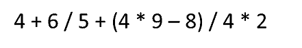
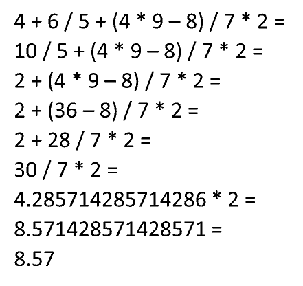
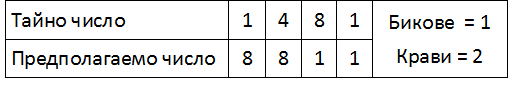
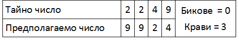

# Глава 9. Задачи за шампиони (част II)

В тази глава ще разгледаме още две задачи, които причисляваме към категорията "за шампиони" т.е. по-трудни от стандартните задачи за това ниво. Хубаво да се отбележи, че задачите представени тук могат да се решат по-лесно с допълнителни знания за езика C# (методи, масиви, колекции, рекурсия и т.н.), но всяко едно решениe, което представяме тук, ще използва единствено материал покрит в тази книга.

## Задача 1 - Passion Days

Оригинално състезание: [https://judge.softuni.bg/Contests/Practice/Index/163#3](https://judge.softuni.bg/Contests/Practice/Index/163#3)

Лина има истинска страст за пазаруване. Когато тя има малко пари, веднага отива в първия МОЛ и се опитва да изхарчи възможно най-много за дрехи, чанти и обувки. Но любимото и нещо са зимните намаления. Нашата задача е да анализираме странното и поведение и да изчислим покупките които Лина прави, когато влезе в МОЛ-а, както и парите които и остават, когато приключи с пазаруването си.
На първия ред, от входа, ще бъде подадена сумата която Лина има преди да започне да пазарува. След това при получаване командата **"mall.Enter"**, Лина влиза в МОЛ-а и започва да пазарува, докато не получи командата **"mall.Exit"**. Когато Лина започне да пазарува на всяка линия от входа ще получите стрингове, които представляват действия, които Лина изпълнява. Всеки символ в стринга представлява покупка или друго действие.
Стринговите команди могат да съдържат само символи от ASCII таблицата. ASCII кода на всеки знак има връзка с това колко Лина трябва да плати за всяка стока. Интерпретирайте символите по следния начин:
- Ако символа е **главна буква**, Лина получава 50% намаление, което означава че трябва да намалите парите, които тя има, с 50% от цифровата репрезентация ASCII символа.
- Ако символа е **малка буква**, Лина получава 70% намаление, което означава че трябва да намалите парите, които тя има, с 30% от цифровата репрезентация ASCII символа.
- Ако символа е **"%"**, Лина правия покупка която намалява парите и на половина.
- Ако символа е **"*"**, Лина изтегля пари от дебитната си карта и добавя към наличните си средства 10 лева.
- Ако символа е **различен от упоменатите горе**, Лина просто прави покупка без намаления и в такъв случай просто извадете стойността на ASCII символа от наличните и средства.
Ако някоя от стойностите на покупките е по-голяма от текущите налични средства, Лина **НЕ** прави покупката. Парите на Лина не могат да бъдат по-малко от 0.

Пазаруването свършва когато се получи командата **"mall.Exit"**. Когато това стане трябва да принтирате броя на извършени покупки и парите, които Лина има останали. Моля вижте секциите Изход и Примерен вход и изход за повече яснота.

### Входни данни

Входните данни трябва да се четата от конзолата. 
На първия ред, от входа, ще бъде подадена сумата която Лина има преди да започне да пазарува.
Когато получите командата **"mall.Enter"** на всеки следващ ред ще получите стрингове съдържащи информация относно покупките/действията, които Лина иска да направи. Тези стрингове ще продължат да бъдат подаване докато не се получи командата **"mall.Exit"**.
Винаги ще се подава само една команда "mall.Enter" и само една команда **"mall.Exit"**

### Изходни данни

Изходните данни трябва да се принтират на конзолата.
Когато пазаруването приключи на конзолата трябва да се принтира изход в зависимост от какви покупки са били направени.
- Ако не са били направени никакви покупки – "**No purchases. Money left: {останали пари} lv.**"
- Ако е направена поне една покупка - "**{брой покупки} purchases. Money left: {останали пари} lv.**"

### Ограничения

- Парите са число с плаваща запетая в интервала - [0 - 7.9 x 1028].
- Броя на стрингове между "mall.Enter" и "mall.Enter" ще в интервала – [1-20].
- Броя на символи във всеки стринг, който представлява команда, ще е в интервала – [1-20]
- Позволено време за изпълнение: 0.1 секунди.
- Позволена памет – 16 MB.

### Примерен вход и изход

| Вход | Изход | Коментари |
|------|-------|-----------|
| 110 mall.Enter d mall.Exit | 1 purchases. Money left: 80.00 lv. | ‘d’ има ASCII код 100. ‘d’ e mалка буква е и за това Лина получава 70% отстъпка. 100% – 70% = 30. 110 – 30 = 80 лв. |

| Вход | Изход |
|------|-------|
| 110 mall.Enter % mall.Exit|1 purchases. Money left: 55.00 lv.|

| Вход | Изход |
|------|-------|
|100 mall.Enter Ab ** mall.Exit|2 purchases. Money left: 58.10 lv.|

### Насоки и подсказки

#### Обработване на входа
#### Алгоритъм за решаване
#### Форматиране на изхода

## Задача 2 - X Expression
Оригинално състезание: [http://bgcoder.com/Contests/Practice/Index/106#2](http://bgcoder.com/Contests/Practice/Index/106#2)

Бони е много мощна вещица. Тъй като силата на природата не е достатъчна за да се бори успешно с вампири и върколаци, те започнала усвоява силата на Изразите.
Израза е много труден за усвояване т.е. заклинанието разчита на способността за **бързо решаване на математически изрази**. За използване на Израз заклинание, вещицата трябва да знае резултата от математическия израз предварително.
Израз заклинанието се състои от няколко прости математически израза. Всеки математически израз може да съдържа оператори за **СЪБИРАНЕ**, **ИЗВАЖДАНЕ**, **ДЕЛЕНИЕ** и/или **УМНОЖЕНИЕ**. Израза се решава както **би бил решен от калкулатор** (вижте последващия пример) и **може да съдържа скоби**. **Всичко в скобите се пресмята първо**. Всеки израз може да съдържа множество скоби, но не може да съдържа вложени скоби:
- Израз съдържащ **(…(…)…) е невалиден**.
- Израз съдържащ **(…)…(…) е валиден**.

### Пример:

Изразът:

Бива решен по следния начин:

Т.к. Бони е доста красива, но не чак толкова съобразителна, тя има нужда от нашата помощ за да усвои силата на Изразите.

### Входни данни
Входните данни се състоят от един ред, който бива подаван от конзолата.

Тази единична линя представлява **математически израз за пресмятане**. Линията **винаги завършва с символа „=“**. Символа „=“ означава **край на математическия израз**.

Входните данни винаги са валидни и във формата, който е описана. Няма нужда да бъдат валидирани.

### Изходни данни

Изходните данни трябва да се принтират на конзолата. 

Изхода се състои от един ред – резултата от пресметнатия математически израз.

**Резултата трябва да бъде закръглен до втората цифра след десетичната запетая.**

### Ограничения

- Изразите ще състоят от максимум 2500 символа.
- Числата във всеки математически израз ще са между **[1..9]**
- Операторите в математическите изрази винаги ще бъдат измежду +(събиране), -(изваждане), /(деление) или *(умножение)
- **Резултата от математическия израз ще е в интервала [-100000.00, 100000.00]**
- Позволено време за изпълнение: **0.1 секунди**.
- Позволена памет – **4 MB**.

### Примерен вход и изход

| Вход                           | Изход  |
|--------------------------------|--------|
| 4+6/5+(4*9–8)/7*2=             | 8.57   |

| Вход                           | Изход  |
|--------------------------------|--------|
| 3+(6/5)+(2*3/7)*7/2*(9/4+4*1)= | 110.63 |

### Насоки и подсказки

#### Обработване на входа
#### Алгоритъм за решаване
#### Форматиране на изхода

## Задача 3 - Bulls and Cows

Оригинално състезание: [https://judge.softuni.bg/Contests/Practice/Index/1#3](https://judge.softuni.bg/Contests/Practice/Index/1#3)

Всички обичаме играта „Бикове и Крави“ (http://en.wikipedia.org/wiki/Bulls_and_cows). При дадено 4 цифрено тайно число и 4 цифрено предполагаемо число, използваме следните правила:
- ко имаме цифра от предполагаемото число, която съвпада с цифра от тайното число и е на същата позиция, имаме – бик.
- Ако имаме цифра от предполагаемото число, която съвпада с цифра от тайното число, но е на различна позиция, имаме – крава.

При дадено тайно число и брой на бикове и крави, нашата задача е да намерим всички възможни предполагаеми числа в нарастващ ред.
Aко не съществуват предполагаеми числа, които да отговарят на зададените критерии на конзолата трябва да се изпише “No”.

### Входни данни
- Входните данни трябва да се четат от конзолата.
- Входа се състои от 3 реда. Първия ред е секретното число, втория номера на бикове и третия номера на кравите.
- Входните данни ще бъдат винаги валидни. Няма нужда да бъдат проверявани.

### Изходни данни
- Изходните данни трябва да се принтират на конзолата.
- Изхода трябва да се състои от един единствен ред – всички предполагаеми числа разделени с единични празно място.
- Aко не съществуват предполагаеми числа, които да отговарят на зададените критерии на конзолата трябва да се изпише “No”.

### Ограничения
- Тайното число винаги ще се състои от 4 цифри в интервала [1..9].
- Броя на кравите и биковете винаги ще е в интервала [0..9].
- Позволено време за изпълнение: 0.15 секунди.
- Позволена памет: 4 MB.

### Примерен вход и изход

| Вход           | Изход        |
|----------------|--------------|
| 2228 2 1 | 1222 2122 2212 2232 2242 2252 2262 2272 2281 2283,2284 2285 2286 2287 2289 2292 2322 2422 2522 2622,2722 2821 2823 2824 2825 2826 2827 2829 2922 3222 4222 5222 6222 7222 8221 8223 8224 8225 8226 8227 8229 9222 |

| Вход           | Изход        |
|----------------|--------------|
| 1234 3 0 | 1134 1214 1224 1231 1232 1233 1235 1236 1237 1238 1239 1244 1254 1264 1274 1284 1294 1334 1434 1534 1634 1734 1834 1934 2234 3234 4234 5234 6234 7234 8234 9234 |

| Вход           | Изход        |
|----------------|--------------|
| 1234 3 1 | No           |

### Насоки и подсказки

#### Обработване на входа
#### Алгоритъм за решаване
#### Форматиране на изхода

