# Глава 9. Задачи за шампиони (част II)

В тази глава ще разгледаме още две задачи, които причисляваме към категорията "за шампиони", т.е. по-трудни от стандартните задачи за това ниво. Добре е да се отбележи, че задачите, които са представени тук, могат да се решат по-лесно с допълнителни знания за езика C# (методи, масиви, колекции, рекурсия и т.н.), но всяко едно решениe, което представяме тук, ще използва единствено материал, покрит в тази книга.

### Задача: Passion Days

Лина има истинска страст за пазаруване. Когато тя има малко пари, веднага отива в първия МОЛ и се опитва да изхарчи възможно най-много за дрехи, чанти и обувки. Но любимото ѝ нещо са зимните намаления. Нашата задача е да анализираме странното ѝ поведение и да **изчислим покупките**, които Лина прави, когато влезе в МОЛ-а, както и **парите, които ѝ остават**, когато приключи с пазаруването си.
На **първия ред** от входа ще бъде подадена **сумата**, която Лина има **преди** да започне да пазарува. След това при получаване командата **"mall.Enter"**, Лина влиза в МОЛ-а и започва да пазарува, докато не получи командата **"mall.Exit"**. Когато Лина започне да пазарува, **на всяка линия** от входа ще получите стрингове, които представляват **действия, които Лина изпълнява**. Всеки **символ** в стринга представлява **покупка или друго действие**.
Стринговите команди могат да съдържат само символи от **ASCII таблицата**. ASCII кода на всеки знак има **връзка с това колко Лина трябва да плати** за всяка стока. Интерпретирайте символите по следния начин:

- Ако символът е **главна буква**, Лина получава **50% намаление**, което означава, че трябва да намалите парите, които тя има, с 50% от цифровата репрезентация на символа от ASCII таблицата
- Ако символът е **малка буква**, Лина получава **70% намаление**, което означава, че трябва да намалите парите, които тя има, с 30% от цифровата репрезентация на символа от ASCII таблицата
- Ако символът е **"%"**, Лина прави **покупка**, която намалява парите ѝ на половина
- Ако символът е **"\*"**, Лина **изтегля пари от дебитната си карта** и добавя към наличните си средства 10 лева
- Ако символът е **различен от упоменатите горе**, Лина просто прави покупка без намаления и в такъв случай просто извадете стойността на символа от ASCII таблицата от наличните ѝ средства
Ако някоя от стойностите на покупките е **по-голяма** от текущите налични средства, Лина **НЕ** прави покупката. Парите на Лина **не могат да бъдат по-малко от 0**

Пазаруването завършва, когато се получи командата **"mall.Exit"**. Когато това стане, трябва да **принтирате броя на извършени покупки и парите, които са останали на Лина**. 

#### Входни данни

Входните данни трябва да се четат от конзолата. 
На **първия ред** от входа ще бъде подадена **сумата, която Лина има преди да започне да пазарува**. На всеки следващ ред ще има определена команда. Когато получите командата **"mall.Enter"**, на всеки следващ ред ще получавате **стрингове, съдържащи информация относно покупките/действията**, които Лина иска да направи. Тези стрингове ще продължат да бъдат подавани, докато не се получи командата **"mall.Exit"**.
Винаги ще се подава само една команда **"mall.Enter"** и само една команда **"mall.Exit"**.

#### Изходни данни

Изходните данни трябва да се **принтират на конзолата**.
Когато пазаруването приключи, на конзолата трябва да се принтира определен изход в зависимост от това какви покупки са били направени.
- Ако **не са били направени някакви покупки** – "**No purchases. Money left: {останали пари} lv.**"
- Ако е направена **поне една покупка** - "**{брой покупки} purchases. Money left: {останали пари} lv.**"

**Парите** трябва да се принтират с **точност от 2 символа след десетичния знак**.

#### Ограничения

- Парите са число с **плаваща запетая** в интервала: [**0 - 7.9 x 1028**]
- Броят на стрингове между "**mall.Enter**" и "**mall.Enter**" ще в интервала: [**1-20**]
- Броят на символи във всеки стринг, който представлява команда, ще е в интервала: [**1-20**]
- Позволено време за изпълнение: **0.1 секунди**
- Позволена памет: **16 MB**

#### Примерен вход и изход

| Вход                       | Изход                              | Коментар |
|:----------------------------:|:------------------------------------:|:-----------:|
| 110 mall.Enter d mall.Exit | 1 purchases. Money left: 80.00 lv. | ‘d’ има ASCII код 100. ‘d’ e малка буква и за това Лина получава 70% отстъпка. 100% – 70% = 30.110 – 30 = 80 лв. |

| Вход | Изход |
|:------:|:-------:|
| 110 mall.Enter % mall.Exit|1 purchases. Money left: 55.00 lv.|

| Вход | Изход |
|:------:|:-------:|
|100 mall.Enter Ab \*\* mall.Exit|2 purchases. Money left: 58.10 lv.|

#### Насоки и подсказки

Ще разделим решението на задачата на три основни части:
* **обработка** на входа
* **алгоритъм** на решаване 
* **форматиране** на изхода

Нека разгледаме всяка една част в детайли.

##### Обработване на входа

Входът за нашата задача се състои от няколко компонента:
- на **първия ред имаме всички пари**, с които Лина ще разполага за пазаруването
- на **всеки следващ ред** ще имаме някакъв вид **команда**

Първата част от прочитането е тривиална:

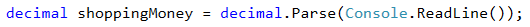

Но във втората има детайл, с който трябва да се съобразим. Условието гласи следното:

> Всеки следващ ред ще има определена команда. Когато получите командата **"mall.Enter"**, на всеки следващ ред ще получите стрингове, съдържащи информация относно покупките/действията, които Лина иска да направи.

Тук е моментът, в който трябва да се съобразим, че от **втория ред нататък трябва да започнем да четем команди**, но **едва след като получим** командата **"mall.Enter"**, трябва да започнем да ги обработваме. Как можем да направим това? Използването на **`while`** или **`do-while`** цикъл e добър избор. Ето примерно решение как можем **да пропуснем** всички команди преди получаване на командата **"mall.Enter"**:

Тук е мястото да отбележим, че извикването на **`Console.ReadLine(...)`** след края на цикъла се използва за **преминаване към първата команда** за обработване.

##### Алгоритъм за решаване

Алгоритъмът за решаването на самата задача е праволинеен - продължаваме да **четем команди** от конзолата, **докато не бъде подадена командата "mall.Exit"**. През това време **обработваме** всеки един знак (**`char`**) от всяка една команда спрямо правилата, указани в условието, и едновременно с това **модифицираме парите**, които Лина има, и **съхраняваме броя на покупките**.

Нека разгледаме първите два проблема пред нашия алгоритъм. Първият проблем засяга начина, по който можем да четем командите, докато не срещнем **"mall.Exit"**. Решението, както видяхме по-горе, е да се използва **`while-цикъл`**. Вторият проблем е задачата да **достъпим всеки един знак** от подадената команда. Имайки предвид, че входните данни с командите представляват **`string-ове`**, то най-лесния начин да достъпим всеки знак в тях е чрез **`foreach-цикъл`**.

Ето как би изглеждало използване на два такива цикъла:

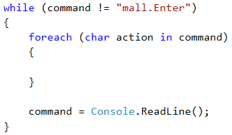

Следващата част от алгоритъма ни е да **обработим символите от командите**, спрямо следните правила от условието:

> - Ако символът е **главна буква**, Лина получава 50% намаление, което означава, че трябва да намалите парите, които тя има, с 50% от цифровата репрезентация ASCII символа
> - Ако символът е **малка буква**, Лина получава 70% намаление, което означава, че трябва да намалите парите, които тя има, с 30% от цифровата репрезентация ASCII символа
> - Ако символът е **"%"**, Лина прави покупка, която намалява парите ѝ на половина
> - Ако символът е **"\*"**, Лина изтегля пари от дебитната си карта и добавя към наличните си средства 10 лева
> - Ако символът е **различен от упоменатите горе**, Лина просто прави покупка без намаления и в такъв случай просто извадете стойността на ASCII символа от наличните ѝ средства

Нека разгледаме проблемите от първото условие, които стоят пред нас. Единият е как можем да разберем дали даден **символ представлява главна буква**. Можем да използваме един от двата начина:
* имайки предвид, факта, че буквите в азбуката имат ред, можем да използваме следната проверка **`action >= 'A' && action <= 'Z'`**, за да проверим дали нашият символ се намира в интервала от големи букви
* можем да използваме функцията **`char.IsUpper(..)`**

Другият проблем е как можем **да пропуснем даден символ**, ако той представлява операция, която изисква повече пари, отколкото Лина има? Това е възможно да бъде направено с използване на **`continue`** конструкцията.

Примерната проверка за първата част от условието изглежда по следния начин:

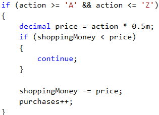

**Забележка**: **`purchases`** е променлива от тип **`int`** , в която държим броя на всички покупки.

Смятаме, че читателят не би трябвало да изпита проблем при имплементацията на всички други проверки, защото са много сходни с първата, .

##### Форматиране на изхода

В края на задачата трябва да **принтираме** определен **изход**, в зависимост от следното условие:

> - Ако не са били направени никакви покупки – "**No purchases. Money left: {останали пари} lv.**"
> - Ако е направена поне една покупка - "**{брой покупки} purchases. Money left: {останали пари} lv.**"

Операциите по принтиране са тривиални, като единственото нещо, с което трябва да се съобразим е, че **парите трябва да се принтират с точност от 2 символа след десетичния знак**.

Как можем да направим това? Ще оставим отговора на този въпрос на читателя.

#### Тестване в Judge системата

Тествайте решението си тук: [https://judge.softuni.bg/Contests/Practice/Index/519#0](https://judge.softuni.bg/Contests/Practice/Index/519#0)

### Задача: X Expression

Бони е много мощна вещица. Тъй като силата на природата не е достатъчна, за да се бори успешно с вампири и върколаци, тя започнала да усвоява силата на Изразите.
Израза е много труден за усвояване, тъй като заклинанието разчита на способността за **бързо решаване на математически изрази**. За използване на Израз заклинание, вещицата трябва да знае резултата от математическия израз предварително.
Израз заклинанието се състои от няколко прости математически израза. Всеки математически израз може да съдържа оператори за **СЪБИРАНЕ**, **ИЗВАЖДАНЕ**, **ДЕЛЕНИЕ** и/или **УМНОЖЕНИЕ**. Израза се решава както **би бил решен от калкулатор** (вж. последващия пример) и **може да съдържа скоби**. **Всичко в скобите се пресмята първо**. Всеки израз може да съдържа множество скоби, но не може да съдържа вложени скоби:
- Израз съдържащ **(…(…)…) е невалиден**
- Израз съдържащ **(…)…(…) е валиден**

#### Пример

Изразът

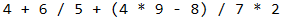

бива решен по следния начин:

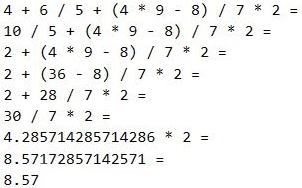

Бони е доста красива, но не чак толкова съобразителна, затова тя има нужда от нашата помощ, за да усвои силата на Изразите.

#### Входни данни

Входните данни се състоят от един ред, който бива подаван от конзолата.

Тази единична линия представлява **математически израз за пресмятане**. Линията **винаги завършва със символа „=“**. Символът **„=“** означава **край на математическия израз**.

Входните данни винаги са валидни и във формата, който е описан. Няма нужда да бъдат валидирани.

#### Изходни данни

Изходните данни трябва да се принтират на конзолата. 

Изходът се състои от един ред – резултата от **пресметнатия математически израз**.

**Резултатът трябва да бъде закръглен до втората цифра след десетичния знак.**

#### Ограничения

- Изразите ще състоят от **максимум 2500 символа**
- Числата от всеки математически израз ще са в интервала **[1..9]**
- Операторите в математическите изрази винаги ще бъдат измежду `+` (събиране), `-` (изваждане), `/` (деление) или `*` (умножение)
- **Резултатът от математическия израз ще е в интервала [-100000.00, 100000.00]**
- Позволено време за изпълнение: **0.1 секунди**
- Позволена памет – **4 MB**

#### Примерен вход и изход

| Вход                           | Изход  |
|:--------------------------------:|:--------:|
| 4+6/5+(4\*9–8)/7\*2=           | 8.57   |

| Вход                           | Изход  |
|:--------------------------------:|:--------:|
| 3+(6/5)+(2\*3/7)\*7/2\*(9/4+4\*1)= | 110.63 |

#### Насоки и подсказки

##### Обработване на входа

Входните ни данни се състоят от точно един ред от конзолата. Тук имаме **два начина**, по които можем да обработим входа. Първият е чрез **прочитането на целия ред с командата `Console.ReadLine(...)`** и достъпването на всеки един символ (**`char`**) от реда чрез **`foreach-цикъл`**. Вторият е чрез **прочитане на входа символ по символ чрез командата `Console.Read(...)`** и обработване на всеки символ.

За решаване на задачата ще използваме втория вариант.

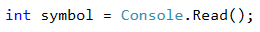

##### Алгоритъм за решаване

За целите на нашата задача ще имаме нужда от две променливи:
* една променлива, в която ще пазим **текущия резултат**
* още една променлива, в която ще пазим **текущия оператор** от нашия израз.

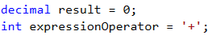

Относно кода по-горе нека поясним, че използваме тип **`decimal`** за **съхранение на резултата на нашето уравнение**, за да избегнем всякакви проблем с точността, които съпътстват типовете **`float`** и **`double`**. Също така, оператора по подразбиране е **`+`**, за да може още първото срещнато число да бъде събрано с резултата ни.

След като вече имаме началните си променливи, трябва да помислим върху това **каква ще е основната структура** на нашата програма. От условието разбираме, че **всеки израз завършва с `=`**, т.е. ще трябва да четем и обработваме символи, докато не срещнем **`=`**. Следва точното изписване на **`while-цикъл`**.

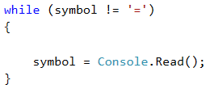

Следващата стъпка е обработването на нашата **`symbol`** променлива. За нея имаме 3 възможни случая:
1. Ако символът е **начало на подизраз, заграден в скоби**, т.е. срещнатият символ е **`(`**
2. Ако символът е **цифра между 0 и 9**. Но как можем да проверим това? Как можем да проверим дали символът ни е цифра? Тук идва на помощ **ASCII кодът** на символа, чрез който можем да използваме следната формула: **`[ASCII кода на нашия символ] - [ASCII кода на символа `0`] = [цифрата, която репрезентира символа]`**. Ако **резултатът от тази проверка е между 0 и 9**, то тогава нашият символ наистина е **число**
3. Ако символът е **оператор**, т.е. е **`+`**, **`-`**, **`*`** или **`/`**

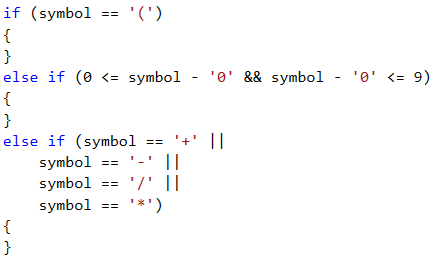

Нека разгледаме действията, които трябва да извършим при съответните случаи, които дефинирахме:
1. Ако нашият символ е **оператор**, то тогава единственото, което трябва да направим, е да **зададем нова стойност на променливата `expressionOperator`**.

2. Ако нашият символ е **цифра**, тогава трябва да **променим текущия резултат от израза в зависимост от текущия оператор**, т.е. ако **`expressionOperator`** е **`-`**, тогава трябва да **намалим резултата с цифровата репрезентация на текущия символ**. Можем да вземем цифровата репрезентация на текущия символ, чрез формулата, която използвахме при проверката на този случай (**`[ASCII кода на нашия символ] - [ASCII кода на символа `0`] = [цифрата, която репрезентира символа]`**)

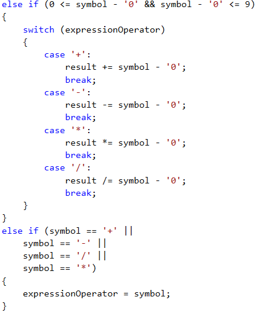

3. Ако нашият символ е **`(`**, това индикира **началото на подизраз** (израз в скоби). По дефиниция **подизразът трябва да се калкулира преди да се модифицира резултата от целия израз** (действията в скобите се извършват първи). Това означава, че ще имаме локален резултат за подизраза ни и локален оператор

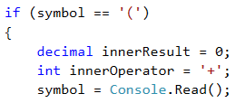

След това, за **пресмятане стойността на подизраза** използваме същите методи, които използвахме за пресмятане на главния израз - използваме **`while-цикъл`**, за **да четем символи** (докато не срещнем символа **`)`**). В зависимост от това дали прочетения символ е цифра или оператор, модифицираме резултата на подизраза. Имплементацията на тези операции е аналогична на имплементацията за пресмятане на изрази, описана по-горе, затова смятаме, че читателят не би трябвало да има проблем с нея.

След като приключим калкулацията на резултата от подизраза ни, **модифицираме резултата на целия израз** в зависимост от стойността на **`expressionOperator`**.

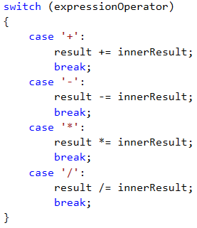

##### Форматиране на изхода

Единствения изход, който програмата трябва да принтира на конзолата, е **резултатът от решаването на израза, с точност два символа след десетичния знак**. Как можем да форматираме изхода по този начин? Отговора на този въпрос оставяме на читателя.

#### Тестване в Judge системата

Тествайте решението си тук: [https://judge.softuni.bg/Contests/Practice/Index/519#1](https://judge.softuni.bg/Contests/Practice/Index/519#1)

### Задача: Bulls and Cows

Всички обичаме играта „Бикове и Крави“ ([http://en.wikipedia.org/wiki/Bulls_and_cows](http://en.wikipedia.org/wiki/Bulls_and_cows)). При дадено 4-цифрено **тайно число** и 4-цифрено **предполагаемо число**, използваме следните правила:
* Aко имаме цифра от предполагаемото число, която съвпада с цифра от тайното число и е на **същата позиция**, имаме бик.
* Ако имаме цифра от предполагаемото число, която съвпада с цифра от тайното число, но е **на различна позиция**, имаме крава.

| Тайно число         | 1 | 4 | 8 | 1 |                          |
|:-------------------:|:---:|:---:|:---:|:---:|:--------------------------:|
| Предполагаемо число | 8 | 8 | 1 | 1 | Бикове = 1 Крави = 2  |

| Тайно число         | 2 | 2 | 4 | 1 |                         |
|:-------------------:|:---:|:---:|:---:|:---:|:-------------------------:|
| Предполагаемо число | 9 | 9 | 2 | 4 | Бикове = 0 Крави = 3 |

При дадено тайно число и брой на бикове и крави, нашата задача е **да намерим всички възможни предполагаеми числа** в нарастващ ред.
Aко **не съществуват предполагаеми числа**, които да отговарят на зададените критерии на конзолата, трябва да се изпише “**No**”.

#### Входни данни

Входните данни трябва да се четат от конзолата.
Входа се състои от 3 реда:
* първият ред съдържа **секретното число**
* вторият - **броя бикове**
* третият - **броя крави**

Входните данни ще бъдат винаги валидни. Няма нужда да бъдат проверявани.

#### Изходни данни

Изходните данни трябва да се принтират на конзолата.
Изходът трябва да се състои от **един единствен ред** – **всички предполагаеми числа**, разделени с единично празно място.
Aко **не съществуват предполагаеми числа**, които да отговарят на зададените критерии на конзолата, трябва **да се изпише “No”**.

#### Ограничения

- Тайното число винаги ще се състои от **4 цифри в интервала** [**1..9**]
- Броят на** кравите и биковете** винаги ще е в интервала [**0..9**]
- Позволено време за изпълнение: **0.15 секунди**
- Позволена памет: **4 MB**

#### Примерен вход и изход

| Вход           | Изход        |
|:--------------:|:------------:|
| 2228 2 1 | 1222 2122 2212 2232 2242 2252 2262 2272 2281 2283,2284 2285 2286 2287 2289 2292 2322 2422 2522 2622,2722 2821 2823 2824 2825 2826 2827 2829 2922 3222 4222 5222 6222 7222 8221 8223 8224 8225 8226 8227 8229 9222 |

| Вход           | Изход        |
|:--------------:|:------------:|
| 1234 3 0 | 1134 1214 1224 1231 1232 1233 1235 1236 1237 1238 1239 1244 1254 1264 1274 1284 1294 1334 1434 1534 1634 1734 1834 1934 2234 3234 4234 5234 6234 7234 8234 9234 |

| Вход           | Изход        |
|:--------------:|:------------:|
| 1234 3 1 | No           |

#### Насоки и подсказки

##### Обработване на входа

За входа на нашата задача имаме 3 реда:
* **секретното число**
* **броя** на желани **бикове**
* **броя** на желани **крави**

Прочитането на тези входни данни е тривиално:

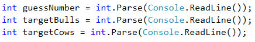

##### Алгоритъм за решаване

Преди да започнем писането на алгоритъма за решаване на нашия проблем, трябва да **декларираме флаг**, който да указва дали е намерено решение:

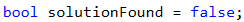

Ако след приключването на нашия алгоритъм, този флаг все още е **`false`**, тогава ще принтираме **`No`** на конзолата, както е указано в условието.

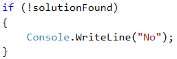

Нека започнем да размишляваме над нашия проблем. Това, което трябва да направим, е да **анализираме всички числа от `1111` до `9999` без тези, които съдържат в себе си нули** (напр. **`9011`**, **`3401`** и т.н. са невалидни). Какъв е най-лесният начин за **генериране** на всички тези **числа**? **С вложени цикли**. Тъй като имаме **4-цифрено число**, ще имаме **4 вложени цикъла**, като всеки един от тях ще генерира **отделна цифра от нашето число** за тестване.

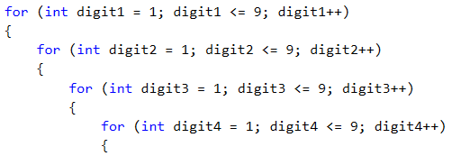

Благодарение на тези цикли, **имаме достъп до всяка една цифра** на всички числа, които трябва да проверим. Следващата ни стъпка е да **разделим секретното число на цифри**. Това може да се постигне много лесно чрез **комбинация от целочислено и модулно деление**.

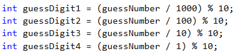

Остават ни последните две стъпки преди да започнем да анализираме колко крави и бикове има в дадено число. Съответно, първата е** декларацията на `counter` променливи** във вложените ни цикли, за да **броим кравите и биковете** за текущото число. Втората стъпка е да направим **копия на цифрите на текущото число**, което ще анализираме, за да **предотвратим проблеми с работата на вложите цикли**, ако правим промени по тях.

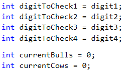

Вече сме готови да започнем анализирането на генерираните числа. Каква логика можем да използваме? Най-елементарният начин да проверим колко крави и бикове има в едно число е чрез **поредица от `if-else` проверки**. Да, не е най-оптималния начин, но с цел да не използваме знания извън пределите на тази книга, ще изберем този подход.

От какви проверки имаме нужда?

Проверката за бикове е елементарна - проверяваме дали **първата цифра** от генерираното число е еднаква със **същата цифра** от секретното число. Премахваме проверените цифри с цел да избегнем повторения на бикове и крави.

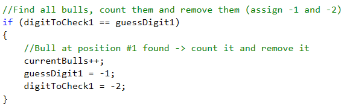

Повтаряме действието за втората, третата и четвърта цифра. 

Проверката за крави можем да направи по следния начин - първо проверяваме дали **първата цифра** от генерираното число **съвпада с втората**, **третата** или **четвъртата цифра** на секретното число. Примерна имплементация:

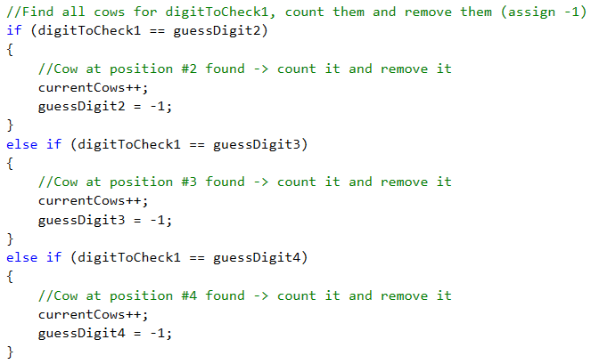

След това последователно проверяваме дали **втората цифра** от генерираното число **съвпада с първата**, **третата** или **четвъртата цифра** на секретното число, дали **третата цифра** от генерираното число съвпада с **първата**, **втората** или **четвъртата цифра** на секретното число и накрая проверяваме дали **четвъртата цифра** от генерираното число съвпада с **първата**, **втората** или **третата цифра** на секретното число.

След като приключим всички проверки, ни остава единствено да **проверим дали биковете и кравите в текущото генерирано число съвпадат с желаните бикове и крави, прочетени от конзолата**. Ако това е така, принтираме текущото число на конзолата.

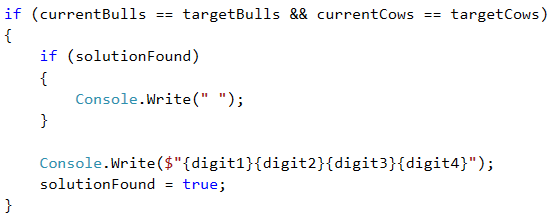

#### Тестване в Judge системата

Тествайте решението си тук: [https://judge.softuni.bg/Contests/Practice/Index/519#2](https://judge.softuni.bg/Contests/Practice/Index/519#2)
